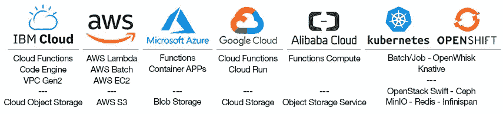

# Lithops，一个多云无服务器编程框架

> 原文：<https://itnext.io/lithops-a-multi-cloud-serverless-programming-framework-fd97f0d5e9e4?source=collection_archive---------2----------------------->

*无服务器计算的兴起*


照片由[克里斯里德](https://unsplash.com/@cdr6934?utm_source=medium&utm_medium=referral)在 [Unsplash](https://unsplash.com?utm_source=medium&utm_medium=referral) 上拍摄

出人意料的是，无服务器计算的兴起也间接启动了云中大规模数据并行的民主化。从这个意义上说， **Lithops** 是第一个受益于使用无服务器计算优势的计算框架，比如即时资源供应和可伸缩性。


因此， **Lithops 可以被定义为一个强大的多云工具包，它允许透明地将本地、多进程、python 应用程序扩展到云中的大量资源中。Lithops 使生成成百上千个任务的任务变得简单，从开始到执行一个大型任务只需几秒钟。从这个意义上来说，Lithops 可以被看作是一个动态的作业编排器，经过优化可以在一个无服务器的计算平台上运行作业。**

Lithops 是一个开源项目，可以在 Github 上获得。

[](https://github.com/lithops-cloud/lithops) [## 石质云/石质

### Lithops 是一个 Python 多云分布式计算框架。它允许在…上运行未修改的本地 python 代码

github.com](https://github.com/lithops-cloud/lithops) 

**为什么选择 Lithops？**与传统计算框架的一个关键区别是，Lithops 不需要集群供应和管理的繁琐任务。相反，Lithops 利用公开可用的无服务器计算平台，如 **AWS Lambda** 、 **Google Cloud Run** 或 **IBM Cloud Functions** (等等)，来运行应用程序。使用无服务器计算平台的主要好处之一是，它们可以在几秒钟内提供巨大的 CPU 能力和内存，只需为您使用它们的确切时间付费。

它是如何工作的？Lithops 获取本地定义的函数、类和变量，并将它们传输到云中。这发生在运行时，也就是你在计算机上运行应用程序的时候。在后台，它通常使用一个对象存储服务(如 S3 自动气象站)来存储这些信息和其他中间数据。在任何情况下，Lithops 将用户的代码和数据交付到云中，而不需要了解它如何部署和运行到无服务器平台中。从这个意义上说，Lithops 消除了大多数阻碍部署、打包和任务执行的障碍，这些障碍抑制了大多数用户轻松进入云。从用户的角度来看，就好像你在电脑上运行应用程序一样。

**它适合在哪里？**当今无服务器平台的无状态特性使得 Lithops 非常适合运行以下作业:超参数优化、对象存储数据(预)处理、搜索和处理日志、大数据分析、蒙特卡罗模拟、基因组分析、网页抓取、模型评分等。所有这些应用都体现了 Lithops 将单机代码计算扩展到云中数千个内核的能力。非常重要的是，不需要引导冷集群或为临时任务保留热集群。

# 蜜蜂石蛾

在高层，Lithops 附带了两个不同的**计算 API**，允许与底层计算平台交互，抽象出管理和使用这些服务的复杂性。这些 API 是**未来 API** 和**多重处理 API** 。此外，Lithops 提供了一个**存储 API** ，允许与存储后端进行交互，以一种简单的方式管理数据(上传/下载/移动/删除)。

**Futures API:** Lithops 实现了一个类似于[内置 python*concurrent . Futures*库](https://docs.python.org/3/library/concurrent.futures.html)的 API。这个 API 基于名为 *Futures* 的对象，当 Lithops 产生一个函数时创建。有了这个*未来*对象，就有可能访问结果和一些关于执行的统计数据。例如，我们可以使用 *call_async()* API 方法只生成一个函数，并通过管理生成的 *Future* 来获得结果:

```
from lithops import FunctionExecutor

def hello(name):
    return f'Hello {name}!'

with FunctionExecutor() as fexec:
    future = fexec.call_async(hello, 'World')
    print(future.result())
```

**多处理 API:** Lithops 实现了大部分的[内置 python *多处理*库](https://docs.python.org/3/library/multiprocessing.html)方法和抽象，用熟悉的 API 在云端运行任务。例如，我们可以创建一个 *pool()* 并使用 *map()* 方法为可迭代列表中的每个条目生成一个函数:

```
from lithops.multiprocessing import Pool

def double(i):
    return i * 2

if __name__ == "__main__":
    with Pool() as pool:
        result = pool.map(double, [1, 2, 3, 4, 5])
        print(result)
```

**存储 API:** 存储 API 使得用类似于 [python boto3 库](https://boto3.amazonaws.com/v1/documentation/api/latest/index.html)的简单 API 方法操作存储后端变得容易。存储 API 与计算 API 相结合，提供了前所未有的灵活性，可以向云运行任务，如大数据分析或其他涉及数据分析或管理的应用程序。例如，我们可以使用存储 API 将文件从我们的计算机上传到云存储服务，然后从使用 *call_async()* 方法生成的函数中获取该文件:

```
from lithops import FunctionExecutor, Storage

BUCKET = 'my-bucket'

def get_file(key, storage):
    return storage.get_object(bucket=BUCKET, key=key))

if __name__ == "__main__":
    storage = Storage()
    storage.put_object(bucket=BUCKET, key='test.txt', body='Hello World')

    with FunctionExecutor() as fexec:
        fut = fexec.call_async(get_file, 'test.txt')
        print(fut.result())
```

# 多云无服务器编程

Lithops 遵循一个基本原则；**编写一次随处运行。**从一开始，Lithops 就被设计成一个可扩展的框架，它引用可用的**后端**来执行应用程序。在这个意义上，Lithops 提供了对大量云提供商、无服务器平台(*计算后端*)和存储服务(*存储后端*)的支持。

可用的云提供商列表包括 **IBM Cloud** 、 **AWS** 、**微软 Azure** 、**谷歌云**和**阿里云**。在这些云提供商内部，你可以利用他们的 ***功能即服务(FaaS)*** 平台，比如 **AWS Lambda** 、 **IBM Cloud Functions** 或者 **Google Cloud Functions** 来运行应用。此外，Lithops 还支持 ***无服务器容器服务*** 像 **IBM 代码引擎**和 **Google Cloud Run** 。关于存储，Lithops 主要支持这些云提供商提供的*对象存储服务，如 **AWS S3** 和 **IBM 云存储**。*

*除了支持这些公共云提供商，Lithops 还允许使用 **Kubernetes** 或**本地集群**运行应用程序。从这个意义上来说，Lithops 允许使用 **kubernetes** **批处理/作业 API、**或使用 ***开源无服务器平台*** ，如 **Knative** 或**open whish**来运行作业。在这种情况下，关于存储，Lithops 可以使用服务的*定制/私有*安装，如 **OpenStack Swift** 、 **Redis** 、 **Ceph** 或 **Infinispan***

**

*使用 Lithops，你可以编写一个应用程序，并在任何云或计算后端不加修改地运行它。为此，只需创建一个配置文件，并按照配置说明设置所需的计算和存储服务。一旦创建了配置文件，Lithops 将开始在云中运行作业。如果您配置了多个计算或存储后端，则可以通过编辑配置文件中的*默认计算后端*和*默认存储后端*来切换应用程序的执行，而无需更改代码中的任何内容。例如，下一个代码将在任何已配置的云或后端上不明显地运行。*

```
*from lithops import FunctionExecutor

def double(i):
    return i * 2

if __name__ == "__main__":
    fexec = FunctionExecutor()
    fexec.map(double, [1, 2, 3, 4])
    print(fexec.get_result())*
```

*此外，为了更加灵活，Lithops 允许在代码中指定在哪里运行应用程序。从这个意义上说，我们可以在同一个脚本中利用多个计算后端。例如，查看下一个代码，它将运行 **AWS Lambda** 中的一个作业和 **IBM Cloud Functions** 中的一个作业，然后等待所有结果同时就绪。*

```
*from lithops import FunctionExecutor
from lithops import get_result

def double(i):
    return i * 2

if __name__ == '__main__':
    fexec_aws = FunctionExecutor(backend='aws_lambda', storage='aws_s3')
    futures_aws = fexec_aws.map(double, [1, 2, 3, 4])

    fexec_ibm = FunctionExecutor(backend='ibm_cf', storage='ibm_cos')
    futures_ibm = fexec_ibm.map(double, [5, 6, 7, 8])

    print(get_result(futures_aws + futures_ibm))*
```

*总之，使用 Lithops，您可以使用熟悉的 API 来受益于使用无服务器平台的所有优势，例如**无服务器管理**、**降低成本、**以更细粒度的方式为用户使用的服务器资源付费、**即时可伸缩性**以及**快速部署**和更新。此外，它的**多云不可知架构**确保跨云提供商的可移植性，**克服供应商锁定**。*

*Lithops 是一个具有更多功能的扩展框架，更多详情请查看 [Lithops 用户指南](https://lithops-cloud.github.io/docs/)。*

***开始用 Lithops 对云编程吧！***