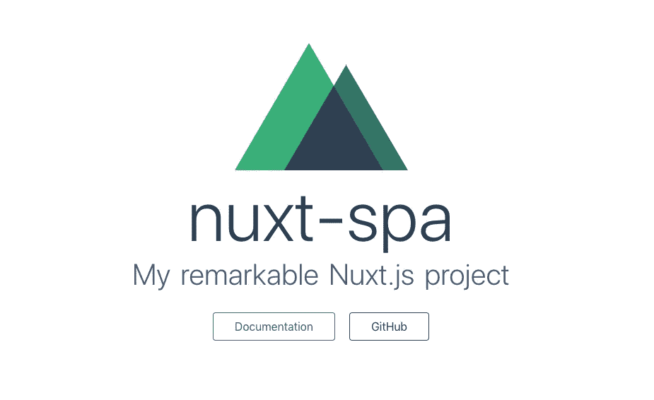
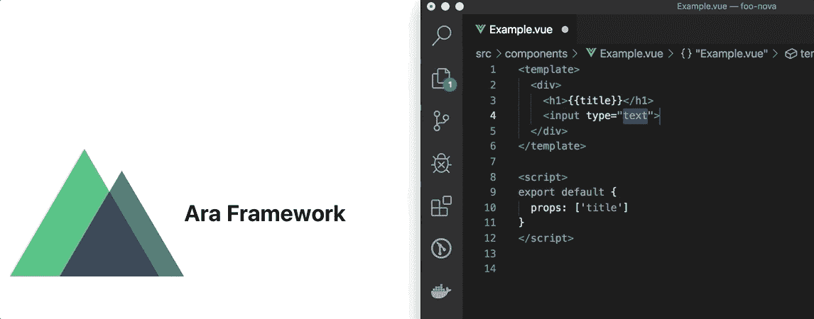
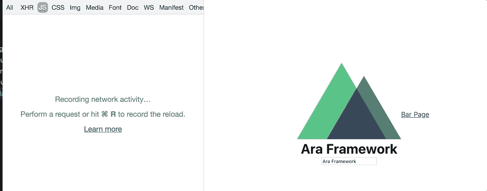

# 使用 Ara 框架的动态重载和延迟加载微前端

> 原文：<https://itnext.io/live-reloading-and-lazy-loading-for-micro-frontends-using-ara-framework-707ccb0f1960?source=collection_archive---------2----------------------->


本文原载于 [Ara 博客](https://ara-framework.github.io/website/blog/2019/09/14/lazy-loading-micro-frontend)。

演示代码[此处](https://github.com/marconi1992/ara-spa-demo)。

微前端解决了一些组织和技术问题，然而，它们也可能导致其他问题。作为软件架构师，我们需要做出决策来解决最关键的问题，并找出如何减轻所选解决方案导致的新问题。

> 真正的成功需要牺牲——雷克·莱尔顿

在这篇文章中，我们将学习如何减轻其中一些。

# 网络过载(性能问题)

微前端可以独立交付其 JavaScript 包。然而，主机应用程序需要为它使用的每个微前端下载一个文件。在最坏的情况下，它可能需要下载一堆文件，这会影响其初始加载的性能。

# 刷新宿主页面(开发人员体验问题)

另一个问题出现在开发周期中。对于 Monolith 前端应用程序来说，使用实时重新加载工具可以在代码发生变化时轻松刷新页面。然而，对于微前端来说，这项任务变得更加困难，因为主机应用程序只消耗每个微前端的 JavaScript 包，并且它们的底层代码在其边界之外。

# Webpack Nova 消费者

我们创建了 [webpack-nova-consumer](https://github.com/ara-framework/webpack-nova-consumer) 来解决上面提到的问题。该插件支持跨微前端(诺瓦斯)的实时重载和生产模式下 JavaScript 包的延迟加载。

我们将在本文后面看到它的实际应用。

# 设置主机应用程序(Nuxt SPA)

首先，在`spa`模式下创建一个 Nuxt 应用程序:

注:`Choose rendering mode`选项选择`Single Page App`。

```
create-nuxt-app nuxt-spa
```

在文件夹`nuxt-spa`中，运行 [http://localhost:3000](http://localhost:3000/) 中的 nuxt 应用程序:

```
yarn dev
```

浏览器:



运行应用程序后，我们将看到一个呈现 nuxt 示例页面的页面。

# 设置微前端(Foo Nova)

使用 [CLI](https://github.com/ara-framework/ara-cli) 创建一个新的 Nova:

注意:当`Do you want to include Server-Side Rendering (SSR)`选项似乎只包含客户端入口点时，键入`n`。

```
ara new:nova -t vue foo-nova
```

对于生产，我们需要构建客户端入口点，并将其部署在存储服务中，如[亚马逊 S3](https://aws.amazon.com/s3/) 并通过 CDN 分发。然而，对于开发，我们将使用 [webpack-dev-server](https://webpack.js.org/configuration/dev-server/) 来服务它。

在[http://localhost:8080/client . js](http://localhost:8080/client.js)中提供 JavaScript 包

```
yarn dev
```

注意，`foo-nova/src/components`文件夹包含一个名为`Example`的组件，它在入口点`foo-nova/src/index.js`文件中使用。接下来我们将在 nuxt 应用程序中呈现它。

# 在 Nuxt 中实现微前端(Foo Nova)

首先，我们需要为 Vue.js 安装 [Nova 桥](https://ara-framework.github.io/website/docs/nova-bridge)。这个包提供了一个组件，在基于 Vue.js 的应用程序中包含 Nova 视图。

```
yarn add nova-vue-bridge
```

用以下代码更新文件`pages/index.vue`:

再次运行 nuxt 应用程序:

```
yarn dev
```

浏览器:


运行应用程序后，页面只显示 Nuxt 徽标，因为我们还没有为`Foo Nova`加载 JavaScript 包。然而，如果我们检查浏览器中的 HTML 元素，我们可以注意到 Nova 桥渲染器，这是将安装微前端(Nova)视图的占位符。

```
<**div** data-hypernova-key="Example" data-hypernova-id="8f07d513-0c84-4b16-8058-08cf2a014d0d"></**div**> 
<**script** type="application/json" data-hypernova-key="Example" data-hypernova-id="8f07d513-0c84-4b16-8058-08cf2a014d0d"><!--{"title":"Ara Framework"}--></**script**>
```

# 使用 Webpack Nova Consumer 加载 JavaScript 包

在 nuxt 应用程序中安装 [webpack-nova-consumer](https://github.com/ara-framework/webpack-nova-consumer) 。

```
yarn add --dev @ara/webpack-nova-consumer
```

安装包后，导入 NovaConsumer 插件并将其添加到`nuxt.config.js`文件的`extend`部分。

`nuxt.config.js`

`NovaConsumerPlugin`接收一个对象，该对象带有它正在使用的微前端(诺瓦斯)的信息:

*   `entry`:包含微前端入口点的 JavaScript 包。
*   `views`:微前端支持的视图名称列表。

浏览器:


# 实时重装

现在，我们可以更新`foo-bar/components`文件夹中的`Example.vue`组件，主机应用程序(nuxt)将重新加载显示最新更改的页面。

更新`Example.vue`:

实时重装操作:



# 设置微前端(Bar Nova)

为了使用多个微前端测试我们的 nuxt 应用程序，我们将创建一个名为`bar-nova`的新微前端。

按照前面提到的相同步骤创建一个新的 nova。

```
ara new:nova -t vue bar-nova
```

将`src/index.js`中的视图名称从`Example`更改为`Bar`:

在[http://localhost:8081/client . js](http://localhost:8081/client.js)中提供 JavaScript 包

```
yarn dev
```

# 在 Nuxt 中实现微前端(Bar Nova)

我们需要创建一个名为`bar`的新页面，在这里我们将实现`Bar`视图。我们还将在主页中添加一个链接来导航到`bar`页面。

创建新页面`pages/bar.vue`:

`bar.vue`

在`pages/index.vue`文件中添加到`bar`页面的链接:

`index.vue`

在`nuxt.config.js`文件中添加新的入口点:

浏览器:


再次运行 nuxt 应用程序后，我们将看到视图从一个页面导航到另一个页面。接下来我们将测试延迟加载特性。

# 惰性装载

在生产模式下，使用 webpack 自动启用延迟加载。插件在内置的应用中添加了一个`nova-lazy-load`脚本。在幕后，这个脚本监听 Nova Bridge 发出的`NovaMount`事件，以便加载装载所请求视图的 JavaScript 包。

构建 nuxt 应用程序:

```
yarn build
```

安装`http-server`服务静态文件:

```
npm **i** -g http-server
```

转到`dist`文件夹，提供 [http://127.0.0.1:3000](http://127.0.0.1:3000/) 中的静态文件:

```
http-server . -**p** 3000
```

浏览器:



注意，只有当用户导航到`bar`页面时，才会加载 Bar 微前端的 JavaScript 包。一般来说，Nova 包只有在它们的一个视图被放在页面上时才会被加载。