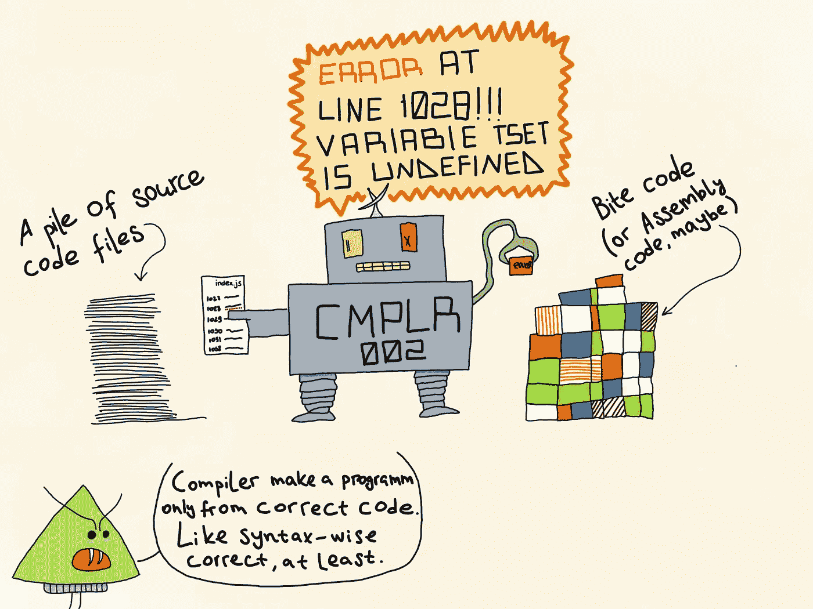
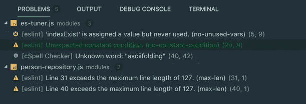

# 没有(JS)编译器的生活。如何减少对它的恐惧。

> 原文：<https://itnext.io/live-without-a-js-compiler-how-to-be-less-afraid-of-it-7ebde33fef76?source=collection_archive---------1----------------------->

毒蘑菇既没有编译器，也没有烦恼。

对我们大多数人来说，做一个孩子比做一个青少年或成年人要容易得多。童年可能是我们一生中最快乐的时光的原因之一是缺乏责任，其中最令人讨厌的是对自己的幸福负责。作为孩子，我们有父母，或法定监护人，或其他一些有经验的，负责任的成年人告诉我们什么是好的，什么不是。虽然我们可能仍然行为不端，并通过我们自己的痛苦错误的痛苦经历这个世界的某个部分，但我们接受的这个成人的指导使我们活着。非常字面上的意思。

类似的事情也适用于编译编程语言。编译器就像一个有爱心的成年人，防止我们的应用程序犯愚蠢的错误。编译器将我们的高级代码翻译成某种低级编程语言(汇编语言、字节码等)。)，为了做到这一点，其中一个应该有效地映射到另一个。我们相信编译器会在我们试图访问一个从未声明过的变量、将 MyHelloworldClass1 类型的值赋给一个布尔变量或遗漏分号时通知我们😖。我们放心，如果我们搞砸了，我们的代码永远不会被执行。除非我们使用 JavaScript。或者 PHP，或者 Ruby，或者其他任何一种没有编译时间的语言，但是让我在这里把重点放在 JS 上(拜托)。

因此，让我们回顾一些选项，我相信这些选项可以帮助您减少运行时错误的数量，从而使您的生活更加快乐(或仅仅快乐一点点)。

**免责声明**:有时我会使用术语“编译语言”的传统含义，指的是有编译时间的编程语言，而不是只有实时(JIT)编译选项的语言。

编译器是你的朋友。真的。

# 选项 1:静态代码分析工具

嗯，我想如果你使用 JavaScript 一段时间，你已经熟悉了一个概念。我说的是 linter——一种分析你的代码并告诉你哪里出了问题的工具。毫无疑问，静态代码分析软件是减少荒谬的运行时错误数量的第二有效方法。

如果你们中的一些人，我亲爱的读者，不知道 linters 是什么(我将使用这个术语，而不是更长的“静态代码分析”)以及它们是做什么的，这里有一个非常简短的概述。Linter 是一种程序，它把你的代码和一些被认为是不好的代码实践的指令作为输入，并在分析前者的基础上产生一个问题列表。就像你的代码一样，而不是一般意义上的(为此你需要比一个应用更好的东西)。通常，根据您的配置，linter 可能会指出语法错误(例如未声明的变量)、代码味道(例如未使用的变量)、违反代码风格约定(例如长行)或不推荐。虽然这些工具可以作为独立的应用程序使用，但当它们与您的 IDE 集成时更有意义，在这种情况下，它们可以分析您的代码，并实时为您提供问题列表。例如，我使用了一个名为 [ESLint](https://eslint.org) 的 linter，集成了 [Visual Studio 代码](https://code.visualstudio.com)。当你为你的项目初始化 ESLint 时，你可以选择是否要基于你的代码风格生成一个新的 linter 配置，或者只是采用 AirBnb 或 Google 等知名公司使用的流行配置。我个人更喜欢经过一些定制修改的 AirBnb one，我建议先尝试一下，了解一下它的实际功能。不管怎样，经过一段时间后，大多数开发团队都提出了他们自己的 linter 配置，最适合他们的需求。因为在我们神奇的、高度多样化的 IT 世界中，没有一个开发团队是相同的。

所以是的。静态代码分析工具又名 linters。如果你仍然不使用它们，就使用它们。真的没有借口不这样做。

ESLint 输出的一个例子。

# 选项 2:翻译和语言超集

这将是一个棘手的问题，因为我将要谈论两件有联系但不完全相同的事情。忍耐一下，好吗？

克服 JS 缺乏强类型和编译时错误检查的最简单方法是添加它们。使用 JavaScript 语言超集，如 [TypeScript](https://www.typescriptlang.org) 、 [ResonML](https://reasonml.github.io) 、 [Flow](https://flow.org) (这被称为“静态类型检查器”)或[coffee script](https://coffeescript.org)(2018 年没人关心它)，然后[转换](https://en.m.wikipedia.org/wiki/Source-to-source_compiler)回 vanilla JS，这是可能的。几乎可以说，使用这些语言中的一种与使用 Java 这样的编译语言是一样的。至少从代码分析的角度来看*。*不像 linter 可能会指出明显的错误，但实际上永远不会阻止你做危险的事情，编译器可能会引发编译错误，这将阻止你的代码运行，至少在你修复编译器发现的所有问题之前。这是一件好事，因为没有应用比有一个坏掉的应用要好。

虽然您必须使用 transpiler 从其超集生成 JS，但是您也可以使用 trans piler 从更高级的 JS 代码生成 JS 代码。这种工具的一个很好的例子就是 [Babel](https://babeljs.io/docs/en/) 。对于那些不熟悉这个工具的人来说，Babel 是一个 JS transpiler，它可以将使用最新和最棒的 ES2015+编写的代码转换为旧的 ES5，以便更好地兼容稍微过时的浏览器。所以对于纯粹主义者和不太喜欢弱类型语言的人来说——你仍然可以为你的 100%纯 JS 代码找到一个类似编译器的工具。

因此，作为这一部分的简历，我想说:如果你正在开始一个新项目或使用 Node.js 迈出第一步，请好好看看 TypeScript 或甚至 ReasonML，因为它们是很好的编程语言，有助于避免 js 对类型的不太符合逻辑的理解所导致的许多陷阱。另外，如果你是一名前端开发人员，有充分的理由不使用 EcmaScript，那么请至少使用 Babel。随着 ES 的每一次迭代，JS 都变得越来越好，并且您真的希望尽快获得所有新的 API，更不用说您将会有一个 transpiler 的敏锐的眼睛为您寻找代码中的不良之处。

当涉及到强类型时，TypeScript、Flow 和 ReasonML 是救星。

# 选项 3:测试自动化

*唉*，在 2018 年，每当我需要与看似理智的开发人员讨论单元测试的重要性时，我都会感到不安，这些开发人员正在从事具有大量依赖性的相当大的项目。此外，情况越来越复杂，我是否应该建议开发人员也可以编写一些自动集成和/或功能测试。这不仅仅是在你没有专门的测试团队的情况下。比方说，在一个大而复杂的系统中，可能会有一些棘手的部分在某种程度上相互集成，这些部分可能仍然有资格进行白盒测试，而白盒测试不是单元测试。例如，您可能想要测试您的 Web API，它有几个在不同条件下调用的中间件函数(想想 [Koa](https://koajs.com) )。在某些情况下，你可以用这种方式组织你的代码，这样你就可以模仿底层的基础设施并调用你的 API 的端点，而不用把它部署到测试环境中。

编写白盒测试很无聊，而且越无聊，你的系统就变得越复杂。然而，测试，即使它们是非常基础和不完整的，可能并且将会(有时)阻止你部署不完整的代码。通常，这种潜在的破坏并不是由错误实现的算法引起的，或者与应用程序的逻辑有关的东西。不，一点也不。您的罪魁祸首很可能是一个丢失的分号、一个错别字或一个未声明的变量。编译器通常会发现并报告所有这些东西。

编写测试，在每次提交之前运行测试，热爱测试(或者至少不要忽略它们)。

# 选项 4(有争议):提升你的编码技能

因为你总能做得更好。即使你是埃隆。

与我建议的其他选项不同，这个选项是被动的，不保证任何结果，但我仍然相信结构良好、易于理解的代码有助于减少荒谬的、容易忽略的错误。也就是说，我不会谈论所有可能的和不可能的改进代码的方法。因为你知道，我有一种感觉，某个地方的某个人已经用人类已知的每种编程语言写了一两本关于良好实践的书。相反，让我们把注意力集中在我真诚相信的与这篇博文的主题相关的东西上。

首先，让你的代码尽可能简单、易读、明了。我已经写过一篇关于[的文章，每当某个模块的繁忙逻辑变得复杂时，我都会尝试采用一种很好的方法](/a-functional-poem-code-that-makes-sense-e884153e8ccb)。JavaScript 允许我们使用函数式编程世界中的一些概念，我建议你采用它们来提高我在本段第一句中提到的代码的三个质量。然而，我确实想提到一个编程概念，我不久前才学会使用它，我很遗憾花了这么长时间才学会。那是[纯函数](https://en.m.wikipedia.org/wiki/Pure_function)——一个不会产生副作用的函数，对相同的自变量返回相同的结果。您可以用任何编程语言编写它们，但是组合、部分应用和库里函数的能力使它们在 JS 中特别容易和有效。

第二，这与**选项 3** 相关，以允许依赖注入的方式编写代码。不过不要过度。这将有助于您编写更有意义的单元测试，这将帮助您了解您的代码是否有问题，而不是在您每次做一个小的更改时就莫名其妙地中断测试。

 [## 一首功能诗——有意义的代码

### 你好。

itnext.io](/a-functional-poem-code-that-makes-sense-e884153e8ccb) 

# 选项 5:唯一好的

好吧，现在让我们面对现实。正如一个人永远不会像一个经验丰富的专业团队那样高效，上面提到的选项中没有一个会像它们组合在一起时那样好。

使用 TS/Flow/ReasonML 编写干净、无意义的代码，其中数组永远不会被字符串整除。在你的 IDE 中添加一个 linter 来实时跟踪未使用的变量和其他讨厌的东西。用 Babel 编译你的代码，捕捉那些被 linter 忽略的愚蠢错误。在提交代码之前运行自动化的白盒测试，以确保您的系统在部署时不会崩溃(希望是部署到您的测试环境中)。这不能保证你永远不会因为从一个严重的失败中恢复你的无论你构建的应用程序而度过一个不眠之夜，但是这肯定会帮助你将这样的夜晚数量保持在最少。

或者用 Java/C#/Go 代替。

仅此而已。非常感谢，下次再见。