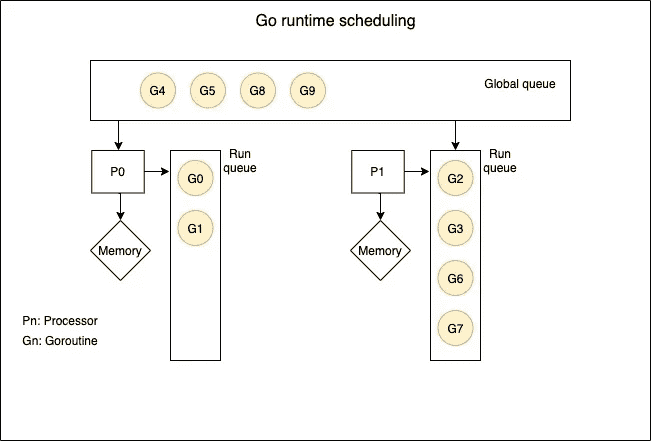
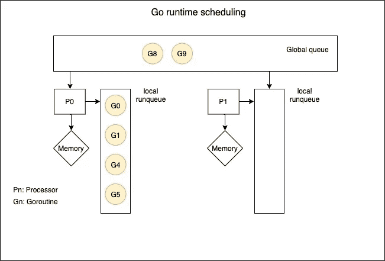
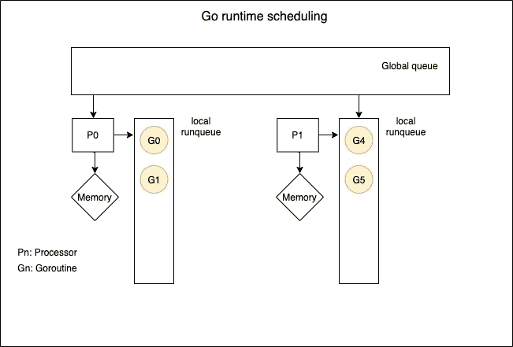

# Go 中的负载平衡 goroutines

> 原文：<https://itnext.io/load-balancing-goroutines-in-go-57e0896c7f86?source=collection_archive---------3----------------------->

图为[洛伊克·勒雷](https://unsplash.com/@loicleray?utm_source=unsplash&utm_medium=referral&utm_content=creditCopyText)在 [Unsplash](https://unsplash.com/s/photos/balance?utm_source=unsplash&utm_medium=referral&utm_content=creditCopyText)

Golang 以其对使用`goroutines`、`channels`、`select`语句、竞争和死锁检测的并发模型的语言原生支持而闻名。但是在多处理器系统中，这总是伴随着[成本](https://www.usenix.org/system/files/conference/hotos15/hotos15-paper-mcsherry.pdf)(优于单线程的配置)。

## 背景:多进程调度

回顾我们的 CS 课程，我们知道每个多处理器系统的核心都是优化处理器利用率，操作系统通过实施高效的调度算法在不同处理器之间分配负载来实现这一点。这些方法包括:

1.  **对称和非对称调度**:当有一个主处理器为其他进程编排调度时，对称调度很常见。当每个处理器都有自己的就绪队列，也许还有一个全局队列来处理它们的作业时，就会出现对称调度
2.  **处理器关联性:**当不同处理器的资源使用行为不一致时，例如不同处理器不一致地访问高速缓存或内存时，使用此机制( [NUMA](https://en.wikipedia.org/wiki/Non-uniform_memory_access) )
3.  **负载共享/负载平衡:**当处理器负载不均匀时，使用这种机制，其中一些负载过重，而另一些负载空闲。这在拥有自己的*就绪队列的对称系统中很常见。*这可以通过以下两种方式之一实现:

*   **推送迁移**:一个单独的进程定期运行，将任务从过载处理器的就绪队列中推送到全局队列或其他未过载的处理器中
*   **拉式迁移**:空闲的处理器将任务从全局队列拉至它们自己的就绪队列

Golang 在其运行时使用基于 ***拉迁移的负载均衡调度*** 来优化资源利用率。让我们把下面的图表看作一个典型的 go 运行时在任何给定时间点的调度

在图中，`G0`、`G1`……`G9`是运行在一台双核机器上的 goroutines，该机器有两个处理器`P0`和`P1`。上下文中的系统有一个全局队列，队列中有 4 个 goroutines。

## Goroutine 负载均衡

Go 的`goroutine`负载平衡算法通过以如下方式实现基于[停放/未停放的工作窃取调度](https://github.com/golang/go/blob/dcd3b2c173b77d93be1c391e3b5f932e0779fb1f/src/runtime/proc.go#L31-L80)来工作:

1.  每个处理器都从自己的本地运行队列中运行`goroutines`。因此，在上述情况下，P0 和 P1 将分别运行 goroutines G0、G1 和 G2、G3、G6、G7
2.  如果一个处理器不在它自己的本地运行队列(空闲状态)中执行，它将从全局队列中提取工作
3.  如果处理器无法在全局队列中找到要执行的 goroutines，那么它会尝试从`netpoller`中提取工作
4.  如果它仍然找不到要执行的 goroutines，它将检查其他处理器的运行队列，并从它们的运行队列中窃取`goroutines`的一半

基于此，假设我们有一个 go 程序，其状态如下，其中 P0 过载，而 P1 空闲

在这种情况下，Go runtime scheduler 将执行以下步骤，以确保尽可能高效地利用硬件(多处理器)

1.  P1 将检查本地运行队列，发现它是空的。
2.  它检查全局运行队列，发现有两个 goroutines 要执行:G8 和 G9
3.  它*将它们停放*在其本地运行队列中，并开始执行它们
4.  假设过了一段时间，它完成了这两个 goroutines 的执行，而 P1 仍然忙于执行一个满运行队列
5.  P1 检查了一下`netpoller`，发现它也是空的。当全局队列和`netpoller`队列都为空时，这在 Go 运行时调度器的底层实现中被称为线程的[旋转状态](https://github.com/golang/go/blob/dcd3b2c173b77d93be1c391e3b5f932e0779fb1f/src/runtime/proc.go#L55-L63)
6.  在这种状态下，P1 现在*从 P0: G4 和 G5 窃取*工作*的一半*。系统状态看起来是这样的，它平衡了处理器之间的负载，并有效地利用了硬件

如果你感兴趣，2012 年写的可伸缩 Go 调度器的设计文档[更深入地捕捉了所有这些细节。](https://docs.google.com/document/d/1TTj4T2JO42uD5ID9e89oa0sLKhJYD0Y_kqxDv3I3XMw/edit)