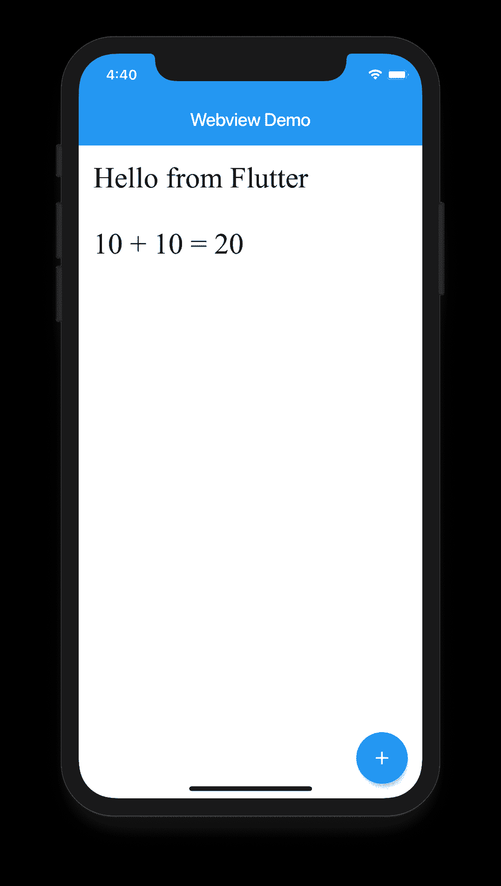

# 在 Flutter 中将本地 html 文件加载到 WebView 中。从 Flutter 调用 JS 函数。

> 原文：<https://itnext.io/load-local-html-file-into-webview-in-flutter-call-js-function-from-flutter-2d9404c8f7d4?source=collection_archive---------0----------------------->

在本文中，我们将看到如何在 Flutter 中用本地 Html 加载 Webview，并从 Flutter 调用其中的 Javascript 函数。


WebView 颤振

# **添加依赖关系**

你首先需要的是 webview 插件本身，你可以从下面的链接得到它【https://pub.dev/packages/webview_flutter
T3

打开 *pubspec.yaml* 文件，添加依赖关系

```
dependencies:   
    webview_flutter: ^1.0.7
```

# **观看视频教程**

下面是我们将要加载到 webview
中的 HTML 代码示例，我已经将该文件保存在项目根目录下名为“files”的文件夹中。

为了让应用程序访问该目录，请确保在 *pubspec.yaml* 文件中添加该文件夹。

打开 *pubspec.yaml* 文件后，转到 assets 部分，在那里添加这个文件夹“ *files* ”。

#要将资产添加到您的应用程序中，请添加一个资产部分，如下所示:
资产:
—图像/
— json/
—视频/
— **文件/**

## **HTML 文件**

```
<html>
<head>
    <meta name="viewport" content="width=device-width, initial-scale=2">
    <script type="text/javascript">
        function add(num1, num2) {
            var result = num1 + num2;
            document.getElementById("result").innerHTML
                = num1 + " + " + num2 + " = " + result;
        }
    </script>
</head>
<body>
    <p>Hello from Flutter</p>
    <p id="result"></p>
</body>
</html>
```

**接下来，我们将通过添加 webview 来创建用户界面。**

下面是完整的源代码。这里，我们首先使用空 Url 加载 webview，当 webview 返回'***onwebview created***'回调时，我们将初始化***webview controller***，然后使用它加载本地 HTML 文件。webViewController 实例还用于使用***evaluate javascript***方法调用 JavaScript 函数。
这里我们调用本地 html 文件中的' ***add*** '函数，该函数添加了从 Flutter 发送的两个数字，并显示在 Webview 的 p 标签中。

*这里是完整的代码*

```
import 'package:flutter/material.dart';
import 'package:flutter/services.dart';
import 'dart:convert';
import 'package:webview_flutter/webview_flutter.dart';

class WebViewTest extends StatefulWidget {
  [@override](http://twitter.com/override)
  State<StatefulWidget> createState() {
    return _WebViewTestState();
  }
}

class _WebViewTestState extends State<WebViewTest> {
  //
  WebViewController _webViewController;
  String filePath = 'files/test.html';

  [@override](http://twitter.com/override)
  Widget build(BuildContext context) {
    return Scaffold(
      appBar: AppBar(title: Text('Webview Demo')),
      body: WebView(
        initialUrl: '',
        javascriptMode: JavascriptMode.unrestricted,
        onWebViewCreated: (WebViewController webViewController) {
          _webViewController = webViewController;
          _loadHtmlFromAssets();
        },
      ),
      floatingActionButton: FloatingActionButton(
        child: const Icon(Icons.add),
        onPressed: () {
          _webViewController.evaluateJavascript('add(10, 10)');
        },
      ),
    );
  }

  _loadHtmlFromAssets() async {
    String fileHtmlContents = await rootBundle.loadString(filePath);
    _webViewController.loadUrl(Uri.dataFromString(fileHtmlContents,
            mimeType: 'text/html', encoding: Encoding.getByName('utf-8'))
        .toString());
  }
}
```



从 Flutter 调用 JS 函数

请分享和评论你的宝贵想法。

在 youtube 上关注我以获得更多教程

[](https://www.youtube.com/channel/UC5lbdURzjB0irr-FTbjWN1A) [## 移动程序员

### 这个频道将帮助你学习移动技术，如 Fluttter，React Native，Android 和 iOS。

www.youtube.com](https://www.youtube.com/channel/UC5lbdURzjB0irr-FTbjWN1A) 

谢谢大家！！！祝你新年健康快乐…