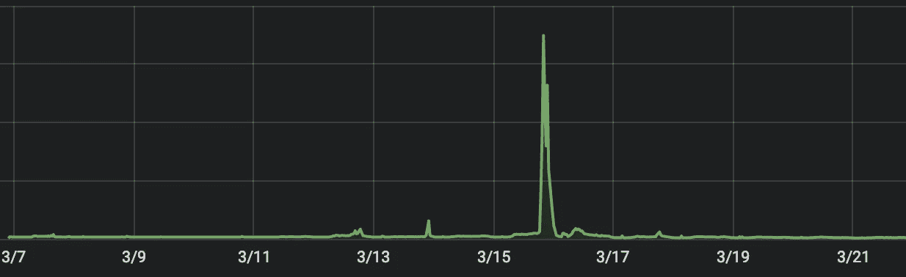
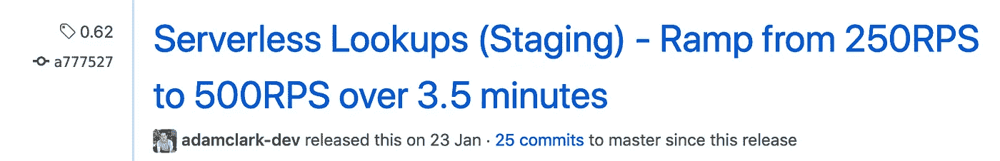
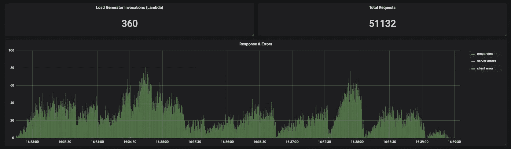
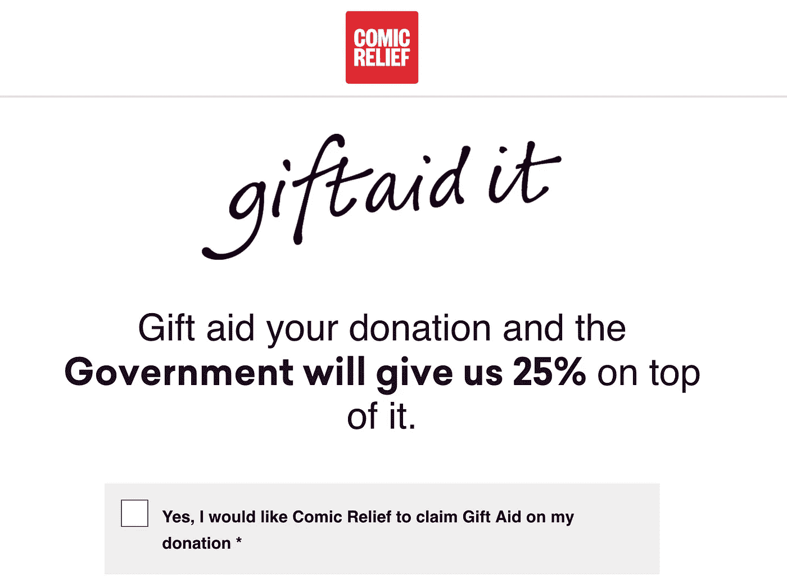
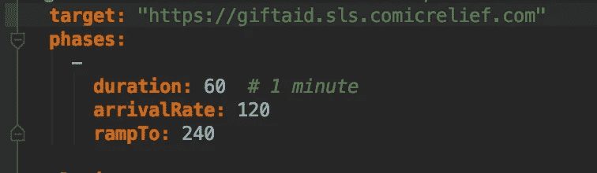
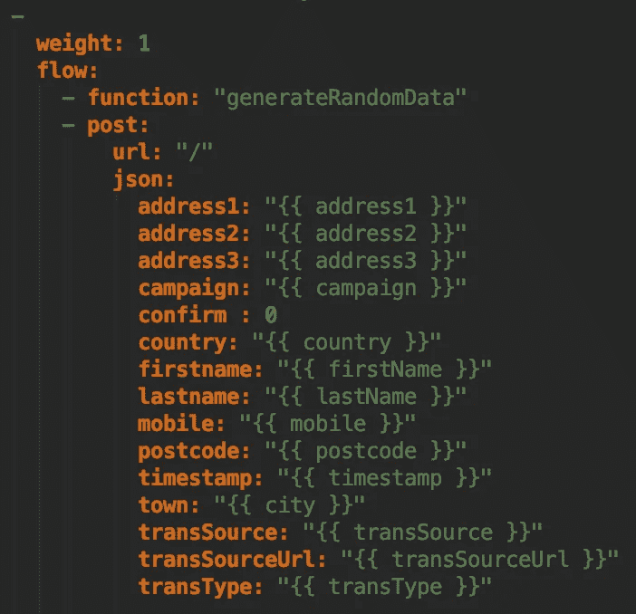
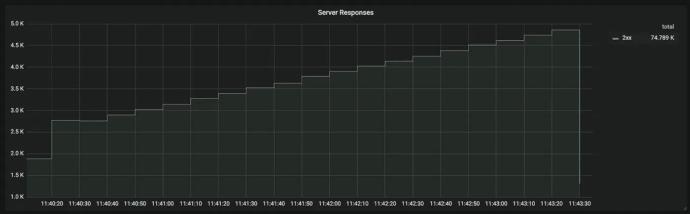
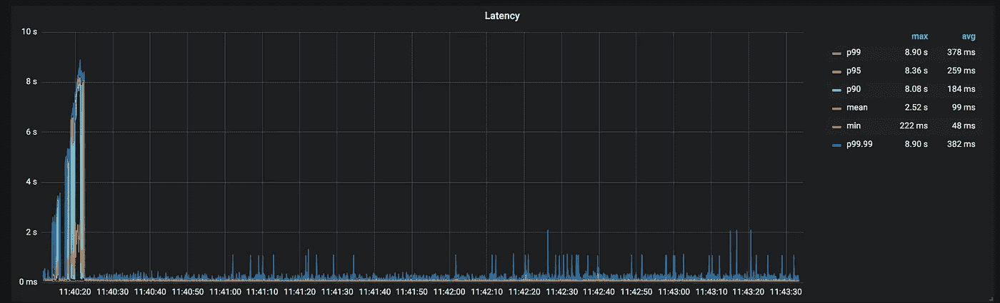

# Comic Relief 上的无服务器负载测试

> 原文：<https://itnext.io/load-testing-serverless-with-serverless-at-comic-relief-e983e8bf52c0?source=collection_archive---------4----------------------->

在 2019 年红鼻子日之前，我们如何使用无服务器大炮对我们的无服务器应用(和传统应用)进行负载测试

# 这个红鼻子日是什么东西？

自从 1988 年发起以来，红鼻子日已经成为英国的一种习俗。这一天，全国各地的人们可以聚在一起，在家里、学校和工作场所筹集资金，以支持英国和国际上的弱势群体和社区。

整整一年都是行人流量，然后每样东西都有五个小时处于危险之中，我们需要能够确保我们的系统失败并优雅地倒过来。我将向您简要介绍我们如何在峰值负载之上持续对系统进行负载测试，确保我们不会引入应用程序在流量冲击期间无法处理的漏洞。给我的[上一篇关于无服务器之旅的文章](https://medium.com/@adamclarkdev/journey-to-serverless-d3256d91af16)读一读，了解一下我们是如何实现几乎一切无服务器并大幅减少 AWS 占用空间的。

# 背景故事

因此，要理解我们现在在负载测试中的位置，您需要知道我们从哪里来。

我们之前使用了部署在 EC2 spot 实例负载上的[围攻](https://github.com/JoeDog/siege)，所有这些都是使用[地形](https://www.terraform.io/)和 [Ansible](https://www.ansible.com/) 部署的。为了模拟我们过去最重要的交通事件之一，我们使用了 32 个 r4.large 实例进行一系列 slam 测试。它允许我们生成所需的负载，以确保我们的应用程序按预期工作。从工程(和成本)角度来看，缺点非常明显。这些是，

*   部署基础设施、设置和运行测试需要几天时间。
*   不必要地增加了负载测试的成本，基础设施的部署时间通常也比需要的时间长得多。
*   它不容易被工程团队中想要测试他们系统的每个人复制。

# 新的希望

Peter (工程主管)和我努力理解遗留方法以及我们如何推进它，我们开始在谷歌上搜索立即生效的替代方案。我们很快遇到了两个非常合适的候选人；这些是[驱迫器](https://goad.io/)和[无服务器火炮](https://github.com/Nordstrom/serverless-artillery)。我们对两者做了一个快速的比较，并选定了[无服务器大炮](https://github.com/Nordstrom/serverless-artillery)，因为它是用 NodeJS 编写的，并使用了[无服务器框架](https://serverless.com/)，这与我们其他新兴的无服务器应用程序是一致的。

为了让您对我们的方法有更多的了解，我们通常会针对我们的应用程序执行不同的测试选择，下面是对每种测试类型以及我们为什么要这样做的快速解释。

*   **点滴试验**通常持续几天。这可确保我们模拟正常的后台负载水平，观察站点在正常操作下的行为，并将延迟或错误率增加的任何时段与这些时段内已知发生的活动(例如部署、缓存清理和我们负载测试计划的其他元素)相关联。
*   **Slam 测试**至模拟流量的突然峰值，这使我们能够了解站点在面对传统的自动扩展系统难以恰当处理的流量状况时的行为。我们在这里的目标是确定在突然的流量高峰期间可能出现的错误的级别和类型。由于喜剧救济的性质，响应于新闻故事、在国家电视上播放的吸引人的电影和其他类似事件，可能出现极其急剧的流量峰值。
*   **匝道测试**产生一个逐渐增加的交通流量水平，类似于活动期间每天的流量水平。

电视之夜前的捐赠流量

就我们的负载测试工作流而言，我们将所有的负载测试计划与测试代码一起存储在一个存储库中。我们可能会让计划更接近我们正在测试的应用程序，但是这些东西会自然增长，所以，哦，好吧！对于每个负载测试，我们在 GitHub 中创建一个发布，记录负载测试和任何信息或发现；稍后我们可以快速回头看这些，所有与负载测试相关的代码更改都是 sed 发布的一部分。

我们的查找服务的负载测试版本

我们从[无服务器火炮](https://github.com/Nordstrom/serverless-artillery)向 [InfluxDB](https://www.influxdata.com/) 报告负载测试的性能；然后我们在 Grafana 中可视化该报告，并在我们的 GitHub 版本中链接到它。

我们从一个单独的 AWS 帐户对我们正在测试的应用程序运行所有的负载测试，这使我们能够快速了解运行测试的成本，也意味着我们不会超出我们的 lambda 调用限制(希望不会，我们有非常高的调用限制)。我们通常还会从不同的 AWS 区域对应用程序进行负载测试。更科学的做法可能是从另一家云提供商那里运行这些服务，以更接近真实用户，但目前对我们来说已经足够接近了。

向 InfluxDB 报告并在 Grafana 中查看的无服务器火炮载荷试验

所以，为了让你全面了解我们如何用[无服务器大炮](https://github.com/Nordstrom/serverless-artillery)对[礼物援助应用程序](https://giftaid.comicrelief.com/)进行负载测试，我需要给你提供一些背景。对该应用程序的最佳描述是一个用户提交其详细信息的表单，以便我们可以在短信捐赠上申请礼品援助。

点击[礼物援助应用](https://giftaid.comicrelief.com/)的流量通常在 BBC 广播频道的行动号召之后非常高，在几秒钟内从 0 上升到数千个请求。它可能是我们负载最高的应用程序，但也是我们最简单的用户流之一，因为大部分负载是针对单个 lambda 的。

礼品资助表格

在下面的测试中，我们定义了无服务器后端的端点，设置了 60 秒的持续时间，每秒 120 次提交的到达率上升到每秒 240 次提交。

然后我们创建提交逻辑，使用 faker NPM 模块向无服务器端点提交一个包含随机数据的表单。

就这么简单，我在这里就不赘述了，因为[无服务器火炮](https://github.com/Nordstrom/serverless-artillery)和[火炮](https://github.com/artilleryio/artillery)文档都超出了我在这里所能描述的范围。

一旦我们在本地机器上验证并运行了一个低流量版本的测试，以确保它像预期的那样工作，我们运行`slsart deploy`将负载测试部署到 AWS，然后使用`slasrt invoke`调用负载测试。然后，我们将立即开始查看 Grafana 中被调用的负载测试 lambdas 的计数，看到流量开始到达后端，并可以注意错误或延迟问题。

在斜坡测试中，我们通常会看到请求上升，并确保响应速度或客户端错误不会突然下降。

超过 5 分钟的上升请求

我们在非常突然的高流量峰值上看到的一个常见问题是，您将获得相当大的预热延迟。一旦兰姆达斯舰队得到补给和温暖，这通常会得到控制。我们构建我们的前端应用程序来处理这种初始峰值，如果它发生了，不会吓坏用户。在 P99.99 上平均 382 毫秒是可以接受的，但我们最终会为那些看了 8 秒钟旋转器的人感到难过。

对于电视之夜，随着时间的推移，我们通常会看到越来越温暖的兰姆达斯车队，所以这不是一个问题。当我们知道高峰即将到来时，我们可以温暖一队兰姆达斯；不过，峰值通常不是那么容易预测的。

预热延迟峰值

当负载测试运行时，我们将高度警惕来自[哨兵](https://sentry.io)和 [IOPipe](https://www.iopipe.com/) 的错误。我们通常会尝试完全复制负载测试环境的警报和仪表板，以匹配生产，让我们完全习惯于我们将在活动期间看到的内容。

在活动开始前，我们还举办了几个游戏日，让企业的利益相关者参与测试和模拟。我们运行这些测试的更多扩展版本，以复制电视之夜的流量概况的压缩版本，同时在 youtube 上观看红鼻子日的重播。这一过程有助于团队习惯于他们晚上将会看到的东西，并允许创建和优化沟通路线。

# 最后的想法

我们的下一步可能是为我们的负载测试带来一定程度的自动化，并将测试与我们的功能测试一起引入我们的 [Concourse CI](https://concourse-ci.org/) 管道。随着新特性的出现，了解我们系统的负载含义并确保我们不会带来任何关键问题将是一件非常棒的事情。

这对我们来说就像负载测试一样简单。我们鼓励工程团队中的每一个班都去做，并对此感到舒适。无服务器之前的负载测试过程看起来总是像一场艰苦的斗争，有点痛苦，并且针对一个利基技能集。就像无服务器中的所有东西一样，它只是去掉了一些额外的垃圾环，您必须跳过这些环才能完成外围工作并继续您的一天。负载测试的价格和时间现在处于一个可以忽略不计的水平，它不能成为不做测试的理由。

如果你喜欢这篇文章，那么看看我们走向无服务器之旅的[故事](https://medium.com/@adamclarkdev/journey-to-serverless-d3256d91af16)以及[我们如何调试我们的应用](https://medium.com/@adamclarkdev/monitoring-debugging-serverless-applications-for-red-nose-day-2019-b2e3dd43613b)。

此外，请务必观看由我们的工程主管 [Peter Vanhee](https://github.com/pvhee) 在[伦敦无服务器计算大会](https://serverlesscomputing.london/)上介绍我们当前架构的[演讲。此外，查看我们的](https://www.youtube.com/watch?v=uyWDrEh0PvA)[技术博客](http://technology.comicrelief.com)了解更多关于我们如何做我们所做的事情的故事。