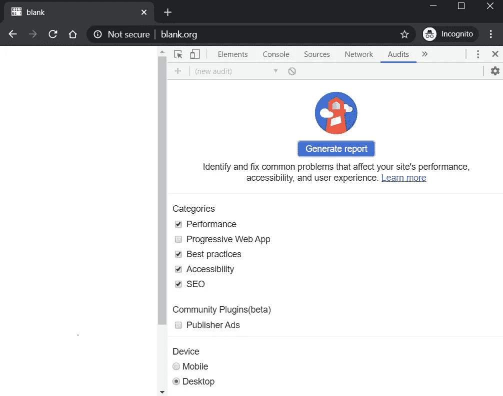
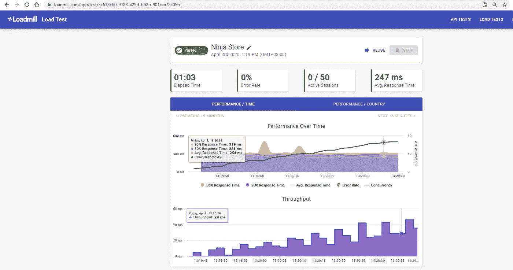

# 负载测试、压力测试和性能测试:您需要知道的一切

> 原文：<https://itnext.io/load-testing-stress-testing-and-performance-testing-all-you-need-to-know-56c333849941?source=collection_archive---------2----------------------->

米切尔·罗的照片

你有没有遇到过这样的情况:在测试的时候,*以前从没这样过*或者*昨天成功了*这种说法绝对有道理？

如果你回答是，那么你在一个好公司。这个阶段我们都经历过，现在还时不时的经历。

即使今天我们有复杂且非常强大的工具，在 99%的情况下应该使这些问题变得多余，但仍有 1%的情况下会出现意想不到的事情，例如没有被考虑的[极限情况](https://en.wikipedia.org/wiki/Corner_case)。

就 web 开发而言，最不愉快的情况之一是大量用户同时使用应用程序。因此，应用程序实际上可能会因负载过大而崩溃。这是一个可以同时影响大多数用户的问题。

测试是缓解大多数这些问题的解决方案，对于这种特殊的情况，性能测试是必由之路。

# 性能测试说明

这个领域是一个不断变化和发展的领域。正因为如此，事情发生得太快，以至于无法清晰地定义和描述。因此，误用这些术语的情况经常出现。

标签“性能、负载和压力测试”是这种情况的一个完美例子。

简而言之，负载测试和压力测试都是性能测试的子集，用于确定系统组件在不同负载场景下的性能。

总的来说，这种技术用于确定 web 应用程序在各种实际用例中的表现。

这个指标至关重要，因为 99.9%的时间，页面加载时间影响转化率、销售额和用户体验。

例如，在移动设备上，最佳实践是在 [3 秒](https://www.thinkwithgoogle.com/marketing-resources/data-measurement/mobile-page-speed-new-industry-benchmarks/)内显示网站内容。

越难装，跳出率越高。

作为开发工具的一个快速提示，您可以使用各种指标测试您访问的任何网站的性能。您所要做的就是导航到所需的网站，并使用 *CTRL+SHIFT+I* 或右键单击打开开发工具，然后该工具在审计选项卡中可用。

# 负载测试与压力测试:有什么不同

如果整个饼被称为性能测试，那么它的两个切片如下:

*   负载测试
*   压力测试

这两种类型的测试之间的差异非常微妙，但用最简单的话来说，就是这样的:

*   **负载测试**展示了应用**如何在**极端负载**下执行**。
*   **另一方面，压力测试**检查**应用程序在**极端负载**下的健壮性**。

或者

*   **负载测试**是为了算出一个 app 的**上限**，看系统在重负载下表现如何。
*   **进行压力测试**以查看**当负载极限**高于阈值**时**会发生什么，以及**如何从故障**中恢复。

# 如何执行负载测试和压力测试

在测试 web 应用程序的总体性能时，这里有一些需要考虑的最重要的指标。

大部分测试包括收集一些关键指标的数据。值得一提的一些指标包括以百分位数表示的**响应时间**(50%和 95%)、**错误率、平均加载时间、并发性、**和以每秒请求数度量的**吞吐量**。

**吞吐量**和**并发**是两个一开始有点难理解的术语。查看[并发性与 rps 的关系](https://github.com/alexfernandez/loadtest/issues/126)和[如何规划高并发性](https://flood.io/blog/planning-for-high-concurrency-load-tests-millions-of-users-and-beyond)以更好地理解它们。

**百分位数**值得几个单独的行。该指标与**响应时间**相关，它是对平均值的改进，因为平均值可能会产生误导。最流行的百分位数是 50%和 95%。

例如，以下值转换为:

*   **95%响应时间= 350 毫秒** —意味着传入请求的 **95%** 响应时间在 **350** 毫秒之内
*   **50%响应时间= 280 毫秒** —表示传入请求的 **50%** 响应时间在 **280** 毫秒内

现在，给定这些指标——**负载测试**意味着获取关于这些试金石的数据，并对其进行分析，以找出我们的应用的上限，以及它在这些高负载条件下的性能表现。

对于**压力测试，**我们超过了我们在之前的模型中发现的限制，我们测试并希望在相当长的时间内，服务器不会崩溃。

为了收集关于我们的应用程序的这种类型的数据，我们需要高性能工具的帮助，这些工具返回关于应用程序行为的真实和正确的数据。

其中一个工具是 [Loadmill](https://www.loadmill.com/) ，它允许你使用真实的网络流量来模拟真实的使用模式，以便在测试的服务器上产生负载。

下图展示了该工具提供的一些指标。

您还可以查看您的网站在不同地理位置的表现。然后，在下一次升级时，您将知道在哪些区域放置服务器，以便所有流量的响应时间更加一致。

# 结论

说到性能测试，在最能描述真实场景的条件下进行测试尤为重要。

有时你为应用程序设定的期望不够现实。这就是为什么选择一个能够模拟真实使用模式的工具来测试真实场景是很重要的。