# 使用 Apache JMeter 进行负载测试

> 原文：<https://itnext.io/load-testing-using-apache-jmeter-af189dd6f805?source=collection_archive---------1----------------------->


在 [Unsplash](https://unsplash.com?utm_source=medium&utm_medium=referral) 上由 [VanveenJF](https://unsplash.com/@vanveenjf?utm_source=medium&utm_medium=referral) 拍摄的照片

负载测试是对任何软件系统进行负载(HTTP、HTTPS、WebSocket 等)调用，以确定其在正常和高负载条件下的行为的过程。负载测试有助于确定软件系统可以处理的最大请求。它有助于确定导致应用程序性能下降的瓶颈点。当我们模拟真实的用户场景时，负载测试是有效的。我们需要知道用户在我们的应用程序上的行为。尝试使用不同的 API 调用复制它们的行为，并在我们的应用程序中长时间通过许多并发请求生成负载，以了解应用程序行为的变化。

当我们在系统上生成超出正常使用的负载(高负载)来理解应用程序/系统行为时，我们称之为压力测试。进行压力测试是为了了解整个系统的极限，理解在这样的负载期间抛出的错误种类，以及最终用户是如何受到影响的。这有助于在通过配置更多基础架构或优化应用程序来应对更高负载时的事件规划。

我们可以使用 [Apache JMeter](http://jmeter.apache.org) 对静态和动态资源进行负载测试，这些资源可以生成并发用户来模拟真实的用户场景。它还提供测试报告的图形分析。它是用 java 编写的，所以我们需要安装 Java 运行时来运行 Jmeter。根据 [JMeter 网站](http://jmeter.apache.org/index.html)，其定义如下:

> Apache JMeter 应用程序是开源软件，是一个 100%纯 Java 应用程序，旨在加载测试功能行为和测量性能。它最初是为测试 Web 应用程序而设计的，但后来扩展到了其他测试功能。

在您想要运行测试的系统上安装 [JMeter](https://jmeter.apache.org/download_jmeter.cgi) 。我用 Mac OS 运行 JMeter，用 brew 安装 Jmeter。

```
brew install jmeter
```

我们首先需要使用下面的命令检查我们可以在系统上打开的文件描述符。每个操作系统对活动文件描述符都有限制。每个 TCP 连接都需要一个文件描述符，所以我们需要确保有足够的文件描述符(可以在 1-65535 之间设置)来运行并发请求。

```
ulimit -n
```

为了开始我们的负载测试，我们需要从线程组开始。它们是任何测试计划的起点。我们可以指定想要同时模拟的用户数量(=线程数量)。设置加速时间，该时间指定启动所有线程所需的时间。我们需要为组中的每个用户(线程)定义一些迭代。每个线程独立于其他线程执行计划。单线程中的所有元素将按顺序执行。

我们可以在一个线程组中添加采样器和逻辑控制器。采样器帮助向服务器发送请求并等待响应，即 HTTP 请求采样器发送 HTTP 请求并获得响应。逻辑控制器帮助定制逻辑以决定何时发送请求、修改请求等。

侦听器是另一种类型的元素，我们可以将它添加到线程组中。它们提供了对我们的负载测试信息的访问。图形结果监听器帮助我们绘制测试结果。查看结果树监听器显示请求和响应的详细信息。我们可以为采样器请求添加预处理程序和后处理程序。前处理器在样本请求前执行定义的动作，后处理器在样本请求后执行定义的动作。预处理器可用于为每个请求生成不同的动态参数，后处理器可用于获取其他请求要使用的响应参数。配置元素用于配置采样器的默认值。

让我们举一个真实的例子，我们将使用一个线程组创建一个 JMeter 测试计划，该线程组可以在给定服务器上的用户资源上运行 CRUD 操作。每个“创建用户”操作需要在发送请求之前随机生成不同的电子邮件地址。获取身份验证令牌和用户 id 为创建用户请求提供了响应。身份验证令牌在所有后续请求中用作标头，并根据需要在 URL 和主体参数中用作用户 id。最后，有一个视图结果树监听器，在那里我们可以看到所有的请求及其响应。

步骤 1:向我们的测试计划添加一个线程组

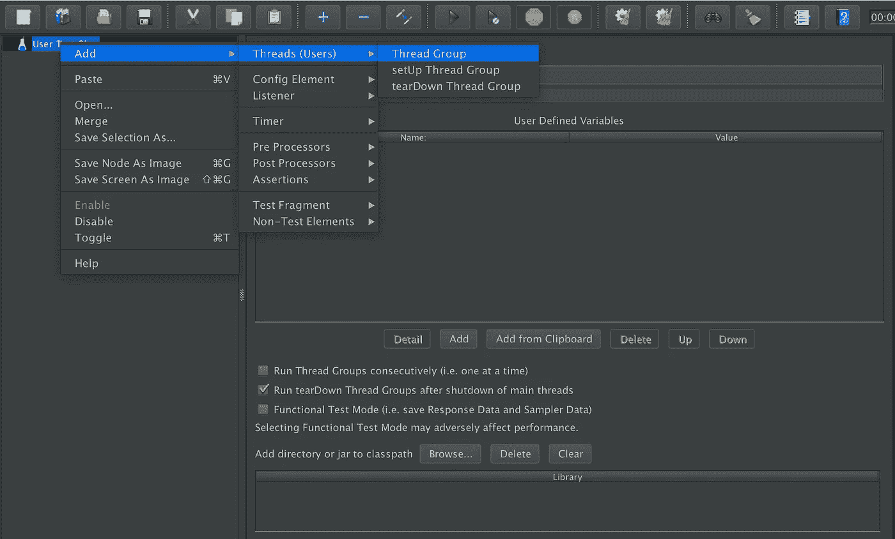

创建线程组

步骤 2:添加 HTTP 请求默认值，使用 config 元素定义所有请求所需的默认参数，如主机名和服务器端口。

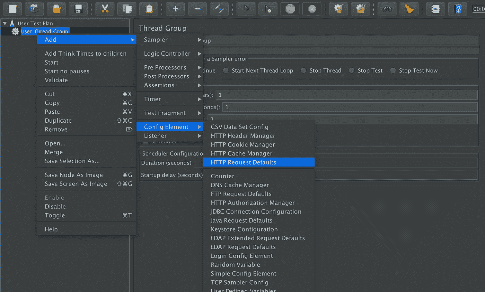

创建 HTTP 请求默认值

步骤 3:添加一个 HTTP 请求采样器来发送创建用户请求。

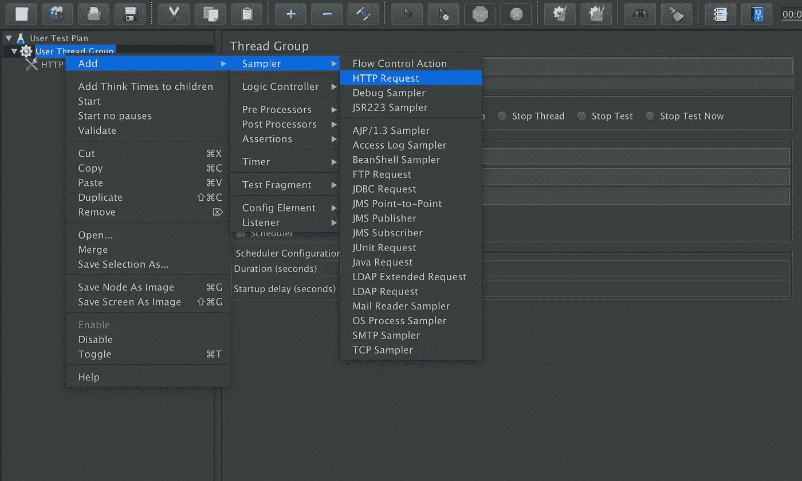

创建 HTTP 请求采样器

添加主体以创建带有动态电子邮件参数的 HTTP 请求，该参数由预处理器生成。

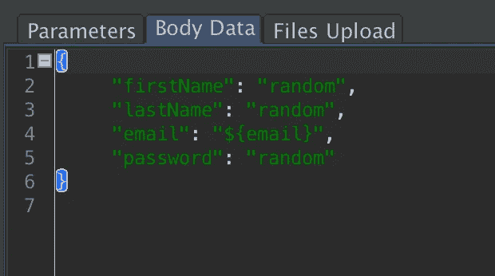

第 4 步:添加一个 BeanShell 预处理器，为创建用户请求生成一个随机的电子邮件地址。

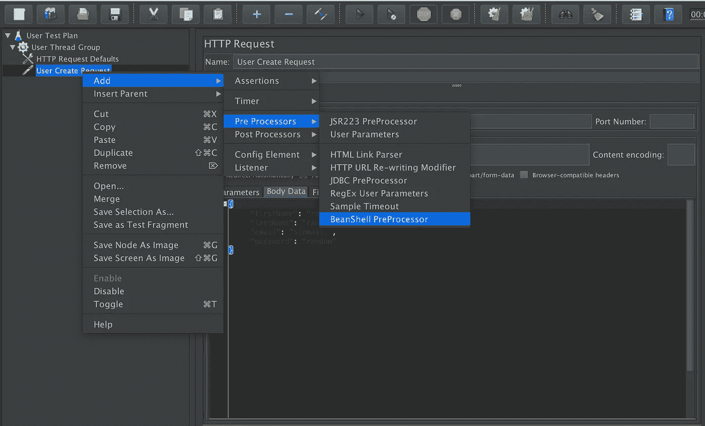

为预处理用户 HTTP 请求创建 BeanShell 处理器

使用 java 代码生成一个随机数，用于为每个请求生成新的电子邮件。

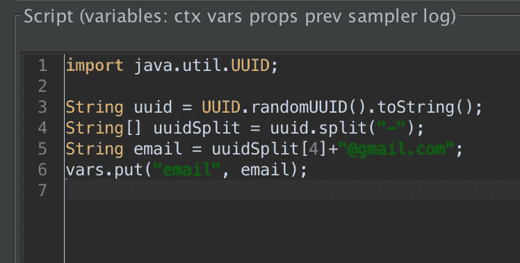

步骤 5:添加一个 JSON 提取器后处理器，从创建用户请求的响应中获取身份验证令牌和 userId。

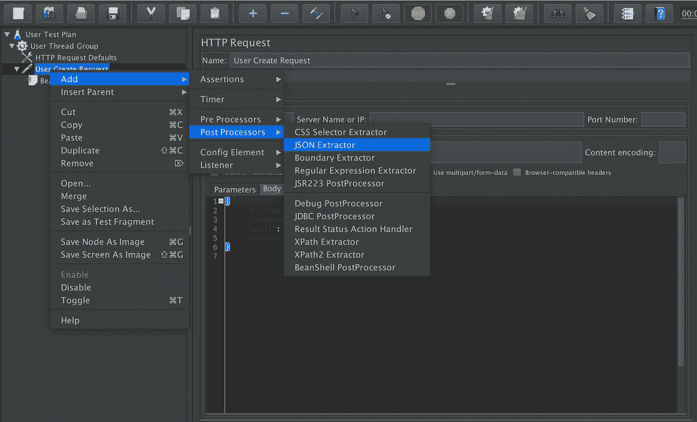

为后处理 HTTP 请求创建 JSON 提取器

使用 JSON 提取器从 JSON 响应中读取令牌。

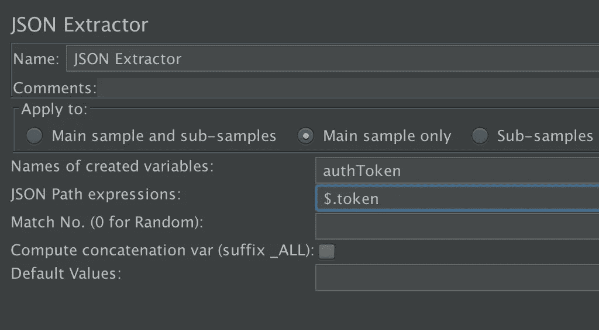

步骤 6:添加一个 HTTP 头管理器，将身份验证令牌作为头添加到所有后续请求中。

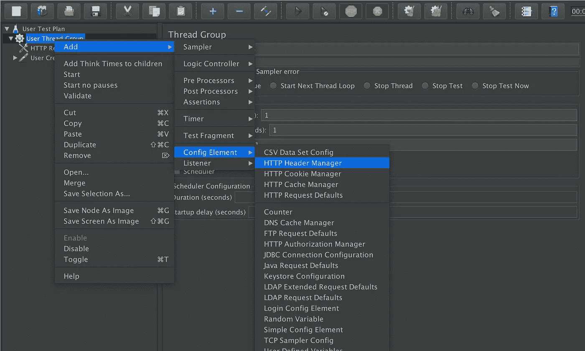

创建 HTTP 头管理器，用于向所有请求发送验证头

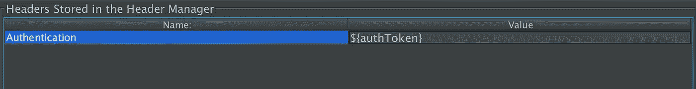

第七步:添加更新用户，获取用户，删除用户 HTTP 请求采样器用于后续的请求，方式与创建用户 HTTP 请求采样器相同，userId 为动态变量，从创建用户后处理器中取出。

步骤 8:添加查看结果树以获得对所有请求的响应。

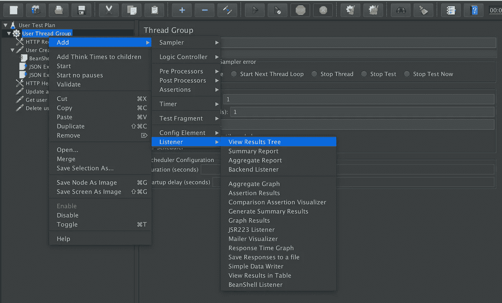

创建视图结果树监听程序

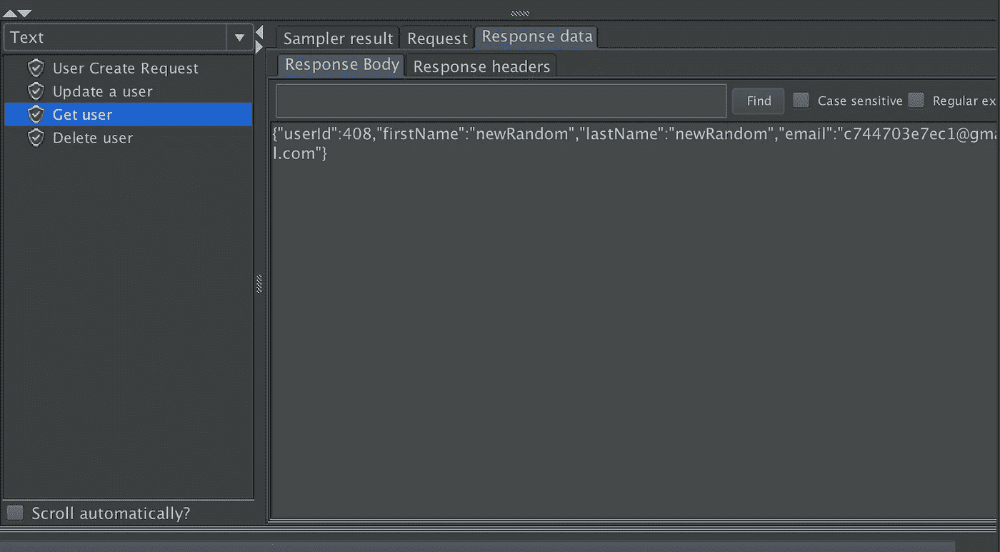

最后，我们准备好了用户 CRUD 负载测试，可以通过增加用户数量来生成负载。

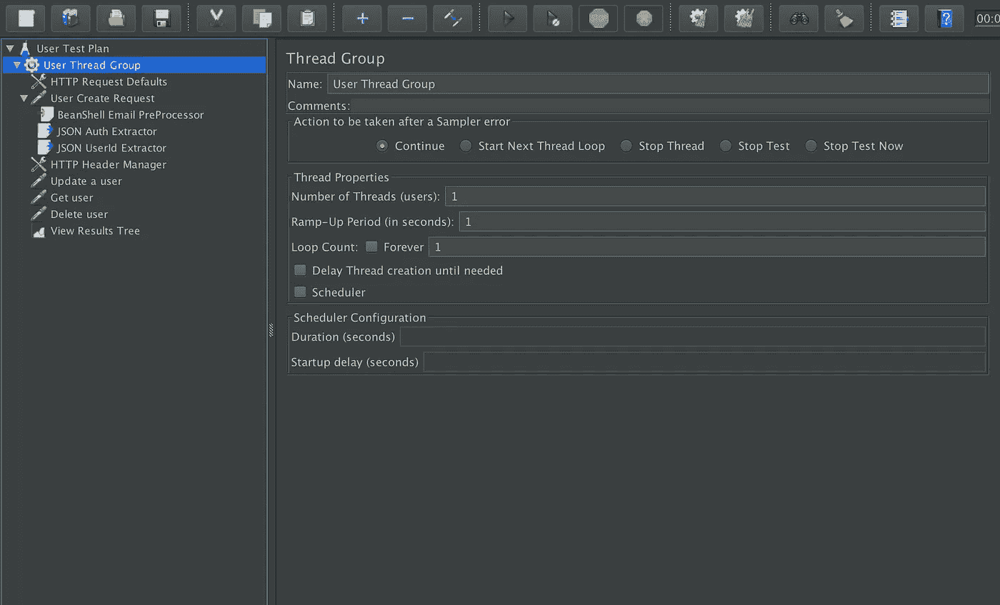

这样，我们可以生成不同的负载测试计划，以了解我们的应用程序的限制。

完整的代码可以在这个 git 资源库中找到:[https://github.com/MiteshSharma/JMeterUserLoadTest](https://github.com/MiteshSharma/JMeterUserLoadTest)

***PS:如果你喜欢这篇文章，请鼓掌支持*** 👏 ***。欢呼***