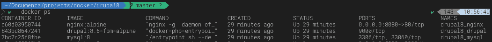

# 用 Docker 进行本地 Drupal 8 开发

> 原文：<https://itnext.io/local-drupal-8-development-with-docker-ed25910cfce2?source=collection_archive---------1----------------------->


如果你知道如何谷歌，你会发现大量关于如何为 Drupal 建立一个 [Docker 开发环境的信息。大部分都很好，有据可查。](https://www.drupal.org/docs/develop/local-server-setup/docker-development-environments)

感觉他们挺复杂的。我需要更简单的东西，这也是一个学习如何自己制作东西的过程。我必须创建一个适合我工作的流程。如果你对学习感兴趣，这是我的学习方法。

> 在开始之前，我想做的是为 Drupal 8 创建一个简单的本地 docker 开发，这样我就可以从主机上编辑我的 Drupal 文件和数据库，而无需设置其他组件，如 web 服务器、MySQL 服务器…

**从 docker-compose 开始**

Dockerfile 不错，docker-compose 在管理不同容器方面要好得多。

```
*# docker-compose.yml*version: "3"services:
  web:
    image: nginx:$NGINX_TAG
    container_name: "${PROJECT_NAME}_nginx"
    ports:
      - $NGINX_PORT
    volumes:
      - "./drupal/web:/var/www/html"
      - "./drupal/nginx.conf:/etc/nginx/conf.d/default.conf"    
    depends_on:
      - php    
  php:
    image: drupal:$DRUPAL_TAG
    container_name: "${PROJECT_NAME}_drupal"
    volumes:
      - "./drupal/web:/var/www/html"
    restart: always
    depends_on:
      - mysql    
  mysql:
      image: mysql:$MYSQL_TAG
      container_name: "${PROJECT_NAME}_mysql"
      entrypoint: ['/entrypoint.sh', '--default-authentication-plugin=mysql_native_password']
      environment:
        MYSQL_ROOT_PASSWORD: $DB_ROOT_PASSWORD
        MYSQL_USER: $DB_USER
        MYSQL_PASSWORD: $DB_PASSWORD
        MYSQL_DATABASE: $DB_NAME
      volumes:
        - "./drupal/mysql:/var/lib/mysql"
      restart: always
```

如您所见，我使用一个环境文件来管理所有版本的容器。

```
*# .env*PROJECT_NAME=drupal8DRUPAL_VERSION=8.6.12NGINX_TAG=alpine
NGINX_PORT=8080:80DRUPAL_TAG=8.6-fpm-alpineMYSQL_TAG=8DB_NAME=drupal
DB_USER=drupal
DB_PASSWORD=drupal
DB_ROOT_PASSWORD=password
```

**获取 Drupal 8 文件**

Drupal 容器假定下载 Drupal 文件并把它们放在 ***/var/www/html*** 文件夹下。**不知道为什么没有，需要手动更新。如果你知道如何** [**解决这个问题**](https://stackoverflow.com/questions/55268228/drupal-8-folder-is-empty-after-running-docker-compose?noredirect=1#comment97271216_55268228) **。请帮忙改进；)**

不然我得写个剧本来做。

```
*# drupal-install.sh*#! /bin/bash[[ -f .env ]] && source .envif [ $DRUPAL_VERSION ]
then 
    echo "Start with Drupal version ${DRUPAL_VERSION}"
else
    echo "Drupal version is not defined. Set the default version to 8.6.12"
    DRUPAL_VERSION='8.6.12'
fimkdir drupal/web
curl -fSL "[https://ftp.drupal.org/files/projects/drupal-${DRUPAL_VERSION}.tar.gz](https://ftp.drupal.org/files/projects/drupal-${DRUPAL_VERSION}.tar.gz)" -o drupal.tar.gz
mv drupal.tar.gz drupal/web
cd drupal/web
tar -zx --strip-components=1 -f drupal.tar.gz
rm drupal.tar.gz
```

因此，我将在启动机器之前运行脚本。

```
sh drupal-install.sh
```

**管理容器**

一切准备就绪后，我们可以打开容器(Nginx、Drupal 和 MySQL)

```
docker-compose up -d
```



你可以访问 [http://localhost:8080](http://localhost:8080) ，开始安装一个新的 Drupal 8 项目。

完成后，您可以关闭容器

```
docker-compose down
```

**导出和导入数据库**

如果你已经有了一个现有的项目，你可以把这个项目放在 **drupal/web** 文件夹下，而不用运行安装脚本。

之后，您可以使用这些命令导出和导入数据库

```
# For export database
docker exec drupal8_mysql /usr/bin/mysqldump -u root --password=password drupal > drupal/backup.sql# For import database
cat drupal/backup.sql  | docker exec -i drupal8_mysql /usr/bin/mysql -u root --password=password drupal
```

如果你想查看这个项目，请访问 [Drupal 8 Docker Github 库](https://github.com/dalenguyen/drupal8-docker)。

这个项目是基于 WordPress 开发的 Docker。