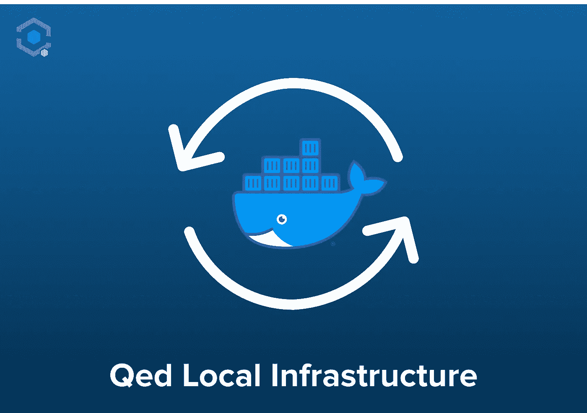
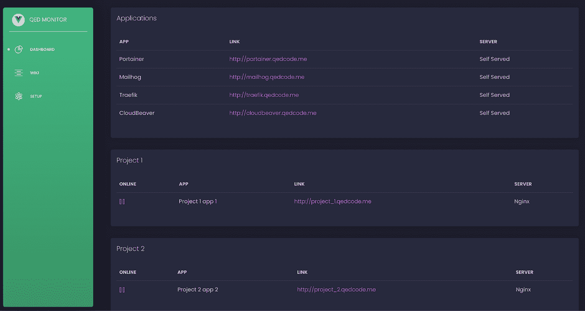

# 网络软件开发的本地基础设施(MacOs、Linux、Windows)

> 原文：<https://itnext.io/local-infrastructure-for-web-software-development-macos-linux-windows-14c0a7acd82c?source=collection_archive---------5----------------------->

## 本文的目的是介绍如何为所有项目使用一个独特的设置。Docker 是一个强大的工具，我将向您展示我是如何帮助我自己和我的团队在不同的项目之间快速轻松地切换的。

我已经开始了我在 windows 上的开发之路。用 xampp & notepad++开发 php 和 javascript 应用程序。那是 8 年前的事了，从那以后我逐渐改变了我的环境、框架和编程语言。一个合理的转变是转向 Linux (Ubuntu ),在那里我可以更容易地管理 Nginx、PHP 和整个环境。从那时起，我转而使用 Laravel & Vue 框架，这是一个完美的组合。与此同时，部署到服务器对我来说更自然，因为数据库、服务器、php、节点和其他一切我都在我的 Linux 上本地管理，切换 php-fpm 版本或带有 nvm 的节点并不困难，一切都很好，很流畅，但我想开始在 Flutter 框架中开发移动应用程序，这将我带到了我的第一个 MacOs 开发环境。

与此同时，我成了公司的首席技术官，我必须能够定期从一个项目切换到另一个项目，这很快就成了一场噩梦。使用 brew 和 valet 和 nvm 来切换 php，节点版本非常慢(同时我们为 flutter 和:D 提供了一个 fvm ),谢天谢地，我公司的 CEO 和我在 [QED](https://qedcode.io) 的同事听到了我的问题，在他们的支持下，我能够为这个问题建立一个解决方案。

在我开始之前，让我先说几个月前，我和码头工人一起工作时翻了翻白眼。所以是的，这是一个 docker 设置，但不要停止阅读！

# 这个想法

设置背后的想法是能够在许多项目之间切换(目前的堆栈是 Laravel — php，Vue.js & Nuxt — node ),并且如果需要更快的开发，能够更快地加入新成员或重新排序成员。我必须概述 5 个以上的项目，一个使用 composer 1，一些使用 composer 2，他们在 php 版本从 7.4 到 8.1 和从节点 12 到 16..时间就是金钱(花时间换东西很让人沮丧)。

Laravel 有 laradock 和 sail，但我们希望为每个人创建一个封闭的 docker 环境，以便用最少的资源在几分钟内完成所有项目，这意味着不要一直停止和运行项目，不要有冲突的端口等。经验不足的开发人员在使用这些设置时会感到困惑，真的不知道后面会发生什么。

# 设置

-每个项目都只排除了哪些需求(php，nginx，node)

-版本使用的数据库

-节点服务器仅在需要时运行

-每个都使用不同的端口，因此它们可以同时启动

工作原理:

-包含基础设施项目的别名，让您的生活更轻松

-创建命令，轻松地将项目从 git 存储库拉到正确的位置

-本地的。env 文件应该从基础设施中自动添加(因此，当它们在项目中更新时，也应该在这里更新)

-在运行 create 命令时添加数据库创建命令，同时创建 dumps 文件夹，如果 dumps 文件夹中存在项目的数据库转储，则将导入它

-所有命令都应该在 init 上执行(在长时间不活动后也应该工作以自动刷新)

-通过导入别名，我们使用的所有命令，php，artisan，composer，npm 都被重新路由到正确的 docker 容器，该容器将执行它

上面你可以看到代码结构，这是我个人选择的变体，但是你可以随意改变。

# 用法

一旦我们克隆了基础设施的源代码，我们就可以开始初始化项目了。根目录 start_setup.sh 中的简单脚本将为数据库、应用程序和监控应用程序创建 dockers。monitor app(这是基础设施源代码中包含的唯一项目)的目的是在一个地方拥有关于项目的设置、wiki、信息和链接。

监视器应用程序的屏幕截图

在这一步之后，它变得更加简单，init.sh 脚本具有创建和运行这个设置中的每个项目的函数。假设您想要设置 project_1_app_1，您可以使用 init.sh project_1_app_1，然后等待(如果您的互联网连接很慢，请给自己冲杯咖啡:)

## 初始化设置说明

init 上发生了什么(现在我们只为 Nuxt 项目添加一个代码片段，这样您就明白了，但是我们稍后将在 gitlab 上添加一个示例(我们将在这里链接它):

因此，这只是背后逻辑的一个例子，而不是整个基础设施，但你得到了要点。

如前所述，运行 init.sh monitor，应该可以让您的项目监视器在选定的端口(生成的版本)上启动和运行，瞧！

## 监视器应用程序的 docker 编写示例

每个基于所需服务使用的应用程序容器都通过 docker 网络连接。像 laravel 的 postgres，mailhog 的 emails，redis 等..

## 最佳化

你可能会说这与 laradock 或 sail 没有太大区别，但它确实是经过优化的！只有你需要的容器才会被创建和运行，如果你可以有一个容器并且为每个项目创建数据库，为什么要有 3 个有冲突端口的 postgres 容器呢？

如果你只是需要概述项目，为什么你要费心设置项目，这样它就都启动并运行了，只需启动它，等待，然后在 monitor 应用程序上找到链接。不要担心 node，php，databases 的版本，哦，对了，我没有提到，在 dumps 文件夹中，你可以放入由 project 命名的数据库转储，在创建项目和数据库时，它会被自动导入。

此外，节点容器仅在需要时启动，当您运行 npm 命令时，它会克隆容器，完成命令，然后删除自身。除非您在服务器/热重装模式下启动它。

## 奖金

进入 docker 容器，或者在运行 php artisan migrate 或 npm install 之类的命令时调用容器执行是令人恼火的..非常..我做了一个愚蠢的小黑客，这让我的生活更容易。

在第一个安装脚本中，我这样做

只需注入一个自定义别名文件，其中包含类似于 init 脚本中的函数，我们就可以识别命令，如果它在项目所在的某个文件夹中，它会在 docker 执行时重定向命令。

也许有点粗糙，但绝对简单。每个项目中的命令都是原创的，composer 这个，php artisan 那个，npm 做的东西。

# 实施至今

应用程序

*   Cloudbeaver(有史以来最好的东西)
*   便携式集装箱
*   邮件猪
*   特拉菲克

数据库

*   mysql(多个版本)
*   postgres
*   mongodb
*   雷迪斯
*   dynamodb

框架和应用

*   Laravel + Vue
*   Vue spa
*   Nuxt Spa

临时演员

*   laravel 回声服务器
*   码头工人中的 ngrok

# 算是结论吧

这篇文章或多或少是概念性的，解释了想法和结构，但如果你喜欢这个想法，我们会提供一些 github 要点链接，介绍一些 laravel 应用程序的实际设置，数据库设置(mongo，postgre，mysql，redis)，包括在 mac os 上运行 docker sync 的脚本等..

对我来说，这改变了我的一生。我从事或正在从事的每个项目都一直在运行。我将在几分钟内让它变得生动和最新。我不需要停止任何其他容器来做到这一点。

我需要这个，我们的 CEO 也需要这个(因为他也是一名开发人员)，这是毫无疑问的。但是为所有团队成员节省的时间，以及在随机项目中快速切换到次要任务的可能性是无价的。

我们甚至没有完善这些设置，现在我们必须为本地环境设置 aws lambdas 设置，所以这将是一个不断增长的项目哈哈。我希望将来我会有更多的时间来推广 qed 本地基础设施，这样我们就可以与社区共享它。

它帮了我们很大的忙，通过更精确的设置，它可以处理更大的项目堆栈。如果你对这个设置感兴趣，或者有如何改进它的想法，请联系在[info@qedcode.net](mailto:info@qedcode.net)举办的某种研讨会，也可以关注我们的[博客](https://qedcode.io/company/blog)，了解关于这个主题和许多其他主题的未来更新(AWS 即将推出)。

# 额外小费

为了绕过每个开发人员需要为每个新项目更新主机，我们得到了一个额外的域，通过 dns 指向每个本地主机端口。所以直接点播放右:)