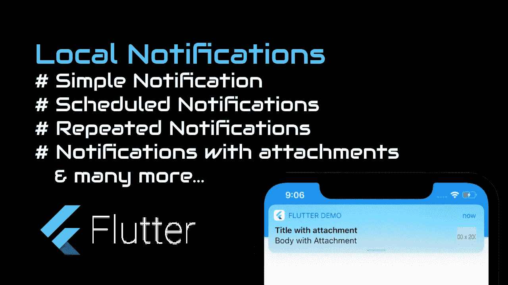
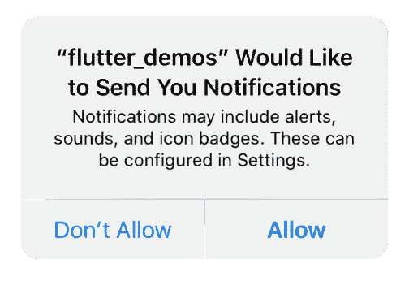
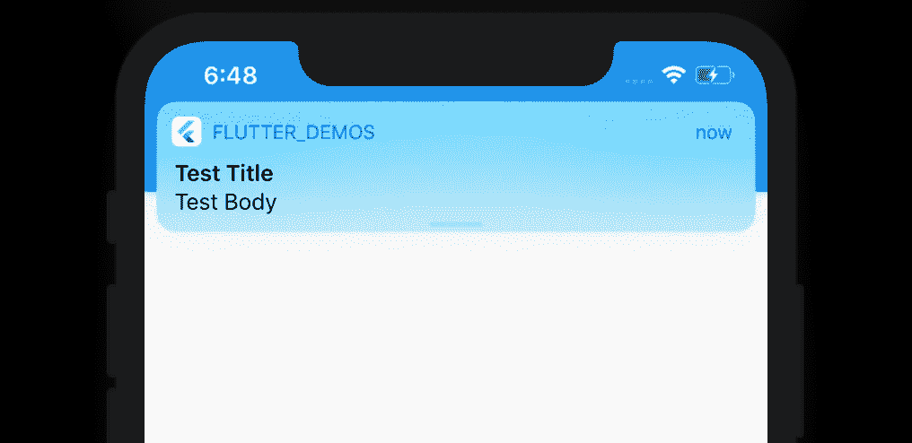
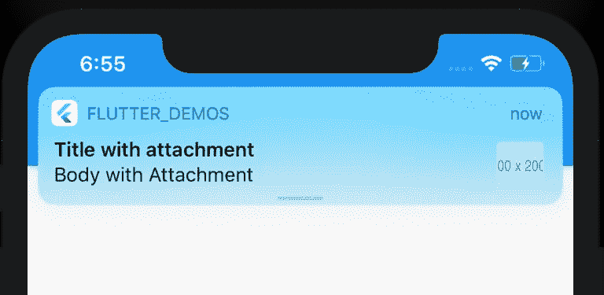
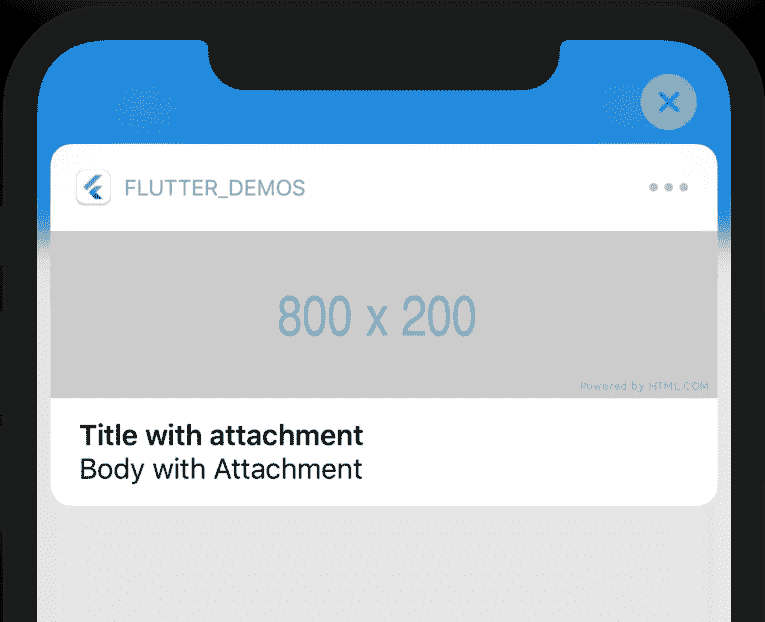

# Flutter 中的本地通知

> 原文：<https://itnext.io/local-notifications-in-flutter-6136235e1b51?source=collection_archive---------1----------------------->



Flutter 中的本地通知

大家好，

在这篇文章中，我们将学习如何在 Flutter 中显示本地通知。

我们要学什么？

*   *显示简单通知*
*   *显示重复通知*
*   *显示预定通知*
*   *在一周的特定时间和日期显示通知*
*   *显示带附件的通知*
*   *显示带有 HTML 内容的通知*
*   *取消通知。*
*   *取消所有通知*
*   *处理通知抽头。*

所以让我们开始…

# **观看视频教程**

Flutter 中的本地通知

# 添加依赖关系

打开您的 ***pubspec.yaml*** 文件，并在依赖项中添加以下内容

```
**flutter_local_notifications: ^1.4.4+1** // Add below dependencies based on your requirement **rxdart: ^0.24.1
path_provider: ^1.6.11
http: ^0.12.1**
```

*初始 Android 和 iOS 设置请按照这个* [*链接*](https://pub.dev/packages/flutter_local_notifications#-installing-tab-) *。*

一旦你完成了设置，让我们移动到颤振编码部分。

对于这个例子，我将大部分与通知相关的代码保存在一个单独的文件中。所以让我们创建一个名为“NotificationPlugin.dart”的新文件。

我首先需要的是一个通知插件的句柄。

```
FlutterLocalNotificationsPlugin flutterLocalNotificationsPlugin;
```

# 获得用户的许可

接下来是获得用户的许可。只有在 iOS 中需要这个权限，在 Android 中不需要。

```
_requestIOSPermission() {
    flutterLocalNotificationsPlugin
        .resolvePlatformSpecificImplementation<
            IOSFlutterLocalNotificationsPlugin>()
        .requestPermissions(
          alert: false,
          badge: true,
          sound: true,
        );
 }
```



iOS 中使用 Flutter 的通知权限

让我们假设用户点击允许。

太好了，现在我们得到了用户的许可。

现在让我们初始化通知的设置。

```
initializePlatformSpecifics() {
    var initializationSettingsAndroid =
        AndroidInitializationSettings('app_notf_icon');
    var initializationSettingsIOS = IOSInitializationSettings(
      requestAlertPermission: true,
      requestBadgePermission: true,
      requestSoundPermission: false,
      onDidReceiveLocalNotification: (id, title, body, payload) async {
        // your call back to the UI
      },
    );initializationSettings = InitializationSettings(
        initializationSettingsAndroid, initializationSettingsIOS);
  }
```

' app_notf_icon '是 android Studio 中创建的图标，我在上面的 youtube 视频中解释了同样的内容。一旦你有了图标，确保复制到 Android res/drawable 文件夹中。现在我们对 Android 通知设置很满意。

接下来对于 iOS，和上面的 requestAlertPermission 的代码一样，requestBadgePermission 和 requestSoundPermission 按照你想要的方式设置。

“*onDidReceiveLocalNotification*”适用于低于 10 的 iOS 版本。当。应用程序在前台运行，当一个通知被触发。在低于 10 的版本中，当应用程序在前台运行时，不会有任何通知出现。

那么如何获得 10 版本以上的回调呢？

下面是做这件事的方法…

```
await flutterLocalNotificationsPlugin.initialize(initializationSettings,
        onSelectNotification: (String payload) async {
      onNotificationClick(payload);    // your call back to the UI
});
```

让我们进入主要部分…

通知…

# 简单通知

```
Future<void> showNotification() async {
    var androidChannelSpecifics = AndroidNotificationDetails(
      'CHANNEL_ID',
      'CHANNEL_NAME',
      "CHANNEL_DESCRIPTION",
      importance: Importance.Max,
      priority: Priority.High,
      playSound: true,
      timeoutAfter: 5000,
      styleInformation: DefaultStyleInformation(true, true),
    );
    var iosChannelSpecifics = IOSNotificationDetails();
    var platformChannelSpecifics =
        NotificationDetails(androidChannelSpecifics, iosChannelSpecifics);
    await flutterLocalNotificationsPlugin.show(
      0,  // Notification ID
      'Test Title', // Notification Title
      'Test Body', // Notification Body, set as null to remove the body
      platformChannelSpecifics,
      payload: 'New Payload', // Notification Payload
    );
}
```

对于 Android 频道规范，如果您已经为该频道 id 设置了一些设置，则在此之后不会更改，但您可以使用新的通知 ID、标题、正文和有效负载在该频道上触发进一步的通知。您可能需要更改频道 ID 或重新安装应用程序来重置它。

一组

```
importance: Importance.Max,
priority: Priority.High,
```

将通知显示为屏幕顶部的弹出窗口。否则它将被触发，但不会显示在屏幕上方，而是会出现在 Android 通知区域。



使用 Flutter 的简单通知

# 安排通知

```
Future<void> scheduleNotification() async {
    var scheduleNotificationDateTime = DateTime.now().add(Duration(seconds: 5));
    var androidChannelSpecifics = AndroidNotificationDetails(
      'CHANNEL_ID 1',
      'CHANNEL_NAME 1',
      "CHANNEL_DESCRIPTION 1",
      icon: 'secondary_icon',
      sound: RawResourceAndroidNotificationSound('my_sound'),
      largeIcon: DrawableResourceAndroidBitmap('large_notf_icon'),
      enableLights: true,
      color: const Color.fromARGB(255, 255, 0, 0),
      ledColor: const Color.fromARGB(255, 255, 0, 0),
      ledOnMs: 1000,
      ledOffMs: 500,
      importance: Importance.Max,
      priority: Priority.High,
      playSound: true,
      timeoutAfter: 5000,
      styleInformation: DefaultStyleInformation(true, true),
    );
    var iosChannelSpecifics = IOSNotificationDetails(
      sound: 'my_sound.aiff',
    );
    var platformChannelSpecifics = NotificationDetails(
      androidChannelSpecifics,
      iosChannelSpecifics,
    );
    await flutterLocalNotificationsPlugin.schedule(
      0,
      'Test Title',
      'Test Body',
      scheduleNotificationDateTime,
      platformChannelSpecifics,
      payload: 'Test Payload',
    );
  }
```

此通知将在触发 5 秒后触发，如果用户没有与之交互，它将在 5 秒后消失。

# 每天一次显示通知

```
Future<void> showDailyAtTime() async {
    var time = Time(18, 0, 0);
    var androidChannelSpecifics = AndroidNotificationDetails(
      'CHANNEL_ID 4',
      'CHANNEL_NAME 4',
      "CHANNEL_DESCRIPTION 4",
      importance: Importance.Max,
      priority: Priority.High,
    );
    var iosChannelSpecifics = IOSNotificationDetails();
    var platformChannelSpecifics =
        NotificationDetails(androidChannelSpecifics, iosChannelSpecifics);
    await flutterLocalNotificationsPlugin.showDailyAtTime(
      0,
      'Test Title at ${time.hour}:${time.minute}.${time.second}',
      'Test Body', //null
      time,
      platformChannelSpecifics,
      payload: 'Test Payload',
    );
 }
```

上面的通知将在每天下午 6 点准时发出。

# 显示每周的日期和时间

```
Future<void> showWeeklyAtDayTime() async {
    var time = Time(10, 0, 0);
    var androidChannelSpecifics = AndroidNotificationDetails(
      'CHANNEL_ID 5',
      'CHANNEL_NAME 5',
      "CHANNEL_DESCRIPTION 5",
      importance: Importance.Max,
      priority: Priority.High,
    );
    var iosChannelSpecifics = IOSNotificationDetails();
    var platformChannelSpecifics =
        NotificationDetails(androidChannelSpecifics, iosChannelSpecifics);
    await flutterLocalNotificationsPlugin.showWeeklyAtDayAndTime(
      0,
      'Test Title at ${time.hour}:${time.minute}.${time.second}',
      'Test Body', //null
      Day.Saturday,
      time,
      platformChannelSpecifics,
      payload: 'Test Payload',
    );
  }
```

上述通知将于每周六上午 10 点整发出。

# 重复通知

```
Future<void> repeatNotification() async {
    var androidChannelSpecifics = AndroidNotificationDetails(
      'CHANNEL_ID 3',
      'CHANNEL_NAME 3',
      "CHANNEL_DESCRIPTION 3",
      importance: Importance.Max,
      priority: Priority.High,
      styleInformation: DefaultStyleInformation(true, true),
    );
    var iosChannelSpecifics = IOSNotificationDetails();
    var platformChannelSpecifics =
        NotificationDetails(androidChannelSpecifics, iosChannelSpecifics);
    await flutterLocalNotificationsPlugin.periodicallyShow(
      0,
      'Repeating Test Title',
      'Repeating Test Body',
      RepeatInterval.EveryMinute,
      platformChannelSpecifics,
      payload: 'Test Payload',
    );
  }
```

这个通知将会每分钟重复一次。

显示带附件的通知。

```
Future<void> showNotificationWithAttachment() async {
    var attachmentPicturePath = await _downloadAndSaveFile(
        '[https://via.placeholder.com/800x200'](https://via.placeholder.com/800x200'), 'attachment_img.jpg');
    var iOSPlatformSpecifics = IOSNotificationDetails(
      attachments: [IOSNotificationAttachment(attachmentPicturePath)],
    );
    var bigPictureStyleInformation = BigPictureStyleInformation(
      FilePathAndroidBitmap(attachmentPicturePath),
      contentTitle: '<b>Attached Image</b>',
      htmlFormatContentTitle: true,
      summaryText: 'Test Image',
      htmlFormatSummaryText: true,
    );
    var androidChannelSpecifics = AndroidNotificationDetails(
      'CHANNEL ID 2',
      'CHANNEL NAME 2',
      'CHANNEL DESCRIPTION 2',
      importance: Importance.High,
      priority: Priority.High,
      styleInformation: bigPictureStyleInformation,
    );
    var notificationDetails =
        NotificationDetails(androidChannelSpecifics, iOSPlatformSpecifics);
    await flutterLocalNotificationsPlugin.show(
      0,
      'Title with attachment',
      'Body with Attachment',
      notificationDetails,
    );
  }_downloadAndSaveFile(String url, String fileName) async {
    var directory = await getApplicationDocumentsDirectory();
    var filePath = '${directory.path}/$fileName';
    var response = await http.get(url);
    var file = File(filePath);
    await file.writeAsBytes(response.bodyBytes);
    return filePath;
  }
```

在这个例子中，通知将从指定的 URL 下载一个图像，并将其设置在 Android 和 iOS 的附件中。



带附件的通知(未展开)



带附件的通知(扩展)

# 获取待定通知

```
Future<int> getPendingNotificationCount() async {
    List<PendingNotificationRequest> p =
        await flutterLocalNotificationsPlugin.pendingNotificationRequests();
    return p.length;
}
```

这将返回号码。尚未触发的通知。

# 取消通知

```
Future<void> cancelNotification() async {
    await flutterLocalNotificationsPlugin.cancel(0);
}Future<void> cancelAllNotification() async {
    await flutterLocalNotificationsPlugin.cancelAll();
}
```

取消(0)将取消 ID = 0 的通知

cancelAll()将取消所有通知。

下面是完整的“NotificationPlugin.dart”文件内容。

```
import 'package:flutter/material.dart';
import 'package:flutter_local_notifications/flutter_local_notifications.dart';
import 'package:path_provider/path_provider.dart';
import 'dart:io' show File, Platform;
import 'package:http/http.dart' as http;import 'package:rxdart/subjects.dart';class NotificationPlugin {
  //
  FlutterLocalNotificationsPlugin flutterLocalNotificationsPlugin;
  final BehaviorSubject<ReceivedNotification>
      didReceivedLocalNotificationSubject =
      BehaviorSubject<ReceivedNotification>();
  var initializationSettings;NotificationPlugin._() {
    init();
  }init() async {
    flutterLocalNotificationsPlugin = FlutterLocalNotificationsPlugin();
    if (Platform.isIOS) {
      _requestIOSPermission();
    }
    initializePlatformSpecifics();
  }initializePlatformSpecifics() {
    var initializationSettingsAndroid =
        AndroidInitializationSettings('app_notf_icon');
    var initializationSettingsIOS = IOSInitializationSettings(
      requestAlertPermission: true,
      requestBadgePermission: true,
      requestSoundPermission: false,
      onDidReceiveLocalNotification: (id, title, body, payload) async {
        ReceivedNotification receivedNotification = ReceivedNotification(
            id: id, title: title, body: body, payload: payload);
        didReceivedLocalNotificationSubject.add(receivedNotification);
      },
    );initializationSettings = InitializationSettings(
        initializationSettingsAndroid, initializationSettingsIOS);
  }_requestIOSPermission() {
    flutterLocalNotificationsPlugin
        .resolvePlatformSpecificImplementation<
            IOSFlutterLocalNotificationsPlugin>()
        .requestPermissions(
          alert: false,
          badge: true,
          sound: true,
        );
  }setListenerForLowerVersions(Function onNotificationInLowerVersions) {
    didReceivedLocalNotificationSubject.listen((receivedNotification) {
      onNotificationInLowerVersions(receivedNotification);
    });
  }setOnNotificationClick(Function onNotificationClick) async {
    await flutterLocalNotificationsPlugin.initialize(initializationSettings,
        onSelectNotification: (String payload) async {
      onNotificationClick(payload);
    });
  }Future<void> showNotification() async {
    var androidChannelSpecifics = AndroidNotificationDetails(
      'CHANNEL_ID',
      'CHANNEL_NAME',
      "CHANNEL_DESCRIPTION",
      importance: Importance.Max,
      priority: Priority.High,
      playSound: true,
      timeoutAfter: 5000,
      styleInformation: DefaultStyleInformation(true, true),
    );
    var iosChannelSpecifics = IOSNotificationDetails();
    var platformChannelSpecifics =
        NotificationDetails(androidChannelSpecifics, iosChannelSpecifics);
    await flutterLocalNotificationsPlugin.show(
      0,
      'Test Title',
      'Test Body', //null
      platformChannelSpecifics,
      payload: 'New Payload',
    );
  }Future<void> showDailyAtTime() async {
    var time = Time(21, 3, 0);
    var androidChannelSpecifics = AndroidNotificationDetails(
      'CHANNEL_ID 4',
      'CHANNEL_NAME 4',
      "CHANNEL_DESCRIPTION 4",
      importance: Importance.Max,
      priority: Priority.High,
    );
    var iosChannelSpecifics = IOSNotificationDetails();
    var platformChannelSpecifics =
        NotificationDetails(androidChannelSpecifics, iosChannelSpecifics);
    await flutterLocalNotificationsPlugin.showDailyAtTime(
      0,
      'Test Title at ${time.hour}:${time.minute}.${time.second}',
      'Test Body', //null
      time,
      platformChannelSpecifics,
      payload: 'Test Payload',
    );
  }Future<void> showWeeklyAtDayTime() async {
    var time = Time(21, 5, 0);
    var androidChannelSpecifics = AndroidNotificationDetails(
      'CHANNEL_ID 5',
      'CHANNEL_NAME 5',
      "CHANNEL_DESCRIPTION 5",
      importance: Importance.Max,
      priority: Priority.High,
    );
    var iosChannelSpecifics = IOSNotificationDetails();
    var platformChannelSpecifics =
        NotificationDetails(androidChannelSpecifics, iosChannelSpecifics);
    await flutterLocalNotificationsPlugin.showWeeklyAtDayAndTime(
      0,
      'Test Title at ${time.hour}:${time.minute}.${time.second}',
      'Test Body', //null
      Day.Saturday,
      time,
      platformChannelSpecifics,
      payload: 'Test Payload',
    );
  }Future<void> repeatNotification() async {
    var androidChannelSpecifics = AndroidNotificationDetails(
      'CHANNEL_ID 3',
      'CHANNEL_NAME 3',
      "CHANNEL_DESCRIPTION 3",
      importance: Importance.Max,
      priority: Priority.High,
      styleInformation: DefaultStyleInformation(true, true),
    );
    var iosChannelSpecifics = IOSNotificationDetails();
    var platformChannelSpecifics =
        NotificationDetails(androidChannelSpecifics, iosChannelSpecifics);
    await flutterLocalNotificationsPlugin.periodicallyShow(
      0,
      'Repeating Test Title',
      'Repeating Test Body',
      RepeatInterval.EveryMinute,
      platformChannelSpecifics,
      payload: 'Test Payload',
    );
  }Future<void> scheduleNotification() async {
    var scheduleNotificationDateTime = DateTime.now().add(Duration(seconds: 5));
    var androidChannelSpecifics = AndroidNotificationDetails(
      'CHANNEL_ID 1',
      'CHANNEL_NAME 1',
      "CHANNEL_DESCRIPTION 1",
      icon: 'secondary_icon',
      sound: RawResourceAndroidNotificationSound('my_sound'),
      largeIcon: DrawableResourceAndroidBitmap('large_notf_icon'),
      enableLights: true,
      color: const Color.fromARGB(255, 255, 0, 0),
      ledColor: const Color.fromARGB(255, 255, 0, 0),
      ledOnMs: 1000,
      ledOffMs: 500,
      importance: Importance.Max,
      priority: Priority.High,
      playSound: true,
      timeoutAfter: 5000,
      styleInformation: DefaultStyleInformation(true, true),
    );
    var iosChannelSpecifics = IOSNotificationDetails(
      sound: 'my_sound.aiff',
    );
    var platformChannelSpecifics = NotificationDetails(
      androidChannelSpecifics,
      iosChannelSpecifics,
    );
    await flutterLocalNotificationsPlugin.schedule(
      0,
      'Test Title',
      'Test Body',
      scheduleNotificationDateTime,
      platformChannelSpecifics,
      payload: 'Test Payload',
    );
  }Future<void> showNotificationWithAttachment() async {
    var attachmentPicturePath = await _downloadAndSaveFile(
        '[https://via.placeholder.com/800x200'](https://via.placeholder.com/800x200'), 'attachment_img.jpg');
    var iOSPlatformSpecifics = IOSNotificationDetails(
      attachments: [IOSNotificationAttachment(attachmentPicturePath)],
    );
    var bigPictureStyleInformation = BigPictureStyleInformation(
      FilePathAndroidBitmap(attachmentPicturePath),
      contentTitle: '<b>Attached Image</b>',
      htmlFormatContentTitle: true,
      summaryText: 'Test Image',
      htmlFormatSummaryText: true,
    );
    var androidChannelSpecifics = AndroidNotificationDetails(
      'CHANNEL ID 2',
      'CHANNEL NAME 2',
      'CHANNEL DESCRIPTION 2',
      importance: Importance.High,
      priority: Priority.High,
      styleInformation: bigPictureStyleInformation,
    );
    var notificationDetails =
        NotificationDetails(androidChannelSpecifics, iOSPlatformSpecifics);
    await flutterLocalNotificationsPlugin.show(
      0,
      'Title with attachment',
      'Body with Attachment',
      notificationDetails,
    );
  }_downloadAndSaveFile(String url, String fileName) async {
    var directory = await getApplicationDocumentsDirectory();
    var filePath = '${directory.path}/$fileName';
    var response = await http.get(url);
    var file = File(filePath);
    await file.writeAsBytes(response.bodyBytes);
    return filePath;
  }Future<int> getPendingNotificationCount() async {
    List<PendingNotificationRequest> p =
        await flutterLocalNotificationsPlugin.pendingNotificationRequests();
    return p.length;
  }Future<void> cancelNotification() async {
    await flutterLocalNotificationsPlugin.cancel(0);
  }Future<void> cancelAllNotification() async {
    await flutterLocalNotificationsPlugin.cancelAll();
  }
}NotificationPlugin notificationPlugin = NotificationPlugin._();class ReceivedNotification {
  final int id;
  final String title;
  final String body;
  final String payload;ReceivedNotification({
    [@required](http://twitter.com/required) this.id,
    [@required](http://twitter.com/required) this.title,
    [@required](http://twitter.com/required) this.body,
    [@required](http://twitter.com/required) this.payload,
  });
}
```

你可以用 flutter 通知插件做很多其他的事情。这些是你将经常使用的基本材料。

原来如此。

请在下面留下您的宝贵意见。

谢了。