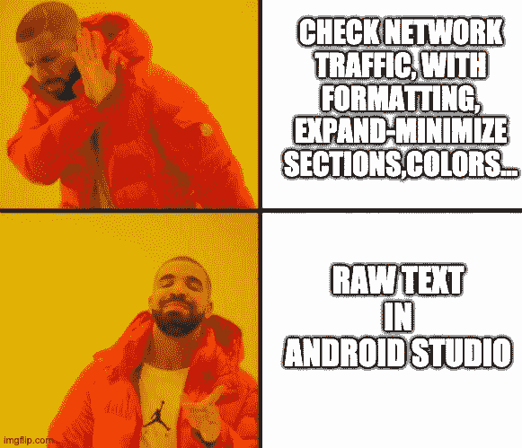
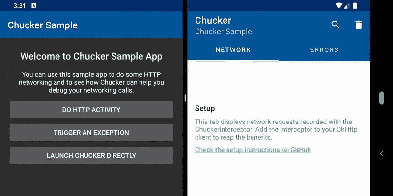

# 记录未捕获的异常和网络流量。你的 QA 团队会喜欢的😍)

> 原文：<https://itnext.io/log-uncaught-exceptions-and-network-traffic-with-chucker-for-android-ps-967fe3e0488c?source=collection_archive---------2----------------------->


马文·迈耶在 [Unsplash](https://unsplash.com/s/photos/network?utm_source=unsplash&utm_medium=referral&utm_content=creditCopyText) 上的照片

在一个普通的开发人员工作日，您很可能必须调试一些东西，而监控网络流量可以对此有所帮助。有多种工具可以提供帮助，如 [Charles proxy](https://www.charlesproxy.com/) 或 [Stetho](http://facebook.github.io/stetho/) (我个人更喜欢 Stetho，因为它有一些额外的功能，如对共享偏好和数据库的读/写访问)，甚至可以直接记录流量，并在 Android Studio 中监控流量(如果你不喜欢任何漂亮的格式，可以使用它)。



来源: [imgflip](https://imgflip.com/i/3zmj31)

当然，如果你正在调试，那么这意味着有东西坏了，大多数时候你可以直接在 Android Studio logcat 中看到，有许多不祥的红线，其中只有一条以某种方式指向导致这种情况的原因(但你仍然很幸运！你可以看到错误！)

不过有时候，如果你可以在设备上直接完成这两项任务，可能会更容易，因为你厌倦了启动这些工具，或者你没有访问 Android Studio 的权限，或者当你在设备上检查不同的东西时随机发生了崩溃。

或者你有多少次听到 QA 测试人员说“这个设备发生了崩溃，但我现在无法重现”/“这个功能不起作用，是客户端还是后端的问题？”然后你们都试图找出发生了什么，试图重现崩溃，检查 crashlytics 希望找到有用的东西，检查网络响应看起来可能不正常，等等。最终，你们两个都失去了宝贵的时间和精力。

如果您可以在测试设备上直接看到崩溃的确切原因，以及对于不起作用的功能，网络发送和接收的确切内容，会怎么样？更快更容易。这就是 Chucker 库发挥作用的地方[https://github.com/ChuckerTeam/chucker](https://github.com/ChuckerTeam/chucker)



来源:Chucker github 页面

存储库中有一个非常好的示例应用程序，基本上，为了开始记录网络流量，您必须将依赖项添加到您的应用程序 build.gradle 文件中:

```
repositories {
    maven { url "https://jitpack.io" }
}dependencies {
  debugImplementation "com.github.ChuckerTeam.Chucker:library:3.2.0"
  releaseImplementation "com.github.ChuckerTeam.Chucker:library-no-op:3.2.0"
}
```

然后无论你在哪里初始化任何 okhttp 客户端(你用的是 okthttp 吧？你不是那种人……)只需添加一个拦截器:

```
val client = OkHttpClient.Builder()
 .addInterceptor(ChuckerInterceptor(context))
 .build()
```

就是这样！您现在可以访问设备上的所有网络流量，展开通知以访问它，检查标题、请求、响应、状态代码等。

如果你看到上面的截图，在 chucker UI 中有两个标签，一个显示网络，另一个显示错误。起初，我以为他们在谈论网络错误，但后来我检查了一点点，看到应该有被捕获的可抛出对象。在 chucker 的 readme 中，他们描述了这样一个用例:每当你有一个 try-catch 并且你捕捉到一个异常，你可以在 Chucker 中记录它并且在设备上看到它。就我个人而言，我不认为这真的有用，因为我很可能会在 Android Studio 中记录这些，或者在那里有一个断点来检查它们，并且对于 QA 来说，它们也没有太大的意义。

但是，如果我们不记录被捕获的异常，而是记录未被捕获的异常呢？这将非常有用，尤其是对于上面的 QA 场景！所以让我们试着去做。我在这里为它创建了一个小的演示应用:[https://github.com/tpakis/Testing-Chucker](https://github.com/tpakis/Testing-Chucker)

本质上，您需要做的是在应用程序类中添加一个未捕获的异常处理程序，它将在应用程序必须终止之前记录错误。首先，创建这个异常处理程序:

最后，在应用程序类中注册这个崩溃处理程序:

我只添加了一个对默认异常处理程序的引用来使应用程序崩溃，但是如果你想在其他地方记录这个崩溃，(比如 crashlytics？)你可以看看这篇非常有趣的文章[https://proandroiddev . com/hide-your-crashes-graceful-and-still-report-them-9b1c 85 b 25875](https://proandroiddev.com/hide-your-crashes-gracefully-and-still-report-them-9b1c85b25875)。

就是这样！现在，您可以在设备上记录未捕获的崩溃，每个人都更开心、更有效率，再也不会有虚幻的随机崩溃了！！

来源:giphy.com