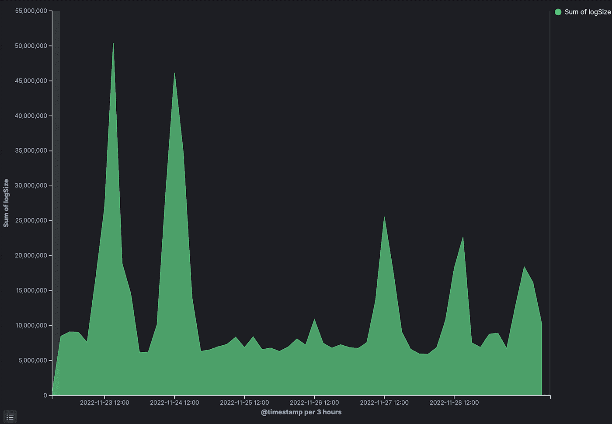
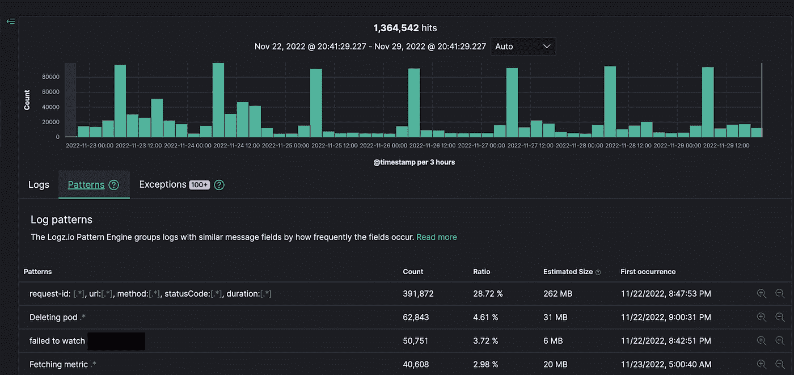
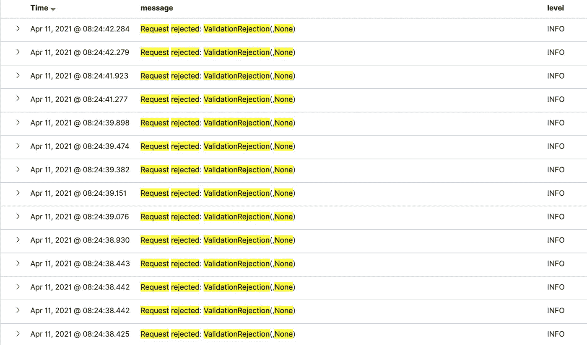
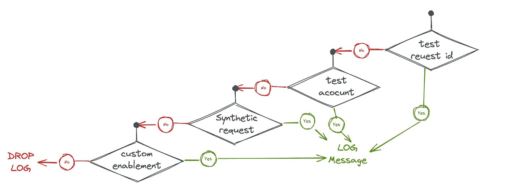

# log.warn("此日志将花费您的成本")关于日志成本优化

> 原文：<https://itnext.io/log-warn-this-log-will-cost-you-on-log-cost-optimization-5c6fd8b234e9?source=collection_archive---------0----------------------->

另一种昂贵的原木由[@有用的集体](https://www.youtube.com/watch?v=mAiO8wfcT0E)在 [unsplash](https://unsplash.com/) 上制作

你还记得你知道日志不是免费的那一刻吗？我当然知道。就在我们团队实现一个重要里程碑之后，我们刚刚推出了一个新的闪亮的可扩展服务，即将取代传统的极高吞吐量和极低效率的服务。我们刚刚在一个多租户 kubernetees 集群上将机群规模从大约 300 个 EC2 实例减少到大约 30 个 pod。实现更好的可靠性、更低的处理延迟，并将成本降低一个数量级。

就在那时，我们无意中让我们的日志提供商比尔身价暴涨。我们以高吞吐量记录了大量数据。我们几乎抹去了整个运营成本节约。

就在那时，我知道了那些我每天都在使用的、没有经过太多思考的日志有多贵。

在这篇文章中，我将介绍我们为降低系统产生的日志记录成本所采取的步骤，以及有效日志记录的一般实践。

# 任何优化都始于测量

如果我们不知道我们使用了多少，我们记录了什么，以及为什么，我们就不能优化日志的使用。

当时，我们使用第三方供应商的日志——一个托管的 ELK 平台。

因此，我们首先测量我们索引了多少日志，以及谁是“罪魁祸首”——也就是说，发送最多的日志是什么。

这里有两件很酷的事情可以帮到你(虽然使用的是 Kibana，但是可能可以应用到任何地方),那就是测量日志大小:

以及显示最常见日志模式的模板选项卡:

由于这是一个全新的系统，我们从未使用过该系统生成的日志——因此它们的价值很难获得——而成本是显而易见的。这让我们从整体上认真思考这个系统。

# 了解用法

你的日志会被用来做什么？

*   它们是否仅在停机期间使用，以了解生产中发生的情况？
*   日志是否用于审核目的以了解请求过程？它们会被用来调试业务用例吗？
*   那些日志一小时后还有价值吗？过了一天？
*   系统是否满足长期需求？还是请求是暂时的？
*   日志是任何法规要求的一部分吗？
*   停机的成本是多少？

我们问自己所有这些问题，这些问题是理解我们应该将日志记录的重点放在哪里，以及我们可以在哪里节省成本的基础。

让我们看几个例子:

假设您有一个系统，其中每个请求都很关键，每个失败的请求都会对公司的业务产生负面影响。这种系统的最好例子是电子商务网站——每一个未能下单的订单都是收入损失！我们可能希望记录请求过程中的每一步，以了解发生了什么，失败了什么，并且可能能够使用这些日志来回答诸如“为什么订单通过流 X 而不是流 Y”之类的问题。

在这种用例中，日志非常有价值，应该保留相当长的一段时间，可能是 7-14 天。

对于所需的日志保留期，有一个很好的经验法则——支持查询和请求返回给您所需的一般时间。

但是在我们的案例中，这些请求是支持系统的请求，与收入没有密切关系，每个请求都非常短暂，停机成本非常低。

此外，系统的处理流数量非常少，因此某个问题只影响特定请求子集的可能性非常低，也就是说，如果出现问题，很可能会出现整体中断或完全不中断。

此外——不需要请求级审计，没有人会问我们为什么请求 X 会有这样的行为。

这一分析使我们得出以下结论:

*   这个请求在我们的系统中毫无意义
*   除了处理失败之外，我们想不出任何理由来检查系统的日志(度量监控覆盖了它的行为和 SLI)
*   数据是如此短暂，以至于没有人会关心处理后几个小时的请求

这些关于我们系统行为的基本事实允许我们开始设计解决方案。

# 使用正确的保留时间

我们从一个快速解决方案开始—将日志的保留时间减少到最短 1 天，这使我们能够在解决根本问题之前快速降低成本。

但这里也有一个教训—大多数公司使用的默认 7–14 天保留级别是一个相当随机的默认设置，可能会对成本产生 10–90%的影响。

想想你的日志在你的用例中有多长时间的价值？将保持力调整到最小值。

随着您的需求变化，动态地扩展和降低所需的保留级别—大型功能发布是延长保留期的绝佳理由，而长维护窗口可能是减少保留期的好机会。

如果您有 5TB 的每日日志，并且存储了一天或一个月，那就大不一样了。

# 有意义的日志，不使用日志作为衡量标准

常见的日志消息有*“服务请求”*。除非你记录下这个请求是什么，并且这个请求背后有一个真正有价值的意义——**这是一个度量**，这可以用一个简单的计数器来代替！

这些日志毫无意义:

这应该是一个衡量标准

所以，不要用日志做度量，**用度量做度量**，这样更便宜，也更有效。

至于日志——记录有意义的数据，如果这个请求有价值，记录这个请求是什么，如何找到它，什么使它有意义，它是数据！大致是:

*服务溢价账户<账户名称>，请求< id >，<关于流转的一些附加上下文，请求>，*

由于我们已经构建了一个高吞吐量服务，我们已经删除了大约数百 GB 的*“服务请求”*和*“已完成的进程 x”*，从而将我们的日志记录成本降低了大约 5–10%。

此外——这清理了我们杂乱的服务日志，并使查找问题变得更加容易。

# 基于严重性的日志记录

我们通常在生产中为*信息*设置最低日志级别，这样我们排除了用于开发系统的调试行，同时不会丢失正在发生的事情的上下文。

我们决定更进一步——将日志级别放在*警告*，稍后放在*错误*。

我们了解到我们不需要上下文，我们只关心系统失败和崩溃时的日志记录。

这额外减少了 90%的日志使用，而没有任何实际的可用性损失。

我们添加了一个动态配置标志，可以在任何情况下按需启用较低的日志级别。

# 动态日志记录

随着我们开始减少日志，很明显，在生产和暂存环境中手动运行变得更加困难，因为我们的日志几乎总是空的。

很明显，即使我们很少使用日志，我们仍然需要一些关于我们系统中发生的事情的指示。我们需要一些木头。

我们已经建立了一种机制，可以根据请求的属性动态地决定是否记录请求的日志。例如:

*   为了测试和探索，我们为从`test` *开始的任何请求 id 启用了日志记录。*或者从我们的一些测试账号发出。
*   我们已经通过测试请求的属性为合成测试请求启用了完整的日志记录，所以我们将有一些常量控制组。
*   对于产品/客户入职，我们已经在入职的第一阶段通过客户姓名前缀启用了日志。

所有这些功能都由功能标志和配置控制，可以毫不费力地进行更改。

这降低了我们的成本，同时提高了系统的可用性。

记录消息决策流

# 微量取样

一般来说，我不喜欢采样解决方案。对于不熟悉的人来说，采样是仅在流量或使用案例的子集上使用功能，例如，仅启用 10%流量的日志，或仅启用来自特定 ip 空间或区域的流量。

在我们的例子中，我们可以通过只记录部署中的一部分 pod，或者只记录一小部分请求来轻松降低成本。

这是降低运营成本的一个相当常见的用例。但是在我们的例子中，在完成了所有的优化之后，我们认为没有理由这样做，但是如果您确实选择这样做，请记住记录整个请求日志，并且分别对每个日志行进行采样——那样您将得到中断的流，并且没有真正的价值。

# 限制“错误风暴”，可预测的日志记录成本

由于我们的系统现在只记录严重性为 ***错误*** 的日志消息，我们发现了一个有趣的现象，我们称之为“错误风暴”。

错误风暴是指当您的系统进入错误状态时发生的情况，即停机。当这种情况发生时，我们的日志就会被大量重复的错误日志填满，一遍又一遍地记录相同的错误。从大规模来看，它没有什么价值。

我们实现了一个小的内存中的[闩锁](https://www.geeksforgeeks.org/latches-in-digital-logic/)(一种在特定状态下“锁定”的机制)，当相同的日志消息被记录超过 X 次时，它就会锁定，并停止错误风暴。

这为我们提供了足够的错误信息，并阻止了错误的泛滥，从而减少了停机期间的额外成本，更重要的是，使我们的日志记录成本在停机期间是可预测的。

同样重要的是，这里要提到我们有很大的度量覆盖，因此我们只需要那些错误日志作为上下文和手边错误的附加信息。

# 限制供应商锁定和转换供应商

通过更换日志供应商，我们能够降低大约 50%的总成本。

本质上，我们是在为一个美化了的托管 OpenSearch(当时是 ElasticSearch)付费，我们没有使用工具的很多高级功能。

我们的大多数可视化都是基于度量的，我们在日志上使用的是基本的 Kibana 可视化，它可以在任何其他支持 Kibana 的平台上工作。

因此，通过一个不太复杂的迁移过程，我们能够节省大量的总体日志记录成本，一些供应商有迁移过程来简化从其竞争对手的迁移。使用它。

如果您没有利用您选择的日志记录平台的高级功能，并且您的监控堆栈不是专门的，或者主要是基于日志的，请不要害怕去供应商那里购物和参与价格战。

# 不要害怕 SSH 和 Kubectl

在一些(通常是非常无状态的系统)中，你不一定要有集中的日志。如果您的安全需求允许，您可以默认使用您选择的工具连接到一台机器，并使用*跟踪*、*跟踪和减少*日志文件和标准输出。我知道这很野蛮，而且很 98。但是很管用，而且很便宜。

在我们的系统中，即使 ELK 日志具有错误严重性，所有信息日志仍然可以在实例上的循环日志文件中获得，因此通过访问实例，如果需要的话，我们可以获得许多上下文。

由于我们通过上述步骤取得了如此惊人的成本降低成就，我们实际上还没有走那么远，但我们以这种方式做了一个使用日志的小型概念验证，在我们的特定用例中并不太糟糕。

# 最后的想法

你可能会认为我们在这里走得太远了，在这里过度设计了自己。你可能是对的。但是:

首先，在与日志供应商的价格谈判中，我们将这种降低成本的努力作为额外的杠杆，因此它具有额外的价值，我们实际上可以给它贴上价格标签。

第二，除了“锁闭”机制之外，大部分工作都是非常容易实现的，只需要很少的开发工作。

第三，我们将这一努力作为团队中一些初级开发人员的学习机会，重点关注大规模做任何事情的困难，并“训练”他们的思维，在他们参与的任何事情上进行大规模思考。

底线是，日志成本不应该是你议程上的第一项，但它们是你的可观察性姿态的一部分，它们可能是一笔巨大的支出。

不应该。

一如既往，欢迎在 twitter 上发表想法和评论，地址: [@cherkaskyb](https://twitter.com/cherkaskyb)