# 记录器和调试器——选择哪一个？

> 原文：<https://itnext.io/logger-or-debugger-which-one-to-choose-3f6a72200b15?source=collection_archive---------5----------------------->


照片由 Unsplash 上的 Brendan Church 拍摄

# 介绍

调试是发现并解决计算机程序中妨碍计算机软件或系统正确运行的缺陷或问题的过程。调试策略可能涉及交互式调试、控制流分析、单元测试、集成测试、日志文件分析、应用程序或系统级监控、内存转储和分析。”——[维基百科](https://en.wikipedia.org/wiki/Debugging)

或者用一种更有趣的方式:

*“调试就像是犯罪电影中的侦探，而你同时也是凶手。* " - *菲利佩·福特*

谈到调试，有许多不同的方法。最常见的是使用记录器或调试器。许多人认为使用调试器是更好的方法，但是我认为两者都有各自的优点和缺点，您应该根据具体情况进行选择。

如果你写代码，你会遇到错误和缺陷，你会发现有时一个日志记录器是你所需要的，有时一个调试器会更合适。毕竟只是开发者生产力的一种选择。

# 伐木工道

让我们看看下面的代码，并尝试找出问题所在。

作为一个 JavaScript Logger，我们有以下方法: **console.log()**

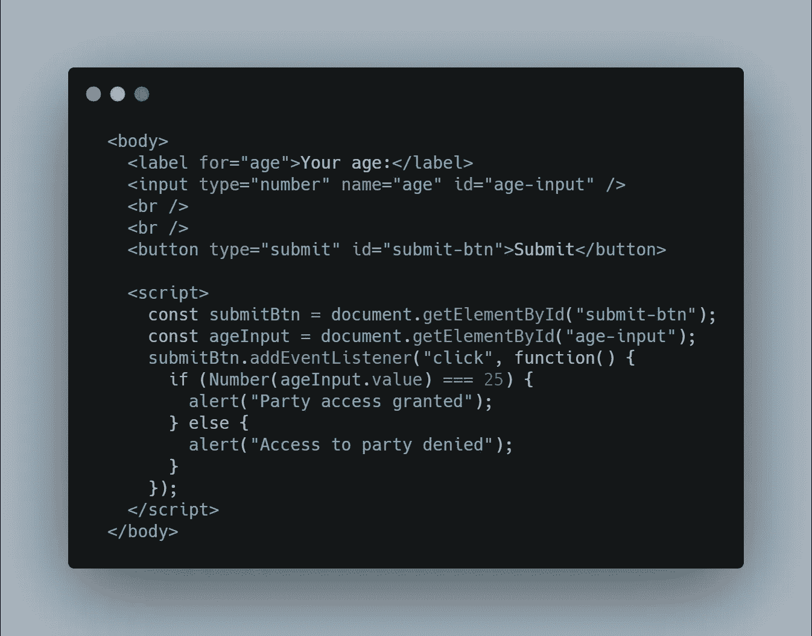

[生](https://carbon.now.sh/?bg=rgba(171%2C%20184%2C%20195%2C%201)&t=seti&wt=none&l=htmlmixed&ds=true&dsyoff=20px&dsblur=68px&wc=true&wa=true&pv=56px&ph=56px&ln=false&fl=1&fm=Hack&fs=14px&lh=133%25&si=false&es=2x&wm=false&code=%2520%2520%253Cbody%253E%250A%2520%2520%2520%2520%253Clabel%2520for%253D%2522age%2522%253EYour%2520age%253A%253C%252Flabel%253E%250A%2520%2520%2520%2520%253Cinput%2520type%253D%2522number%2522%2520name%253D%2522age%2522%2520id%253D%2522age-input%2522%2520%252F%253E%250A%2520%2520%2520%2520%253Cbr%2520%252F%253E%250A%2520%2520%2520%2520%253Cbr%2520%252F%253E%250A%2520%2520%2520%2520%253Cbutton%2520type%253D%2522submit%2522%2520id%253D%2522submit-btn%2522%253ESubmit%253C%252Fbutton%253E%250A%250A%2520%2520%2520%2520%253Cscript%253E%250A%2520%2520%2520%2520%2520%2520const%2520submitBtn%2520%253D%2520document.getElementById(%2522submit-btn%2522)%253B%250A%2520%2520%2520%2520%2520%2520const%2520ageInput%2520%253D%2520document.getElementById(%2522age-input%2522)%253B%250A%2520%2520%2520%2520%2520%2520submitBtn.addEventListener(%2522click%2522%252C%2520function()%2520%257B%250A%2520%2520%2520%2520%2520%2520%2520%2520if%2520(Number(ageInput.value)%2520%253D%253D%253D%252025)%2520%257B%250A%2520%2520%2520%2520%2520%2520%2520%2520%2520%2520alert(%2522Party%2520access%2520granted%2522)%253B%250A%2520%2520%2520%2520%2520%2520%2520%2520%257D%2520else%2520%257B%250A%2520%2520%2520%2520%2520%2520%2520%2520%2520%2520alert(%2522Access%2520to%2520party%2520denied%2522)%253B%250A%2520%2520%2520%2520%2520%2520%2520%2520%257D%250A%2520%2520%2520%2520%2520%2520%257D)%253B%250A%2520%2520%2520%2520%253C%252Fscript%253E%250A%2520%2520%253C%252Fbody%253E)

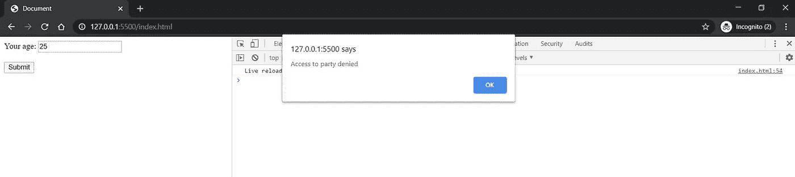

正如你所看到的，我们有一个**数字输入字段**，我们想给那些正好 25 岁的人一个虚拟的聚会。

问题是，即使我们提供数字 25 作为参数，程序也不会工作。

为了解决这个问题，我们可以使用调试器。因为代码简单易懂，我们将从使用 **console.log** 方法打印 if 语句中的数字开始。

在 **if** 语句之前，我们添加下面一行:

`console.log(ageInput.value, 25, ageInput.value === 25);`

如果我们再次运行代码，我们将在控制台中看到以下输出。

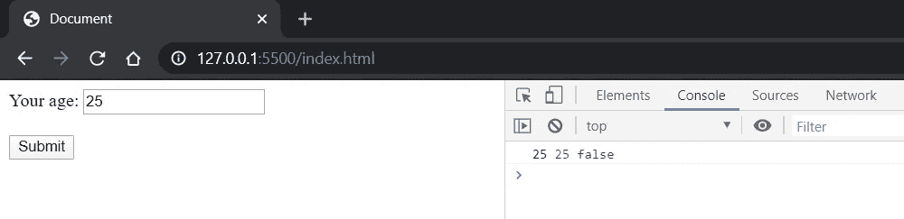

因为浏览器相当智能，如果我们仔细观察，我们可以看到它打印了 **25** 和 **25。**

但是数字的颜色不一样。这暗示它们有不同的数据类型。

通过添加以下语句

`console.log(typeof ageInput.value, typeof 25);`

我们看到输入的值是一个**字符串**，即使我们将其类型设置为数字。

`<input type="number" name="age" id="age-input" />`

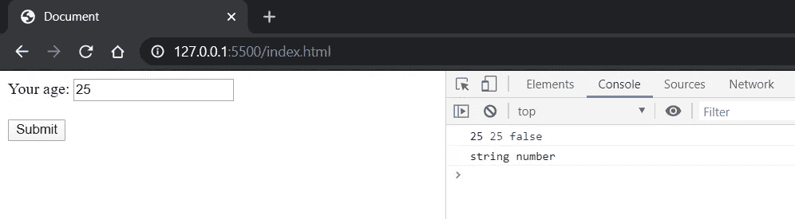

if 语句总是将这个表达式评估为 false，因为我们使用了三个等号 **===** ，这意味着我们比较值和数据类型。

为了解决这个问题，我们需要将输入的传入值转换成一个数字。

```
if (Number(ageInput.value) === 25) {
  ...
}
```

这个例子很好地说明了记录器比调试器更有用。

同时，JavaScript 控制台提供的不仅仅是一个简单的日志。

这里列出了**控制台**对象必须提供的所有方法，您可以在调试过程中使用这些方法。

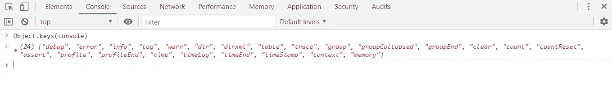

*   **console.trace() —** 显示一条跟踪信息，显示代码如何在某一点结束；如果你有调用其他函数的函数，并且你想看到执行堆栈，这非常有用
*   **console.debug()、console.info()、console.warn()、console.error()** —如果想在不同级别进行日志记录，非常有用；例如，如果您有一个 **NodeJS** 应用程序，其中有一个像 **PM2** 这样的流程管理器，并且您想要错误、警告和信息的日志文件(errors.txt，warning.txt，info.txt)，那么您可以使用这些方法在相应的文件中打印消息
*   **console.time()** 和 **console.timeEnd() —** 该方法启动和停止控制台视图中的计时器，您可以使用它来测量给定代码块的性能([示例](https://www.w3schools.com/jsref/met_console_time.asp))

# 调试器方式

正如我们之前说过的，你应该根据你的需要选择你的武器。在有些情况下，一个日志记录者不会有所帮助，或者实际上让事情变得更加困难。

比如下面的代码为例:

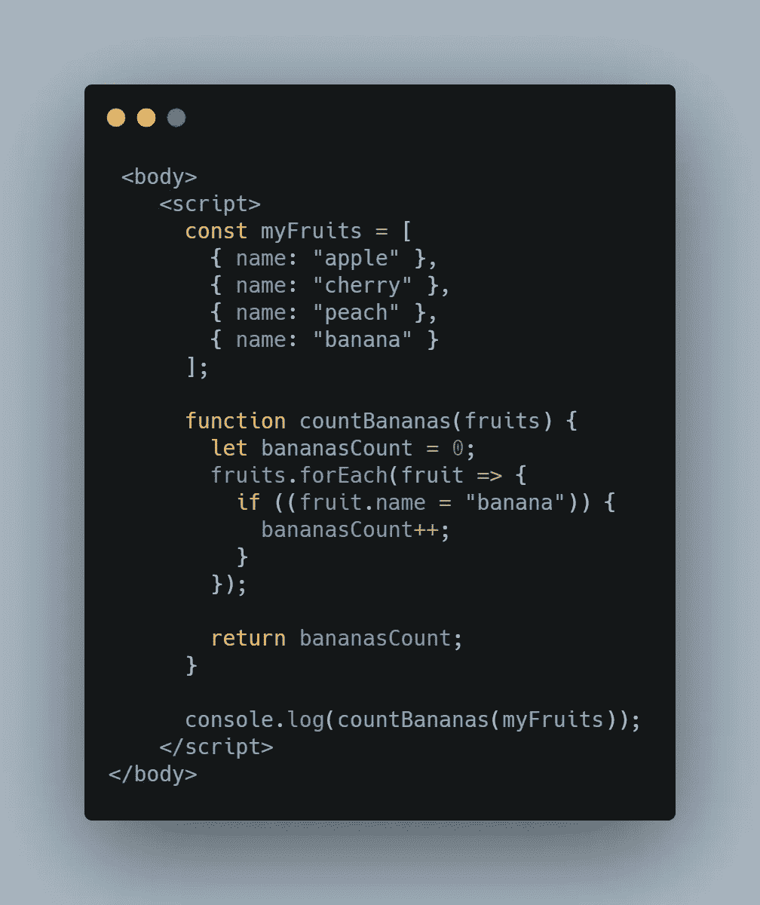

[生](https://carbon.now.sh/?bg=rgba(171%2C%20184%2C%20195%2C%201)&t=seti&wt=none&l=htmlmixed&ds=true&dsyoff=20px&dsblur=68px&wc=true&wa=true&pv=56px&ph=56px&ln=false&fl=1&fm=Hack&fs=14px&lh=133%25&si=false&es=2x&wm=false&code=%2520%253Cbody%253E%250A%2520%2520%2520%2520%253Cscript%253E%250A%2520%2520%2520%2520%2520%2520const%2520myFruits%2520%253D%2520%255B%250A%2520%2520%2520%2520%2520%2520%2520%2520%257B%2520name%253A%2520%2522apple%2522%2520%257D%252C%250A%2520%2520%2520%2520%2520%2520%2520%2520%257B%2520name%253A%2520%2522cherry%2522%2520%257D%252C%250A%2520%2520%2520%2520%2520%2520%2520%2520%257B%2520name%253A%2520%2522peach%2522%2520%257D%252C%250A%2520%2520%2520%2520%2520%2520%2520%2520%257B%2520name%253A%2520%2522banana%2522%2520%257D%250A%2520%2520%2520%2520%2520%2520%255D%253B%250A%250A%2520%2520%2520%2520%2520%2520function%2520countBananas(fruits)%2520%257B%250A%2520%2520%2520%2520%2520%2520%2520%2520let%2520bananasCount%2520%253D%25200%253B%250A%2520%2520%2520%2520%2520%2520%2520%2520fruits.forEach(fruit%2520%253D%253E%2520%257B%250A%2520%2520%2520%2520%2520%2520%2520%2520%2520%2520if%2520((fruit.name%2520%253D%2520%2522banana%2522))%2520%257B%250A%2520%2520%2520%2520%2520%2520%2520%2520%2520%2520%2520%2520bananasCount%252B%252B%253B%250A%2520%2520%2520%2520%2520%2520%2520%2520%2520%2520%257D%250A%2520%2520%2520%2520%2520%2520%2520%2520%257D)%253B%250A%250A%2520%2520%2520%2520%2520%2520%2520%2520return%2520bananasCount%253B%250A%2520%2520%2520%2520%2520%2520%257D%250A%250A%2520%2520%2520%2520%2520%2520console.log(countBananas(myFruits))%253B%250A%2520%2520%2520%2520%253C%252Fscript%253E%250A%253C%252Fbody%253E)

这段代码应该打印水果列表中香蕉的数量。在我们的例子中，它应该打印 1，但是它有一个错误，如果我们运行它，我们将在控制台视图中看到数字 4。

也许你已经明白了，但是假设我们只是粗略地看了一下这个代码片段，或者这是一个更大项目的一部分，我们没有发现问题。

让我们试着用一个记录器来找出它。在我们的函数 **countBananas()** 中，在**让 bananasCount = 0 之前添加下面一行；**

`console.log(myFruits);`

如果我们再次运行它，我们将在控制台视图中看到以下输出。

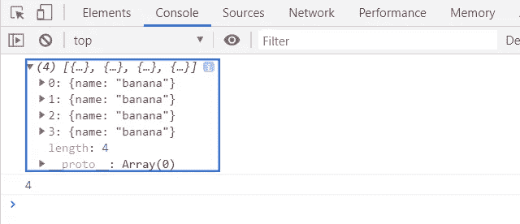

我们很容易称这种行为为怪异，因为我们的列表看起来不是这样的。让我们从函数中移除 **console.log** ，并在函数调用之前运行它。

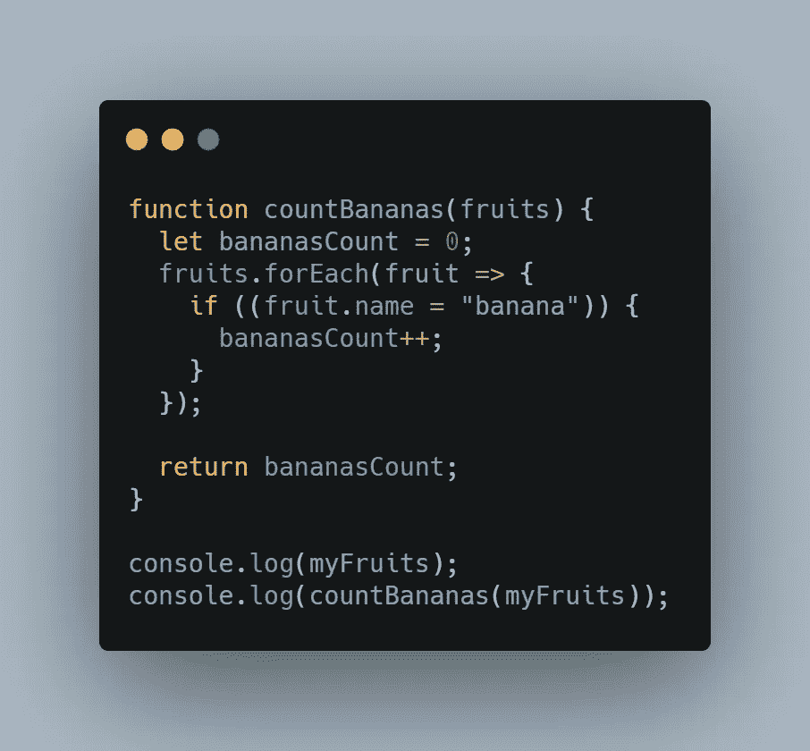

[RAW](https://carbon.now.sh/?bg=rgba(171%2C%20184%2C%20195%2C%201)&t=seti&wt=none&l=javascript&ds=true&dsyoff=20px&dsblur=68px&wc=true&wa=true&pv=56px&ph=56px&ln=false&fl=1&fm=Hack&fs=14px&lh=133%25&si=false&es=2x&wm=false&code=function%2520countBananas(fruits)%2520%257B%250A%2520%2520let%2520bananasCount%2520%253D%25200%253B%250A%2520%2520fruits.forEach(fruit%2520%253D%253E%2520%257B%250A%2520%2520%2520%2520if%2520((fruit.name%2520%253D%2520%2522banana%2522))%2520%257B%250A%2520%2520%2520%2520%2520%2520bananasCount%252B%252B%253B%250A%2520%2520%2520%2520%257D%250A%2520%2520%257D)%253B%250A%250A%2520%2520return%2520bananasCount%253B%250A%257D%250A%250Aconsole.log(myFruits)%253B%250Aconsole.log(countBananas(myFruits))%253B)

如果我们再次运行它，我们将看到相同的输出。

现在更糟了，因为我们在开始函数之前就打印了变量的值。

*在这一点上，我们可能记得对象是作为引用* [*发送的，而不是作为值*](https://medium.com/nodesimplified/javascript-pass-by-value-and-pass-by-reference-in-javascript-fcf10305aa9c) *发送的，也许我们在函数中修改了对象的值。*

我们看到这里使用记录器是不可行的。

这不是 JavaScript 控制台的问题，更多的是它的异步行为和工作方式。你可以在这个[栈溢出帖子](https://stackoverflow.com/questions/23429203/weird-behavior-with-objects-console-log)上读到更多。

让我们克服这个问题，利用**调试器。**我们来添加以下断点。

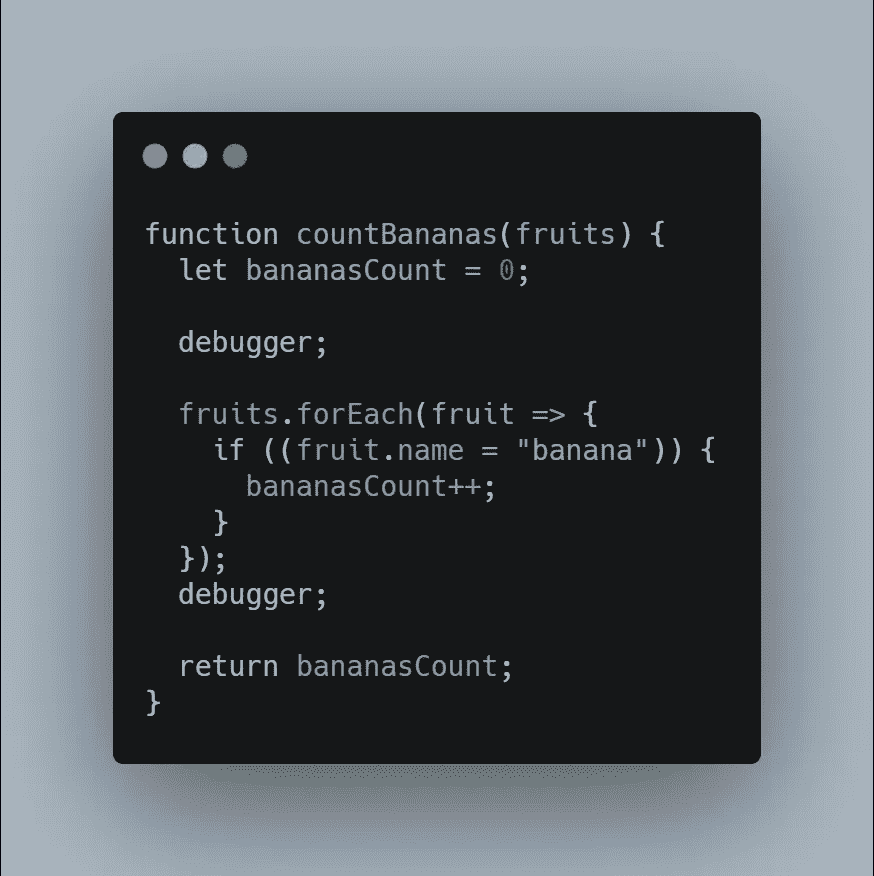

[未加工的](https://carbon.now.sh/?bg=rgba(171%2C%20184%2C%20195%2C%201)&t=seti&wt=none&l=javascript&ds=true&dsyoff=20px&dsblur=68px&wc=true&wa=true&pv=56px&ph=56px&ln=false&fl=1&fm=Hack&fs=14px&lh=133%25&si=false&es=2x&wm=false&code=function%2520countBananas(fruits)%2520%257B%250A%2520%2520let%2520bananasCount%2520%253D%25200%253B%250A%2520%2520%250A%2520%2520debugger%253B%250A%2520%2520%250A%2520%2520fruits.forEach(fruit%2520%253D%253E%2520%257B%250A%2520%2520%2520%2520if%2520((fruit.name%2520%253D%2520%2522banana%2522))%2520%257B%250A%2520%2520%2520%2520%2520%2520bananasCount%252B%252B%253B%250A%2520%2520%2520%2520%257D%250A%2520%2520%257D)%253B%250A%2520%2520debugger%253B%250A%2520%2520%250A%2520%2520return%2520bananasCount%253B%250A%257D)

当它到达第一个断点时，我们得到以下输出:

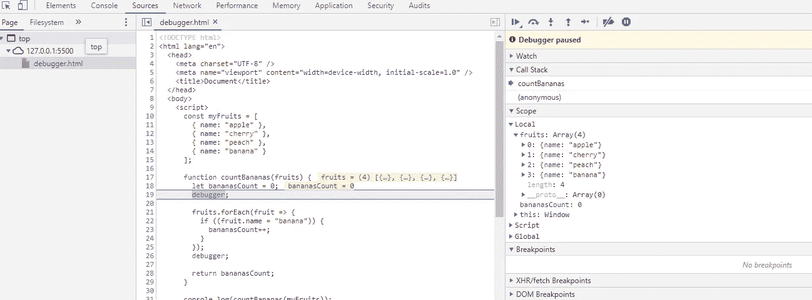

通过使用调试器，我们看到我们的水果数组没有问题，直到这里。

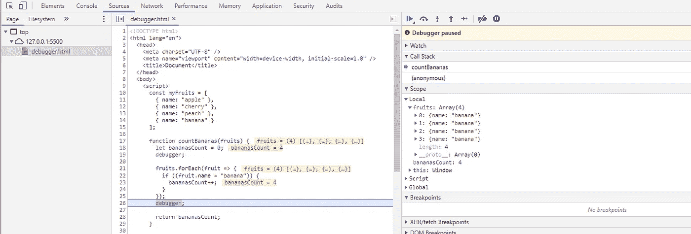

但是，到了第二个断点，我们看到我们的对象被 **forEach** 循环中的一些代码修改了。

我们现在可以将调试器放在 **forEach** 循环中，如果我们继续这样做，我们会发现问题出在 **if** 语句中。我们使用了赋值操作符而不是比较操作符。

我们写道

`if ((fruit.name = "banana"))`

代替

`if ((fruit.name == "banana"))`

或者

`if ((fruit.name === "banana"))`

正如我们所看到的，调试器更适合于代码变得更复杂和执行堆栈增加的情况。

# 下一级是什么？

这些例子是微不足道的。现实生活中的生产就绪型应用程序呢？

我们将如何处理下一个场景，我们有一个用户的应用程序，突然出现一个 bug/错误？可以做远程调试吗？

在这种情况下，我们必须在本地设置上创建一个与生产环境相同的开发环境，并尝试复制错误或 bug。

一旦我们找到它，我们可以发布应用程序的新版本。

但是，假设我们更进一步，我们有一个现代架构的现代解决方案。

我们没有单一的应用程序，而是在云中有微服务甚至无服务器的方法。

在这种情况下，MTTR/MTTI(平均解决时间/平均识别时间)比率将受到影响。

云和容器的兴起导致系统变得更加分散和动态，从而使问题的故障诊断变得越来越困难。

这种松散解耦的架构使得可观测性变得更加重要，也更加具有挑战性。在无服务器解决方案的情况下，由于其架构的复杂性，这些应用程序在生产中[调试要困难得多](https://www.rookout.com/blog/debugging-in-production-how-to-stop-fearing-the-inevitable)。

没有远程调试过程的空间，因为缺少对服务器和操作系统级别的访问。为了调试这个应用程序，必须能够收集尽可能多的数据/日志。你可以使用平台本身提供的原生云工具，也可以使用商业云工具。

谈到在云中调试实时代码，有几个工具可供选择。其中之一是 [Rookout](https://www.rookout.com/) ，一个数据提取和流水线平台，它提供了一个惊人的能力，可以根据需要从您的实时代码中收集数据。

可以用于 Python，Node.js，。NET 和 JVM 运行时。

通过设置断点，您可以实时看到应用程序中发生了什么。

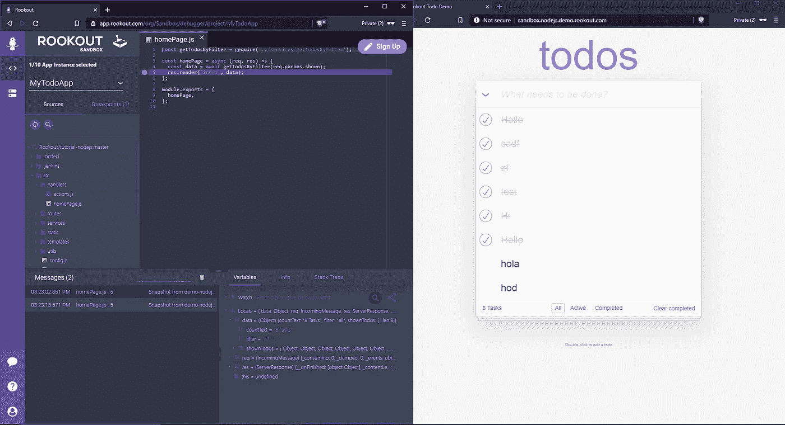

# 结论

调试过程是我们几乎每天都要经历的事情。

尽管这个问题有多种解决方案，但请记住始终选择最符合您需求的方案。从基本应用程序中的简单日志程序，到调试器，甚至代码测试，再到基于云的解决方案的高性能工具。