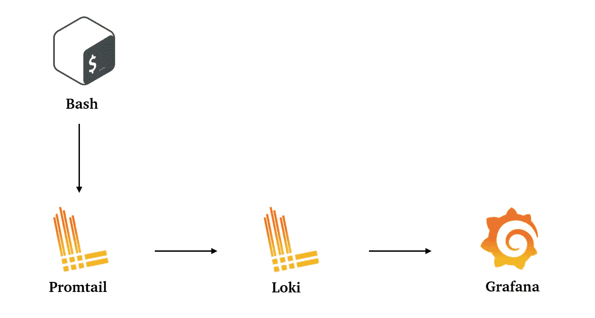
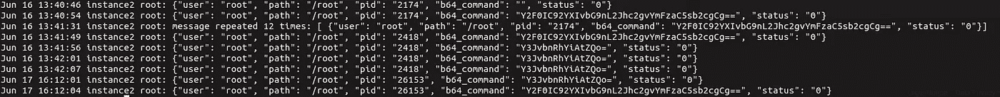
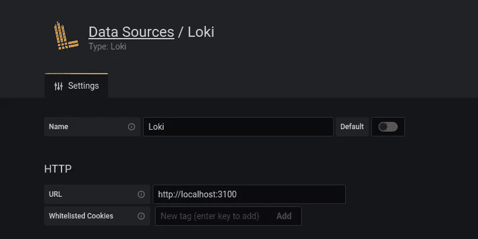
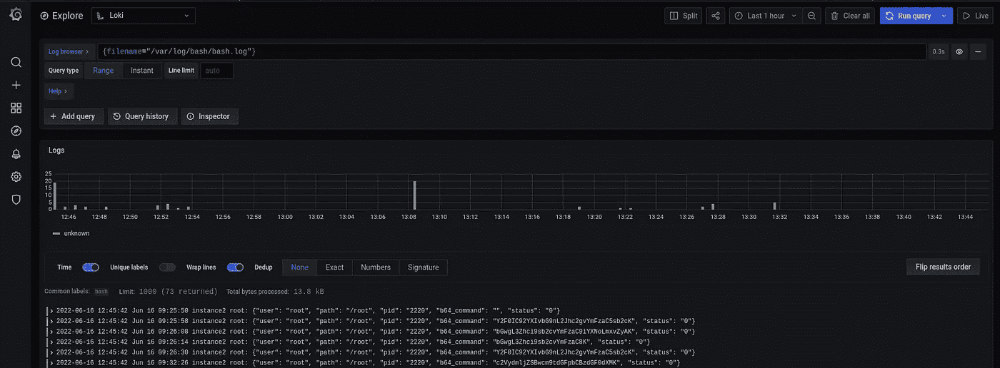

# 通过 Promtail、Loki 和 Grafana 记录 Bash 历史

> 原文：<https://itnext.io/logging-bash-history-via-promtail-loki-and-grafana-9e70870a6cd?source=collection_archive---------2----------------------->



我们经常使用 bash 控制台。有时，您必须记住谁做了什么，何时运行了什么命令，并观察基础架构中的用户。或者说，当你使用 apt 升级和升级 eg，Nginx 时，你有多容易得到时间和日期？当然，除非您已经实现了 GitOps 方法，在这种方法中，基础设施中的所有更改都是使用 X 作为代码来完成的。我不得不这样透明地为我们的基础设施配置一切。

一个有趣的观察，那几个直接用手去摸基础设施的人，开始更加小心翼翼的使用控制台，包括我。在一个中心位置跨整个基础设施运行 Bash 命令是一个不错的选择，尤其是当您的基础设施可能有许多服务器，而您还没有使用编排系统时。

在这篇文章中，我们将一步一步地配置一台服务器，在控制台中显示所有输入的命令。上述所有命令最好与自动基础结构配置一起使用，因为在每台服务器上配置此功能需要很长时间。

在这篇文章中，我使用各种技术为 Bash shell 设置日志，并将这些日志转发给 Grafana。Grafana 和 Loki 在不同的监控服务器上。这使得演示如何为设置 Bash 日志设置各种组件变得容易，并且应该很容易在您自己的基础设施中复制这一功能。上述所有脚本和命令最好与自动基础结构配置一起使用，因为在每台服务器上单独配置该功能需要很长时间。

我们开始吧！

**初始数据:**
*服务器 1:* 实验服务器，其 bash 历史我们会推送到监控中；这种服务器的数量不限。身份设定。
*服务器 2:* 带有 Grafana 的监控服务器，我们将在其中安装 Loki。

# **服务器 1。设置操作员的 bash 环境**

确保您安装了 rsyslog:

```
apt-get install -y update && apt-get install -y rsyslog
```

**提示 _ 命令**

为了设置 bash 日志记录，我们将使用 PROMPT_COMMAND 环境变量。PROMPT_COMMAND 的内容将在返回 Bash 提示符之前执行(即在终端中的每个交互命令执行之后)。这个 Bash 特性将允许我们通过本地对象发送日志，并使用 rsyslog 将它们写入日志文件。最后，我们将使用 Promtail 来转发 Loki 日志，并在 Grafana 中显示它们。

要使用 **PROMPT_COMMAND** 设置环境变量，请将以下代码行添加到****/etc/bash . bashrc:****

```
*export PROMPT_COMMAND=’RETRN_VAL=$?; if [ -f /tmp/lastoutput.tmp ]; then LAST_OUTPUT=$(cat /tmp/lastoutput.tmp); rm /tmp/lastoutput.tmp; fi; logger -S 10000 -p local6.debug “{\”user\”: \”$(whoami)\”, \”path\”: \”$(pwd)\”, \”pid\”: \”$$\”, \”b64_command\”: \”$(history 1 | sed “s/^[ ]*[0–9]\+[ ]*//” | base64 -w0 )\”, \”status\”: \”$RETRN_VAL\”, \”b64_output\”: \”$LAST_OUTPUT\”}”; unset LAST_OUTPUT;*
```

**哪里，**

****RETRN_VAL=$？；*** — *设置包含前一次命令运行返回值的变量。因为 PROMPT_COMMAND 是在我们的提示符重新显示之前运行的，这最终意味着脚本将在我们运行每个命令之后运行；**

****if[-f/tmp/last output . tmp]；然后 LAST _ OUTPUT = $(cat/tmp/LAST OUTPUT . tmp)；RM/tmp/last out . tmp；fi；—*** *检查名为/tmp/lastoutput.tmp 的文件是否存在，将 LAST_OUTPUT 的值设置为文件内容的值，如果文件存在，则删除该文件。该文件将通过我们稍后创建的实用函数存储我们的命令的输出；**

****logger-S 10000-p local6.debug—****使用最多 10000 个字符的 logger 命令，并在本地对象 local 6 . debug 级别设置优先级。这将允许我们稍后使用 rsyslog 捕获日志；**

****" { \ \ " user \ ":\ " $(whoami)\ "，\\"path\": \"$(pwd)\ "，\ \ " PID \ ":\ " $ $ " b64 _ command \ ":\ " $(history 1 | sed-r " s/^\s*[0–9]+\s*// " | base64-w0)\ "，\\"status\": \"$RETRN_VAL\ "，\ \ " b64 _ output \ ":\ " $ last _ output \ " } "；—*** *包含一条日志消息。在我们的例子中，我们使用 JSON 格式。这将使我们在构建 ELK 堆栈期间解析登录日志时更加容易。如您所见，我们注册了 6 个字段，包括:**

*   **当前用户**
*   **电流路径**
*   **PID**
*   **先前提取的运行命令使用* `*history*` *和 base64 编码。Base64 编码确保命令在我们的 JSON 对象中正确转义。**
*   **前一次运行命令的返回值**
*   **命令的 base64 编码输出(如果存在)。稍后我们将深入探讨这一领域；**

****未设置 LAST _ OUTPUT*** —我们禁用了 LAST_OUTPUT 变量，这样它就不会在命令之间持续。*

***最后 _ 输出***

*我们现在可以设置我们的 helper 函数来捕获我们的命令的输出，这样我们就可以将它们发送到 Loki。因为没有自动捕获命令输出的内置方法，所以我们必须执行命令两次，或者使用帮助器函数在 PROMPT_COMMAND 脚本中捕获输出。*

*以下命令必须包含在您的***/etc/bash . bashrc***文件中:*

```
*logoutput() { output=$(while read input; do echo “$input”; done < “${1:-/dev/stdin}”); echo -e “$output“; echo -e “$output” | head -c 10000 | base64 -w0 > /tmp/lastoutput.tmp; return $?; }*
```

*如图所示，logoutput 命令捕获命令的输出或读取文件的内容，base64 编码前 10，000 个字符，并将它们写入 */tmp/lastoutput.tmp* (记住，这个文件以前在我们的 PROMPT_COMMAND 中使用过！).这个帮助器函数可以用于系统中的一个文件，或者可以传递给 STDOUT 以便于日志记录！*

*这就完成了我们需要对 */etc/bash.bashrc* 文件所做的修改，现在我们可以继续设置 rsyslog 了。您需要确保将以下内容添加到您的***/etc/bash . bashrc****配置中:**

```
**export PROMPT_COMMAND=’RETRN_VAL=$?; if [ -f /tmp/lastoutput.tmp ]; then LAST_OUTPUT=$(cat /tmp/lastoutput.tmp); rm /tmp/lastoutput.tmp; fi; logger -S 10000 -p local6.debug “{\”user\”: \”$(whoami)\”, \”path\”: \”$(pwd)\”, \”pid\”: \”$$\”, \”b64_command\”: \”$(history 1 | sed “s/^[ ]*[0–9]\+[ ]*//” | base64 -w0 )\”, \”status\”: \”$RETRN_VAL\”, \”b64_output\”: \”$LAST_OUTPUT\”}”; unset LAST_OUTPUT; ‘logoutput() { output=$(while read input; do echo “$input”; done < “${1:-/dev/stdin}”); echo -e “$output“; echo -e “$output” | head -c 10000 | base64 -w0 > /tmp/lastoutput.tmp; return $?; }**
```

****写入/var/log/bash/bash.log****

**将以下用于 rsyslog 监视本地对象 local6 的内容添加到以下文件:***/etc/rsyslog . d/bash . conf***:**

```
**local6.* /var/log/bash/bash.log**
```

**正在重新加载 rsyslog:**

```
**service rsyslog restart**
```

**我们还需要为我们的日志添加 logrotate，以便不无限期地存储它们。打开***/etc/log rotate . d/r syslog***文件，向其中添加以下内容:**

```
**/var/log/bash/bash.log {
    hourly
    missingok
    rotate 1
    compress
    delaycompress
    notifempty
    create 0600 promtail promtail
    sharedscripts
}**
```

**让我们来看看它是如何工作的！**

**让我们检查一下在控制台中执行命令后日志是如何写的:**

```
**cat /var/log/bash/bash.log**
```

**您应该会在下面的截图中看到它:**

****

****设置提示信息****

**我们还需要安装 promtail，它会将我们的日志文件直接发送到 Loki:**

```
**# Downliading promtail binary
wget [https://github.com/grafana/loki/releases/download/v2.3.0/promtail-linux-amd64.zip](https://github.com/grafana/loki/releases/download/v2.3.0/promtail-linux-amd64.zip)# Unzipping downloaded archive
unzip promtail-linux-amd64.zip# Copy promtail binary file
cp -f promtail-linux-amd64 /usr/local/bin/promtail# Adding promtail user
useradd --no-create-home --shell /bin/false promtail**
```

**让我们把 Promtail 变成一项服务。为此，创建***/etc/systemd/system/promtail . service***文件并添加内容:**

```
**[Unit]
Description=Promtail service
After=network.target[Service]
Type=simple
User=promtail
ExecStart=/usr/local/bin/promtail -config.file /usr/local/bin/config-promtail.ymlServer 2\. Install Loki.[Install]
WantedBy=multi-user.target**
```

**重新读取服务配置文件:**

```
**sudo systemctl daemon-reload**
```

**并创建一个配置文件***/usr/local/bin/config-promtail . yml***，内容为:**

```
**server:
http_listen_port: 9080
grpc_listen_port: 0positions:
filename: /tmp/positions.yamlclients:
- url: http://<monitoring server internal IP>:3100/loki/api/v1/pushscrape_configs:
- job_name: systemstatic_configs:
- targets:
- localhostlabels:
job: bash__path__: /var/log/bash/bash.log**
```

**启动提示服务:**

```
**sudo service promtail start**
```

**是时候进入下一步了——设置监控。**

# ****服务器 2。安装 Loki 并配置 Grafana****

****

**安装 Loki:**

```
**# Downloading Loki binary files
wget [https://github.com/grafana/loki/releases/download/v2.3.0/loki-linux-amd64.zip](https://github.com/grafana/loki/releases/download/v2.3.0/loki-linux-amd64.zip)# Unzip
unzip loki-linux-amd64.zip# Copy Loki binary file
cp -f /tmp/loki-linux-amd64 /usr/local/bin/loki# Add Loki user
useradd --no-create-home --shell /bin/false loki**
```

**我们将 Loki 作为服务—创建***/etc/systemd/system/Loki . service***文件并添加内容:**

```
**[Unit]
Description=Loki service
After=network.target[Service]
Type=simple
User=loki
ExecStart=/usr/local/bin/loki -config.file /usr/local/bin/config-loki.yml[Install]
WantedBy=multi-user.target**
```

**创建一个配置文件***/usr/local/bin/config-Loki . yml***
，添加内容:**

```
**auth_enabled: falseserver:
    http_listen_port: 3100ingester:
    lifecycler:
        address: 127.0.0.1
        ring:
            kvstore:
                store: inmemory
            replication_factor: 1
        final_sleep: 0s
    chunk_idle_period: 5m
    chunk_retain_period: 30s
    max_transfer_retries: 0schema_config:
    configs:
        - from: 2018-04-15
          store: boltdb
          object_store: filesystem
          schema: v11
          index:
              prefix: index_
              period: 168hstorage_config:
    boltdb:
        directory: /tmp/loki/index filesystem:
        directory: /tmp/loki/chunkslimits_config:
    enforce_metric_name: false
    reject_old_samples: true
    reject_old_samples_max_age: 168hchunk_store_config:
    max_look_back_period: 0stable_manager:
    retention_deletes_enabled: false
    retention_period: 0s**
```

**在官方[文档](https://grafana.com/docs/loki/latest/configuration)中阅读更多关于配置的信息。**

**为 Loki 索引创建目录:**

```
**mkdir /tmp/loki**
```

**接下来，重新启动守护程序:**

```
**sudo systemctl daemon-reload**
```

**并启动 Loki 服务:**

```
**sudo service loki enable && sudo service loki start**
```

**监控服务器上的 Loki 服务被配置为从 Promtail 接收日志。**

****让我们试着通过 Grafana**
查看我们的 bash 历史记录。现在我们需要确保我们可以通过 Grafana 查看从服务器获得的日志。**

**登录 Grafana，向数据源添加一个新的 Loki 源:
**配置- >数据源- >添加数据源- > Loki** 并将 [*添加到 URL 字段。
如下图截图所示:*](http://localhost:3100)**

****

****浏览日志****

**要查看日志，请点按边栏中的“浏览”按钮(🧭)。单击数据源，您可以看到日志文件列表，选择其中一个来查看日志。也可以这样输入自己的查询:***{ filename = "/var/log/bash/bash . log " }***会给出来自 syslog 的日志。**

****

# ****结论。下一步是什么？****

****

**将此配置扩展到我们所有的云重定向器、本地运营等。让跟踪正在完成的工作变得非常容易。这有时会让我们的生活更轻松。我希望这种方法能够通过 Promtail 和 Loki 帮助您在 Grafana 中配置 bash 历史日志。**

****设置愉快！****