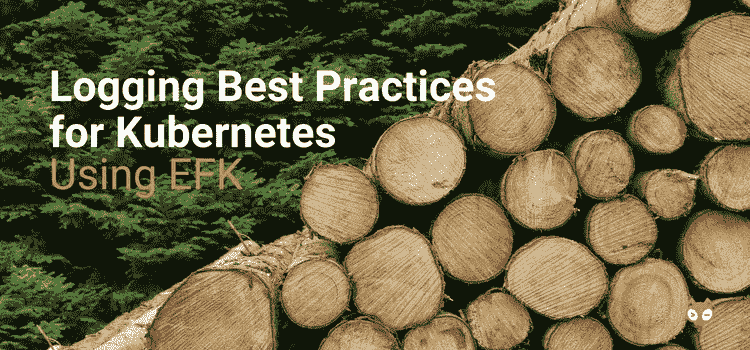

# 使用 Elasticsearch、Fluent Bit 和 Kibana 记录 Kubernetes 的最佳实践

> 原文：<https://itnext.io/logging-best-practices-for-kubernetes-using-elasticsearch-fluent-bit-and-kibana-be9b7398dfee?source=collection_archive---------1----------------------->

日志记录是我们作为开发人员拥有的最强大的工具之一。当生产中出现问题时，开发人员的第一个问题通常是——“你能把日志发给我吗？”。原始日志包含有用的信息，但可能很难解析。因此，在大规模操作系统时，使用结构化日志记录可以大大提高日志的有用性。使用一个公共结构使得日志更容易搜索，也使得日志的自动处理更容易。

在 Giant Swarm，我们在整个控制平面使用结构化日志记录来为客户管理 Kubernetes 集群。我们用 EFK 栈来做这件事，它由 [Elasticsearch](https://github.com/elastic/elasticsearch) 、 [Fluent Bit](https://fluentbit.io/) 和 [Kibana](https://github.com/elastic/kibana) 组成。EFK 堆栈基于广泛使用的 ELK 堆栈，它使用 Logstash 而不是 Fluent Bit 或 Fluentd。

这篇文章解释了我们在构建日志时遵循的一些最佳实践，以及我们如何使用 EFK 堆栈来管理它们。很快，我们还将为我们的客户提供托管日志基础设施，作为[托管云原生堆栈](https://blog.giantswarm.io/managed-cloud-native-stack/)的一部分。

# 我们如何写日志

我们的控制平面由多个微服务和 Kubernetes 操作员组成。提醒一下，Kubernetes 中的操作符是一个自定义控制器，与一个 CRD(自定义资源定义)配对，它扩展了 Kubernetes API。

对于我们的微服务，我们在基于 [Go-Kit](https://github.com/go-kit/kit) 的[微工具包](https://github.com/giantswarm/microkit)框架中开发它们。我们的操作符是使用我们的 [operatorkit](https://github.com/giantswarm/operatorkit) 框架开发的。这些框架都使用我们的微日志库。因为我们所有的日志都流经一个库，所以我们可以用额外的数据来丰富日志。这也使得我们的日志结构非常一致。

例如，我们可以将像租户集群的 ID 这样的数据添加到 Golang 上下文中，并在操作符代码中传递。我们用它来创建一个到操作员正在处理的 CR(自定义资源)的自链接。这与 Kubernetes API 公开的 self-links 方法相同，并且使日志更容易阅读。

# 我们记录的内容

我们的日志使用 JSON 格式，这使得 Fluent Bit 更容易处理它们。这也意味着存储在 Elasticsearch 中的数据更加结构化。我们对日志级别(例如调试或错误)和日志消息使用一种非常标准的格式。对于错误，我们添加一个带有完整调用堆栈的堆栈条目。

我们使用前面描述的框架，用额外的信息来丰富日志消息，例如时间戳、自链接或操作者正在处理的事件(例如创建或更新)。

# 弹性搜索

Elasticsearch 是 EFK 堆栈的核心。这是一个基于 Lucene 搜索引擎的 NoSQL 数据库。它作为搜索引擎的出身也使它擅长查询日志数据。它可以接收大量数据，高效存储数据并快速执行查询。在 EFK 堆栈中，Elasticsearch 用于日志存储，并从日志发送器 Fluent 接收日志数据。日志数据存储在 Elasticsearch 索引中，由 Kibana 查询。

如你所料，我们使用 Kubernetes 部署了 Elasticsearch。我们为客户管理的每个控制平面都有自己的 Elasticsearch 部署。这将它与所有其他控制平面隔离开来。在 AWS 和 Azure 上，我们使用带有持久卷的云存储来存储索引数据。在内部控制平面中，数据存储在物理存储上。

# 流畅位

日志记录是云原生应用程序的一个领域，其中有许多选项。我们目前使用 Fluent Bit，但我们之前评估过许多其他选项，包括 Logstash(非常流行的 ELK 堆栈中的 L)和 Filebeat，后者是来自 Elastic.co 的轻量级日志传送程序。

我们最初排除了 Logstash 和 Filebeat，因为与 Kubernetes 元数据的集成不是很先进。所以我们开始使用 Fluentd 实现。Fluentd 是一个日志运送器，有很多插件。它提供了一个统一的日志记录层，将数据转发给 Elasticsearch。这也是 CNCF 的一个项目，因其 Kubernetes 和 Docker 集成而闻名，这对我们都很重要。

Fluentd 使用 Ruby 和 Ruby Gems 来配置其 500 多个插件。由于 Ruby 是一种解释型语言，它也大量使用 C 扩展来解析日志文件和转发数据，以提供必要的速度。然而，由于我们接收的日志量，我们遇到了性能问题，因此我们评估了相关的 Fluent Bit 项目。

Fluent Bit 只在 C 中实现，与 Fluentd 相比，它的功能有限。然而，在我们的例子中，它提供了我们需要的所有功能，我们对性能非常满意。我们将 Fluent Bit 作为守护程序集部署到控制平面集群中的所有节点。每个节点上的 Fluent Bit pods 装载主机的 Docker 日志，使我们能够访问集群中所有容器的日志。

在这里，我要感谢 Eduardo Silva，他是 Fluent Bit 的维护者之一，在我们进行集成时，他回答了我们很多问题。

# 日志保留—管理员

日志记录很棒，但是它会很快用完大量的磁盘空间。因此，拥有一个好的日志保留策略是必不可少的。Fluent Bit 对此有所帮助，因为它在 Elasticsearch 中创建了每日指数。我们在 Kubernetes 中有一个每日 cron 作业，它删除超过 n 天的索引。cron 作业调用管理器组件来删除旧的索引。

有一个来自 Elastic.co 的策展人组件，但我们使用自己的简单版本，满足我们的要求。GitHub[giants warm/策展人](https://github.com/giantswarm/curator)上有。删除索引是磁盘 I/O 的一个密集过程，因此我们使用的另一个技巧是在不寻常的时间(如 02:35)运行 cron 作业，而不是在 02:00——这避免了与其他计划任务的冲突。

# 基巴纳

Kibana 为栈提供 UI，前端和查询引擎用于查询 Elasticsearch 中的日志。Kibana 支持 Lucene 查询语法以及它自己的使用 JSON 的扩展查询 DSL。另一个很好的特性是对在仪表板中使用的可视化的内置支持。

我们面临的一个挑战是如何配置 Kibana。我们在每个控制平面中运行一个 Kibana 实例，我们希望它们都与相同的基本配置保持同步。这包括在 Kibana 中设置索引模式，它应该搜索哪些 Elasticsearch 索引。

我们使用的是 Kibana 6，直到最近它还没有一个[文档化的配置 API](https://github.com/elastic/beats/pull/4413) 。所以我们写了一个简单的边车[来设置配置。这工作得很好，但是需要适应每个版本的 Kibana。Elastic.co 最近发布了用于配置的](https://github.com/giantswarm/kibana-sidecar)[保存对象 API](https://www.elastic.co/guide/en/kibana/6.3/saved-objects-api.html) 的文档，将来可能会升级到这个版本。

# 结论

在本帖中，我们向您展示了如何使用结构化日志记录和 EFK 堆栈来为我们的客户管理 Kubernetes 集群。在构建云原生应用程序时，有许多日志记录选项。我们评估了几个选项，找到了一套适合我们的工具。

然而，EFK 和麋鹿栈的好处之一是它们非常灵活。因此，如果你想使用不同的日志存储工具，如[Kafka](https://kafka.apache.org/)——你只需配置 Fluent 来传输到 Kafka。这也适用于第三方日志存储提供商，如 DataDog 和 Splunk。如果 Filebeat 或 Logstash 更适合您的需要，您也可以使用不同的日志传送程序。

很快，我们还将向我们的客户提供托管日志记录基础设施，作为[托管云原生堆栈](https://blog.giantswarm.io/managed-cloud-native-stack/)的一部分。这将让我们的客户利用 EFK 堆栈提供的丰富功能。但是，它将完全由我们管理，利用我们在生产中运行 EFK 堆栈的运营知识。在这里申请免费试用[巨型蜂群基础设施](https://giantswarm.io/)。

由[罗斯·费尔班克斯](https://twitter.com/rossf7?lang=en) —平台工程师@ [巨型蜂群](https://giantswarm.io/)撰写

 [## 罗斯·费尔班克斯(@rossf7) |推特

### 罗斯·费尔班克斯的最新推文(@rossf7)。平台工程师@giantswarm -对云本地基础架构、数据感兴趣…

twitter.com](https://twitter.com/rossf7)