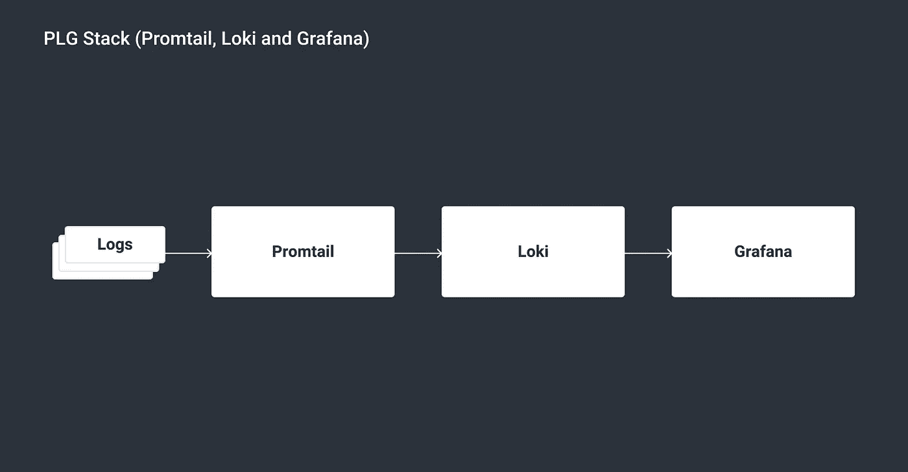
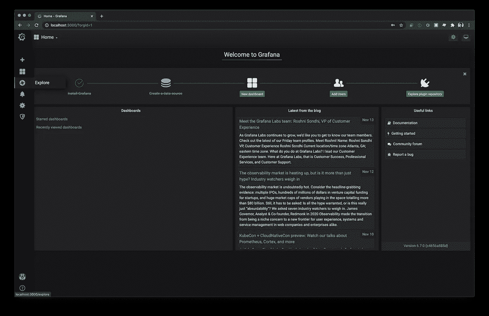
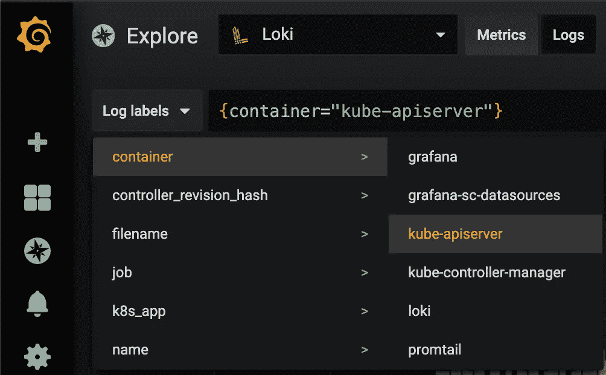
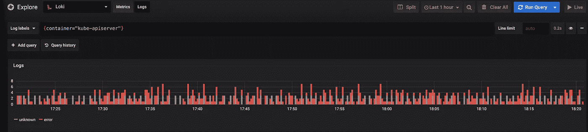
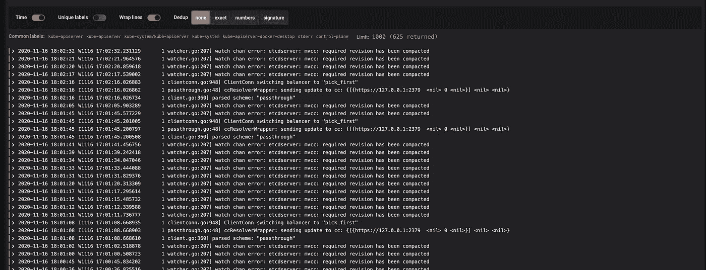

# 使用洛基和 PLG 堆栈登录 Kubernetes

> 原文：<https://itnext.io/logging-in-kubernetes-with-loki-and-the-plg-stack-93b27c90ec34?source=collection_archive---------0----------------------->

## Loki 是 Grafana 实验室的一个新的日志聚合系统。它被设计成具有成本效益且易于操作。在本文中，您将了解更多关于 Loki 的知识，以及如何在 Kubernetes 中使用 PLG 堆栈(Promtail、Loki、Grafana)进行登录。


# 洛基是什么？

Loki 是一个开源的多租户日志聚合系统。它可以与 Grafana 和 Promtrail 一起使用来收集和访问日志，[类似于 ELK/EFK 栈](https://grafana.com/docs/loki/latest/overview/comparisons/)。虽然人们可以使用 Kibana 和 Elasticsearch 进行高级数据分析和可视化，但基于 Loki 的日志堆栈侧重于轻量级和易于操作。

Loki 提供了一种叫做 [LogQL](https://grafana.com/docs/loki/latest/logql) 的查询语言，允许用户查询日志。它的灵感来自 Prometheus 的 PromQL，可以认为是一个聚合日志源的分布式“grep”。

与传统日志记录系统的一个主要区别是，Loki 只索引元数据，而不是日志的全部内容。所以索引变小了，减少了内存消耗，最终降低了成本。这种设计的一个缺点是，查询的性能可能不如将所有内容都编入索引并加载到内存中。

日志直接存储在云存储中，如亚马逊 S3 或 GCS，而无需将文件存储在磁盘上。这简化了操作，并避免了磁盘空间不足等问题。

# 使用 Loki 的 8 个好处

以下是在您的堆栈中使用 Loki 的一些主要优势:

1.  易于使用:设置简单，易于操作。
2.  轻量级:它只索引元数据，而不是像 EFK 那样索引完整的日志消息。这使得 Loki 部署所需的 RAM 实例更便宜。
3.  云原生:它与其他云原生工具[如 Kubernetes 配合得很好，像 Pod 标签这样的元数据是自动抓取和索引的。](https://codersociety.com/blog/articles/cloud-native-tools)
4.  使用对象存储:它使用像亚马逊 S3 或 GCS 这样的对象存储，这通常比使用块存储更便宜。
5.  水平扩展:它可以作为单个二进制文件在本地运行，或者用于小规模操作，并且可以很容易地水平扩展用于大规模操作。
6.  Quorum consistency:它使用 Dynamo 风格的 [quorum consistency](https://grafana.com/docs/loki/latest/architecture/#quorum-consistency) 进行读写操作，以保证统一的查询结果。
7.  多租户支持:通过一个租户 ID 支持[多租户](https://grafana.com/docs/loki/latest/overview/#multi-tenancy)，这样租户的数据是分开存储的。
8.  原生 Grafana 支持:它在 Grafana 中有原生支持(需要 Grafana v6.0)。

# 洛基的使用案例

既然我们已经讨论了 Loki 的好处，让我们也来看看一些[流行的用例](https://grafana.com/blog/2020/05/12/an-only-slightly-technical-introduction-to-loki-the-prometheus-inspired-open-source-logging-system/#key-log-analysis-use-cases)。

**调试和故障排除** : Loki 通过提供与手头问题相关的有用信息，帮助开发团队更快地找到问题的根源。例如，很容易看出问题何时出现、具体发生了什么以及问题是如何产生的。

**监控**:普罗米修斯在工业上广泛用于监控。但是，您可以通过使用 Loki 监控您的日志来识别许多问题。例如，您可以使用它来关注网站的错误率，并在超过某个阈值时收到警报。

**网络安全** : Loki 允许您识别公司系统中的威胁、问题和恶意活动。此外，它还能帮助您在系统遭到破坏后了解攻击的详细信息。

**合规性**:当法规要求公司保留审计日志时，Loki 是一个可靠且安全的选择。

**商业智能** : Loki 帮助非技术团队理解日志数据，并为业务增长开发新的策略和想法。例如，营销人员可以使用数据进行转化率优化:他们可以看到客户来自哪里，哪些营销渠道工作得最好，哪些渠道需要改进。

# PLG 堆栈(Promtail、Loki 和 Grafana)



*   [Promtail](https://grafana.com/docs/loki/latest/clients/promtail/) 是一个代理，需要安装在运行您的应用程序或服务的每个节点上。它检测目标(如本地日志文件)，将标签附加到来自 pod 的日志流，并将它们发送到 Loki。
*   洛基是 PLG 堆栈的核心。它负责存储日志数据。
*   [Grafana](https://grafana.com/grafana/) 是一个开源可视化平台，处理来自 Loki 的时间序列数据，并使日志可以在 web 用户界面中访问。

# Kubernetes 的 PLG 堆栈入门

让我们从一些实际操作开始使用 Loki。在这个例子中，我们将使用 Loki 栈来可视化 Grafana 中 Kubernetes API 服务器的日志。

在开始之前，确保您已经启动并运行了 Kubernetes 集群，并且安装了 [Helm](https://helm.sh/) 。当你一切就绪，我们可以安装洛基:

# 安装带舵的 PLG 烟囱

创建一个 Kubernetes 命名空间，将 PLG 堆栈部署到:

```
$ kubectl create namespace loki
```

添加洛基的头盔图[储存库](https://github.com/grafana/loki/tree/master/production/helm/loki):

```
$ helm repo add loki [https://grafana.github.io/loki/charts](https://grafana.github.io/loki/charts)
```

运行以下命令来更新存储库:

```
$ helm repo update
```

部署 Loki 堆栈:

```
$ helm upgrade --install loki loki/loki-stack --namespace=loki --set grafana.enabled=true
```

这将把 Loki、Grafana 和 Promtail 安装到您的 Kubernetes 集群中。

检索登录 Grafana 的密码:

```
$ kubectl get secret loki-grafana --namespace=loki -o jsonpath="{.data.admin-password}" | base64 --decode ; echo
```

生成的管理员密码将如下所示-> `jvjqUy2nhsHplVwrX8V05UgSDYEDz6pSiBZOCPHf`

最后，执行下面的命令来访问 Grafana UI。

```
$ kubectl port-forward --namespace loki service/loki-grafana 3000:80
```

现在打开你的浏览器，进入 [http://localhost:3000](http://localhost:3000/) 。

使用用户名“admin”和之前获取的密码登录。

# 格拉法纳的洛基

我们安装的 Grafana 带有预先配置的 Loki 数据源。所以我们可以马上开始探索我们的 Kubernetes 日志:



接下来，单击左侧的 Explore 选项卡。从数据源下拉列表中选择 Loki。

点击日志标签下拉菜单>容器> kube-apiserver



现在，您应该在日志窗口中获得数据了！



向下滚动，您将在 kube-apiserver 日志中找到详细信息。



# LogQL

LogQL 提供了通过操作符过滤日志的功能。以下是支持的运算符列表:

*   `=:`完全相等。
*   `!=:`不平等。
*   `=~:`正则表达式匹配。
*   `!~:`正则表达式不匹配。

让我们在另一个查询中尝试一下。我们从搜索`kube-apiserver`容器的所有日志开始。除此之外，我们还添加了过滤操作符，将结果限制为包含单词`error`而不包含`timeout`的日志:

```
{container="kube-apiserver"} |= "error" != "timeout"
```

这是一个设置和使用 Loki 和 Grafana 的简单例子。如果你想了解更多，请前往 [Loki 文档](https://grafana.com/docs/loki/latest/)。

# 包扎

公司需要一种简单且经济高效的解决方案来收集、存储和分析分布式系统中应用和服务的日志文件。Loki 可以帮助您[显著降低生产环境中的日志记录和监控成本](https://grafana.com/blog/2019/11/19/how-loki-helped-paytm-insider-save-75-of-logging-and-monitoring-costs/)。结合 Promtail 和 Grafana，它提供了完整测井堆栈所需的所有功能，可以帮助您更快地发现和解决问题，并防止故障在未来发生。

你想知道洛基如何帮助你在你的软件系统中获得更多的内幕，削减成本和[加强你公司的开发工作吗](https://codersociety.com/blog/articles/devops-success-in-organization)？使用我们的[联系表](https://codersociety.com/contact)，我们将很快回复您。

有关我们的最新见解和更新，[在 LinkedIn 上关注我们](https://www.linkedin.com/company/codersociety)

*最初发表于*[*https://codersociety.com*](https://codersociety.com/blog/articles/loki-kubernetes-logging)*。*