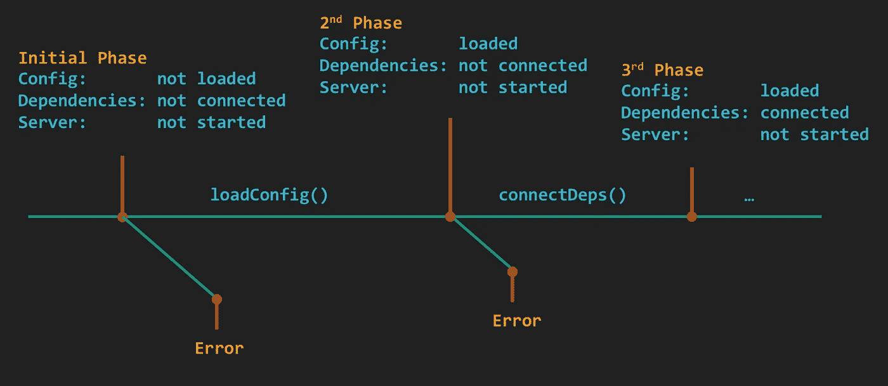
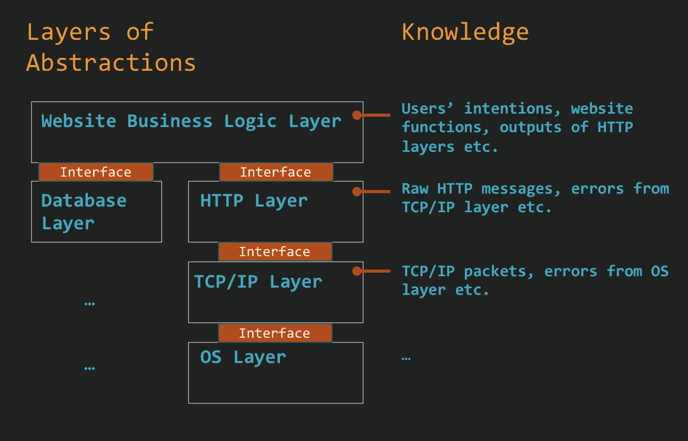

# 像专业人士一样记录日志

> 原文：<https://itnext.io/logging-like-a-pro-8cc6ad09e415?source=collection_archive---------1----------------------->

## 有效应用程序日志记录的理论和最佳实践


信用: [Alexas_Fotos](https://pixabay.com/photos/police-crime-scene-murder-forensics-3284258/) 在 Pixabay 上

日志就像犯罪现场的证据，开发者就像 CSI。日志在开发人员调查 bug 或中断时起着至关重要的作用。与缺乏证据会导致悬案一样，缺乏有意义的日志会导致故障排除耗时甚至不可能。我见过有人使用 strace 和 tcpdump 之类的工具，或者在停机期间将新代码部署到生产环境中，只是为了获得更多的日志来诊断问题。

俗话说，“刮得好的胡子是剃掉的一半，”所有专业开发人员都应该学会有效地记录日志。本文旨在不仅提供一个有用的应用程序日志记录实践的列表，而且解释一些理论，例如日志记录中的什么、何时和谁。

# 我们如何调试

如果不先讨论什么是程序以及人们如何调试，就很难谈论日志，因为日志应该有助于调试。

## 作为状态转换编程

> 程序是一系列状态间的**转换。**

[状态](https://en.wikipedia.org/wiki/State_(computer_science))是程序在特定时间点存储在内存中的内容，程序的代码定义了程序如何从一种状态转换到另一种状态。使用命令式编程语言(如 Java)的开发人员通常更关注过程(代码)而不是状态。然而，将一个程序看作是一系列的状态是一个关键的思维模式，因为状态更热衷于程序应该做什么，而不是程序如何做。

例如，如果一个机器人正在给我的汽车油箱加油，当被描述为状态转换时，它需要从状态(油箱=空，钱= 50 美元)进入状态(油箱=满，钱= 15 美元)。当被描述为一个过程时，机器人需要找到一个加油站，把车开到那里，然后付款。过程很重要，但是状态更直接地衡量程序的正确性。

## 调试

调试是状态转换的心理重建。在他们的脑海中，开发人员回放程序如何接受输入，经历一系列状态变化并产生输出，然后找出哪里出错了。在开发中，开发人员使用调试器来协助这个心理过程，而在生产中，使用调试器要困难得多，因此更经常使用日志。

# 记录什么

有了调试的定义，记录什么就变得更加简单了:

> 日志应该包含足够的信息来帮助重建**状态转换**。

不可能也没有必要去捕捉所有时间点的所有状态。警察不需要全息录像，但需要一些好的草图来抓罪犯。日志也是一样，开发者只需要在**临界状态转变**发生时进行日志记录，日志应该包含当前状态的**关键特征和**转变的原因。****

**临界状态转换**

并非所有的状态转换都值得记录。关键是把一个程序的执行想成一系列的状态变化，把它们分成阶段，然后关注执行从一个阶段到另一个阶段的时间。

例如，假设一个应用程序的启动有 3 个阶段

*   负载配置
*   连接到依赖项
*   启动服务器



应用程序的启动被描述为状态转换

记录所有这些阶段的开始和结束是非常合理的。如果连接依赖关系时出现任何错误，应用程序挂起，日志可以清楚地显示应用程序已加载其配置，进入依赖关系连接阶段，但没有完成。有了它，开发人员可以很快查明问题所在。

**关键特征**

记录状态就像勾画你的程序，只需要捕捉核心业务逻辑的关键特征。如果有任何敏感信息，如 [PII](https://en.wikipedia.org/wiki/Personal_data) ，它们仍应被记录，但被屏蔽或间接描述。

例如，当 HTTP 服务器从“等待请求”状态变为“接收到请求”状态时，它应该记录 HTTP 方法和 URL，因为它们描述了 HTTP 请求的基本内容。如果 HTTP 请求的其他元素(如标题或部分正文)的值影响业务逻辑，则应该记录这些元素。例如，如果服务器行为在 Content-Type:application/json 和 Content-Type:multipart/form-data 之间显著不同，则应该记录头。

**状态转换的原因**

记录状态转换的原因对调试非常有帮助。日志应该简要地涵盖上一个和下一个状态的含义，并解释原因。他们帮助开发人员连接点和导航程序执行的重建(调试)。

**示例**

一个简单的例子把所有这些放在一起:假设一个服务器收到一个格式错误的 [SSN 号码](https://www.usrecordsearch.com/ssn.htm)，一个开发者想要记录这个事件。

缺少关键状态特征和原因的一些反模式日志:

*   [2020–04–20t 03:36:57+00:00]server . go:处理请求时出错
*   [2020–04–20t 03:36:57+00:00]server . go:SSN 拒绝
*   [2020–04–20t 03:36:57+00:00]server . go:SSN 为用户 UUID " 123e 4567-e89b-12 D3-a456–426655440000 "拒绝

它们都包含一些信息，但不足以回答开发人员在故障排除过程中可能遇到的问题，例如:服务器失败的是哪种请求？为什么 SSN 被拒绝了？哪个用户受到了影响？有助于调试的好日志是:

*   [2020–04–20t 03:36:57+00:00]server . go:收到来自用户 uuid " 123 e 4567-e89b-12 D3-a456–426655440000 "(**前一状态**)的 SSN 请求(跟踪 id:" e4a 49 a 27–1063–4a B3–9075-cf 5 faec 22 a 16 ")，拒绝它(**下一状态**，因为

# 谁应该记录

许多人忽略的一个陷阱是写日志时的“谁”。从错误的函数写入日志会导致日志包含重复的信息或信息不足。

## 作为抽象层编程

大多数构造良好的现代程序就像一个具有多层抽象的金字塔。上层的类/函数将一个复杂的任务分解成子任务，而下层的类/函数像黑盒一样抽象子任务实现，并提供接口供上层调用。这种范式使编程变得更容易，因为每一层只需要关注其逻辑，而不用担心所有血淋淋的细节。



抽象的层次

例如，一个网站可以由业务逻辑层、HTTP 层和 TCP/IP 层组成。当响应某个 URL 的请求时，业务逻辑层主要决定显示哪个网页，并将网页内容传递给 HTTP 层。HTTP 层将内容转化为 HTTP 响应，然后让 TCP/IP 层将 HTTP 响应转化为 TCP 数据包并发送出去。

## **不要记录在错误的层**

作为抽象的结果，不同的层对正在进行的任务有不同层次的了解。在前面的例子中，HTTP 层不知道发送了多少个 TCP 包，也不知道用户在请求这个 URL 时的意图。当试图记录一些东西时，开发人员应该选择对状态转换和原因有全面了解的正确层。

在我们的 SSN 验证示例中，假设 SSN 验证逻辑被包装到一个验证器类中，比如

```
public class Validator {
    // other validation functions ...

  public static void validateSSN(String ssn) throws ValidationException {
    // do the validation
    String regex = "^(?!000|666)[0-8][0-9]{2}-(?!00)[0-9]{2}-(?!0000)[0-9]{4}$";
    Pattern pattern = Pattern.compile(regex);
    Matcher matcher = pattern.matcher(ssn);

    if (!matcher.matches()) {
      **// --> Log Location A <--**
      logger.info("Bad SSN blah, blah, blah...");
      throw new ValidationException(String.format("expecting SSN format AAA-GG-SSSS but got %s", ssn.replaceAll("\\d", "*")));
    }
  }
}
```

还有另一个函数验证更新用户信息的请求，它调用 SSN 验证:

```
public class Validator {
    // other validation functions ...

  public static void validateUserUpdateRequest(UserUpdateRequest req) {
    // validate other attribute of req ...

    try {
      validateSSN(req.ssn);
    } catch (ValidationException e) {
      **// --> Log Location B <--**
      logger.info(String.format("Received a user update request(track id %s) from user uuid %s, rejecting it because %s", req.trackID, req.uid, e.getMessage()));
      // other error handling logic ...
    }

    // other logic ...
  }
}
```

有两个地方可以记录 SSN 验证失败的日志，位置 A 和 B，但是只有位置 B 有足够的信息来记录。在位置 A，程序不知道它正在处理哪种请求，也不知道请求来自哪个用户。日志记录除了增加冗长性之外没有什么作用。对于*validateUserUpdateRequest*来说，将错误扔给有更多上下文要记录的调用者( *validateRequest* )更合适。

尽管这并不是说在程序的较低层进行日志记录是完全不必要的，尤其是当较低层不向较高层暴露错误时。例如，网络层可以嵌入重试逻辑，这意味着高层不会注意到一些间歇性的网络问题。一般来说，较低层可以在调试级别而不是信息级别写日志，以减少冗长。如果需要，开发人员可以调整日志级别以获得更多详细信息。

# 多少根木头？

在日志量和有用性之间有一个明显的权衡。日志越有意义，重建状态转换就越容易。你可以做两件事来控制你的伐木账单:

## 估计日志和工作负载之间的关系

为了控制日志量，重要的是首先给它一个合理的估计。大多数程序有两种类型的工作负载:

*   接收工作项目(请求),然后响应
*   从其他地方轮询工作项，然后执行操作

大多数日志记录是由工作负载触发的，程序的工作负载越大，它写的日志就越多。可能还有其他与工作负载无关的日志，但是当程序开始承担工作负载时，这些日志就变得微不足道了。开发人员应该保持日志数量和工作项目数量之间的线性关系，换句话说:

> 日志数量= X *工作项目数量+常数

其中 X 可以通过检查代码来确定。开发人员应该对他们的程序的 X 因素有一个很好的概念，并将其与日志容量和预算相匹配。X 的一些常见情况是:

*   0 < X < 1: This means that logs are sampled and not every work items have logs. E.g. only log on error, or use some other log sampling algorithms. It helps reducing log volumes but it can also limit troubleshooting.
*   X ~ 1: This means that, on average, every work item produces roughly one record. It’s usually reasonable as long as that one log contains sufficient information(see “what to log” section).
*   X > > 1:人们应该有一个非常好的理由来拥有一个远大于 1 的 X。因为当工作负载达到峰值时，例如，服务器收到一个突然的 HTTP 请求风暴，X 会放大这个风暴，并给日志记录基础设施带来巨大的负载，这通常是自找麻烦。

## 利用日志级别

如果优化后 X 还是太大怎么办？日志级别会有所帮助。如果 X 远大于 1，也许可以将一些日志放在调试级别，以降低信息级别的 X。排除故障时，程序可以暂时在调试级别运行，以提供更多信息。

# 摘要

要像专业人员一样写日志，应该把程序看作一系列具有抽象层的状态转换。记住这些理论，就可以回答应用程序日志中的这些关键问题:

*   **何时记录**:发生临界状态转换时记录。
*   **记录什么**:当前状态的关键特征和状态转换的原因。
*   **记录谁的日志**:记录在具有足够上下文的正确抽象层。
*   **有多少日志**:估计 X 因子(X 为 in，**)日志数= X *工作项目数+常数**，并将其调整到一个预算但有帮助的值。

如果你喜欢这篇文章，[在 Medium 上关注我](https://medium.com/@nealhu)！我撰写关于分布式系统和软件架构的文章，例如:

*   [自动化友好软件系统以及如何构建它们](/automation-friendly-software-systems-and-how-to-build-them-7a7c5e3c1a15)。向更好的自动化方向设计软件系统的技巧
*   [极简软件架构](/minimalist-software-architecture-426888684e60)。构建大规模多区域分布式系统的经验教训
*   [使用 Kustomize 之前](/before-you-use-kustomize-eaa9529cdd19)。流行的 Kubernetes 配置管理工具 Kustomize 的优缺点