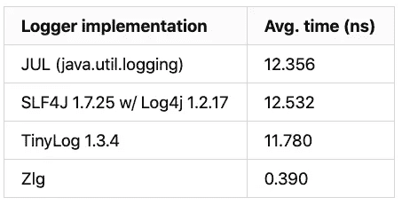

# 廉价伐木

> 原文：<https://itnext.io/logging-on-the-cheap-568674fa6387?source=collection_archive---------4----------------------->


## JVM 的超低开销日志记录

> 记录还是不记录？

编写新代码是应用程序开发中相对较小的一部分。软件工程师生活中的很大一部分涉及到支持和维护现有的系统。首先，这需要正确的洞察力——理解系统到底在做什么，特别是当这不是你(和你的客户)所期望的时候。日志记录、跟踪、远程调试和应用程序性能监控对于达到舒适操作和支持现代应用程序套件所需的可观察性水平至关重要。

在构建传统的应用程序时，是否应该记录某个操作的问题很少会引起激烈的争论。(所谓“常规的”，我们指的是大多数电子商务应用程序，它们具有相当常规的非功能性需求，涉及吞吐量、延迟、可用性等等。)偶尔，我们会遇到一类打破这种模式的应用程序。有时，传统系统的特定模块可能会受到非常严格的性能约束。一个应用程序可能在一个严格的循环中执行一个昂贵的计算，或者可能需要在一个严格的时间框架内做出响应(平均而言)。这些应用程序的侵入性检测改变了它们的计时行为——即使是简单的日志调用也会带来开销，这可能会对客户体验产生重大影响。在这些场景中，本文开头提出的问题是——*记录还是不记录？*——成为真正的争论点。你会为了可观察性而牺牲极限性能吗，或者性能是令人垂涎的赚钱机器，让所有其他关注都相形见绌吗？

# 介绍 Zerolog？

本文将探索 [Zerolog](https://github.com/obsidiandynamics/zerolog) (缩写为 Zlg)——一种用于性能敏感型 Java 应用程序的超低开销日志记录外观。Zlg 的目标有两个—

1.  **抑制日志记录的超低开销。**换句话说，当该级别的日志记录被禁用时，调用日志方法的成本可以忽略不计。此外，有可能以这样一种方式调用 Zlg 来将这些成本降低到绝对零。
2.  **不妥协的代码覆盖率。**日志记录的抑制不应该影响语句和分支覆盖度量。日志条目和其他任何语句一样，如果值得编写，就值得测试。

总的来说，这些目标使得 Zlg 适合在超高性能、低延迟应用程序和高保证环境中使用。

# 有多快？

这篇文章值得我花费时间吗？当然，日志库和外观已经被优化到极致。值得考虑另一种选择吗？

这些都是合理的问题。在抑制日志记录的情况下，在一个[i7–4770 has well](https://ark.intel.com/products/75122/Intel-Core-i7-4770-Processor-8M-Cache-up-to-3_90-GHz)CPU 上进行的 JMH 基准测试比较了 Zlg 与一些主要日志记录程序的每次调用损失。四个原语被传递给每个日志记录器进行格式化，这是一个典型日志条目的合理表示。



性能比较

> ***注:*** *运行是在 CentOS 7 上进行的，运行 JDK 10。要复制，运行* `*./gradlew launch -Dlauncher.class=AllBenchmarks*` *。*

请稍等片刻，在我们深入探讨之前，先澄清一些事情。当代的日志门面和图书馆(如 SLF4J 和 Log4j 2.x)非常棒。对于 99%的传统应用程序来说，它们已经足够了，这些应用程序每秒处理数百或数千件事情，通常响应时间为毫秒级。坦率地说，在当代微服务架构中，网络调用和 I/O 的数量远远超过了日志调用和任何其他低级工具。从工程的角度来看，生活在毫秒的世界里却提取纳秒级的性能无异于自残。所以不，这篇文章并不适合所有人，甚至不适合大多数人。

# 我能在哪里找到它？

Zerolog 是一个开源(BSD 许可)的 Java 8 项目，托管在 GitHub 上。

[](https://github.com/obsidiandynamics/zerolog) [## obsidiandynamics/zerolog

### 面向性能敏感型应用的低开销日志记录外观。Zerolog(缩写为 Zlg)是一个日志外观…

github.com](https://github.com/obsidiandynamics/zerolog) 

# 入门指南

## 属国

Gradle 构建托管在 JCenter 上。将下面的代码片段添加到您的构建文件中，用本自述文件顶部下载标记上显示的版本替换`x.y.z`。

```
compile "com.obsidiandynamics.zerolog:zerolog-core:x.y.z"
compile "com.obsidiandynamics.zerolog:<binding>:x.y.z"
```

您需要`zerolog-core`模块，通常还需要一个绑定模块。目前唯一支持的 Zlg 绑定是`zerolog-slf4j17`，它应该可以与任何具有 SLF4J 1.7.x 绑定的日志记录器一起工作。(这涵盖了所有主要的伐木工。)例如，要将 Zlg 与 Log4j 1.2.17 一起使用，请在您的`build.gradle`中添加以下内容(适当替换`x.y.z`)。

```
compile "com.obsidiandynamics.zerolog:zerolog-core:x.y.z"
compile "com.obsidiandynamics.zerolog:zerolog-slf4j17:x.y.z"
runtime "org.slf4j:slf4j-api:1.7.25"
runtime "org.slf4j:slf4j-log4j12:1.7.25"
runtime "log4j:log4j:1.2.17"
```

> ***注意:*** `*zerolog-slf4j17*` *不声明特定的* `*slf4j-api*` *版本 Maven 依赖，允许您在项目中提名任何二进制兼容的 SLF4J API 版本。结果是，您必须在您的构建文件中显式包含* `*slf4j-api*` *版本。这可以归入* `*runtime*` *配置(除非你需要在应用程序中直接使用 SLF4J，和 Zlg 一起)。*

# 记录

获得一个 logger 实例与 SLF4J 没有太大区别。通常，首先从工厂获得一个命名的记录器实例，然后将其分配给一个实例或一个静态字段，如下所示。

```
public final class SysOutLoggingSample {
  private static final Zlg zlg = Zlg.forDeclaringClass().get();  

  public static void open(String address, 
                          int port, double timeoutSeconds) {
    zlg.i("Hello world");
    zlg.i("Pi is %.2f", z -> z.arg(Math.PI));
    zlg.i("Connecting to %s:%d [timeout: %.1f sec]", 
          z -> z.arg(address).arg(port).arg(timeoutSeconds));    
    try {
      openSocket(address, port, timeoutSeconds);
    } catch (IOException e) {
      zlg.w("Error connecting to %s:%d", 
            z -> z.arg(address).arg(port).tag("I/O").threw(e));
    }
  }
}
```

一些需要注意的重要事项:

*   记录器是一个`Zlg`实例，为一个特定的类(使用`forClass()`)或一个任意的名字(使用`forName()`)创建。
*   调用`forDeclaringClass()`是`forClass(TheDeclaringClass.class)`的简写等价物，其中`TheDeclaringClass`是声明记录器的类的名称。
*   按照惯例，我们将记录器分配给一个名为`zlg`的字段。
*   日志记录是通过一个流畅的链调用的，从指定强制格式字符串的日志级别(缩写为第一个字母)开始，后面是任何可选参数(原语或对象类型)、可选标记和可选异常。
*   格式字符串是`printf`风格的，不像其他大多数记录器使用`{}` (stash)符号。

## 懒惰参数

当值*已经*可用并且可以按原样提供给记录器时，链式 args 模式工作良好。如果需要进一步的工作来制定参数，则日志隐藏不会阻止对这些表达式进行求值。例如，下面的调用将调用`List`上的`size()`方法，而不管日志记录是启用还是取消。换句话说，不管怎样，你都要付出代价。

```
final List<Integer> numbers = Arrays.asList(5, 6, 7, 8);
zlg.i("The list %s has %d elements", 
      z -> z.arg(numbers).arg(numbers.size()).tag("list"));
```

## 供应商

为了避免不必要的参数评估，Zlg 支持 FP 风格的供应商和转换。(FP 代表*功能编程*。)上面的例子可以重写，使用方法引用通过 getter 方法引用提供原始值。

```
zlg.i("The list %s has %d elements", 
      z -> z.arg(numbers).arg(numbers::size).tag("list"));
```

通过简单地将`list.size()`改为`list::size`,我们避免了潜在的多余方法调用。我们的建议是总是偏爱方法引用而不是 lambda 风格的闭包。这种方式*不会编写新代码*，对代码覆盖率没有影响。

## 转换

通常我们不会奢侈地调用一个对象上的单个无参数方法来获得一个好的、日志友好的表示。Zlg 提供了一种方便的方法，将延迟求值的转换提取到一个单独的静态方法中，只需要一个参数——要转换的对象。

在下一个示例中，我们将从人员列表中搜索一个人的姓名。如果找不到名字，我们希望记录列表的内容，但不透露人们的姓氏。正在讨论的转换是一个静态的`tokeniseSurnames()`函数，接受一组`Name`对象。为了附加转换，我们使用`Args.map(Supplier, Function)`实用程序方法，提供原始(未转换的)值引用和转换方法引用。剩下的就是 Zlg 的问题了。

```
private static final Zlg zlg = Zlg.forDeclaringClass().get();public static final class Name {
  final String forename;
  final String surname;  Name(String forename, String surname) {
    this.forename = forename;
    this.surname = surname;
  }
}public static void logWithTransform() {
  final List<Name> hackers = 
      Arrays.asList(new Name("Kevin", "Flynn"), 
                    new Name("Thomas", "Anderson"), 
                    new Name("Angela", "Bennett"));
  final String surnameToFind = "Smith";    if (! hackers.stream()
      .anyMatch(n -> n.surname.contains(surnameToFind))) {
    zlg.i("%s not found among %s", 
          z -> z
          .arg(surnameToFind)
          .arg(Args.map(Args.ref(hackers), 
                        LazyLogSample::tokeniseSurnames)));
  }
}static List<String> tokeniseSurnames(Collection<Name> names) {
  return names
     .stream()
     .map(n -> n.forename + " " + 
          n.surname.replaceAll(".", "X")).collect(toList());
}
```

被转换的值本身可以被延迟检索。下面的例子使用自定义的`DateFormat`打印当前时间；`Date`对象被有条件地实例化。

```
private static final Zlg zlg = Zlg.forDeclaringClass().get();public static void logWithSupplierAndTransform() {
  zlg.i("The current time is %s", 
        z -> z.arg(Args.map(Date::new, LazyLogSample::formatDate)));
}private static String formatDate(Date date) {
  return new SimpleDateFormat("MMM dd HH:mm:ss").format(date);
}
```

关于转换和提供者，有一点需要注意:它们和其他代码一样，应该进行相应的单元测试。您可能有一个有问题的转换，并且由于它的懒惰评估，当测试包含日志指令的代码时(如果日志被禁止)没有发现它。因为转换和提供者是简单的、单一责任的“纯”功能，对它们进行单元测试应该是简单明了的。

## 标签

Zlg 增加了一个*标签*的概念——一个可选的字符串值，可以用来修饰一个日志条目。在 SLF4J，标记相当于标记，为日志输出添加了另一个维度。

## 日志级别

Zlg 日志级别与 SLF4J(和大多数其他日志程序)相当一致。Zlg 引入了一个新的日志级别——`LogLevel.CONF`——逻辑上位于`DEBUG`和`INFO`之间。`CONF`是从 JUL ( `java.util.logging`)借用来的，用于记录初始化和配置参数，在应用程序向用户提供各种配置选项时非常有用。

> ***注:*** `*CONF*` *是规范地映射到那些不支持* `*CONF*` *的记录器中的* `*INFO*` *。*

内置日志级别从低到高依次为:`TRACE`、`DEBUG`、`CONF`、`INFO`、`WARN`、`ERROR`、`OFF`。

`OFF`不是合法的日志级别，因为它不能用于从应用程序代码输出日志条目；它被方便地用于抑制——所有级别中的最高级别。

# 配置

## 粘合剂

作为一个外观，Zlg 将所有日志调用委托给一个实际的日志记录器——一个`LogService`的实现。默认情况下，Zlg 预打包了一个非常基本的‘故障保护’`SysOutLogService`，它以固定格式将条目打印到`System.out`。下面的例子。

```
**21:18:11.771 INF [main]** SysOutLoggingSample.open:20: Connecting to github.com:80 [timeout: 30.0 sec]
**21:18:11.773 WRN [main]** **[I/O]** SysOutLoggingSample.open:25: Error connecting to github.com:80
```

Zlg 使用 Java 的 [SPI](https://docs.oracle.com/javase/tutorial/ext/basics/spi.html) 插件机制检测已安装的绑定。默认情况下，只要在类路径中包含一个绑定，Zlg 就会切换到新的绑定。

## 记录器配置

像 SLF4J 一样，Zlg 在日志配置管理方面基本上不插手，将配置细节留给绑定的日志实现。例如，Log4j 1.2 的配置将通过`log4j.properties`完成；Zlg 对此保持完全不可知论。

## 使用`zlg.properties`的基线配置

Zlg 通过从类路径中读取可选的`zlg.properties`文件来支持*基线*配置。基线配置包括可选属性列表。例如，它指定基本日志级别(低于该级别，所有日志记录都被禁用)，并且可以覆盖默认绑定。下面是一个`zlg.properties`的例子。

```
zlg.base.level=CONF
zlg.log.service=com.obsidiandynamics.zerolog.SysOutLogService
```

`zlg.base.level`属性指定最低启用日志级别(不考虑绑定日志记录器可能允许的级别)。默认值是`CONF`，这意味着除非基线改变，`TRACE`和`DEBUG`条目将被忽略。选择`CONF`作为默认级别最接近典型的生产配置。

## 改变`zlg.properties`的位置

通过设置`zlg.default.config.uri`系统属性可以覆盖`zlg.properties`的默认位置。默认的 URI 是`cp://zlg.properties`，`cp://`表示“类路径”。或者，可以用`file://`方案指定文件系统位置。

当覆盖默认文件位置时，理想情况下，`zlg.default.config.uri`属性应该作为一个`-D...` JVM 参数传入，以确保日志子系统在初始使用前被正确引导。

## 直列配置

除了`zlg.properties`之外，Zlg 还支持获取记录器时的内嵌配置:

```
final Zlg zlg = Zlg
    .forDeclaringClass()
    .withConfigService(new LogConfig().withBaseLevel(LogLevel.TRACE))
    .get();
```

内嵌配置优先，覆盖任何系统默认值或由`zlg.properties`提供的值。因此，如果您希望在对所有其他类使用 SLF4J 绑定的同时，强制某个特定类作为特例登录到控制台，您可以这样做:

```
final Zlg zlg = Zlg
    .forDeclaringClass()
    .withConfigService(new LogConfig()
                       .withBaseLevel(LogLevel.TRACE)
                       .withLogService(new SysOutLogService()))
    .get();
```

# Zerolog 为什么这么快？

一个更好的问题可能是:*为什么典型的伐木工人和伐木外观这么慢？*一个典型的 SLF4J 语句(其他伐木工大多都在同一条船上)看起来像这样:

```
logger.trace("float: {}, double: {}, int: {}, long: {}", 
             f, d, i, l);
```

这种方法有三个问题，每一个都是很大的性能消耗。

1.  **使用 varargs 传递参数。**通常，除了两到四个(取决于 API 设计者的慷慨程度)格式化参数之外，记录器将提供一个基于 varargs 的 API 来容纳任意数量的参数。Varargs 只是语法糖；性能影响是数组分配的影响。此外，在优化之前进行的任何转义分析都会得出这样的结论:数组的使用可能会超出方法调用的范围，因此堆栈分配将是不可能的——一个完整的堆分配将随之而来。
2.  **原始类型的拳击。**格式化参数要么是`Object`类型，要么是`Object`的 vararg 数组。将原语传递给 API 将导致自动装箱。autobox 缓存通常非常小；只有相对少量的原始人被拘留。即使是内部原语也仍然需要分支、偏移运算和数组查找来解析。(参见`Integer.valueOf(int)`了解 JDK 是如何实施的。)。)
3.  **垃圾收集。**这是#1 和#2 的进一步症状；varargs 和(非强制)自动装箱最终都会在堆上分配对象，而不管日志记录是启用还是取消(除非伴随有“guard”分支)；当从紧循环中进行日志记录时，分配率特别高。这会对应用程序吞吐量和延迟产生负面影响。

要解决 *#1* 和 *#2* (随后是 *#3* )的问题，使用传统的 SLF4J 风格的 API 将意味着为 Java 的八个原始类型中的每一个提供适当类型的参数，以及为变量 arity 提供`Object`。假设可以有任意数量的混合原语和对象类型，以任意组合，那么用相关数据类型的所有可能组合来制作一个单一的接口就是参数域的 arity 的指数函数。有了四个参数，每个级别将有 6，561 个不同的重载方法。这将需要某种形式的代码生成来实现，并且肯定会扼杀任何 IDE 自动完成功能。如果有七个参数，这个数字大约是两千万(跨越五个日志级别)。

Zlg 通过将原语一次一个地累积到`Zlg.LogChain`的实例中来解决上述问题。`LogChain` API 为 Java 的八种原始类型中的每一种都有一个`arg()`方法，还有`Object`。通过使用流畅的链接模式，并一次处理一个参数，Zlg 用一个微小的接口绕过了 arity 问题。当日志被禁止时，原语永远不会被装箱，数组永远不会被分配——因此 Zlg 的对象分配率为零，对 GC 的影响也为零。(这已经通过 GC 分析和禁用 GC 运行得到了验证。)

作为进一步的优化，Zlg 采用的接口驱动的反向依赖设计使它能够在断定已经为所请求的级别禁用了日志记录时，立即用一个`NopLogChain`替换它的有状态累加器日志链。因为`NopLogChain`实现是一个预实例化的单例，没有操作方法，也没有共享字段，所以需要进行积极的优化。使用大量格式化参数进行的基准测试表明，每个附加参数的增量成本约为 0.03-0.05 ns。

# 模仿和代码覆盖率

如前所述，Zlg 的主要目标之一是在不损害代码覆盖率的情况下显著降低日志开销*。我们认识到关于代码覆盖的更广泛的哲学争论:*什么代码应该/不应该被覆盖？覆盖率指标有用吗？这场辩论已经达到了宗教的程度。因此，我们的目的不是说服您达到一些任意的代码覆盖目标。我们要说的是:如果您认为日志语句的准确性是应用程序正确性的基础，因此愿意投入时间和资源来确保其有效性，那么 Zlg 使这成为可能。仅此而已；覆盖或不覆盖— *选择权完全在你*。**


Zlg 的设计很大程度上是接口驱动的，以简化模拟和测试，这本身允许我们用 100%的指令和分支覆盖来维护 Zlg。即使有了接口，使用模仿框架(比如 Mockito)感觉也不太适合流畅风格的链接——有太多的方法需要模仿，验证需要有深度意识。(这可能是流畅链接唯一的实际缺点。)

长话短说，推荐嘲讽 Zlg 的方式是用`MockLogTarget`。下面的例子。

```
// sink for our mock logs
final MockLogTarget target = new MockLogTarget();// pipe logs to a mock target
final Zlg zlg = target.logger();// do some logging...
zlg.t("Pi is %.2f", z -> z.arg(Math.PI).tag("math"));
zlg.d("Euler's number is %.2f", z -> z.arg(Math.E).tag("math"));
zlg.c("Avogadro constant is %.3e", 
      z -> z.arg(6.02214086e23).tag("chemistry"));
zlg.w("An I/O error has occurred", 
      z -> z.threw(new FileNotFoundException()));// find entries tagged with 'math'
final List<Entry> math = target.entries().tagged("math").list();
System.out.println(math);// find entries at or above debug
final List<Entry> debugAndAbove = 
    target.entries().forLevelAndAbove(LogLevel.DEBUG).list();
System.out.println(debugAndAbove);// find entries containing an IOException (or subclass thereof)
final List<Entry> withException = 
    target.entries().withException(IOException.class).list();
System.out.println(withException);// count number of entries containing the substring 'is'
System.out.println("Entries containing 'is': " + 
                   target.entries().containing("is").count());// assert that only one entry contained an exception
target.entries().withThrowable().assertCount(1);// of all the tagged entries, assert that at most two 
// weren't tagged 'chemistry'
target.entries().tagged().not()
    .tagged("chemistry").assertCountAtMost(2);
```

> ***注:*** *如果你需要的只是一个无操作的记录器来静默任何潜在输出，并且不在乎嘲讽流畅的调用链，那么用* `*Zlg.nop()*` *就可以获得一个静默的记录器。*

## 可以用 Mockito 来嘲讽 Zlg 吗？

虽然 Mockito 在内部用于测试 Zlg 的采光，但建议将`MockLogTarget`专门用于记录器的任何应用程序级模拟。如果你真的必须使用一个模仿框架，这里有一个用 Mockito 2.18 模仿日志链各个部分的例子:

```
final Zlg zlg = mock(Zlg.class, Answers.CALLS_REAL_METHODS);
final LogChain logChain = mock(LogChain.class, 
                               Answers.CALLS_REAL_METHODS);
when(logChain.format(any())).thenReturn(logChain);
when(logChain.arg(anyDouble())).thenReturn(logChain);
when(zlg.level(anyInt())).thenReturn(logChain);zlg.t("the value of Pi is %.2f", z -> z.arg(Math.PI));verify(logChain).format(contains("the value of Pi"));
verify(logChain).arg(eq(Math.PI));
verify(logChain).flush();
```

# 零开销日志记录

在本文的开始，我们承诺 Zlg 能够提供真正的零开销配置，前提是它以特定的方式使用。但是这个选项并不是没有妥协的——零开销的配置将会牺牲代码覆盖率。


如果被抑制的日志的亚纳秒惩罚仍然太高，并且您需要*真零*，那么您唯一的选择就是完全去掉日志指令。幸运的是，编译时不需要这样做；JIT DCE(死代码消除)可以智能地为你做这件事。有几种模式可以通过不同的方式实现零足迹。

**1。静态常数**上的分支—将导致其中一个分支的 DCE。示例:

```
private static final Zlg zlg = Zlg.forDeclaringClass().get();private static final boolean TRACE_ENABLED = false;public static void withStaticConstant(String address, 
                                      int port, double timeout) {
  if (TRACE_ENABLED) {
    zlg.t("Connecting to %s:%d [timeout: %.1f sec]", 
          z -> z.arg(address).arg(port).arg(timeout));
  }
}
```

如果分支指令中的常数可以在编译时完全解析，那么就可以安全地消除日志分支。这种方法没有什么特别之处——地球上的每个伐木工都支持这种方法。

**2。断言** —当与`-ea`一起运行时，将评估记录指令；否则，他们将被 DCE 教育。示例:

```
private static final Zlg zlg = Zlg.forDeclaringClass().get();public static void withAssert(String address, int port, 
                              double timeout) {
  assert zlg.level(LogLevel.TRACE)
    .format("Connecting to %s:%d [timeout: %.1f sec]")
    .arg(address).arg(port).arg(timeout).log();
}
```

断言示例没有在 lambda 中链接参数，而是使用了一种稍微长一点的连续链接方式，最终调用了返回常量`true`的`log()`。如果断言是用`-ea` JVM 参数启用的，那么 log 指令将被评估，并且永远不会使断言失败。否则，整个流利链将被 DCE 丢弃。

当目标是生产使用的零开销，同时在测试构建中保持日志记录启用时，应该首选这种方法。`-ea`旗自然有助于这种区分，而不会强迫你在建造前改变你的职业。无论哪种情况，您都将牺牲代码覆盖率，因为这两种技术都在幕后引入了寄生分支指令；测试期间只遍历一条路径。(因为`log()`方法从不返回`false`，所以完全的分支覆盖是不可能的。)

> ***注意:*** *在* `*assert*` *示例之外，强烈建议不要使用连续链接样式。您可能会忘记在链的末尾添加最后一个* `*log()*` *，这将产生“吞噬”日志的效果，而不会将日志事件转发给底层的日志记录器。*

*过早优化是万恶之源。东尼·霍尔爵士的这句名言已经成为软件工程师的主要实践。不幸的是，随着许多想法成长为传奇，这句话的原始含义几乎已经丢失，今天的软件工程师应用这句话的方式与它的原始意图不同。随着计算机系统功能的增强，软件的性能已经退居次要地位。今天，对于软件工程师来说，将霍尔的格言扩展成绝对的*“你永远不应该优化你的代码”一点也不稀奇**

已经存在并且总是存在这样的场景，其中直接的性能构成了必须在应用程序生命周期的早期解决的首要设计问题。假设优化的收益与其成本被正确建模，那么有无数的理由说明为什么软件系统应该被主动优化。有许多工具——分析器、框架、库——可以帮助进行系统优化，本文利用了一个特定的工具——日志记录，因为在构建高性能应用程序的上下文中很少对它进行充分的度量或处理。

*这篇文章对你有用吗？我很想听到你的反馈，所以不要退缩！如果你对卡夫卡或者事件流感兴趣，或者只是有什么疑问，* [*在 Twitter 上关注我*](https://twitter.com/i/user/562466177) *。我也是*[*Kafdrop*](https://github.com/obsidiandynamics/kafdrop)*的维护者和* [*有效卡夫卡*](https://www.apachekafkabook.com) *的作者。*