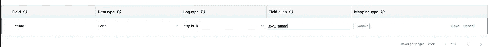

# 使用自定义 log4j2 查找插件记录服务正常运行时间

> 原文：<https://itnext.io/logging-service-uptime-with-a-custom-log4j2-lookup-plugin-2e2572246b00?source=collection_archive---------0----------------------->


由 [Antonio Grosz](https://unsplash.com/@angro?utm_source=medium&utm_medium=referral) 在 [Unsplash](https://unsplash.com?utm_source=medium&utm_medium=referral) 上拍摄

It 了解每个日志消息在服务生命周期的哪个时间点被记录有时很有用，例如，由内存泄漏引起的错误可能仅在服务启动几天后才被记录，而请求延迟警告可能仅在部署后的第一秒/分钟被记录。有趣的是，服务打开所有数据库连接或响应第一次成功的健康检查的速度有多快。一个简单的解决方案可能是在引导数据库中记录时间戳，然后手动计算偏移量。或者在每个日志消息中明确记录正常运行时间。但是这种简单的方法有局限性。手动计算偏移量是一件痛苦的事情。如果您使用 **ELK/Kibana** 进行日志发送和搜索，您将无法使用 [Kibana alerting](https://www.elastic.co/what-is/kibana-alerting) 来创建基于此属性的日志事件警报。显式记录时间戳对第三方库和依赖项不起作用，它们可能会记录重要信息并且不受您的控制。

log4j2 查找插件来拯救！正如其[文档](https://logging.apache.org/log4j/2.0/manual/lookups.html)所说:

> *查找可能是所有插件中最简单的。*

然而，它的文档不是很有帮助，而且互联网上充满了过时的/令人困惑的例子。

在本帖中，我们将:

*   用 Kotlin 写一个 log4j2 查找插件
*   配置 log4j2 以在 yaml 语法中使用它
*   使用 logzio 字段映射将自定义正常运行时间属性解析为 long
*   在此过滤正常运行时间为< 60 seconds in kibana with a lucene query

# The plugin

More about log4j plugins can be found [的事件](https://logging.apache.org/log4j/2.x/manual/plugins.html)

# 配置

使用我们插件的 log4j 配置

这是一个有趣的例子。让我们简单讨论一下。它包含两个控制台附加器，JSON 和 TEXT。当在本地或在 CI 中运行服务时使用文本 appender，而在其他地方使用“json”。

这是通过使用现有的 log4j2 环境 loockup 插件`"${env:LOG_FORMAT:-text}"`来实现的。env 查找之前的单个`$`将导致记录器只使用一次该查找，并缓存所有消息的结果。

我们的插件在这里使用:

```
...
JsonLayout:
...          
	keyValuePair:
	          - key: uptime
	            value: '$${uptime:seconds}'
```

这是名为“json”的控制台 appender 使用的 [json 布局](https://logging.apache.org/log4j/2.x/manual/layouts.html)的配置。

> Appender 使用一种布局将日志事件格式化成一种形式，这种形式可以满足使用日志事件的任何人的需求。

在我们的例子中，日志将由 ELK 使用，并基于 json 属性对它们进行索引。

log4j2 JSON 布局可以有定制字段，这些字段可以使用定制 loockup 插件，这些插件使用`keyValuePair`配置属性。

在我们的例子中，自定义字段的名称将是`uptime`，并且将通过调用我们的插件来计算每个日志消息的值，`'$${uptime:seconds}'.`注意双`$$`，这意味着我们的插件将为每个日志消息被调用。

每个 loockup 插件都必须实现 [StrLoockup 接口](https://github.com/apache/logging-log4j2/blob/master/log4j-core/src/main/java/org/apache/logging/log4j/core/lookup/StrLookup.java)，该接口包含两个方法:

```
public interface StrLookup {
	String lookup(String key); 
	String lookup(LogEvent event, String key); 
}
```

如果你在配置中的插件名称前放一个单个的`$`将会调用第一个方法，如果你放一个双`$$`将会调用第二个方法，第二个方法也可以访问包含消息、级别、上下文映射、日志名称和其他有用的东西的日志事件。在我们的示例中，`String key`接口方法变量是`seconds`，它是出现在配置中的 **":"** 之后的字符串→ $${uptime: `**seconds**` }

我真的很奇怪为什么他们不在官方文档或者界面的 javadocs 中用粗体字写$$和$这个东西。

log4j 会发现我们的插件，因为我们告诉它在哪里可以找到它

```
Configuration:
  name: Default
  packages: "com.company.core.logging"
```

`com.company.core.logging`是应该在类路径中可用的包名。

插件的注释是:

```
@Plugin(name = "uptime", category = StrLookup.CATEGORY)
```

“uptime”是 log4j 将使用反射定位的插件的名称。

# Logzio 字段映射

既然我们的服务记录了每个日志消息的正常运行时间，我们希望在 logzio 中将它解析为一个 long，以实现开放的 logzio 控制台。**工具- >字段映射** **面板**



logzio 字段映射将插件输出解析为 long

别忘了**刷新 kibana 映射**。以使更改生效。

# Lucene 查询

```
svc_name:banana AND svc_uptime:<60
```

现在，我们终于可以过滤部署服务后第一分钟内发生的事件了。

干杯！