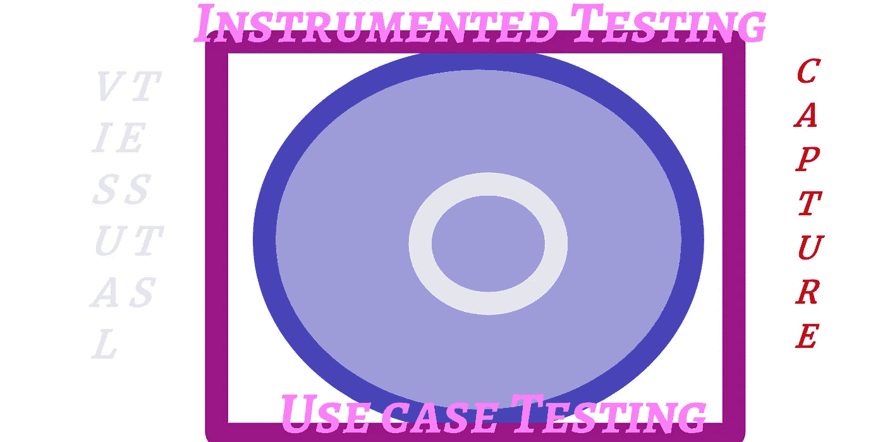

# 伐木颤动的方式

> 原文：<https://itnext.io/logging-the-flutter-way-66ddda60d118?source=collection_archive---------1----------------------->


Marek Szturc 在 [Unsplash](https://unsplash.com/s/photos/loggers?utm_source=unsplash&utm_medium=referral&utm_content=creditCopyText) 上拍摄的照片

为什么要记录颤动的方式？Flutter 宇宙中的大多数日志库都是在开发人员日志包的附件库创建之前创建的，因此多次发明了扭曲轮。因此，我将向您展示如何正确使用日志包和 logging_appenders。

# **背景**

问题是，虽然谷歌在向你介绍小工具方面做得很好；在成熟市场中开发专业应用程序并不需要掌握这些技术。那是我自己分配的工作，推出介质文章和我的颤振设计与开发丛书。

我正在撰写几本颤振设计和开发的书籍，并通过撰写中型文章来预览主题和章节。涵盖的一些主题有:

DevOPS

[为 Flutter 开发调试一台廉价的 MS Windows 笔记本电脑](https://medium.com/p/tuning-a-cheap-ms-windows-laptop-for-flutter-app-development-572d09cd4d19)

[日志驱动学习颤动](https://medium.com/codex/log-driven-learning-flutter-d76b49b75a8c)

[UML 在颤动中的清凉](/uml-coolness-in-flutter-6bb14217b5f2)

[像老板一样的线头](/lint-like-a-boss-60b85e82c227)

[麦凯布周期在颤动](https://medium.com/p/mccabe-cycles-in-flutter-3aa913e19428)

[获得真正的代码覆盖率](https://medium.com/p/getting-real-code-coverage-951231afa2bc)

[Windows 上的 Lcov](https://medium.com/p/lcov-on-windows-7c58dda07080)

[测试秘密，测试套件](/test-secrets-test-suites-99f8390b8d4b)

[如何，颤振内部包](/how-to-flutter-internal-packages-cad1285fe8c)

[一个架构布局](https://medium.com/codex/an-architecture-layout-8f414271b2b4)

[测井，专家方式](https://medium.com/codex/logging-the-expert-way-5beb5c967e44)

[捕捉颤振应用异常](/catch-flutter-application-exceptions-cad036d0fd4e)

[颤振完美设置](https://medium.com/codex/flutter-perfect-setup-c5462b412f78)

视觉的

[用户喜爱的动画(Rive)](https://medium.com/codex/animations-users-love-75a57a8cad5)

[全扑背景绝招](https://medium.com/p/full-flutter-background-trick-d1ea813470d2)

由于我的文章出现在多种出版物上，因此保持更新的最佳方式是加入这些社交平台之一，并使用我的个人资料链接关注我:

LinkedIN[https://www . LinkedIN . com/in/fredgrottstartupfluttermobileappdesigner/](https://www.linkedin.com/in/fredgrottstartupfluttermobileappdesigner/)

邢[的](https://www.xing.com/profile/Fred_Grott/cv)

不和[https://discordapp.com/users/9388/](https://discordapp.com/users/9388/)

Gitter(加入本论坛获取文章链接)[https://gitter.im/flutter/flutter](https://gitter.im/flutter/flutter)

slack[https://app . slack . com/client/TGT 6 yf2 j 1/cgs 4 qdj 56/user _ profile/uhk 8 pnr gu](https://app.slack.com/client/TGT6YF2J1/CGS4QDJ56/user_profile/UHK8PNRGU)

推特[https://twitter.com/fredgrott](https://twitter.com/fredgrott)

中型[https://fredgrott.medium.com](https://fredgrott.medium.com)

Reddit FlutterDev Subedit(只要加入这个论坛，你就会通过 Reddit 得到通知)[https://www.reddit.com/r/FlutterDev/](https://www.reddit.com/r/FlutterDev/)

一如既往，文章和书籍的代码可以在以下位置找到:

Github 上的 flutter design and arch Rosetta[https://Github . com/Fred grott/flutter _ design _ and _ arch _ Rosetta](https://github.com/fredgrott/flutter_design_and_arch_rosetta)

我贡献的插件有

飘起平台的小部件[https://github.com/stryder-dev/flutter_platform_widgets](https://github.com/stryder-dev/flutter_platform_widgets)

颤振 Rive(播放器)插件[https://github.com/rive-app/rive-flutter](https://github.com/rive-app/rive-flutter)

因此，如果你喜欢这样的想法，只需要花 1000-2000 个小时完成我的教程，就可以达到 Flutter 应用程序设计和开发的专家水平；那你知道该怎么做了。

# 我们在努力做什么？

看看这个:



要关闭已实现的洋葱分层架构的整个盒子，必须使用日志记录来找出要修改和记录的重要行为。我们通过日志记录和异常捕获来捕获，这是盒子的右侧。并且，盒子的另一面通过测试。

有哪些用于颤动测井的测井工具？

颤动测井工具

在 2019 年之前，没有用于 dart 的日志记录包，该包获取由开发者日志功能创建的事件并将它们输出到流中。所以创建了一堆第三方插件来收集日志事件，没有人创建一个非常有用的策略。

但是，使用一种方法来流式传输日志事件输出会带来一些痛苦，因为日志包在文档中很少。因此，我正在教如何使用这个日志包和一些其他的 Dart 向导工具，以便在每个 Flutter 应用程序开发项目中使用一套很好的日志记录工具。

# **开发者日志功能和日志包**

dart 开发人员包中的日志功能仅记录单个事件。API 页面在这里:

https://api.flutter.dev/flutter/dart-developer/log.html

这些级别在日志包的其他地方定义。根据级别类别中的来源，来源页面如下:

[https://github . com/dart-lang/log in/blob/master/lib/src/level . dart](https://github.com/dart-lang/logging/blob/master/lib/src/level.dart)

有这些级别:

所有 0

稳定在 2000 年

最细等级 300

水平仪 400

等级罚款 500

级别配置 700

等级信息 800

水平警告 900

严重级别 1000

水平喊 1200

日志包也有一个原始日志类和一个 API，这样记录的事件可以输出到流中。而简单记录器提供了更好的 API 来控制日志包中的记录器；它也有一些不完善之处。所以让我告诉你如何驯服整个混乱。

# **日志记录策略**

让我们一步一步来:

不可变小部件，它不同于可变小部件，因为我们不能插入可变小部件。

这很容易，如果我们初始化一个记录器，我们就不会得到警告，因为我们不再被迫声明一个没有初始化的记录器。并且，初始化单例记录器意味着我们不会为每个 dart 文件重复初始化记录器。

它的第二部分创建一个适当的 mixin，作为特殊命名的日志程序插入，以建立一个用户定义的日志区域。

应用例外

应用程序异常，因为它通常在一个带有可选 throw PlatformException 语句的语句块中；我们可以假设只需要一个简单的 logger.info(message)语句就可以了。因此，我们不需要在这个要求上增加任何东西。

未来尝试、捕捉和出错

在这种情况下，它与应用程序异常相同，因为它已经由记录器的函数处理，只要记录一个事件。

班

可以使用中用于小部件的相同技巧，可以使用专门的日志混合来定义命名日志记录器，从而为该类设置日志记录区域。

功能

现在，只需使用主函数中设置的普通 appLogger 来初始化 appLog 函数。

因为，我将使用 logging appenders 包；我不必担心给任何控制台日志着色，因为该包中的打印附件会处理这项任务。

我们如何实现这一点？

# **包或插件**

尽管如此，这将是一个内部代码，用于你所有的颤振项目。你可以把它实现为一个插件或者一个包。记住，你有路径技巧来使用插件或包来制作与你所有的 flutter 项目相关的插件或包。

我们将从将类型定义为外向工作开始。

# **种类**

现在，让我们来玩一些特殊的飞镖魔术。我们有一个抽象类:

```
abstract class LoggingCampType {Logger get campLogger;}
```

如果我扩展它，那么我的 get 可以返回一个命名的记录器；但是，我必须说明日志包的 Logger 类中的两个工厂:

```
extension LoggingCampSpawner on LoggingCampType {Logger newLogger(String name) => Logger('${campLogger.fullName}.$name');Logger detachedLogger(String name) => Logger.detached(name);}
```

mixin 看起来像这样:

```
mixin UiLoggerMixin implements LoggingCampType {@overrideLogger get campLogger => Logger('UILogger - ${runtimeType.toString()}');}
```

结果很简单，只需开始使用 campLogger，就像这样:

```
class MyHomePageState extends State<MyHomePage>with CounterStoreMixin, UiLoggerMixin {void incrementCounter() {setState(() {// This call to setState tells the Flutter framework that something has// changed in this State, which causes it to rerun the build method below// so that the display can reflect the updated values. If we changed// _counter without calling setState(), then the build method would not be// called again, and so nothing would appear to happen.campLogger.info("state changed");increaseCounter();});}... rest of code here...
```

正如我在开始展示代码时所说的那样；我们必须与 appLogger 集成，这需要在应用程序的主要功能中初始化。现在我们看到了 appLog 初始化代码。

# **App Logger 初始化**

应用程序记录器初始化如下所示:

因为我用了两个包；logging 包和 logging_appenders 包我必须为这两个包设置设置。

```
recordStackTraceAtLevel = Level.ALL;appLogger.level = Level.ALL;
```

将堆栈级别跟踪设置为 all，并将日志记录级别设置为 all。然后我们必须设置一个监听器来接收日志:

```
Logger.root.onRecord.listen((record) {//I already have accounted for the zone info in my appender and record formatter pairsif (record.error != null && record.stackTrace != null) {log('${record.level.name}: ${record.loggerName}: ${record.time}: ${record.message}: ${record.error}: ${record.stackTrace}');log(// ignore: prefer-trailing-comma'level: ${record.level.name} loggerName: ${record.loggerName} time: ${record.time} message: ${record.message} error: ${record.error} exception: ${record.stackTrace}');} else if (record.error != null) {log('level: ${record.level.name} loggerName: ${record.loggerName} time: ${record.time} message: ${record.message} error: ${record.error}');} else {log('level: ${record.level.name} loggerName: ${record.loggerName} time: ${record.time} message: ${record.message}');}});
```

将日志记录附加器设置为特定的日志格式是:

```
MyDevLogAppender(formatter: const MyDevLogRecordFormatter()).attachToLogger(Logger.root);
```

它利用了 loggingcamp 中的两个东西:

格式化程序是:

# **来源**

该软件包的源代码位于:

[https://github . com/Fred grott/flutter _ design _ and _ arch _ Rosetta/internal _ packages/logging camp/](https://github.com/fredgrott/flutter_design_and_arch_rosetta/internal_packages/loggingcamp/)

它被用在 flutter_boilerplate 中:

[https://github . com/Fred grott/flutter _ design _ and _ arch _ Rosetta/foundation _ base/flutter _ boilerplate/](https://github.com/fredgrott/flutter_design_and_arch_rosetta/foundation_base/flutter_boilerplate/)

# **结论**

设置好日志记录基础设施后，我现在可以将未捕获的异常转换为已捕获的异常，并完成完整捕获应用程序行为所需的其余调试日志记录。

# **资源**

特定于文章的资源:

颤振设计和 arch Rosetta https://github . com/Fred grott/flutter _ design _ and _ arch _ Rosetta

一般颤振和飞镖资源；

https://flutter.dev/community 颤振社区资源

颤振 SDK https://flutter.dev/docs/get-started/install

Android Studio IDE https://developer.android.com/studio

微软的 Visual Studio 代码 https://code.visualstudio.com/

https://flutter.dev/docs 颤振博士

https://dart.dev/guides dart Docs

谷歌 Firebase 移动设备测试实验室[https://firebase.google.com/docs/test-lab](https://firebase.google.com/docs/test-lab)

# **商标公告**

Google LLC 拥有以下商标:飞镖，颤振，机器人，机器人，诺托。苹果公司拥有 iOS、MacOSX、Swift 和 Objective-C 的商标。苹果公司拥有 SF Pro、Sf Compact、SF mono 和 New York 字体的商标。JetBeans Inc .拥有 JetBeans、IntelliJ 和 Kotlin 的商标。甲骨文公司拥有 Java 商标。微软公司拥有微软视窗操作系统和 Powershell 的商标。Gradle 是 Gradle Inc .的商标。Git 项目拥有 Git 的商标。Linux 基金会拥有 Linux 的商标。智能手机 OEM 自有商标到其手机产品名称。尽我所能，我遵守上述商标的品牌和使用指南。

# **关于弗雷德·格罗特**

我的密钥库档案在:[https://keybase.io/fredgrott](https://keybase.io/fredgrott)