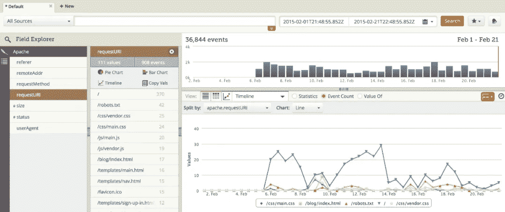
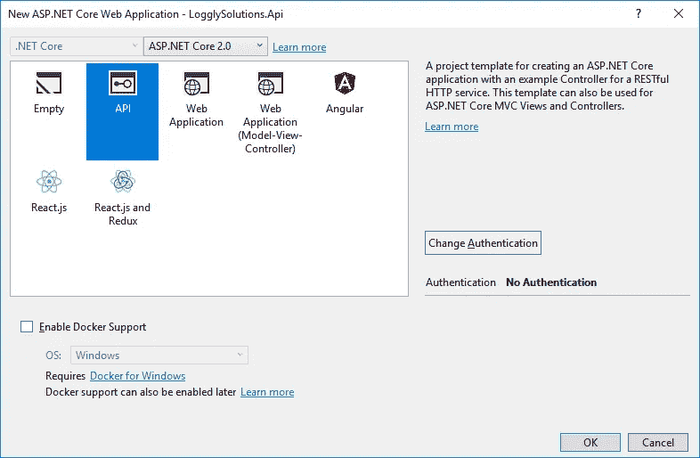
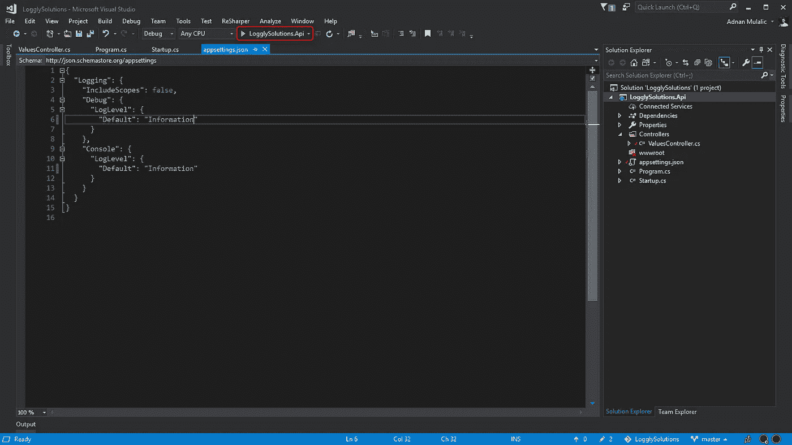
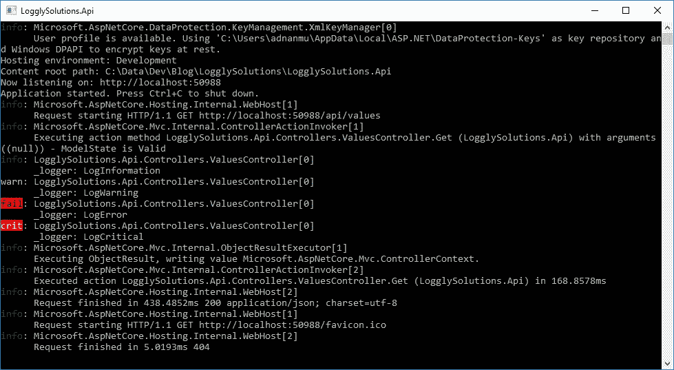
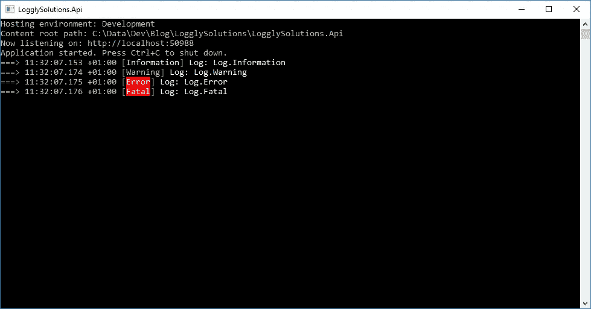
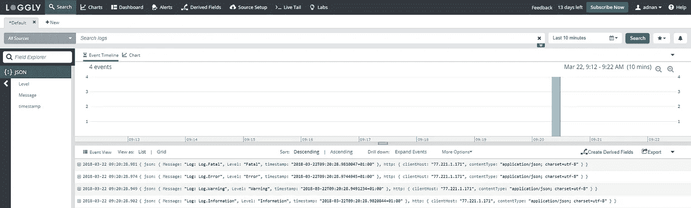

# 使用 Serilog 在 ASP.NET 岩心中测井

> 原文：<https://itnext.io/loggly-in-asp-net-core-using-serilog-dc0e2c7d52eb?source=collection_archive---------1----------------------->



[点击这里在 LinkedIn 上分享这篇文章](/loggly-in-asp-net-core-using-serilog-dc0e2c7d52eb?utm_source=medium_sharelink&utm_medium=social&utm_campaign=buffer)

我已经花了一些时间尝试在 spend 核心应用程序中使用 Serilog 实现 Loggly，我想分享知识。希望能给某人省点时间:)

你可以在这里下载完整的代码:【https://github.com/stensolino/LogglySolutions 

所以让我们开始吧！

第一步是创建一个新的解决方案。选择 ASP.NET 核心 Web 应用程序，输入解决方案和项目名称，然后单击确定。


下一步是选择项目模板。我们将使用 API 作为模板。选择它并单击确定。



## 默认集成记录器

在我们继续前进之前，关于 ASP.NET 核心 API 项目中包含的默认日志程序，说几句话。当我们使用 ASP.NET 核心 API 模板创建新项目时，会创建 Programs.cs 文件，在其中我们可以找到 WebHost。将在应用程序启动时调用的 CreateDefaultBuilder(args)函数。除了其他东西，该函数将注册默认记录器。默认情况下，将启用控制台和调试提供程序，并将从 appsettings.json 文件中读取配置。在 appsettings.json 文件中，您可以看到配置被设置为“警告”日志级别。对于我们的测试用例，将其更改为“信息”级别。

要使用这个默认的记录器，我们只需要将它添加到我们想要使用它的构造函数中。例如，我们可以使用在项目初始化时创建的 ValuesController。打开 ValuesController，添加 ILogger 私有只读属性，并将其追加到构造函数中。

是时候运行应用程序了。如果应用程序使用 IIS Express profile 运行，我们的日志可以在 Visual Studio 的输出屏幕中跟踪。对于我们的示例，使用“LogglySolutions”运行它。Api”配置文件。



这样，应用程序将从打开控制台开始，我们可以在那里跟踪我们的日志:



在这里，我们可以看到一些默认的日志输出和来自 ValuesController 的日志。

要禁用这些日志，我们可以在 appsettings.json 中将 LogLevel 设置为“None”。Development.json 文件，当我们在开发模式下运行应用程序时，该文件将覆盖 appsettings.json 中的设置。仅对 appsettings 中的那些设置进行重写。Development.json，它不会替换文件。

## 禁用默认集成记录器

在继续安装和实现 Serilog 之前，我们将禁用默认的记录器。这不是强制性的，但是没有理由启用两个记录器。

因为默认记录器是通过调用 WebHost 实现的。CreateDefaultBuilder(args)方法，我们必须删除所有提供程序。打开 Program.cs 并将 BuildWebHost 方法编辑为:

```
public static IWebHost BuildWebHost(string[] args) =>
     WebHost.CreateDefaultBuilder(args)
          **.ConfigureLogging((hostingContext, config) =>
          {
               config.ClearProviders();
          })**
          .UseStartup<Startup>()
          .Build();
```

你也可以更换网络主机。CreateDefaultBuilder(args)方法并自行配置主机，并省略添加默认记录器，但这超出了本文的范围。无论如何，上面的代码会做的工作，禁用默认的记录器。

现在，您还可以从 appsettings.json 文件中删除 logger 配置。移除之后，我们的 appsettings.json 应该只包含空的 json: {}。不要忘记清除 appsettings。Development.json 也是。

如果你现在运行应用程序，你会看到没有日志。

## 安装 Serilog

现在是时候安装 Serilog NuGet 包了。我们需要的第一个 NuGet 包是 Serilog.AspNetCore。您可以使用 Visual Studio 或通过命令安装它:

```
Install-Package Serilog.AspNetCore -DependencyVersion Highest
```

安装完基本的 Serilog 包后，下一步是安装 Serilog 接收器提供程序。有很多选择。我们将与 Serilog 一起前进。水槽。控制台，串行。同样，我们可以使用 Visual Studio 或命令:

```
Install-Package Serilog.Sinks.Console
Install-Package Serilog.Sinks.File
Install-Package Serilog.Sinks.Loggly
```

## Serilog 控制台提供程序实现

我们已经准备好了实施细则。我们将从 Program.cs 文件开始。

这里我们运行 BuildWebHost(args)并将结果分配给 WebHost。在构建 web host 时，我们为 _environmentName 变量赋值，我们在构建配置时使用该变量来读取 appsettings.json 文件特定的环境。我们还配置日志。日志记录器，配置来自 appsettings.json。最后，我们运行 web host。

下一步是将记录器配置添加到 appsettings.json 文件中:

重要的部分是 WriteTo，我们在其中添加了我们想要使用的所有提供者。稍后我们将在这里添加文件和日志提供者。

在我们运行应用程序来测试新的记录器之前，我们只需编辑 ValuesController.cs 来删除旧的记录器并添加新的记录器。它应该如下图所示:

如果我们运行应用程序，我们应该会在控制台中看到日志:



## Serilog 文件提供程序实现

添加文件提供者很简单，我们只需要将它添加到 appsettings.json 文件中。下面是更新后的 appsettings.json:

如您所见，我们刚刚向“WriteTo”列表添加了新的提供者。在前面的一个步骤中，我们已经安装了 Serilog 滚动文件提供程序 NuGet 包。作为“Args ”,我们提供了“pathFormat ”,保存文件的路径和“outputTemplate ”,后者定义了日志写入的格式。

运行应用程序，您可以转到路径(在我的例子中是 C:\LogglySolutions\)，您应该会找到新的日志文件。

## 最后，实现 seriloglogly 提供程序

当我实现控制台和文件提供程序时，我期望 Loggly provider 会有相同的实现过程，但是最后没有更多的工作要做。在撰写本文时，appsettings.json 还不能配置 seriloglogly provider，在这里可以通过将它添加到 provider 列表来启用它，但是必须通过代码来完成特性配置。

要实现和测试 Loggly provider，您需要有一个 Loggly 帐户。你可以免费得到一个。

第一步是为 Loggly 准备配置。如前所述，我们可以在 appsettings.json 文件中启用 Loggly provider，只需添加:

```
{
 "Name": "Loggly"
}
```

控制台和滚动文件提供程序所在的提供程序列表中。

我们还需要 loggly 的附加设置，我们可以将这些附加设置添加到 appsetting.json，但我们需要手动读取它。这是完整的最终 appsettings.json 文件，只需用您的值替换“占位符”:

如你所见，Loggly 部分位于 Serilog 之下。这不是必需的，你可以在根级别添加它，但我只是想保持它的组织性。

我将创建一个类(LogglySettings ),其中将加载 Loggly 配置。我还在项目的根目录中创建了一个新的文件夹 Settings，并将 LogglySettings.cs 放在其中。

现在打开 Program.cs 并将 bind Loggly 配置添加到 LogglySettings 类:

```
var logglySettings = new LogglySettings();
configuration.GetSection("Serilog:Loggly").Bind(logglySettings);
```

你也可以用其他方式来做这件事，但我更喜欢这种方式。您甚至可以在代码中输入 Loggly 值。一切都取决于你。

最后一步是配置 Loggly provider。我们将在 Program 类中创建私有方法 SetupLogglyConfiguration，并从 Main 方法调用该方法。下面是完整的类:

SetupLogglyConfiguration 方法实际上是通过代码配置的，不是从设置文件自动配置的，但是将来可能会从设置文件自动配置。我们只是使用之前创建的 logglySettings 来设置值。

仅此而已。现在，您可以运行应用程序，您应该可以在您的 loggly 帐户中看到日志结果:



感谢您花时间阅读本文，并请留下任何(正面和负面)评论。通过这种方式，我们为我们伟大的社区做出了贡献，我们都从中受益。

祝你有美好的一天！