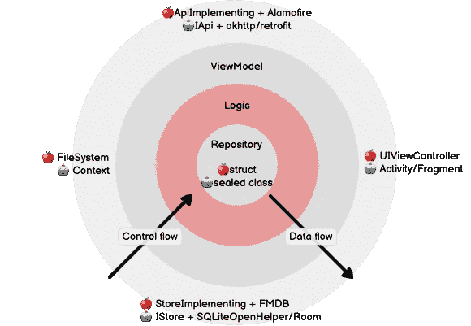

# Swift & Kotlin 中的逻辑类

> 原文：<https://itnext.io/logic-classes-in-swift-kotlin-f7ac1f295839?source=collection_archive---------1----------------------->

探索支持设计良好的视图模型的类的生态系统

森林不仅仅是树，视图模型也不仅仅是视图和模型！(由 [Lukasz Szmigiel](https://unsplash.com/@szmigieldesign?utm_source=unsplash&utm_medium=referral&utm_content=creditCopyText) 在 [Unsplash](https://unsplash.com/s/photos/forest?utm_source=unsplash&utm_medium=referral&utm_content=creditCopyText) 上拍摄)

开发人员经常错误地认为，在 [MVVM 架构](https://medium.com/upday-devs/android-architecture-patterns-part-3-model-view-viewmodel-e7eeee76b73b)中，模型类都存在于[视图模型层](https://medium.com/swlh/viewmodels-in-swift-kotlin-721bbc6f8c07)之下，或者可能是模型+ API 类。

在我们的[干净的 MVVM 架构](https://medium.com/swlh/kotlin-in-xcode-swift-in-android-studio-26a4ace6fc72)中，我们看到事实上有一个更大的类生态系统，它们都支持 ViewModel 完成它的工作。这些启用类中第一个也是最容易被忽略的被称为逻辑类。

> 逻辑类是无状态的包装类，它根据从存储库中检索的数据应用条件逻辑。

逻辑类用红色**表示**🔴清洁建筑中的部分图表。ViewModel 根据这些决定更新其状态或发出事件。逻辑类不知道关于视图或视图模型的任何事情。

例如，逻辑类可以基于简档的完成或简档的订阅状态来决定是否请求匹配堆栈。

# 在以下情况下使用逻辑类:

*   从两个或更多存储库中检索数据，和/或
*   条件逻辑正在被执行，它创建了不同的测试用例，而不是存储库中正在被测试的内容。

# 逻辑类可以:

*   使用多个存储库来访问全局状态或本地状态上的业务逻辑的方法参数
*   将多个逻辑类组合在一起(例如，您可以将逻辑类相互注入)
*   组合来自多个存储库的反应流，以简化父视图模型类的使用

逻辑是包装器；发髻是储存库；肉是数据模型；番茄酱就是 API？

# 逻辑类并不总是需要的

如果您发现一个逻辑类仅仅作为一个存储库类的通道，那么它可能是不必要的，我们可以简单地让视图模型直接与存储库对应。

# 示例:匹配

在这个例子中，我们正在为一个约会应用程序建模一个基于刷卡的匹配功能。您可以看到我们的 MatchLogic 类不仅依赖于 MatchRepository，还依赖于 AccountRepository(关于当前登录配置文件的信息)、LocationRepository(关于用户的纬度和经度的信息)和 FeatureRepository(用于控制实验)。

在这个实现中，我们的 MatchLogic 类在第一次运行时在匹配堆栈的顶部插入指令卡；如果两个配置文件匹配，MatchLogic 也会发出一个相互匹配事件。MatchLogic 通过从 AccountRepository 读取当前登录的配置文件来公开它。

# 为什么你需要反应流

注意方法`restartMatch`——它结合了 AccountRepository 中的两个 observables，并且每当其中一个发生变化时，都会发出一个事件，最终由 ViewModel 使用，以重置回初始状态(并可能获取一个新的匹配堆栈)。

# 接下来

在下一篇文章中，我们将探索一个干净的 MVVM 架构的中心，在那里我们可以找到存储库和领域模型。

# 本系列的更多内容

*   [简介](https://medium.com/p/26a4ace6fc72)
*   [Swift 中的视图模型&科特林](https://medium.com/p/721bbc6f8c07)
*   Swift & Kotlin 的逻辑课← *你在这里*
*   [Swift 中的存储库和域模型& Kotlin](https://medium.com/perry-street-software-engineering/repositories-and-models-in-swift-kotlin-df9ae2c84cb7)
*   [Swift 中的 API 类& Kotlin](https://medium.com/perry-street-software-engineering/api-classes-in-swift-kotlin-a2cb90d3906d)
*   [Swift 中的视图& Kotlin](https://medium.com/p/f5416dec42ea)
*   [在 Swift 中测试 MVVM&科特林](https://medium.com/p/ccb55e462760)
*   [测试 Swift 中的异步性& Kotlin](/testing-asynchronicity-in-swift-kotlin-4926936eae28)
*   [清洁 MVVM 总结](https://medium.com/perry-street-software-engineering/summary-clean-mvvm-in-swift-kotlin-7057230600aa)

# 你可能喜欢的其他系列

[**清理 API 架构(2021)**](/a-visual-history-of-web-api-architecture-c36044df2ac7)构建现代 API 端点时的类、执行模式和抽象。

[**Android 活动生命周期被认为有害**](https://proandroiddev.com/android-activity-lifecycle-considered-harmful-98a5b00d287)**(2021)** Android 进程死亡，不可解释的 NullPointerExceptions，以及你现在就需要的 MVVM 生命周期

# 关于作者

*埃里克·西尔弗伯格(Eric Silverberg)是* [*佩里街软件*](https://www.perrystreet.com/) *的首席执行官和创始人，是 iOS 和 Android 上两个全球最大的 LGBTQ+约会应用的发行商。*