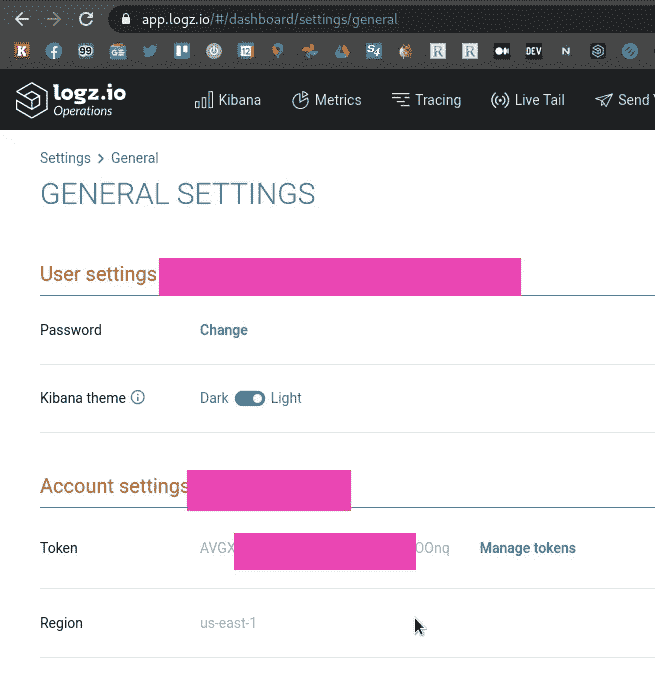
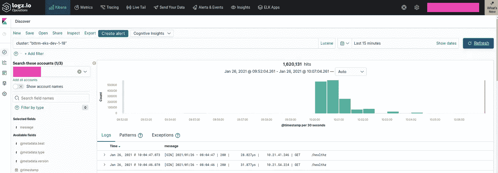
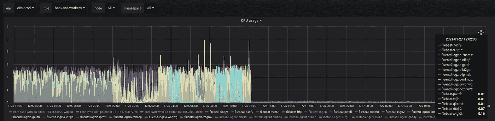

# Logz.io:来自 Kubernetes 的收集日志— fluentd 与 filebeat

> 原文：<https://itnext.io/logz-io-collection-logs-from-kubernetes-fluentd-vs-filebeat-7d3b06708cfe?source=collection_archive---------1----------------------->


我们使用 [Logz.io](https://logz.io/) 来收集我们的 Kubernetes 集群日志(还有一个本地 [Loki](https://rtfm.co.ua/en/grafana-labs-loki-logs-collector-and-monitoring-system/) 实例)。

日志由每个 WorkerNode 上的 [Fluentd](https://www.fluentd.org/) pod 收集和处理，worker node 从默认配置中的 [DaemonSet](https://raw.githubusercontent.com/logzio/logzio-k8s/master/logzio-daemonset-rbac.yaml) 部署，请参见此处的文档— [logzio-k8s](https://github.com/logzio/logzio-k8s) 。

我们面临的问题是这些 pod 消耗了太多的 cpu，高达 3000 毫 cpu，而我们的 WorkerNodes 只有 4 个核心，例如 4000 毫 CPU。

因此，为了解决这个问题，我决定搜索类似的日志收集器，第二件要做的事情是能够通过 Helm chart 用 Ansible 部署它们，但 Fluentd 还没有现成的图表。

找到的解决方案是一个 Filebeat 收集器，参见[通过 Filebeat](https://docs.logz.io/shipping/log-sources/k8s-over-helm.html) 用 Helm 运送 k8s 日志—让我们试试。

首先，我们将手动将其部署到一个开发集群，然后我们将添加一个可评估的任务，将其部署到我们的生产中。

# Logz.io Filebeat 舵图

添加存储库:

```
$ helm repo add logzio-helm [https://logzio.github.io/logzio-helm/filebeat](https://logzio.github.io/logzio-helm/filebeat)
“logzio-helm” has been added to your repositories
```

接下来，我们需要找到我们的令牌和地区—转到帐户的常规设置:



由于我们有默认的地区-us-east-1，请参见[如何查找您的帐户地区](https://docs.logz.io/user-guide/accounts/account-region.html)，然后我们可以从舵图的参数中删除`secrets.logzioRegion`。

此外，默认情况下，Logz.io 客户端将被安装到`kube-system`名称空间，但我想把它放在一个专用的 NS 中，以便更容易地监控它所使用的资源。

名称空间是在[值](https://github.com/logzio/logzio-helm/blob/master/filebeat/values.yaml#L14)文件中配置的，所以让我们用`--set`覆盖它，再加上添加`--create-namespace`和`--debug`选项:

```
$ helm install — namespace=dev-1–18-devops-logzio-ns \
 --create-namespace — debug \
 --set secrets.logzioShippingToken='AVG***Onq' \
 --set secrets.clusterName='bttrm-eks-dev-1–18' \
 --set namespace=dev-1–18-devops-logzio-ns \
logzio-k8s-logs logzio-helm/logzio-k8s-logs
```

检查舱:

```
$ kubectl -n dev-1–18-devops-logzio-ns get pod
NAME READY STATUS RESTARTS AGE
filebeat-2qt5s 1/1 Running 0 96s
filebeat-4xb44 1/1 Running 0 96s
filebeat-9prr9 1/1 Running 0 96s
filebeat-cth47 1/1 Running 0 96s
filebeat-fgmgx 1/1 Running 0 96s
filebeat-gb5ts 1/1 Running 0 96s
filebeat-hs9tr 1/1 Running 0 96s
filebeat-nskvg 1/1 Running 0 96s
filebeat-wfgbg 1/1 Running 0 96s
```

并在 [app.logs.io](https://app.logz.io/) 页面登录基巴纳:



# Ansible

有一个关于用 Ansible 部署舵图的帖子——[ansi ble:модуль社区. kubernetesиустановкаhelm-чартасexternaldns](https://rtfm.co.ua/ansible-modul-community-kubernetes-i-ustanovka-helm-charta-s-externaldns/)(*RUS*)，此时只是一个快速的例子。

添加一个`when`条件，因为我们将只把 Logz.io 部署到生产集群:

```
- name: "Add Logzio chart repo"
  when: "eks_env.startswith('prod')"
  community.kubernetes.helm_repository:
    name: "logzio-helm"
    repo_url: "https://logzio.github.io/logzio-helm/filebeat"

- name: "Deploy Logzio Filebit chart to the {{ eks_env }}-devops-logzio-ns namespace"
  when: "eks_env.startswith('prod')"
  community.kubernetes.helm:
    kubeconfig: "{{ kube_config_path }}"
    name: "logzio-k8s-logs"
    chart_ref: "logzio-helm/logzio-k8s-logs"
    release_namespace: "{{ eks_env }}-devops-logzio-ns"
    create_namespace: true
    values:
      secrets:
        logzioShippingToken: "{{ logzio_token }}"
        clusterName: "{{ eks_cluster_name }}"
      namespace: "{{ eks_env }}-devops-logzio-ns"
```

在 Ansible 变量中指定`logzio_token`，并用`[ansible-vault](https://rtfm.co.ua/ansible-ispolzovanie-vault-zashifrovannogo-xranilishha/)`对其加密，因为我们在 Github 存储库中存储了我们的 Ansible 角色。

# Fluentd 与 Filebeat — CPU 和性能

最后是 CPU 使用率:左边是旧的`fluentd` (Ruby + C)右边是新的`filebeat` (Golang):



*最初发布于* [*RTFM: Linux、DevOps 和系统管理*](https://rtfm.co.ua/en/logz-io-collection-logs-from-kubernetes-fluentd-vs-filebeat/) *。*