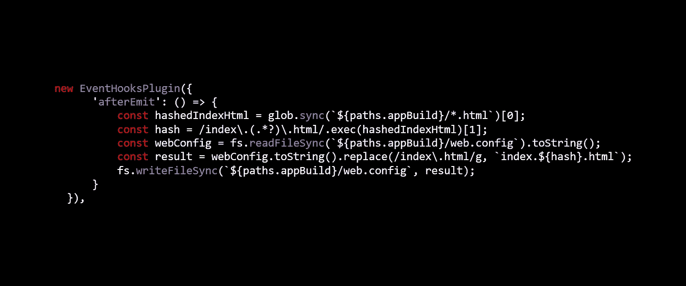

# 使用 Azure 静态站点和 Webpack 长期缓存动态 index.html

> 原文：<https://itnext.io/long-term-caching-a-dynamic-index-html-with-azure-static-sites-and-webpack-b39f0b68ec3?source=collection_archive---------7----------------------->



使用 Webpack 开发和构建 web 应用程序是一个相对简单的过程。有许多伟大的工具，如 [create-react-app](https://github.com/facebook/create-react-app) 和许多伟大的长期缓存资源，如[https://developers . Google . com/web/fundamentals/performance/web pack/use-long-term-caching](https://developers.google.com/web/fundamentals/performance/webpack/use-long-term-caching)。不太清楚的是，如何长期缓存 index.html，同时仍然让新的构建无缝地呈现给用户。当不在静态上下文中时，这很容易处理，比如。Net 或 Node.js，在那里您可以很容易地拦截对 index.html 的调用，并在某些内容发生变化时使缓存失效；然而，当作为静态站点托管 webapp 时，这就不那么容易处理了。创建作为静态站点托管的单页面应用程序时，大多数 web 服务器会积极缓存 index.html。这是不可取的，因为在 index.html 内，任何时候捆绑的资产发生变化，用户都需要硬刷新浏览器才能将它们拉入。我们真正想要的是新的 index.html 出现在任何正常的页面负载上。用户应该永远不需要用 ctrl+r 硬刷新浏览器标签。这是一种糟糕的用户体验，会导致用户在看到旧内容时产生混淆。

解决方案是对 index.html 进行哈希处理，并将该哈希包含在文件名本身中，这样就可以将其构建为索引。[哈希]。html，然后将 web 服务器指向这个特定的散列命名索引文件。

散列 index.html 需要 HtmlWebpackPlugin 中的一个附加选项:

```
new HtmlWebpackPlugin({
 **filename: ‘index.[hash].html’,**
 template: paths.appHtml,
})
```

您的 HtmlWebpackPlugin 可能包含比这更多的选项，但是请注意粗体文本中的[hash]——这是控制输出的内容。生成的构建文件可能类似于:【index.340e916f34c4b56b9d73.html

**有了索引。[哈希]。html 意味着任何时候包发生变化，默认情况下都包含在 index.html 中，然后是索引的散列部分。[哈希]。html 会变。这意味着在生产推送之间，对该索引的所有调用都将使用 304 进行缓存。现在的挑战是将 IIS 指向动态生成的 defaultDocument 文件。由于 [IIS DefaultDocument](https://docs.microsoft.com/en-us/iis/configuration/system.webserver/defaultdocument/) 不允许通配符，我们必须使用另一种方法。**

**当创建一个新的 Azure 静态站点时，你需要选择为你生成一个 **web.config** 文件，或者你可以单独创建一个。这里有两个主要观点。首先是 IIS 需要一个默认文档；其次，Webpack 需要用生成的索引更新本地 web.config。[哈希]。html 名称。**

**在 web.config 中定义一个具有标准 index.html 的 defaultDocument。**

**现在告诉 Webpack 用散列将 index.html 重写为生成的 index.html。这有点棘手，因为 index.html 是由 webpack 在执行插件的末尾编写的，很难确定插件执行的顺序。谢天谢地，“有一个插件可以解决这个问题。”遇见[事件](https://github.com/cascornelissen/event-hooks-webpack-plugin)。这个插件允许你挂钩到 Webpack 中发生的各种事件。这样，我们可以轻松地挂钩到 afterEmit 事件的**，并将 index.html 重写为生成的索引。afterEmit 事件在所有资产都被发送到构建目录后执行。这看起来像下面这样:****

**分解这里的逻辑，在索引之后。[哈希]。html 已经发出，EventHooksPlugin 开始工作，自定义代码读取 html 文件，提取散列，并用索引重写 web.config 中的 index.html 文本。[哈希]。html 文本。在 Azure 中，有一个静态站点的默认文档列表。假设您不能添加通配符，并且您不希望必须手动添加生成的索引。[哈希]。每次你进行产品推送时，这个插件都会修改 web.config，所以它会自动添加到每个新版本中。**

**假设在构建目录中没有严格的 index.html 文件，那么唯一剩下的 defaultDocument 将是 web.config 现在指向的动态文件。现在，当您加载 webapp 时，连续的重新加载将被缓存，直到您推送新版本。新的构建将产生新的哈希索引，在下一次页面加载时使缓存失效，从而导致 200 响应。现在，后续请求将被缓存，直到下一次索引哈希发生变化。这对于用户应该是透明的，不需要额外的用户干预或硬刷新。**

**同样值得注意的是 web.config 中的重写，这将所有请求强制到根上下文。对于作为静态站点托管的单页面应用程序，这很可能是您想要做的，以允许您的路由库拦截这些调用，并允许 defaultDocument 对/的默认上下文生效。**

**编辑于 2018 年 7 月 5 日:**

**如果您通过 VSTS 部署到 Azure，您可能会注意到浏览器可能仍然在缓存旧的工件。这是因为，默认情况下，构建工件被附加到 Kudu site/wwwroot，而不是被替换。请参见以下论坛链接，了解 VSTS 选项，以确保只有最新的构建工件位于 Kudu 的 wwwroot 中:[https://social . msdn . Microsoft . com/Forums/azure/en-US/0c5e 85 b 6-806 f-43 a9-af6b-3a 2 a6f 6634 e 6/how-to-delete-all-the-files-on-the-site？forum = windowsazurewebsitespreview](https://social.msdn.microsoft.com/Forums/azure/en-US/0c5e85b6-806f-43a9-af6b-3a2a6f6634e6/how-to-delete-all-the-files-on-the-site?forum=windowsazurewebsitespreview)**