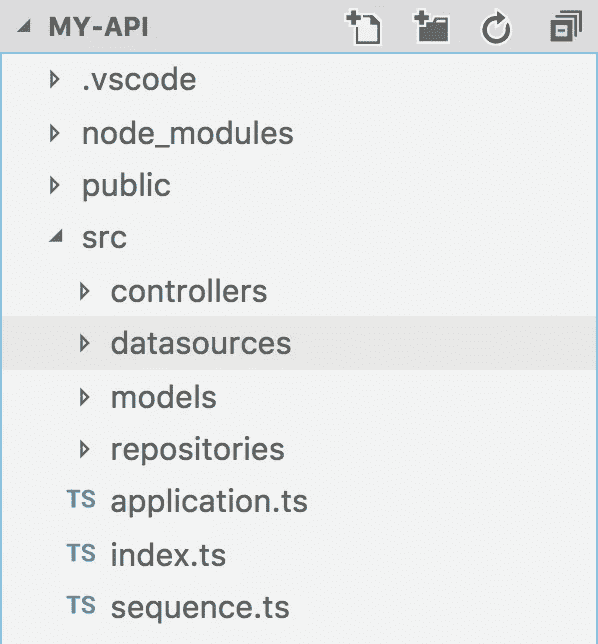

# LoopBack 4 数据库配置

> 原文：<https://itnext.io/loopback-4-database-configuration-8f085399268?source=collection_archive---------1----------------------->

经过 StrongLoop 和开源社区团队数月的辛勤工作，LoopBack 4[最近宣布生产就绪](https://strongloop.com/strongblog/loopback-4-ga)。对于那些不熟悉框架的人，可以查看[官方文档](https://loopback.io/doc/en/lb4/Getting-started.html)或者我的【LoopBack 4 入门教程。


回送 4

除了拥有一个稳定的、生产就绪的框架之外，还需要做一些工作来使我们的应用程序生产就绪，比如设置我们的数据库环境配置。

LoopBack 3 是数据库或数据源配置的标准规范。本文将概述跨多个开发环境(开发、测试和生产)针对数据库配置 LoopBack 4 应用程序的一些方法。

# 介绍

几乎每个 web 应用程序都需要以某种形式保存数据。LoopBack 一直通过提供多个连接器供我们使用，将数据库引擎从应用中抽象出来，比如:MySQL、Postgres 和 In-memory。LoopBack 4 使用 LoopBack 3 用来向引擎传递配置的相同底层库。然而，项目结构略有不同，如下所述

# 环回 3 配置

在 LoopBack 3 中，您将在存储在*服务器*文件夹中的 *datasources.json* 文件中定义一组 JSON 对象，这允许应用程序获取配置。该文件类似于以下内容:

```
{
  "db": {
    "name": "db",
    "connector": "memory"
  }
}
```

该文件定义了一个名为“ *db* 的新数据源，它被配置为使用内存数据库连接器。在大多数应用程序中，这非常适合用作模型的默认数据源，因为它消除了首次使用原型时设置数据库服务器的需要。您可以只配置模型来利用“db”数据源，然后继续编写代码。

同一个文件夹中的 *model-config.json* 文件将一个模型连接到一个数据源，如下所示:

```
{
  "_meta": {
    "sources": [
      "loopback/common/models",
      "loopback/server/models",
      "../common/models",
      "./models"
    ],
    "mixins": [
      "loopback/common/mixins",
      "loopback/server/mixins",
      "../common/mixins",
      "./mixins"
    ]
  },
  "Person": {
    "dataSource": "db",
    "public": false
  }, ...}
```

一旦您有了应用程序的基础并根据内存中的数据库配置运行，您就可以专注于设置数据库服务器，如 MySQL 或 Postgres，安装正确的连接器，并只需更改 *datasources.json* 配置，如下所示:

```
{
  "db": {
    "name": "db",
    "connector": "mysql",
    "hostname": "localhost",
    "port": 3306,
    "user": "root",
    "password": "root",
    "database": "app_database"
  }
}
```

这对当地的发展非常有利。但是，当在一个更大的团队或多个环境中工作时，一个 JSON 配置文件是不够的。LoopBack 3 通过允许我们创建特定于环境的数据源文件，解决了特定于环境的配置问题。特定于环境的数据源文件名需要采用某种结构: *datasources。****<>****。js* 。一个包含 3 个环境的项目将包含以下文件:

*   datasources.json(本地数据库服务器配置)
*   datasources.test.js(测试数据库服务器配置)
*   datasources.production.js(生产数据库服务器配置)

配置文件的 JavaScript 版本给了我们额外的灵活性，因为我们可以通过代码来确定配置。最常见的配置文件会利用系统环境变量。生产数据源配置文件的示例如下:

```
module.exports = {
  db: {
    name: 'db',    
    connector: 'mysql',
    hostname: process.env.DB_HOST,
    port: process.env.DB_PORT,
    user: process.env.DB_USER,
    password: process.env.DB_PASSWORD,
    database: process.env.DB_DATABASE
  }
};
```

这太棒了，因为它消除了在我们的代码中存储生产凭证的需要。我们可以安全地提交这些配置文件并在服务器上设置配置。

默认情况下，框架将利用 NODE_ENV 系统环境变量来选择要使用的数据源文件。生产服务器将具有以下环境变量:

*   节点环境=生产
*   DB _ HOST = AWS-rds-MySQL-HOST . example . com
*   DB_PORT=3306
*   DB _ USER =超级秘密用户
*   DB _ PASSWORD =超级秘密密码
*   数据库=应用数据库

# 环回 4 配置

LoopBack 4 不再自动读取数据源配置文件。相反，框架让我们决定如何配置我们的应用程序。目前，看起来没有任何文档化的最佳实践方法来设置它。建议的方法概述如下。

## 依赖注入

在深入数据库配置之前，我们需要了解 LoopBack 4 的一个关键概念: [***依赖注入***](https://loopback.io/doc/en/lb4/Dependency-injection.html) 。

实际上，应用程序可以根据唯一键的映射来注册值。这些值可以包含普通变量或类定义，然后应用程序可以使用它们来为我们处理这些对象的创建，方法是递归遍历所需的依赖项。

例如，我们可以针对键“foo”注册一个值“bar”。

```
this.bind('foo').to('bar');
```

现在应用程序知道键“foo”包含值“bar”。我们可以在代码的任何地方从应用程序请求这个值。举个例子:

```
@inject('foo') private foo: string;
```

除了将一个值绑定到一个键，我们还可以将一个类绑定到一个键，让应用程序在根据请求实例化对象时递归地找出它的依赖关系。

```
export class Foo {
  constructor(@inject('bar') private bar: string) {} someMethod() {
    return this.bar;
  }
}...this.bind('bar').to('Bar');
this.bind('foo').toClass(Foo);
```

当我们请求 Foo 类的实例时，如下所示:

```
@inject('foo') private foo: Foo
```

应用程序容器将会看到 *Foo* 类依赖于*栏*的值。它将在依赖容器中查找它，找到它(如果它被绑定)，然后*将它注入到类中。于是， ***依赖注入*** 。*

## 创建新项目

我们可以使用 CLI 通过调用以下命令来创建新项目:

```
lb4 app
? **Project name:** my-api
? **Project description:** My API
? **Project root directory:** my-api
? **Application class name:** MyApiApplication
? **Select features to enable in the project** Enable tslint, Enable prettier, Enable mocha, Enable loopbackBuild, Enable vscode, Enable repositories, Enable servicescd ./my-api
```

LoopBack 4 向项目添加一个*数据源*文件夹。



新 LoopBack 4 项目中的 datasources 文件夹

最初，假设这个文件夹被设置为以与 LoopBack 3 数据源 JSON 文件相同的方式读取。但是，它实际上只是用于 CLI 放置新文件的默认文件夹。

## 使用 CLI 添加数据源

通过运行以下命令，使用 CLI 创建新的数据源:

```
lb4 datasource
? **Datasource name:** db
? **Select the connector for db:** In-memory db (supported by StrongLoop)
? **window.localStorage key to use for persistence (browser only)**:
? **Full path to file for persistence (server only)**:create src/datasources/db.datasource.json
create src/datasources/db.datasource.ts
update src/datasources/index.tsDatasource db was created in src/datasources/
```

您首先会注意到的是， *db.datasource.json* 文件与 LoopBack 3*data sources . JSON*文件完全相同。在 CLI 向导中，我选择了内存连接器，这是 LoopBack 3 和 LoopBack 4 中提供的众多连接器之一。

回送数据源系列文件的新成员是*数据源。* ***ts*** 文件。

```
import {inject} from '@loopback/core';
import {juggler} from '@loopback/repository';
import * as config from './db.datasource.json';export class DbDataSource extends juggler.DataSource {
  static dataSourceName = 'db'; constructor(
    @**inject**('**datasources.config.db**', {optional: true})
    dsConfig: object = config,
  ) {
    super(dsConfig);
  }
}
```

该类扩展了一个*杂耍器。DataSource* type，与 LoopBack 3 中使用的类型相同(除了是它的 TypeScript 定义版本)。它需要 LoopBack 3 使用的相同的 JSON 配置结构。在这个版本中，我们需要将配置传递给构造函数的 super 方法。

```
import * as config from './db.datasource.json';...constructor(
  @**inject**('**datasources.config.db**', {optional: true}) 
  dsConfig: object = config
)...
```

该文件从 *db.datasource.json* 文件中导入默认配置，并将其作为默认值包含到 *dsConfig* 构造函数参数中。这意味着，在实例化对象的实例时，我们永远不需要向 DbDataSource 类的构造函数传递任何东西，除非我们要覆盖它……也许是为了不同的环境(稍后将详细介绍)。

另一个不熟悉的*注入*装饰器允许框架从依赖注入容器*注入*参数的值(如果绑定的话)。

考虑到这一点，有许多不同的方法来实例化这个新的 DataSource 类:

```
// 1\. With the default configuration from db.datasource.json
let dbDataSource = new DbDataSource();// 2\. Overwriting the default configuration
let dbDataSource = new DbDataSource({
  name: 'db',    
  connector: 'mysql',
  hostname: process.env.DB_HOST,
  port: process.env.DB_PORT,
  user: process.env.DB_USER,
  password: process.env.DB_PASSWORD,
  database: process.env.DB_DATABASE
});
```

我们现在有了一个 dbDataSource 的实例。但是，我们实际上如何使用它呢？我们的新应用程序如何知道我们的数据源？

与我们可以针对应用程序依赖容器注册(或绑定)值(或类)的方式相同，我们可以将数据源的实例绑定到容器的键。

在我们的 *application.ts* 文件中，我们可以利用构造函数中的应用程序绑定函数将我们的实例链接到应用程序:

```
this.**bind**('**datasources.db**').to(new DbDataSource());
```

另外，LoopBack 4 有一个特殊的函数叫做 *datasource:*

```
this.**dataSource**(new **DbDataSource**());
```

*datasource* 函数，基本上包装了一个*this . bind(‘data sources。<数据源名称>’)。*

还有最后一种将数据源绑定到应用程序的方法:

```
this.bind('datasources.config.db').to({
  name: 'db',
  connector: 'mysql',
  hostname: process.env.DB_HOST,
  port: process.env.DB_PORT,
  user: process.env.DB_USER,
  password: process.env.DB_PASSWORD,
  database: process.env.DB_DATABASE,
});
this.bind('datasources.db').toClass(DbDataSource);
```

上面的代码片段首先将配置绑定到*‘data sources . config . db’*依赖键。这个依赖键通过*注入*装饰器在 DbDataSource 类的构造函数中被引用。通过将 *'datasources.db'* 键绑定到 ***类定义***"*db data source "*，依赖容器将查找它的所有依赖项，并为我们实例化它。

既然应用程序的依赖容器知道了我们的数据源，我们可以将它绑定到存储库和模型。

*注意:在生成存储库之前，您需要先生成一个模型。*为此，使用 *lb4 型号*命令:

```
lb4 model
? **Model class name:** Person
? **Please select the model base class** EntityLet's add a property to Person
Enter an empty property name when done? **Enter the property name:** id
? **Property type:** number
? **Is id the ID property?** Yes
? **Is it required?:** Yes
? **Default value [leave blank for none]:**Let's add another property to Person
Enter an empty property name when done? **Enter the property name:**create src/models/person.model.ts
update src/models/index.tsModel Person was created in src/models/
```

创建模型之后，让我们将它链接到一个新的存储库。使用 *lb4 存储库*命令:

```
lb4 repository
? **Please select the datasource** DbDatasource
? **Select the model(s) you want to generate a repository** Person
? **Please enter the name of the ID property for Person:** idcreate src/repositories/person.repository.ts
update src/repositories/index.tsRepository Person was created in src/repositories/
```

一旦您使用了 *lb4 model* 和 *lb4 repository* 命令，您应该会得到一个绑定到注入 DbDataSource 类的模型的存储库:

```
export class PersonRepository extends **DefaultCrudRepository**<
  Person,
  typeof Person.prototype.id
> {

  constructor(
    @**inject**('**datasources.db**') dataSource: DbDataSource,
  ) {
    super(**Person**, dataSource);
  }
}
```

注意，PersonRepository 构造函数再次使用了 *inject* decorator，但是这次它引用了我们之前设置的*‘data sources . db’*键。该存储库负责将模型连接到数据源，并提供 CRUD(创建、读取、更新和删除)功能，这要归功于我们从其继承的提供的*defaultcruddrepository*类。

就像我们将数据源绑定到应用程序一样，我们需要将存储库绑定到应用程序:

```
this.repository(PersonRepository);
```

this.repository 是 this.bind 的包装器(' repositories。< ***【储存库名称】****>’)。*

注册后，我们可以使用 *lb4 控制器*命令为我们搭建一个新的 REST 控制器，它利用了我们新设置的模型、数据源和存储库:

```
lb4 controller
? **Controller class name:** People
? **What kind of controller would you like to generate?** REST Controller with CRUD functions
? **What is the name of the model to use with this CRUD repository?** Person
? **What is the name of your CRUD repository?** PersonRepository
? **What is the type of your ID?** number
? **What is the base HTTP path name of the CRUD operations?** /peoplecreate src/controllers/people.controller.ts
update src/controllers/index.tsController People was created in src/controllers/
```

您可以使用与我们拥有数据源和存储库相同的方式向应用程序注册控制器。除了利用*库*和*控制器*函数将我们的类绑定到我们的应用程序，LoopBack 自动为我们绑定它们。这可以在应用程序类构造函数中配置:

```
this.bootOptions = {
  controllers: {
    // Customize ControllerBooter Conventions here
    dirs: ['controllers'],
    extensions: ['.controller.js'],
    nested: true,
  },
};
```

这告诉我们的应用程序在 controllers 文件夹中查找我们所有的控制器，并自动为我们调用 *this.controller* 。您也可以配置 bootOptions *repository* 值来对存储库执行相同的操作。

为了节省空间，我们不会在这里分析整个控制器文件。将概述重要的部分:

```
constructor(
  **@repository**(PersonRepository)
  public personRepository : PersonRepository,
) {}
```

*储存库*装饰器包装了*注入*装饰器。这与执行以下操作是一样的:

```
constructor(
  **@inject**('repositories.PersonRepository')
  public personRepository : PersonRepository,
) {}
```

现在，我们可以利用存储库来访问我们配置的数据源中的模型数据。

```
@post('/people', {
  responses: {
    '200': {
      description: 'Person model instance',
      content: {'application/json': {'x-ts-type': Person}},
    },
  },
})
async create(@requestBody() person: Person): Promise<Person> {
  **return await this.personRepository.create(person);**
}
```

# 结论

本文比较了针对 LoopBack 3 和 LoopBack 4 应用程序配置数据库数据源之间的差异。除了了解如何配置数据源，我们还了解了如何通过允许系统环境变量设置配置数据来设置各种环境的配置，我们通过 node . js*process . env . env _ VARIABLE*API 访问这些变量。