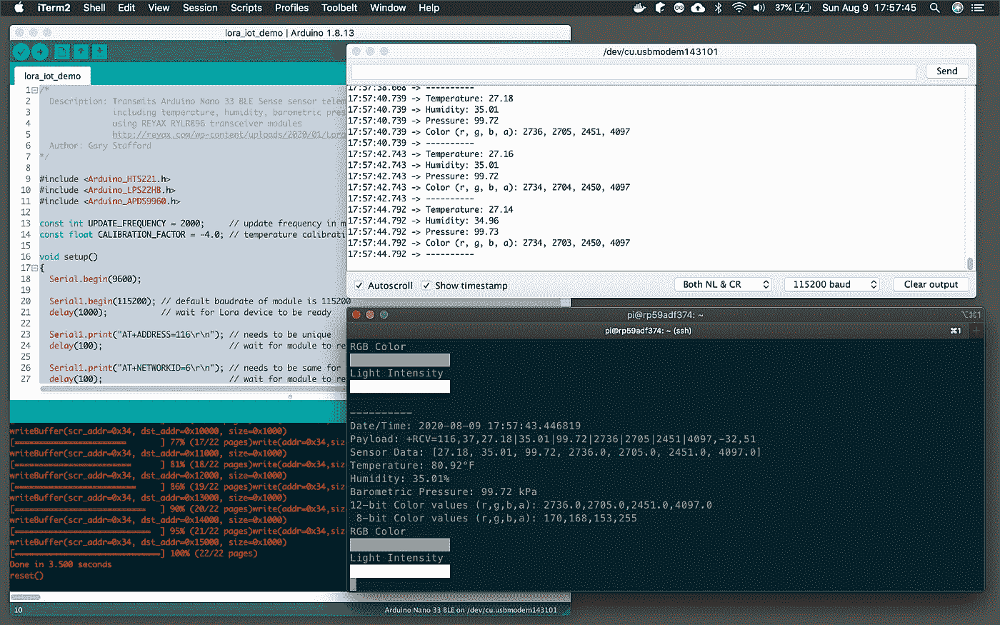
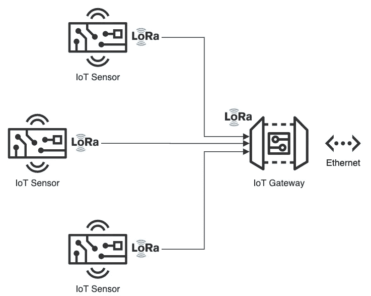
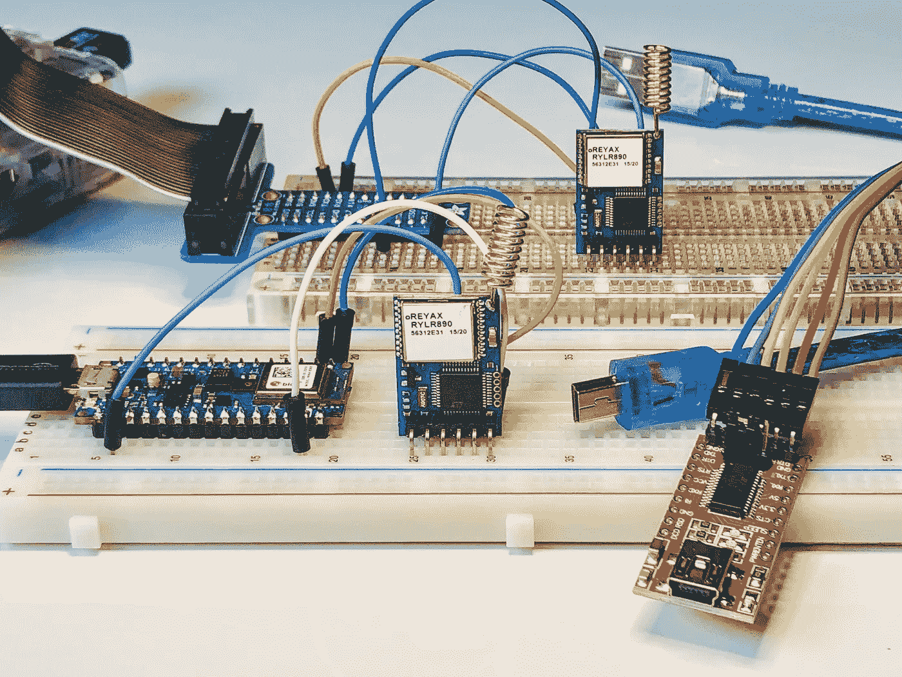
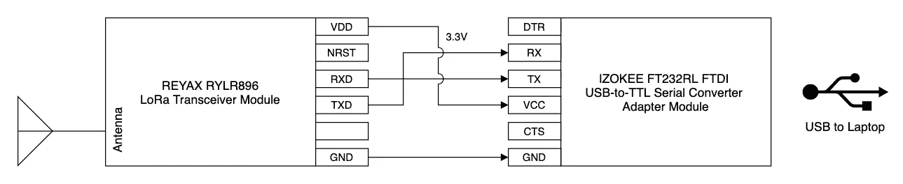
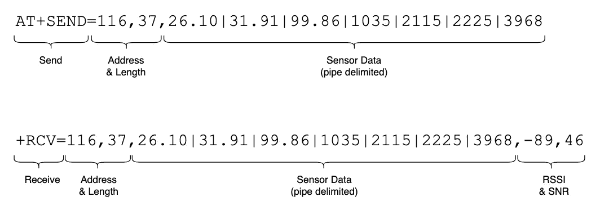
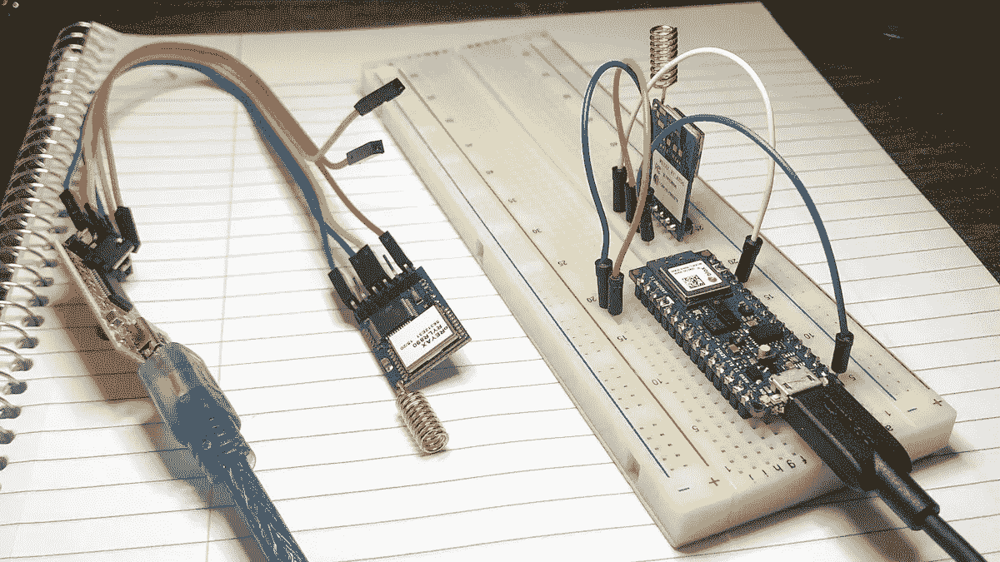
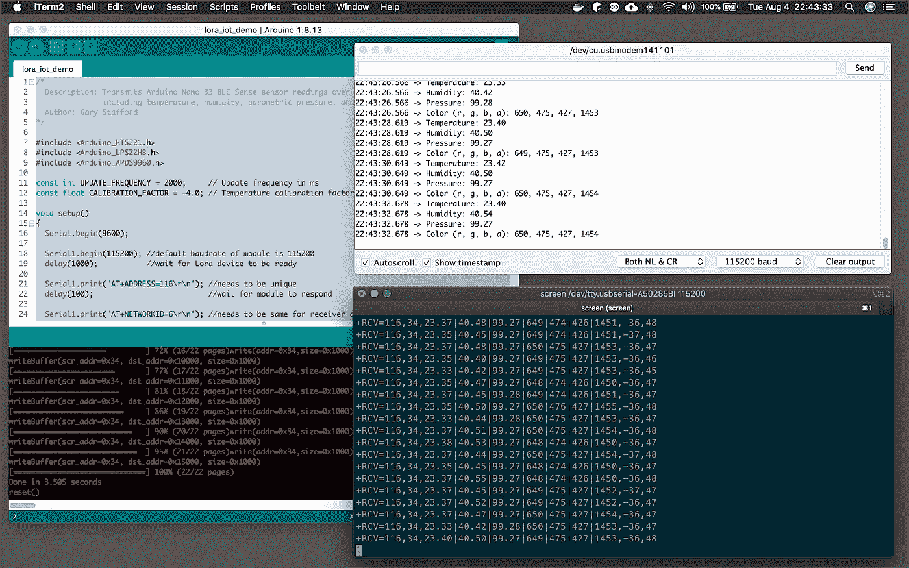
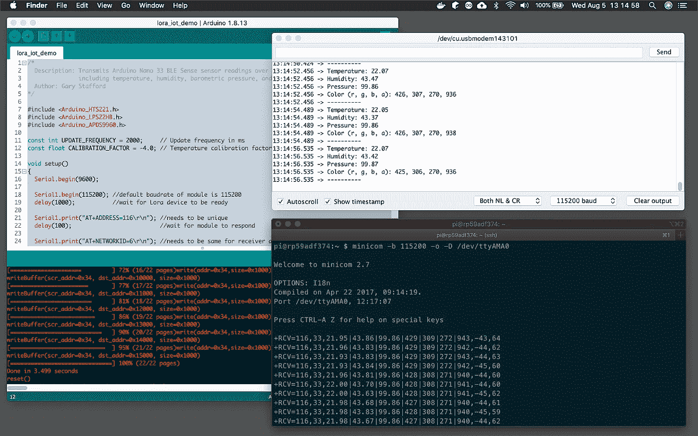

# 面向物联网的 LoRa 和 LoRaWAN

> 原文：<https://itnext.io/lora-for-iot-1f91085c5917?source=collection_archive---------0----------------------->

## 面向物联网低功耗广域网的 LoRa 和 LoRaWAN 协议入门

帖子的音频版本

# 介绍

根据 [LoRa 联盟](https://lora-alliance.org/resource-hub/what-lorawanr)的说法，低功耗广域网(LPWAN)预计将支持预计用于物联网(IoT)的数十亿设备中的大部分。LoRaWAN 的设计自下而上地优化了 LPWANs 的电池寿命、容量、范围和成本。LoRa 和 LoRaWAN 允许不同类型行业的物联网(IoT)设备进行远程连接。根据[维基百科](https://en.wikipedia.org/wiki/LoRa)，LoRaWAN 定义了网络的通信协议和系统架构，而 LoRa 物理层则实现了远程通信链路。

## 劳拉

远程( [LoRa](https://en.wikipedia.org/wiki/LoRa) )，由 Semtech 开发的低功率广域网(LPWAN)协议，位于计算机网络七层 [OSI 模型](https://en.wikipedia.org/wiki/OSI_model)(开放系统互连模型)的第一层[物理层](https://en.wikipedia.org/wiki/Physical_layer)。物理层定义了通过连接网络节点的物理数据链路传输原始位的方式。LoRa 使用免许可证的亚千兆赫射频(RF)频段，包括 433 MHz、868 MHz(欧洲)、915 MHz(澳大利亚和北美)和 923 MHz(亚洲)。LoRa 能够以低功耗实现长距离传输。

## 洛拉万

LoRaWAN 是基于云的媒体访问控制(MAC)子层(第 2 层)协议，但主要作为[网络层](https://en.wikipedia.org/wiki/Network_layer)(第 3 层)协议，用于管理 LPWAN 网关和终端节点设备之间的通信，作为路由协议，由 [LoRa 联盟](https://lora-alliance.org/resource-hub/what-lorawanr)维护。MAC 子层和逻辑链路控制(LLC)子层一起构成了 OSI 模型的第 2 层，即[数据链路层](https://en.wikipedia.org/wiki/Data_link_layer)。

LoRaWAN 经常被引用为在农村地区具有超过 10 公里宽的覆盖区域。然而，根据其他消息来源，一般来说更为有限。根据《电子设计》杂志的文章*关于 LoRaWAN 的 11 个误区，一个典型的 LoRaWAN 网络范围取决于许多因素——室内或室外网关、信息的有效载荷、使用的天线等。平均而言，在拥有室外网关的城市环境中，您可以期望覆盖范围达到 2 到 3 公里，而在农村地区，覆盖范围可以超过 5 到 7 公里。劳拉的范围取决于“无线电视线”400 MHz 至 900 MHz 范围内的无线电波可能会穿过一些障碍物，这取决于它们的成分，但会被吸收或反射。这意味着，只要没有物理障碍阻挡，信号就有可能最远到达地平线。*

在接下来的实践文章中，我们将探讨如何使用 LoRa 和 LoRaWAN 协议在包含多个嵌入式传感器的物联网设备和物联网网关之间远距离传输和接收传感器数据。



物联网网关(LoRa *接收器*)从物联网设备(LoRa 发射器)接收传感器数据

# 推荐的硬件

对于这篇文章，我使用了以下硬件。

## 具有嵌入式传感器的物联网设备

我使用了一个 Arduino 单板微控制器作为物联网传感器，实际上是一个传感器阵列。2019 年 8 月发布的 3.3V 人工智能 Arduino Nano 33 BLE 感应板([亚马逊](https://www.amazon.com/Arduino-Nano-Sense-headers-Mounted/dp/B07WXKDVTL/):36.00 美元)，配备了 Nordic Semiconductors 的强大 [nRF52840](https://www.nordicsemi.com/Products/Low-power-short-range-wireless/nRF52840) 处理器，一个运行频率为 64 MHz 的 32 位 ARM Cortex-M4 CPU，1MB 的 CPU 闪存，256KB 的 SRAM，以及一个 [NINA-B306](https://www.u-blox.com/en/product/nina-b3-series-open-cpu) 独立蓝牙 5 低能耗(低能耗


Sense 还包含一系列令人印象深刻的嵌入式传感器:

*   9 轴惯性传感器( [LSM9DS1](https://content.arduino.cc/assets/Nano_BLE_Sense_lsm9ds1.pdf) ): 3D 数字线加速度传感器、3D 数字
    角速度传感器、3D 数字磁传感器
*   湿度和温度传感器( [HTS221](https://content.arduino.cc/assets/Nano_BLE_Sense_HTS221.pdf) ):电容式数字相对湿度和温度传感器
*   气压传感器( [LPS22HB](https://content.arduino.cc/assets/Nano_BLE_Sense_lps22hb.pdf) ): MEMS 纳米压力传感器:260–1260 百帕(hPa)绝对数字输出气压计
*   麦克风( [MP34DT05](https://content.arduino.cc/assets/Nano_BLE_Sense_mp34dt05-a.pdf) ): MEMS 音频传感器全向数字麦克风
*   手势、接近度、光色和光强传感器( [APDS9960](https://content.arduino.cc/assets/Nano_BLE_Sense_av02-4191en_ds_apds-9960.pdf) ):高级手势检测、接近度检测、数字环境光感测(ALS)和颜色感测(RGBC)。

Arduino Sense 是一款出色的[低成本](https://www.amazon.com/Arduino-Nano-Sense-headers-Mounted/dp/B07WXKDVTL)单板微控制器，用于学习物联网传感器数据的收集和传输。

## 物联网网关

根据 [TechTarget](https://whatis.techtarget.com/definition/IoT-gateway) 的说法，物联网网关是一种物理设备或软件程序，充当云与控制器、传感器和智能设备之间的连接点。所有移动到云的数据都要经过网关，反之亦然，网关可以是专用的硬件设备或软件程序。



我用了一台第三代 [Raspberry Pi 3 Model B+](https://www.raspberrypi.org/products/raspberry-pi-3-model-b-plus/) 单板机(SBC)，作为物联网网关。这款 Raspberry Pi 型号具有 1.4GHz Cortex-A53 (ARMv8) 64 位四核处理器片上系统(SoC)、1GB LPDDR2 SDRAM、双频无线局域网、蓝牙 4.2 BLE 和千兆以太网([亚马逊](https://www.amazon.com/dp/B085DPFR3N):42.99 美元)。

*按照本文，您可以用 Raspberry Pi 代替任何基于 Linux 的机器来运行包含的示例 Python 脚本。*


## LoRa 收发器模块

为了在包含嵌入式传感器的物联网设备和物联网网关之间传输物联网传感器数据，我使用了 REYAX [RYLR896](http://reyax.com/products/rylr896/) LoRa 收发器模块([亚马逊](https://www.amazon.com/gp/product/B07NB3BK5H/):19.50 美元 x 2)。收发器模块通常被称为[通用异步收发器](https://en.wikipedia.org/wiki/Universal_asynchronous_receiver-transmitter) (UART)。UART 是用于异步串行通信的计算机硬件设备，其中数据格式和传输速度是可配置的。



RYLR896 模块连接到 Arduino Sense(前台)和 Raspberry Pi(后台)

根据制造商 REYAX 的说法， [RYLR896](http://reyax.com/products/rylr896/) 包含 [Semtech SX1276](https://www.semtech.com/products/wireless-rf/lora-transceivers/sx1276) 远程低功耗收发器。RYLR896 模块提供超长距离扩频通信和高抗干扰性，同时最大限度地降低功耗。该收发器工作在 868 和 915 MHz 频率范围。在本帖中，我们将以 915 兆赫向北美发送。每个 RYLR896 模块包含一个小型 PCB 集成螺旋天线。

## 安全性

RYLR896 支持 AES 128 位数据加密。使用[高级加密标准](https://en.wikipedia.org/wiki/Advanced_Encryption_Standard) (AES)，我们将使用 32 位十六进制数字密码(128 位/ 4 位/十六进制数字= 32 位十六进制数字)对从物联网设备发送到物联网网关的数据进行加密。使用十六进制表示法，密码限于数字 0-9 和字符 A-f。

## USB 到 TTL 串行转换器适配器

或者，要直接从笔记本电脑上配置、测试和调试 RYLR896 LoRa 收发器模块，可以使用 USB 转 TTL 串行转换器适配器。我目前使用的是 IZOKEE [FT232RL](https://www.ftdichip.com/Products/ICs/FT232R.htm) FTDI USB 转 TTL 串行转换器适配器模块，用于 3.3V 和 5V ( [亚马逊](https://www.amazon.com/gp/product/B085XRMLT3/):2 个 9.49 美元)。3.3V RYLR896 模块使用 TXD/TX、RXD/RX、VDD/VCC 和 GND 引脚轻松连接到 USB 至 TTL 串行转换器适配器。我们使用[串行通信](https://en.wikipedia.org/wiki/Serial_communication)通过 TX(发送)和 RX(接收)引脚发送和接收数据。接线如下所示:VDD 到 VCC，GND 到 GND，TXD 到 RX，RXD 到 TX。



FT232RL 支持高达 115，200 bps 的波特率，这是我们将用来与 RYLR896 模块通信的速度。

# Arduino 草图

对于那些不熟悉 Arduino 的人来说，一个[草图](https://www.arduino.cc/en/tutorial/sketch)是 Arduino 为一个程序使用的名字。它是上传到非易失性闪存并在 Arduino 板上运行的代码单元。Arduino 语言是一组 C 和 C++函数。所有由 [avr-g++](https://linux.die.net/man/1/avr-g++) 编译器支持的标准 C 和 C++结构都应该可以在 Arduino 中工作。

对于本文，草图 [lora_iot_demo.ino](https://github.com/garystafford/iot-lora-demo/blob/master/lora_iot_demo/lora_iot_demo.ino) 包含了使用 LoRaWAN 协议收集和安全传输环境传感器数据所需的所有代码，包括温度、相对湿度、气压、RGB 颜色和环境光强度。这篇文章的所有代码，包括草图，可以在 [GitHub](https://github.com/garystafford/iot-lora-demo) 上找到。

# AT 命令

与 RYLR896 远程调制解调器的通信是通过 AT 命令完成的。AT 命令是用于控制调制解调器的指令。AT 是 ATtention 的缩写。每个命令行都以“AT”开头。这就是为什么 modem 命令被称为 at 命令，据[开发者之家](https://www.developershome.com/sms/atCommandsIntro.asp)介绍。AT 命令的完整列表可以从 RYLR896 产品页面以 [PDF](http://reyax.com/wp-content/uploads/2020/01/Lora-AT-Command-RYLR40x_RYLR89x_EN.pdf) 格式下载。

为了有效地将环境传感器数据从物联网传感器传输到物联网网关，草图将传感器值串联成一个字符串。该字符串将包含在 AT 命令中，以向 RYLR896 LoRa 收发器模块发送数据。为了更容易解析物联网网关上的传感器数据，我们将使用竖线(|)来分隔传感器值，而不是逗号。有效载荷(*传感器数据*)的最大长度为 240 字节。

下面，我们将看到一个 AT 命令的示例，该命令用于发送来自物联网传感器的传感器数据以及物联网网关收到的相应未加密数据。两个字符串都包含 LoRa 发射器地址 ID、有效载荷长度和有效载荷。物联网网关接收的数据还包含[接收信号强度指标](https://en.wikipedia.org/wiki/Received_signal_strength_indication) (RSSI)，以及[信噪比](https://en.wikipedia.org/wiki/Signal-to-noise_ratio) (SNR)。



# 配置、测试和调试

如前所述，要在不使用物联网网关的情况下配置、测试和调试 RYLR896 LoRa 收发器模块，可以使用 USB 转 TTL 串行转换器适配器。草图被加载到 Arduino Sense ( *物联网设备*)上，并通过其中一个 RYLR896 模块主动传输数据(*显示在右下方*)。另一个 RYLR896 模块通过 USB 转 TTL 串行转换器适配器(左下方的*)连接到笔记本电脑的 USB 端口。使用终端和[屏幕](https://linux.die.net/man/1/screen)命令，或者 Arduino 桌面应用的[串行终端](https://learn.sparkfun.com/tutorials/terminal-basics/arduino-serial-monitor-windows-mac-linux)，我们可以从 Arduino Sense 接收传感器数据。*



RYLR896 模块连接到 USB 转 TTL 串行转换器适配器和 Arduino Sense

使用笔记本电脑上的终端，我们首先需要定位正确的[虚拟控制台](https://en.wikipedia.org/wiki/Virtual_console) ( *又名虚拟终端*)。在 Linux 或 Mac 上，虚拟控制台由设备专用文件表示，如`/dev/tty1`、`/dev/tty2`等。要查找插入笔记本电脑的 USB 到 TTL 串行转换器适配器的虚拟控制台，请使用以下命令。

```
ls -alh /dev/tty.*
```

我们应该会看到一个名字类似于`/dev/tty.usbserial-`的虚拟控制台。

```
... /dev/tty.Bluetooth-Incoming-Port
... /dev/tty.GarysBoseQC35II-SPPDev
... /dev/tty.a483e767cbac-Bluetooth-
... **/dev/tty.usbserial-A50285BI**
```

为了使用虚拟终端通过 USB 到 TTL 串行转换器适配器连接到 RYLR896 模块，我们使用`screen`命令并以 115，200 bps 的波特率连接。

```
screen**/dev/tty.usbserial-A50285BI** 115200
```

如果一切都配置好并正常工作，我们应该会看到数据从 Arduino Sense 传输过来，并以 5 秒的间隔被本地机器接收。传输的每一行未加密数据将类似于下面的`+RCV=116,25,22.18|41.57|99.74|2343|1190|543|4011,-34,47`。在下面的示例中，Arduino 上尚未启用 AES 128 位数据加密。加密开启时，传感器数据(*有效载荷*)会出现乱码。



比`screen`命令更简单的是，我们还可以使用 Arduino 桌面应用程序的串行终端，如以下简短的屏幕记录所示。从工具菜单中选择正确的端口(*虚拟控制台*)并打开串行终端。由于应使用 AES 128 位数据加密来保护传输的数据，我们需要发送包含收发器模块通用密码的 AT 命令(`AT+CPIN`)，以在接收设备上正确解密数据(例如`AT+CPIN=92A0ECEC9000DA0DCF0CAAB0ABA2E0EF`)。

# 在物联网网关上接收数据

Raspberry Pi 将充当物联网网关，从物联网设备 Arduino 接收环境传感器数据。Raspberry Pi 将运行一个 Python 3 脚本，[rasppi _ lora _ receiver . py](https://github.com/garystafford/iot-lora-demo/blob/master/python_scripts/rasppi_lora_receiver.py)，它将接收和解密数据有效载荷，解析传感器值，并在终端中显示这些值。该脚本使用了 Python 串行端口扩展 [pyserial](https://pypi.org/project/pyserial/) 。这个 Python 模块封装了对串行端口的访问。

在运行 Python 脚本之前，我们可以使用一个通用应用程序，比如 [Minicom](https://en.wikipedia.org/wiki/Minicom) ，测试和调试从 Arduino Sense 到 Raspberry Pi 的连接。Minicom 是一个基于文本的调制解调器控制和终端仿真器程序。要在 Raspberry Pi 上安装 Minicom，请使用以下命令。

```
sudo apt-get install minicom
```

要运行 Minicom 或 Python 脚本，我们需要知道串行连接的虚拟控制台(脚本中的`Serial1`),用于与 RYLR896 模块通信，连接到 Raspberry Pi。这可以使用下面的命令找到。

```
dmesg | grep -E --color 'serial|tty'
```

搜索一行，类似于最后一行，如下所示。注意虚拟控制台的名称，在我的例子中是`ttyAMA0`。

```
[ 0.000000] Kernel command line: coherent_pool=1M bcm2708_fb.fbwidth=656 bcm2708_fb.fbheight=416 bcm2708_fb.fbswap=1 vc_mem.mem_base=0x1ec00000 vc_mem.mem_size=0x20000000 dwc_otg.lpm_enable=0 console=tty1 root=PARTUUID=509d1565-02 rootfstype=ext4 elevator=deadline fsck.repair=yes rootwait quiet splash plymouth.ignore-serial-consoles[ 0.000637] console [tty1] enabled[ 0.863147] uart-pl011 20201000.serial: cts_event_workaround enabled[ 0.863289] 20201000.serial:**ttyAMA0** at MMIO 0x20201000 (irq = 81, base_baud = 0) is a PL011 rev2
```

要使用 Minicom 查看从 Arduino Sense 接收的数据，请使用以下命令，替换上面找到的虚拟控制台值。

```
minicom -b 115200 -o -D /dev/ttyAMA0
```

如果成功，我们应该会看到类似于右下角终端窗口的输出。Arduino Sense 发送数据，Raspberry Pi 通过 LoRaWAN 接收数据。在下面的示例中，Arduino 上尚未启用 AES 128 位数据加密。在加密开启的情况下，传感器数据(*有效载荷*)会出现乱码。



# 物联网网关 Python 脚本

要在 Raspberry Pi 上运行 Python 脚本，使用以下命令，替换虚拟控制台的名称(例如，`/dev/ttyAMA0`)。

```
python3 ./rasppi_lora_receiver.py \
  --tty /dev/ttyAMA0 --baud-rate 115200
```

该脚本首先配置 RYLR896 模块，并将配置输出到终端。如果成功，我们应该会看到以下信息输出。

```
Connecting to REYAX RYLR896 transceiver module...Address set? +OK
Network Id set? +OK
AES-128 password set? +OK
Module responding? +OKAddress: +ADDRESS=116
Firmware version: +VER=RYLR89C_V1.2.7
Network Id: +NETWORKID=6
UART baud rate: +IPR=115200
RF frequency +BAND=915000000
RF output power +CRFOP=15
Work mode +MODE=0
RF parameters +PARAMETER=12,7,1,4
AES-128 password of the network +CPIN=92A0ECEC9000DA0DCF0CAAB0ABA2E0EF
```

配置完成后，脚本将从 Arduino Sense 接收数据，解密数据，解析传感器值，并在终端中格式化和显示这些值。


以下屏幕记录显示了 Arduino 串行监视器(*右上角窗口*)和 Raspberry Pi 终端输出(*右下角窗口*)的并行视图。Raspberry Pi ( *接收器*)从 Arduino ( *发送器*)接收数据。Raspberry Pi 成功读取、解密、解释和显示传感器数据，包括显示 RGB 和光强度传感器读数的色板。

# 结论

在本帖中，我们探讨了如何使用 LoRa 和 LoRaWAN 协议将环境传感器数据从物联网设备传输到物联网网关。鉴于其低能耗、长距离传输能力和完善的协议，LoRaWAN 是物联网设备的理想远程无线协议。

本博客代表我自己的观点，不代表我的雇主亚马逊网络服务公司的观点。