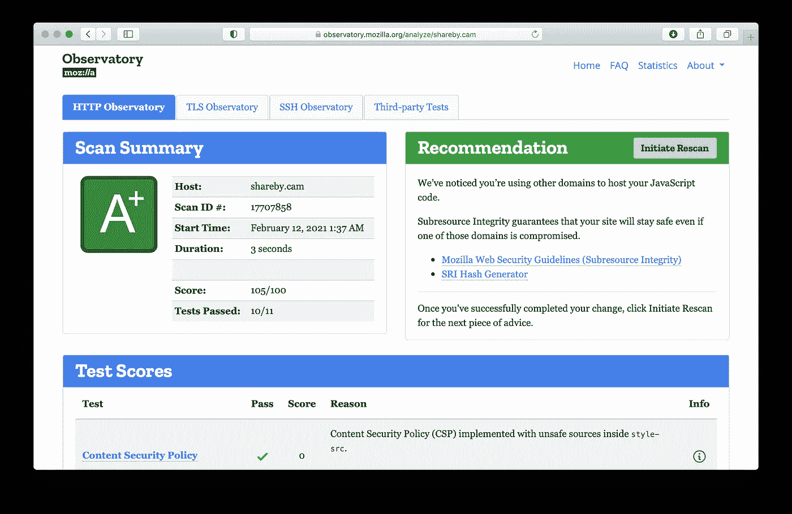

# 网络安全唾手可得的成果

> 原文：<https://itnext.io/low-hanging-fruits-of-web-security-58a1016944bb?source=collection_archive---------2----------------------->

> 我谈到了在您的 web 应用程序中实现公共标题来增加其安全性。


马丁·奥尔森在 [Unsplash](https://unsplash.com/s/photos/fence?utm_source=unsplash&utm_medium=referral&utm_content=creditCopyText) 上拍摄的照片

## 头球

1.  `Access-Control-Allow-Origin`:定义可以访问您的内容的域。 [MDN 链接](https://developer.mozilla.org/en-US/docs/Web/HTTP/Headers/Access-Control-Allow-Origin)。
2.  `Permissions-Policy`:定义您的 web 应用程序可以请求的权限。 [W3C 链接](https://w3c.github.io/webappsec-permissions-policy/#permissions-policy-http-header-field)。
3.  `Referrer-Policy`:定义当你从链接 A 转到链接 B 时，你与链接 B 共享多少关于链接 A 的信息。
4.  `Strict-Transport-Security`:定义在访问您的 web 应用程序时`https://`是否应该是强制的。 [MDN 链接](https://developer.mozilla.org/en-US/docs/Web/HTTP/Headers/Strict-Transport-Security)。
5.  `X-Content-Type-Options`:强制内容为定义的类型。 [MDN 链接](https://developer.mozilla.org/en-US/docs/Web/HTTP/Headers/X-Content-Type-Options)。
6.  `X-Frame-Options`:定义您的 web 应用程序是否可以在`iframe`或其他嵌入元素中加载。 [MDN 链接](https://developer.mozilla.org/en-US/docs/Web/HTTP/Headers/X-Frame-Options)。
7.  `X-XSS-Protection`:定义跨站脚本过滤级别。 [MDN 链接](https://developer.mozilla.org/en-US/docs/Web/HTTP/Headers/X-XSS-Protection)。

## 例子

假设你有一个托管在 https://example.com 的网络应用:

```
const HEADERS = [
  {
    key: 'Access-Control-Allow-Origin',
    value: '[https://example.com'](https://example.com')
  },
  {
    key: 'Permissions-Policy',
    value: 'autoplay=(), camera=(), fullscreen=(), geolocation=(), microphone=()'
  },
  {
    key: 'Referrer-Policy',
    value: 'no-referrer'
  },
  {
    key: 'Strict-Transport-Security',
    value: 'max-age=63072000; includeSubDomains; preload'
  },
  {
    key: 'X-Content-Type-Options',
    value: 'nosniff'
  },
  {
    key: 'X-Frame-Options',
    value: 'DENY'
  },
  {
    key: 'X-XSS-protection',
    value: '1; mode=block'
  }
]
```

在 Vercel 上部署的 Next.js 应用程序中，您可以像这样设置`next.config.js`中的头:

```
// next.config.jsconst headers = async () => [
  {
    source: '/(.*)',
    headers: // Paste HEADERS here
  }
];module.exports = {
  headers
};
```

在 Firebase 主机上部署的 spa 上，您可以像这样设置`firebase.json`中的头:

```
// firebase.json{
  "hosting": {
    "headers": [
      {
        "source": "**",
        "headers": // Paste HEADERS here
      }
    ]
  }
}
```

您可能希望更改`Access-Control-Allow-Origin`标题的值，以允许 [CORS](https://developer.mozilla.org/en-US/docs/Web/HTTP/CORS) 。

您可能还想根据您想要请求的权限来更改`Permissions-Policy`头的值。

## CSP:安全报头之王

`Content-Security-Policy` ( [MDN link](https://developer.mozilla.org/en-US/docs/Web/HTTP/CSP) )是一个非常强大的头，因为它结合了各种策略，允许您以细粒度的方式定义 web 应用的安全策略。第一次尝试很难做对，所以它不应该被列入上面的“低挂水果”清单——但是你不应该跳过它。它保证访问者在你的网络应用上有一个安全的时间。

要为您的 web 应用程序构建最紧密的 CSP，建议从锁定的策略开始，并在进行过程中打开它们。Chrome 对 CSP 违规的描述非常详细，因此很容易知道下一步要开放哪个策略。测试你的 web 应用的所有特性以确保没有违规是很重要的。每次对任何策略进行更改时都使用新的匿名窗口，以确保您没有使用缓存的结果。

通常在开发过程中禁用 CSP 以允许工具正常工作。您可以在开发过程中使用环境变量来禁用 CSP。下面是一个使用 Google 字体的 Next.js 应用程序的 CSP 头配置示例(注意环境变量`NEXT_PUBLIC_IS_PRODUCTION`的用法):

```
// next.config.jsconst HEADERS = [ ..., {
    key: 'Content-Security-Policy',
    value: process.env.NEXT_PUBLIC_IS_PRODUCTION === 'true' ? "connect-src 'self'; default-src 'self'; font-src [https://fonts.gstatic.com](https://fonts.gstatic.com); img-src 'self' data:; manifest-src 'self'; object-src 'none'; script-src 'self'; style-src 'self' [https://fonts.googleapis.com](https://fonts.googleapis.com) 'unsafe-inline'; upgrade-insecure-requests;" : ''
  }, ...]
```

您可以使用 Google 的 [CSP 评估工具](https://csp-evaluator.withgoogle.com)来评估您的政策的严格程度。

## 量化结果

[Mozilla Observatory](https://observatory.mozilla.org) 之于 Web 安全，正如 [Lighthouse](https://developers.google.com/web/tools/lighthouse) 之于 Web 性能。它会对您的 web 应用程序的安全性进行评级，并提供改进评级的建议。它还集成了像[安全头](https://securityheaders.com)这样的第三方扫描器，所以你可以有多种意见。



[Mozilla Observatory](https://observatory.mozilla.org) 的安全评分[由 Cam](https://shareby.cam) 分享

我是否能够帮助您提高 web 应用的安全分数？在我的推特上告诉我。干杯！