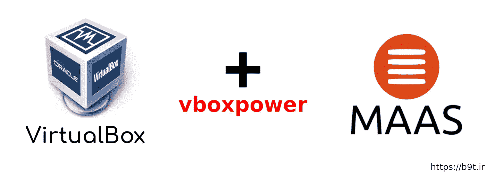
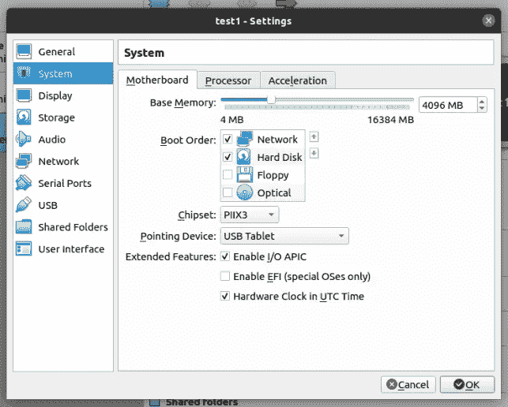
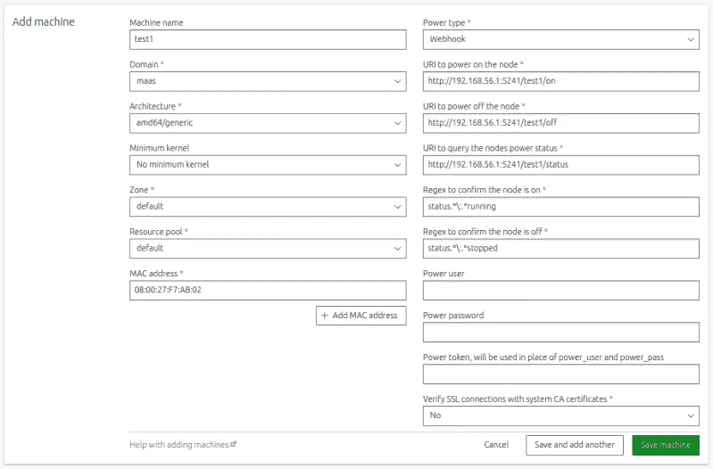

# MAAS 与 VirtualBox (vboxpower)的集成

> 原文：<https://itnext.io/maas-integration-with-virtualbox-20d850381c21?source=collection_archive---------3----------------------->



**MAAS** 是一款不可思议的工具，可用于创建包含物理和虚拟服务器的本地裸机云。本文的目标不是介绍 MAAS 本身。如果您不熟悉 MAAS，请阅读关于 [MAAS 的官方文档。IO](https://maas.io/) 网站。我们是来整合 MAAS 和 VirtualBox 的。如您所知，MAAS 本身不支持 VirtualBox 电源类型，要调配 VirtualBox 虚拟机，我们应该使用手动电源类型。对于手动电源类型，MAAS 不会自动完成电源管理过程。这个过程是我们自己完成的。本文将通过使用 **vboxpower** 为您提供解决这一问题的方案。

# vboxpower 是什么？

vboxpower 是一个包装器，使 MAAS 能够自动管理 VirtualBox 虚拟机的功能。vboxpower 与 MAAS webhook 驱动程序结合使用，可自动执行 VirtualBox 虚拟机的电源管理过程。关于 [vboxpower](https://github.com/ssbostan/vboxpower) GitHub 库的更多信息。

# 如何部署 vboxpower？

我将演示在 Ubuntu 20.04 上的部署步骤，但是对于其他环境也是类似的。让我们开始吧。

**1-安装 VirtualBox:**

```
sudo apt update && sudo apt install -y virtualbox
```

**2-安装 VirtualBox 扩展包:**

转到 VirtualBox [下载](https://www.virtualbox.org/wiki/Downloads)页面，下载扩展包的正确版本。要安装扩展包，打开 VirtualBox，进入**文件- >首选项- >扩展**，添加下载的包。安装此软件包是为了支持虚拟机上的 PXE 启动。

**3-安装 VirtualBox SDK(vbox power 需要):**

vboxpower 使用 vboxapi 与 VirtualBox 通信。从 VirtualBox 下载页面，下载适当版本的 SDK 软件包。要安装 SDK，请运行下列步骤。

```
unzip VirtualBoxSDK-6.1.24-145767.zip
cd sdk/installer
sudo VBOX_INSTALL_PATH=/usr/lib/virtualbox python3 vboxapisetup.py install
```

**4-安装 vboxpower:**

克隆 [vboxpower](https://github.com/ssbostan/vboxpower) 并运行以下命令:

```
sudo apt install -y python3-pip
git clone [https://github.com/ssbostan/vboxpower](https://github.com/ssbostan/vboxpower)
cd vboxpower
sudo ./deploy
```

部署脚本创建一个 systemd 服务并将 **vboxpower.py** 复制到 **/opt/maas/vboxpower** 目录。之后，该服务将自动启动。如果一切顺利，可以在所有网络接口的端口 5241/tcp 上访问 vboxpower。

```
curl 192.168.56.1:5241
curl 192.168.56.1:5241
{
  "machines": [
    {
      "links": {
        "off": "/pfsense/off",
        "on": "/pfsense/on",
        "status": "/pfsense/status"
      },
      "name": "pfsense",
      "status": "running"
    },
    {
      "links": {
        "off": "/maas/off",
        "on": "/maas/on",
        "status": "/maas/status"
      },
      "name": "maas",
      "status": "running"
    }
  ]
}
```

**5-创建新的虚拟机:**

通过在 VirtualBox 上添加新的虚拟机，您应该在 vboxpower 5241/tcp 上看到虚拟机信息—再次卷曲它。请考虑，在这个步骤中需要之前安装的扩展包。新的虚拟机应该能够从网络启动。



**6-将机器添加到 MAAS:**

要添加之前创建的机器，您必须使用 Webhook 电源类型进行电源管理。在必需的 webhook URI 字段中，分别添加以下 URIs。

**http://HOST _ IP:5241/VM _ NAME/on**

**http://主机 IP:5241/虚拟机名称/关闭**

**http://主机 IP:5241/虚拟机名称/状态**

用您自己的信息替换 HOST_IP 和 VM_NAME。



**7-聚会时间:**

添加机器后，机器的启动/停止过程应由 MAAS 自动完成。

# 结论:

通过 MAAS webhook 驱动程序，我们可以为我们的基础设施开发定制驱动程序。除了使用此驱动程序来管理 VirtualBox 虚拟机电源，您还可以阅读我的驱动程序代码，并为您的基础架构编写自己的驱动程序。不要限制自己！编程的世界可以让我们的世界发展得更快。祝你一切顺利。

关注我的领英[https://www.linkedin.com/in/ssbostan](https://www.linkedin.com/in/ssbostan)