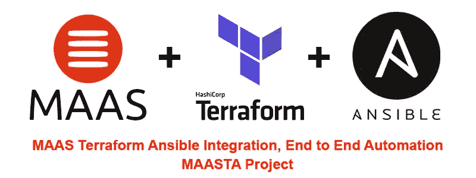
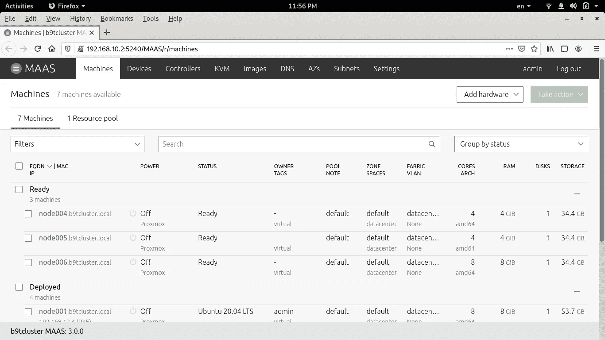
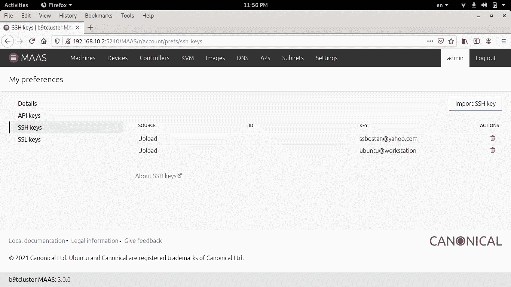
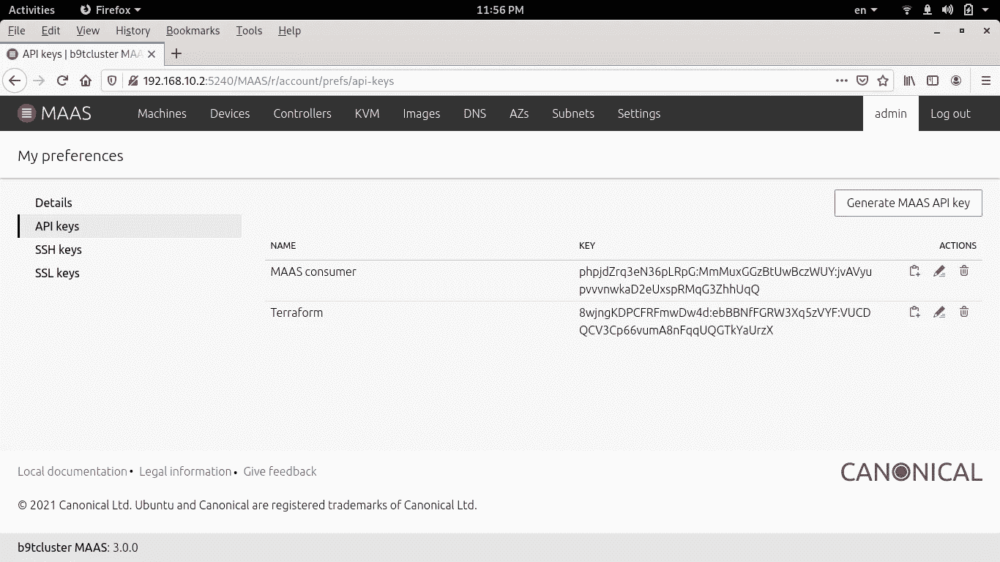

# 马斯地形可变集成

> 原文：<https://itnext.io/maas-terraform-ansible-integration-adb57e09caf2?source=collection_archive---------2----------------------->



今天，我将介绍 MAASTA 项目，该项目将 MAAS、Terraform 和 Ansible 工具集成在一起，以实现 DevOps 生命周期中的端到端自动化。在继续之前，让我解释一些概念，描述问题是什么，以及 MAASTA 如何解决这个没有出路的工作。让我们从概念开始。

# 什么是端到端自动化？

在 DevOps 生命周期中，每一步都与上一步和下一步有语义联系。在每一个项目中，我们使用不同的工具，这些工具可能不会直接与他人联系。例如，在部署中，我们可能会使用几个工具，如 Terraform 和 Ansible，它们没有任何直接连接。尽管 Terraform 和 Ansible 之间没有直接联系，但在现实世界中，Terraform 用于提供云实例、裸机、虚拟机等。，Ansible 用于配置在上一步中由 Terraform 提供的系统。最大的问题是，当没有办法将 Terraform 的输出连接到 Ansible 的输入以将它们介绍给 Ansible 时，Ansible 如何发现那些机器以配置它们。

**传统的**方式是运行 Terraform 来配置机器，手动编写这些机器的 Ansible 清单，并运行 Ansible 来配置这些机器，但在端到端自动化中，独立工具的边缘以自动化的方式连接。可以说，**端到端自动化**是一种完全以自动化方式开发 DevOps 生命周期的方法，不需要任何人工交互或手动过程。所有的工作都应该自动完成。

**公共云上的地形和地形整合:**

端到端自动化在 DevOps 中并不是一个新话题！因此，为了集成 Terraform 和 Ansible 等工具以实现端到端自动化，目前开发了几种工具，但它们都用于集成 Terraform 和 Ansible，例如由 Terraform 在公共云(如 AWS、GCP 等)上提供的实例。对于这种环境中的集成，在 Google 上搜索“**terra form ansi ble Integration**”。

# 内部端到端自动化:

在我们使用基础架构、裸机、虚拟机等的内部环境中。，我们必须使用一种工具将它们转变为类似云的环境。我们应该这样做，以标准的方式继续接下来的步骤，因为标准的方式是基于最佳实践创建的。此外，我们可能希望在未来将我们的基础设施迁移到公共云，在这种情况下，我们应该能够在结构、技术等方面进行最小更改的情况下迁移整个系统。

# MAAS Terraform Ansible 集成:

我们用来将内部基础架构转变为云的工具之一是 MAAS。MAAS 是在内部环境中创建裸机虚拟机云的理想工具。我选择它是因为它有一个 Terraform 的提供者。使用 Terraform MAAS provider，您可以在没有任何直接人工交互的情况下提供实例。之后，是时候配置之前由 Terraform 提供的实例了，但是 Ansible 如何发现这些实例、机器。**大问题！！！**

正如我之前所说，对于公共云实例，有几个工具可以发现由 Terraform 提供的实例，为它们创建一个可行的清单，但对于由 MAAS 提供的实例，到目前为止还没有找到解决方案。欢迎来到**马斯塔**。

[](https://github.com/ssbostan/maasta) [## GitHub-ssbo stan/maasta:MAAS terra form ansi ble

### 如果你觉得有用，就看星星。MAASTA 是一个包装器，用于为 MAAS 实例创建一个可解析的清单。

github.com](https://github.com/ssbostan/maasta) 

**MAASTA** 是一个工具，用于为 Terraform 提供的 MAAS 实例生成可行的清单。借助 MAASTA，您可以将 MAAS、Terraform 和 Ansible 集成在一起，在您的内部环境中实现端到端自动化。在 MAASTA 和这些工具的帮助下，DevOps 生命周期的创建变得更加甜蜜。

# 从零到全自动化入门:

开始之前，您需要满足以下要求:

*   MAAS 2.9+安装环境，带有一些现成的机器。
*   能够访问 MAAS 服务器的工作站机器。

## 步骤 1:配置工作站机器:

工作站机器应具有以下要求:

*   **OpenSSH +私有/公共密钥**
*   **Python 3+(应安装 Python 3-pip)**
*   **地形 1+**
*   **Ansible 2.7+**

## 步骤 2:配置 MAAS:

打开 MAAS 仪表板，添加工作站机器的 SSH 公钥，并为 Terraform provider 创建一个新的 API 密钥。



MAAS 与一些现成的机器。



将您的 SSH 公钥上传到 MAAS。



为地形创建新的 API 键。

# 步骤 3:安装 MAASTA:

在工作站机器上运行以下命令:

```
sudo pip install git+https://github.com/ssbostan/maasta.git
```

## 步骤 4:编写地形文件(IaC):

您可以在 MAASTA 项目资源库中找到一些[示例](https://github.com/ssbostan/maasta/tree/master/examples)。

下面的例子是[这里的](https://github.com/ssbostan/maasta/tree/master/examples/single)。

```
terraform {
  required_providers {
    maas = {
      source = "suchpuppet/maas"
      version = "~> 3.1.3"
    }
  }
}variable "MAAS_API_KEY" {
  type = string
}variable "MAAS_API_URL" {
  type = string
  default = "[http://192.168.10.2:5240/MAAS](http://192.168.10.2:5240/MAAS)"
}provider "maas" {
  api_version = "2.0"
  api_key = var.MAAS_API_KEY
  api_url = var.MAAS_API_URL
}resource "maas_instance" "docker" {
  release_erase = false
  release_erase_quick = true
}
```

## 第五步:编写一份可行的行动手册(IaC):

您可以在 MAASTA 项目资源库中找到一些[示例](https://github.com/ssbostan/maasta/tree/master/examples)。

下面这个例子是在这里找到[。](https://github.com/ssbostan/maasta/tree/master/examples/single)

```
---
  - hosts: docker
    vars:
      docker_old_packages:
        - docker
        - docker-engine
        - docker.io
        - containerd
        - runcdocker_required_packages:
        - apt-transport-https
        - ca-certificates
        - curl
        - gnupg
        - lsb-releasedocker_new_packages:
        - docker-ce
        - docker-ce-cli
        - containerd.iotasks:
      - name: update apt cache and upgrade system
        apt:
          update_cache: yes
          upgrade: yes- name: remove old packages
        apt:
          name: "{{ docker_old_packages }}"
          state: absent- name: install required packages
        apt:
          name: "{{ docker_required_packages }}"
          state: present- name: adding docker repository key
        apt_key:
          url: [https://download.docker.com/linux/ubuntu/gpg](https://download.docker.com/linux/ubuntu/gpg)
          state: present- name: adding docker package repository
        apt_repository:
          repo: deb [arch=amd64] [https://download.docker.com/linux/ubuntu](https://download.docker.com/linux/ubuntu) {{ ansible_facts.lsb.codename }} stable- name: install docker
        apt:
          name: "{{ docker_new_packages }}"
          state: present
```

## 第六步:开始派对！

上面的例子 Terraform 和 Ansible 将为一台新的 MAAS 机器提供 Terraform，Ansible 将 docker 安装在 Docker 组中的机器上。让我们开始吧。

```
export MAAS_API_URL=http://YOUR-MAAS-API-URL:5240/MAAS
export MAAS_API_KEY=YOUR-MAAS-API-KEYexport TF_VAR_MAAS_API_URL=$MAAS_API_URL
export TF_VAR_MAAS_API_KEY=$MAAS_API_KEYterraform initterraform planterraform apply -auto-approve
# Wait for Terraform to complete...terraform show -json | python -m maasta
# The above command creates the inventory.yaml file.ansible-playbook -i inventory.yaml -b playbook.yaml
```

# 最后的结论:

端到端自动化是一种很好的方法，但有时很难通过标准途径实现。对于公共云，找到了各种工具，但是对于内部部署，没有找到足够的工具和方法！MAASTA 是实现端到端自动化的第一款机芯。我们应该创建标准路径！不要犹豫！为了创造一个更美好的世界，你的贡献是必要的。祝你好运。

关注我的领英【https://www.linkedin.com/in/ssbostan 