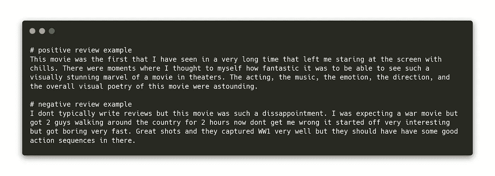
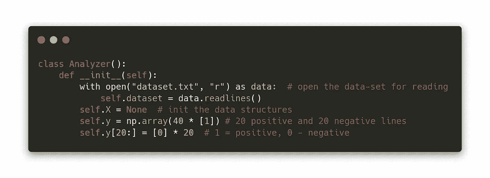
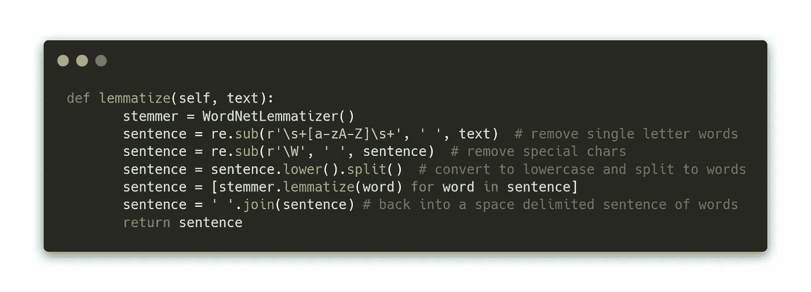
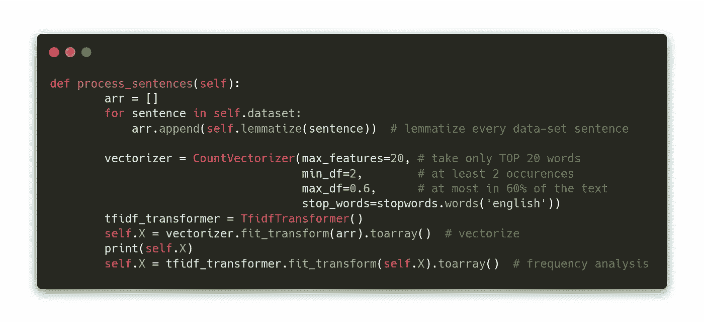
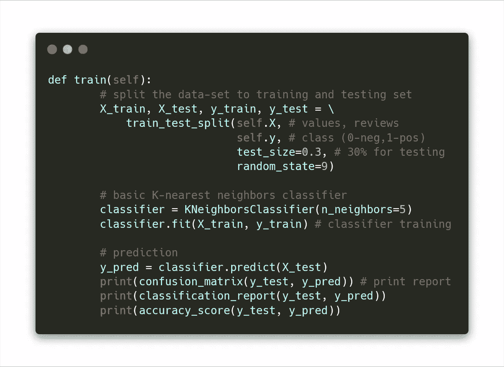
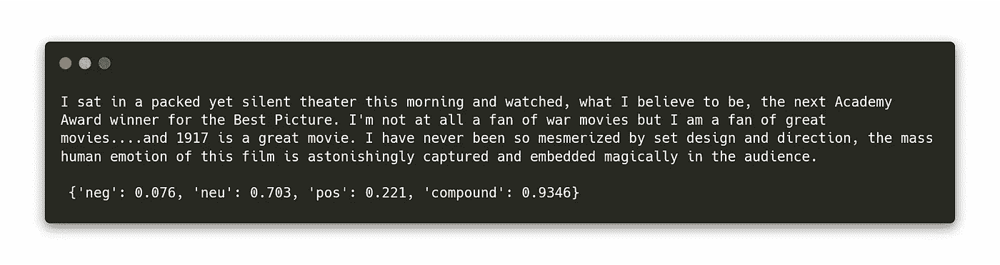

# 带 Python 教程的机器学习基础

> 原文：<https://itnext.io/machine-learning-basics-with-a-python-tutorial-2b262545a943?source=collection_archive---------2----------------------->

机器学习已经成为一个热门词汇有一段时间了，它隐藏了从数据分析到神经网络的一切。在本文中，我们将揭示 ML 的一些工作原理，我将向您展示一个文本分类的实际例子——对电影分级和文本情感分析进行分类。

# 监督和非监督学习

ML 有两个主要类别——监督学习和非监督学习。

首先，我们必须有带注释的数据，例如温度数据及其日期和位置。然而，ML 世界中的典型例子是所谓的 [MNIST 数据集](https://medium.com/syncedreview/mnist-reborn-restored-and-expanded-additional-50k-training-samples-70c6f8a9e9a9)——用实际数字标注的手写数字。

## 分类和回归

数据分类只有一个目的——确定数据点属于哪一类数据(例如，在 MNIST 的情况下，确定图像中手写的数字；在下面的教程的情况下是电影评论的情绪)。回归用于从数据中“预测”和推断。例如生成文本——你可以从 7 本书中生成一个全新的哈利波特章节[。](https://twitter.com/botnikstudios/status/940627812259696643?s=20)

第二个 ML 类别是无监督学习。它用于未标注的数据，通常用于发现数据点之间的隐藏模式和连接，或者用于数据聚类。

[无监督数据聚类](https://scikit-learn.org/stable/auto_examples/cluster/plot_dbscan.html)

# 数据集

数据集通常有三个部分——训练集、测试集和验证集。

训练集由主要数据组成，ML 算法使用这些数据来“学习”问题，找到模式和数据配置，并找到每个决策点的最佳权重。

验证集是训练集的一部分，但同时又必须与训练集有所区别。换句话说，我们*随机*从一个数据集中抽取 70%的数据用于训练集，30%用于验证集。

测试集使用完全不同的数据，最好是来自相似的数据集。在 MNIST 手写数字的情况下，它将是来自一个或多个不同作者的数据。通过这种方式，我们可以确定分类模型的准确性，这是衡量模型质量的主要标准。

有时你会发现这两个术语，测试和验证集，可以自由地互换，以及它们的正确含义。

# 现在举个实际的例子

作为例子，我将向你展示如何制作一个电影文本评论分类器。

首先，我从 imdb.com 下载了文本数据。我已经为新电影“1917”复制了 20 条正面评论和 20 条负面评论——当然，IMDB API 将用于现实生活中的项目。此外，评论不会保存在文本文件中，而是保存在一个. csv 文件和类注释中。为了便于使用，我在本教程中使用了一个基本格式——前 20 行是正数，后 20 行是负数。

dataset.txt 中的数据点示例

我用 Python 加载文件:

现在所有的行都被加载到一个列表中。现在，我必须以某种方式转换文本，以便分类器能够在训练阶段提取尽可能多的有用信息。我去掉了文本中的特殊字符，并进行词汇化——将单词转换成它们的词根形式:

现在，我需要将单词转换成适合 ML 的格式。矢量化开始发挥作用了。将一个单词矢量化意味着将其转换为数字形式——可以说这类似于在文本中查找最常用的单词，但具有更深层次的上下文。我使用的矢量化方法是[单词包，](https://en.wikipedia.org/wiki/Bag-of-words_model)，它几乎完全做到了这一点。

矢量器被设置为只考虑 20 个最常用的单词；这些词必须在文本中出现至少 2 次，在 60%的评论中出现最多(否则它们会失去信息价值和意义，有点像一个说话太多的神经质的人的话)。在此基础上，我删除了所有停用词，对 ML 没有任何重要意义的词(the，and，…)。

现在文本被转换成数值，看起来像这样(每一行是一个单独的评论):

## 分类器训练

我使用了一个简单的分类器，5 个邻居的 K 近邻和 70/30 数据集分割。

我在最后打印分类报告，混淆矩阵和模型精度。混淆矩阵在对角线上显示真阳性和真阴性，在另一条对角线上显示假阳性和假阴性。通过这些设置和这个小数据集，我得到了这个模型的 2-7 真实比率。准确率上升到了 75%，但这对于这么小的数据集来说是很少见的(根据模型设置，准确率会下降到 35%)。随着更多的数据(数千个数据点)和更智能的分类器，准确率可能会超过 90%，没有任何问题。

## 文本中的情感分析

我将向你展示一个更有趣的实验——文本情感分析。这是一种用于观点和情感提取的 NLP(自然语言处理)。社交网络通常被用作数据的来源和分类模型的目标(脸书和它令人毛骨悚然的老大哥对你的私人聊天、墙报等的分析)。).

我在这里用了一个相当简单的例子，VADER(化合价感知词典和情感推理器)的一个电影评论。VADER 基于预先训练的分类模型对文本情感进行分类(有更复杂的方法来进行更准确和可靠的分析，如谷歌云自然语言 API)。

上面的 3 行代码在文本中找到 70%的中性情绪和 22%的正面情绪(这是正面评论之一):

## 在你走之前

所以，我希望你喜欢这篇文章和教程，如果你对完整的源代码(包括导入和其他细节)感兴趣，你可以在我的 [github](https://github.com/janjilecek/ML_article/tree/medium) 上找到它。下次见！

