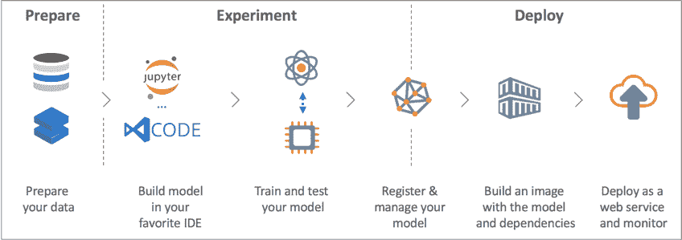
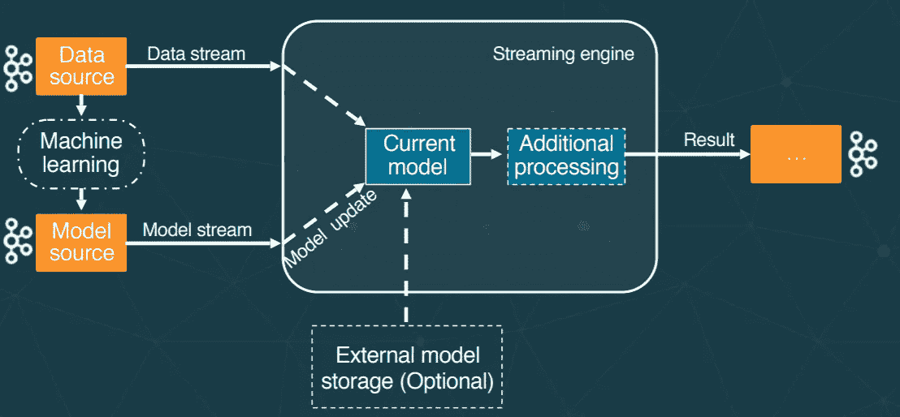
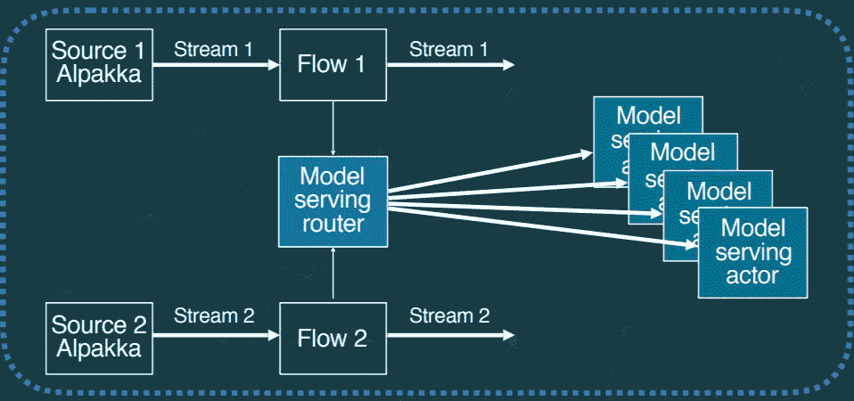
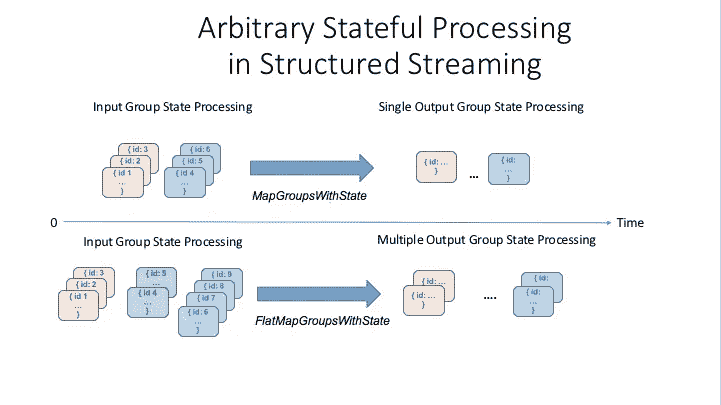

# 机器学习模型服务选项

> 原文：<https://itnext.io/machine-learning-model-serving-options-1edf790d917?source=collection_archive---------0----------------------->

快速的谷歌搜索将返回大量关于开始使用**机器学习**的文章和文献，不幸的是，大多数文献涵盖模型培训，而没有多少文章涵盖**如何在生产中服务于 ML 模型**，当他们这样做时，他们往往专注于单一的方法。在本文中，我将尝试向**概述生产环境中模型推理的不同选项——考虑不同的因素**,如团队规模/结构、推理模式(RPC vs 流)、部署类型(云 vs 内部)和其他方面。

# 介绍

人工智能和机器学习是一个热门话题，越来越多的人正在进入这个有很大潜力的领域，它仍然处于早期发展阶段，我相信在未来的几十年里我们会不断听到人工智能的更多突破。

传统上，这是一个保留给学者的领域，他们拥有开发复杂的 ML 模型的数学技能，但缺乏生产这些模型所需的软件工程技能。另一方面，托管服务和其他框架在过去几年中已经出现，专注于简化 ML 开发；允许没有科学博士学位的软件开发人员创建 ML 模型。然而，模型的定制化水平和性能往往低于拥有专门的数据科学家团队时的水平。

ML 工作流程

# 考虑

## 团队结构

根据你的需求，你可能需要不同的团队结构。如果您不需要对您的模型进行细粒度的控制，并且使用标准的分类/回归模型，您可能更喜欢利用您现有的软件工程师进行 ML，特别是在以下场景中:

*   你用托管云 ML 服务比如 [**AWS SageMaker**](https://aws.amazon.com/sagemaker/) 或者 [**GCP AI 平台**](https://cloud.google.com/ai-platform/) 。
*   您需要丰富您的数据管道，并且您已经使用了 [**Spark**](https://spark.apache.org/) 等工具。在这种情况下，您可以使用现有的库，如[**【SparkML】**](https://spark.apache.org/docs/latest/ml-guide.html)。

这种方法**易于实施**并且提供了出色的结果，但是您会受到提供商能力的限制。此外，它可能会变得昂贵。

另一方面，如果你需要前沿的 AI、高级的 ML 调优和对你的模型的完全控制(你是一家 AI 公司)，那么你可能希望有一个**专门的科学团队**。这种方法让您可以完全控制您的模型，并有创新的空间，因为大多数竞争对手将使用云提供商的标准工具。然而，这造成了工程和科学团队之间的孤岛，使其非常难以管理。我们稍后将讨论解决这个问题的不同方法(*模型作为数据*)。

## 推理类型([在线 vs 流](https://www.datasciencecentral.com/profiles/blogs/model-serving-stream-processing-vs-rpc-rest-a-deep-learning))

一个重要的考虑是你计划如何为你的模型服务。最简单的选择是在线 RPC 风格的代码。在这种情况下，您的模型作为服务运行(通常是*和 HTTP 微服务*)，您向它发送请求并得到响应。在这种情况下，**托管解决方案极大地简化了模型的部署**和监控。

另一个，也可能是最常见的用例是**用 ML 模型丰富数据管道**，例如在 [**NLP**](https://en.wikipedia.org/wiki/Natural_language_processing) 管道中向非结构化数据添加*结构*。这可以在**批次**或**实时**中完成。对于批量，可以使用 [SparkML](https://spark.apache.org/docs/latest/ml-guide.html) 等工具。对于流，我们将回顾不同的选项，这将是我们的主要关注点，因为流处理更加复杂和有趣。尤其是因为您需要维护模型的某个状态，所以您需要使用有状态流。

流处理

## 托管解决方案

你在哪里提供服务？本地还是云？。如果你在**云**上运行，你有几个服务(比如 [**AWS SageMaker**](https://aws.amazon.com/sagemaker/) 或者 [**GCP 人工智能平台**](https://cloud.google.com/ai-platform/) )负责模型服务方面以及监控方面，使之变得简单很多**。如果您在内部运行**，您将需要使用 [**Seldon**](https://www.seldon.io/) 等企业解决方案，或者使用 **Spark** 等数据管道。然而，这需要**更多的努力**。****

## ****模型服务类型****

****这一点非常重要。部署训练好的模型的最常见方法是保存为您选择的工具的二进制格式，将其包装在微服务(例如 Python Flask 应用程序)中，并使用它进行推理。托管解决方案简化了这一部署流程，并提供了执行 canary 发布和 A/B 测试的工具，这种方法被称为代码为的**模型。然而，这种方法有几个**缺点**，随着模型数量的增长，微服务的数量会成倍增加，故障点、延迟等的数量也会成倍增加。这使得管理变得非常困难。******

**另一个更新的方法是**标准化 model** 格式，以便可以使用任何编程语言以编程方式使用它，这样您就不必将其包装在微服务中。这对于延迟和错误管理是个问题的数据处理流特别有用。因为我们直接调用模型，所以我们不必担心监控、错误处理等等。这种方法被称为数据的**模型。****

****

**模型作为数据。**

**现在让我们特别关注数据流和模型服务选项“模型作为代码”和“模型作为数据”。我们不会关注 Spark ML 等大数据 ML 功能，尽管我们会在用例部分回到它们。**

# **作为代码的模型**

**这是部署模型最常见的方式，主要是因为数据科学家不是 sre，所以他们使用他们的工具集( *Python、R、Jupyter notebooks 等)。*)来训练模型，利用他们已有的知识，通常是 Python 来把模型包装在 HTTP 服务中。这是因为最初没有保存模型的标准。由于软件开发人员对 ML 一无所知，这个解决方案对他们非常有用，因为他们知道如何调用 REST 端点。但是**这带来了管理所有交互的复杂性**，使得维护变得非常困难。引入了托管解决方案来缓解这一问题。**

**专注于模型服务的工具有 [**【谢顿】**](https://www.seldon.io/)[**裁剪器**](https://github.com/ucbrise/clipper) 或 [**张量流服务**](https://www.tensorflow.org/tfx/guide/serving) 。**

**这种方法的优点是:**

*   ****易于**开发。**
*   **数据科学家不需要关心生产维护和监控，服务工程师可以管理服务**
*   ****可以自动化**，AWS SageMaker 等工具负责部署服务、创建 URL、A/B 测试等等。一般来说，像 **SageMaker** 或[kube flow](https://www.kubeflow.org/)这样的工具会照顾到从训练到得分的所有方面。**
*   **另一个优点是，我们可以在应用程序中用度量和其他元数据保存模型状态。**

****缺点**是:**

*   **随着越来越多模型的加入，监控和维护模型的复杂性也在增加。**
*   **额外的**延迟**和更多影响可靠性的故障点。**
*   ****阻抗不匹配**:与软件开发人员相比，数据科学家使用一套不同的工具，如 R 或 Python。**
*   ****难以更新**型号。这需要 SREs 使用 Kubernetes 的功能来完成，使用金丝雀方法推出新版本，但您会失去细粒度控制和细粒度指标，从而很难获得关于您的模型性能的准确和快速的反馈。由于模型是代码，很难更新。**
*   **很难实现背压和断路器来处理网络故障。这就是为什么很难在托管集群中使用 Spark 或 [Flink](https://flink.apache.org/stateful-functions.html) 这样的大数据，它们不能很好地处理阻塞 I/O，也是为什么 ML 库是为这些工具开发的。**
*   **另一个问题是，很难精确复制在训练阶段获得的结果，因为权重和其他元数据在生产模型中可能不完全相同。**
*   **由于额外的延迟和数据大小，它无法针对大数据流管道进行扩展。**

**下面是一个关于如何调用外部服务在数据流中进行模型推断的示例:**

**如您所见，我们需要引入未来来处理阻塞 I/O 和处理故障、指数级回退重试、延迟等。因此，一个常见的模式是使用一个**侧柜**来处理所有这些逻辑:度量、重试、断路器等。在 Kubernetes 中，这可以使用边车容器来完成。**

**一般来说，**流处理管道的目标是避免阻塞 I/O** ，模型作为代码引入了这一障碍，正因为如此，模型作为数据被引入。**

# **模型作为数据**

**最近的一种方法是将模型标准化为数据，以便可以用任何编程语言读取。目前， **Tensorflow** 已经成为**事实上的**标准，新的 [**SavedModel**](https://www.tensorflow.org/guide/saved_model) 格式包含一个完整的 Tensorflow 程序，包括权重和计算。它不需要运行原始的模型构建代码，这使得它对于共享非常有用。**

**有几个项目试图将模型标准化为数据， [**PMML**](http://dmg.org/pmml/v4-3/GeneralStructure.html) 是最著名的使用 XML 表示数据的格式。其他格式有 [PFA](https://en.wikipedia.org/wiki/Portable_Format_for_Analytics) 和 ONNX。**

**正如我们之前提到的，大多数机器学习实现都是基于作为 REST 服务的运行模型，这可能不适合大容量数据处理或流系统的使用，这需要重新编码/启动系统以进行模型更新，例如 TensorFlow 或 Flink。**模型即数据非常适合大数据管道**。对于在线推理，实现起来相当容易，你可以将模型存储在任何地方(S3、HDFS……)，读入内存并调用它。**

**主要问题是我们需要保存模型状态来执行 A/B 测试或更新元数据。对于流处理，这意味着我们需要**有状态流**。此外，我们需要一种简单的方法来更新模型，而不干扰模型服务。为了克服这一点，一种常见的模式是使用由 **Lightbend** 引入的 [**动态控制流**](https://www.lightbend.com/blog/serve-machine-learning-models-dynamically-controlled-streams) 。**

****

**该解决方案为**有状态流处理**提供了在服务状态改变时动态更新状态**的能力。主流接收数据和对模型的请求，这将丰富数据。辅助流用于接收模型更新。是的，整个模型可以序列化并通过网络发送，模型可以存储在内存中。在这种情况下，模型就是状态。或者，可以从外部来源(如 S3)检索模型。****

**这个解决方案可以使用有状态的解决方案来实现，例如 [**Akka Streams**](https://doc.akka.io/docs/akka/current/stream/index.html) ，S [**park 结构化流**](https://spark.apache.org/docs/latest/structured-streaming-programming-guide.html) 或 [**Flink**](https://flink.apache.org/stateful-functions.html) 。现在让我们看一个使用 Akka 流和 Spark 流的例子。**

## **阿卡溪流**

**[**Akka Streams**](https://doc.akka.io/docs/akka/current/stream/index.html) 是为流处理而建的低级库。它为构建任何类型的流处理应用程序提供了极大的灵活性。这是一个类似于 [Kafka Streams](https://www.confluent.io/blog/introducing-kafka-streams-stream-processing-made-simple/) 的库，这意味着您拥有完全的控制权，但您必须管理部署，因为它不是 Spark 或 Flink 这样的托管集群。这些应用程序可以很容易地在 Kubernetes 上运行。有关不同流媒体选项的更多信息，请参见[本博客](https://www.lightbend.com/blog/akka-spark-or-kafka-selecting-the-right-streaming-engine-for-the-job)。 [**Alpakka**](https://doc.akka.io/docs/alpakka/current/index.html) 可用于连接 Kafka 或其他信号源。**

**主要思想是有两个 Akka 流，一个用于数据，另一个用于模型更新。几个模型可以链接或并行运行，您有完全的灵活性。您可以使用 Akka **DSL** 来生成复杂的图形，以满足您管理模型间依赖关系的需求。 **Actors** 可用于管理状态，例如，您可以为每个模型版本使用一个 Actors，从而对 A/B 测试进行细粒度控制。**

****

**服务于 Akka 流的模型**

**这个想法是使用 ask 模式调用一个 actor，该 actor 将模型作为其内部状态: *Consumer.atMostOnceSource(..).via(ActorFlow.ask(1)(..)…***

**然后，每个参与者将存储模型，在每个消息上，我们调用模型并返回结果，我们可以调用几个模型来丰富我们的数据管道。**

**这样，我们可以在运行时更新模型，而无需重新部署任何服务。该模型可以实现为包含张量流或 PMML 二进制数据的类。**

## **火花结构化流**

****

**有状态处理火花。**

**动态控制流也可以在 Flink 和 [Spark 结构化流](https://spark.apache.org/docs/latest/structured-streaming-programming-guide.html)中实现。在 Spark 中，您可以使用*联合*来连接数据流和模型流。然后使用`[mapGroupsWithState](https://spark.apache.org/docs/latest/structured-streaming-programming-guide.html#arbitrary-stateful-operations)`对合并流中的数据进行评分。这种方法使用 Spark **小型批处理**，这带来了额外的延迟。**

**另一种更新的方法是使用新的 [**连续**火花流](https://databricks.com/blog/2018/03/20/low-latency-continuous-processing-mode-in-structured-streaming-in-apache-spark-2-3-0.html)，这使得**实时模型服务**。**

**[**可查询状态**](https://www.lightbend.com/blog/managing-streaming-and-queryable-state-in-spark-akka-streams-kafka-streams-flink) 可用于管理有状态应用程序的状态，这允许在不使用任何外部数据源的情况下访问整个流的状态，因此我们的模型及其元数据等指标可以使用[交互查询](https://kafka.apache.org/10/documentation/streams/developer-guide/interactive-queries.html)从流外部进行查询。**

****

**交互式查询**

## **模型作为数据的利与弊**

****的优点**是:**

*   **简化的模型管理。**
*   **模型标准化。**
*   **低延迟。**
*   **更易于实施，有多种选择。**
*   **有助于沟通，当你有筒仓。**

****的缺点**是:**

*   ****并非所有的 ML 工具都支持当前的标准格式**。对于某些用例，您还不能使用这种方法。**
*   **标准化的早期阶段。**

# **用例**

**概括地说，让我们通过不同的使用案例来回顾我们的选项:**

*   **你没有专门的数据科学家团队，你在云中运行你的服务，并希望建立你自己的分类/回归模型供你的服务使用:在这种情况下，使用你的云管理服务，如 AWS SageMaker 或 GCP [Kubeflow](https://www.kubeflow.org/) 。**
*   **你需要从图像中检测文本，或者创建一个聊天框，或者翻译文本，或者一般来说，任何高级的 ML 服务。在这种情况下，使用托管服务；所有云提供商都提供图像识别、文本到语音、翻译、计算机视觉等等。**
*   **您有一个使用 Spark、Flink 或任何其他托管集群的现有数据管道。您希望使用众所周知的监督或非监督模型来丰富数据。您没有专门的数据科学家团队。在这种情况下，使用已经集成在平台中的 **SparkML** 或 **FlinkML** ，无论您是在本地运行还是在云中运行，都很容易使用。**
*   **您有一个专门的数据科学家团队，您在内部运行您的服务。不需要流处理。在这种情况下，使用 [**谢顿**](https://www.seldon.io/) 或任何其他模式的发球服务。**
*   **您没有专门的数据科学家团队，而是在内部运行服务。你以前没有经验。在这种情况下，迁移到云或获得一个数据科学家团队！**
*   **你有一个专门的数据科学家团队，你需要丰富你的数据流管道，你需要节省成本，云解决方案太贵了。在这种情况下，如果可能，使用模型作为代码来使用动态流。一般来说，当你有筒仓时，**数据模型是一个更好的选择。****
*   **对于数据流，只要你的用例得到 [PMML](https://en.wikipedia.org/wiki/Predictive_Model_Markup_Language) 或 Tensorflow 的支持，尽量使用模型作为动态流的数据。如果没有，使用支持反压和重试的 Akka 流。**

# **结论**

**我们已经看到了根据您的用例部署您的 ML 模型的不同选项。可能的话**尝试打破孤岛**让数据科学家和工程师一起工作。**考虑数据量和数据速度**，如果低延迟是你的优先选择**使用 Akka 流**，如果你有大量的数据使用 Spark、Flink 或 GCP [数据流](https://cloud.google.com/dataflow/)。如果您不能打破孤岛，模型作为数据是一个更好的选择。**

****探索和使用您的云提供商人工智能平台**，这将极大地简化您的部署。如果预算很重要，或者如果你是一家人工智能公司，并且你想完全控制你的模型，那么只实现你自己的。**

**我真心推荐 [**这本书**](https://www.lightbend.com/ebooks/machine-learning-guide-architecture-stream-processing-frameworks-oreilly) 出自 **Lightbend** 。也检查这个关于动态流的[帖子](https://www.lightbend.com/blog/serve-machine-learning-models-dynamically-controlled-streams)。最重要的是，**不要忽视生产你的模型服务过程**的重要性，这是**极其重要的**。**

**我希望你喜欢这篇文章。欢迎发表评论或分享这篇文章。跟随[***me***](https://twitter.com/JavierRamosRod)**进行未来岗位。****