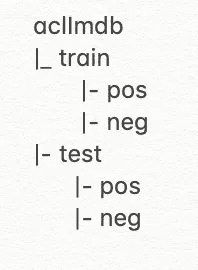
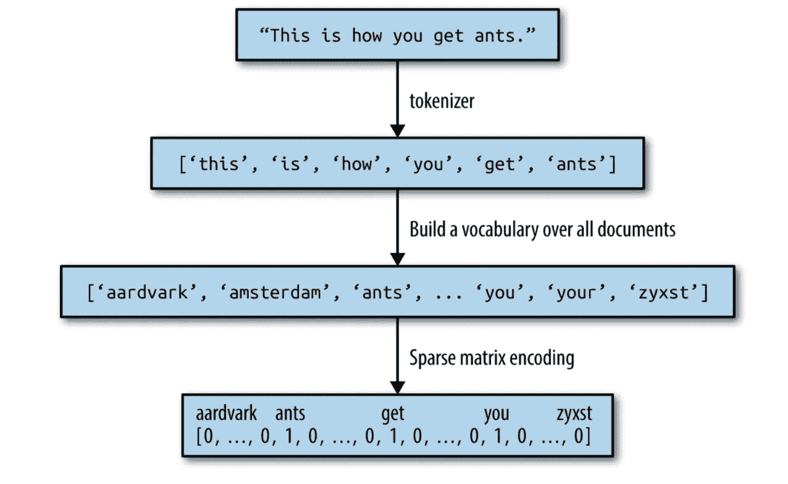
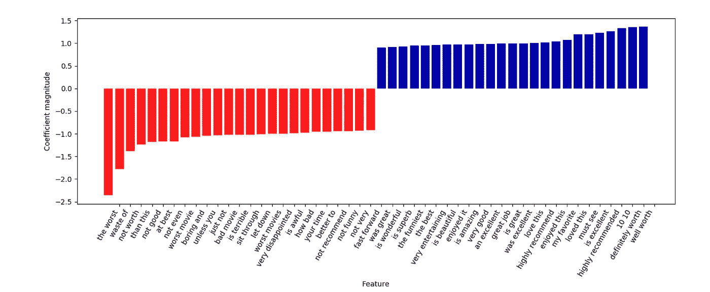

# 机器学习:基于逻辑回归的电影评论情感分析

> 原文：<https://itnext.io/machine-learning-sentiment-analysis-of-movie-reviews-using-logisticregression-62e9622b4532?source=collection_archive---------1----------------------->

在这篇文章中，我们将重点分析 IMDb 电影评论数据，并试图预测评论是积极的还是消极的。熟悉一些机器学习概念将有助于理解所使用的代码和算法。我们将使用流行的 **scikit-learn** 机器学习框架。

**数据集准备**:

我们将使用来自这里的数据集—【http://ai.stanford.edu/~amaas/data/sentiment/】

*下载数据集后，删除了不必要的文件/文件夹，因此文件夹结构如下所示—*

**

*数据集的文件夹结构*

***将数据载入程序**:*

*我们将加载并查看训练和测试数据，以了解数据的性质。在这种情况下，训练和测试数据的格式相似。*

```
*from sklearn.datasets import load_filesreviews_train = load_files("aclImdb/train/")
text_train, y_train = reviews_train.data, reviews_train.target

print("Number of documents in train data: {}".format(len(text_train)))
print("Samples per class (train): {}".format(np.bincount(y_train)))

reviews_test = load_files("aclImdb/test/")
text_test, y_test = reviews_test.data, reviews_test.target

print("Number of documents in test data: {}".format(len(text_test)))
print("Samples per class (test): {}".format(np.bincount(y_test)))*
```

***scikit** - **learn** 提供 **load_files** 来读取这类文本数据。加载数据后，我们打印了文件数量(训练/测试)和每类样本数量(pos/neg ),如下所示*

> *训练数据中的文档数:25000
> 样本每班(训练):【12500 12500】
> 测试数据中的文档数:25000
> 样本每班(测试):【12500 12500】*

*我们可以看到总共 25000 个样本的训练和测试数据，每类 12500 个。*

***将文本数据表示为单词包**:*

*我们希望将单词出现次数统计为一个单词包，其中包括图表中的以下步骤——*

**

*文字处理包[1]*

*为了将输入数据集表示为单词包，我们将使用**计数矢量器**并调用它的**转换**方法。**计数矢量器**是一个转换器，将输入文档转换成稀疏的特征矩阵。*

```
*from sklearn.feature_extraction.text import CountVectorizervect = CountVectorizer(min_df=5, ngram_range=(2, 2))
X_train = vect.fit(text_train).transform(text_train)
X_test = vect.transform(text_test)

print("Vocabulary size: {}".format(len(vect.vocabulary_)))
print("X_train:\n{}".format(repr(X_train)))
print("X_test: \n{}".format(repr(X_test)))

feature_names = vect.get_feature_names()
print("Number of features: {}".format(len(feature_names)))*
```

***计数矢量器**与两个参数一起使用—*

1.  ***min_df** ( = 5):定义一个词作为一个特征的最小频率*
2.  ***ngram_range** (= (2，2)):ngram _ range 参数是一个元组。它定义了所考虑的令牌序列的最小和最大长度。在这种情况下，这个长度是 2。因此，这将找到 2 个标记的序列，如“但是”，“智者”等。*

*结果矩阵中的每个条目都被视为一个特征。上述代码片段的输出如下—*

```
*Vocabulary size: **129549**
X_train:
<**25000x129549** sparse matrix of type '<class 'numpy.int64'>'
 with 3607330 stored elements in Compressed Sparse Row format>
X_test: 
<**25000x129549** sparse matrix of type '<class 'numpy.int64'>'
 with 3392376 stored elements in Compressed Sparse Row format>
Number of features: **129549***
```

*总共找到了 129549 个特征。*

***模型开发:***

*我们将使用**逻辑回归**进行模型开发，对于像我们这样的高维稀疏数据，**逻辑回归**通常效果最佳。*

*在开发模型时，我们需要做另外两件事*

1.  ***网格搜索**:用于逻辑回归的参数调整。我们想确定什么样的系数' **C** 值能提供更好的精度。*
2.  ***交叉验证**:为了避免数据过拟合。*

*要了解更多关于 **GridSearch** 和**交叉验证**的信息，请参考【2】。*

```
*from sklearn.model_selection import GridSearchCV
from sklearn.linear_model import LogisticRegressionparam_grid = {'C': [0.001, 0.01, 0.1, 1, 10]}
grid = GridSearchCV(LogisticRegression(), param_grid, cv=5)
grid.fit(X_train, y_train)

print("Best cross-validation score: {:.2f}".format(grid.best_score_))
print("Best parameters: ", grid.best_params_)
print("Best estimator: ", grid.best_estimator_)*
```

*在这里，我们用 **GridSearchCV** 进行 5 重交叉验证。拟合训练数据后，我们看到“C”的最佳分数、最佳参数和最佳估计量(我们将使用的模型)。*

*上述代码片段的输出如下*

```
*Best cross-validation score: 0.88
Best parameters:  {'C': 1}
Best estimator:  LogisticRegression(C=1, class_weight=None, dual=False, fit_intercept=True,
          intercept_scaling=1, max_iter=100, multi_class='warn',
          n_jobs=None, penalty='l2', random_state=None,  solver='warn',
          tol=0.0001, verbose=0, warm_start=False)*
```

*我们有一个 C = 1 的模型，准确率为 88%。*

*我们想画出最好和最差的前 25 个特征。*

```
*import matplotlib.pyplot as plt
import mglearnmglearn.tools.visualize_coefficients(grid.best_estimator_.coef_, feature_names, n_top_features=25)
plt.show()*
```

**

*常见的最佳和最差特征*

** mglearn 是本书附带的库[1]。你可以从—[https://github.com/amueller/mglearn](https://github.com/amueller/mglearn)下载*

***进行预测**:*

*现在，我们将使用训练好的模型对我们的测试数据进行预测。*

```
*lr = grid.best_estimator_
lr.fit(X_train, y_train)
lr.predict(X_test)
print("Score: {:.2f}".format(lr.score(X_test, y_test)))*
```

*预测的输出显示超过测试数据 88%的分数。*

```
*Score: 0.88*
```

*为了检查我们的模型在单个数据上的表现，我们将对正面的电影评论和负面的电影评论分别进行预测。*

```
*pos = ["I've seen this story before but my kids haven't. Boy with troubled past joins military, faces his past, falls in love and becomes a man. "
       "The mentor this time is played perfectly by Kevin Costner; An ordinary man with common everyday problems who lives an extraordinary "
       "conviction, to save lives. After losing his team he takes a teaching position training the next generation of heroes. The young troubled "
       "recruit is played by Kutcher. While his scenes with the local love interest are a tad stiff and don't generate enough heat to melt butter, "
       "he compliments Costner well. I never really understood Sela Ward as the neglected wife and felt she should of wanted Costner to quit out of "
       "concern for his safety as opposed to her selfish needs. But her presence on screen is a pleasure. The two unaccredited stars of this movie "
       "are the Coast Guard and the Sea. Both powerful forces which should not be taken for granted in real life or this movie. The movie has some "
       "slow spots and could have used the wasted 15 minutes to strengthen the character relationships. But it still works. The rescue scenes are "
       "intense and well filmed and edited to provide maximum impact. This movie earns the audience applause. And the applause of my two sons."]print("Pos prediction: {}". format(lr.predict(vect.transform(pos))))*
```

*这个输出—*

```
*Pos prediction: [1]*
```

*这里，1 表示它预测了一个积极的评价。*

```
*neg = ["David Bryce\'s comments nearby are exceptionally well written and informative as almost say everything "
       "I feel about DARLING LILI. This massive musical is so peculiar and over blown, over produced and must have "
       "caused ruptures at Paramount in 1970\. It cost 22 million dollars! That is simply irresponsible. DARLING LILI "
       "must have been greenlit from a board meeting that said \"hey we got that Pink Panther guy and that Sound Of Music gal... "
       "lets get this too\" and handed over a blank cheque. The result is a hybrid of GIGI, ZEPPELIN, HALF A SIXPENCE, some MGM 40s "
       "song and dance numbers of a style (daisies and boaters!) so hopelessly old fashioned as to be like musical porridge, and MATA HARI "
       "dramatics. The production is colossal, lush, breathtaking to view, but the rest: the ridiculous romance, Julie looking befuddled, Hudson "
       "already dead, the mistimed comedy, and the astoundingly boring songs deaden this spectacular film into being irritating. LILI is"
       " like a twee 1940s mega musical with some vulgar bits to spice it up. STAR! released the year before sadly crashed and now is being "
       "finally appreciated for the excellent film is genuinely is... and Andrews looks sublime, mature, especially in the last half hour......"
       "but LILI is POPPINS and DOLLY frilly and I believe really killed off the mega musical binge of the 60s..... "
       "and made Andrews look like Poppins again... which I believe was not Edwards intention. Paramount must have collectively fainted "
       "when they saw this: and with another $20 million festering in CATCH 22, and $12 million in ON A CLEAR DAY and $25 million in PAINT YOUR WAGON...."
       "they had a financial abyss of CLEOPATRA proportions with $77 million tied into 4 films with very uncertain futures. Maybe they should have asked seer "
       "Daisy Gamble from ON A CLEAR DAY ......LILI was very popular on immediate first release in Australia and ran in 70mm cinemas for months but it failed "
       "once out in the subs and the sticks and only ever surfaced after that on one night stands with ON A CLEAR DAY as a Sunday night double. Thank "
       "god Paramount had their simple $1million (yes, ONE MILLION DOLLAR) film LOVE STORY and that $4 million dollar gangster pic THE GODFATHER "
       "also ready to recover all the $77 million in just the next two years....for just $5m.... incredible!"]print("Neg prediction: {}". format(lr.predict(vect.transform(neg))))*
```

*这个输出—*

```
*Neg prediction: [0]*
```

*在这里，0 表示它预测了负面评价。*

***完整源代码**:*

```
*from sklearn.feature_extraction.text import CountVectorizer
from sklearn.linear_model import LogisticRegression
from sklearn.datasets import load_files
from sklearn.model_selection import GridSearchCV
import numpy as np
import mglearn
import matplotlib.pyplot as plt

reviews_train = load_files("aclImdb/train/")
text_train, y_train = reviews_train.data, reviews_train.target

print("Number of documents in train data: {}".format(len(text_train)))
print("Samples per class (train): {}".format(np.bincount(y_train)))

reviews_test = load_files("aclImdb/test/")
text_test, y_test = reviews_test.data, reviews_test.target

print("Number of documents in test data: {}".format(len(text_test)))
print("Samples per class (test): {}".format(np.bincount(y_test)))

vect = CountVectorizer(min_df=5, ngram_range=(2, 2))
X_train = vect.fit(text_train).transform(text_train)
X_test = vect.transform(text_test)

print("Vocabulary size: {}".format(len(vect.vocabulary_)))
print("X_train:\n{}".format(repr(X_train)))
print("X_test: \n{}".format(repr(X_test)))

feature_names = vect.get_feature_names()
print("Number of features: {}".format(len(feature_names)))

param_grid = {'C': [0.001, 0.01, 0.1, 1, 10]}
grid = GridSearchCV(LogisticRegression(), param_grid, cv=5)
grid.fit(X_train, y_train)

print("Best cross-validation score: {:.2f}".format(grid.best_score_))
print("Best parameters: ", grid.best_params_)
print("Best estimator: ", grid.best_estimator_)

mglearn.tools.visualize_coefficients(grid.best_estimator_.coef_, feature_names, n_top_features=25)
plt.show()

lr = grid.best_estimator_
lr.predict(X_test)
print("Score: {:.2f}".format(lr.score(X_test, y_test)))

pos = ["I've seen this story before but my kids haven't. Boy with troubled past joins military, faces his past, falls in love and becomes a man. "
       "The mentor this time is played perfectly by Kevin Costner; An ordinary man with common everyday problems who lives an extraordinary "
       "conviction, to save lives. After losing his team he takes a teaching position training the next generation of heroes. The young troubled "
       "recruit is played by Kutcher. While his scenes with the local love interest are a tad stiff and don't generate enough heat to melt butter, "
       "he compliments Costner well. I never really understood Sela Ward as the neglected wife and felt she should of wanted Costner to quit out of "
       "concern for his safety as opposed to her selfish needs. But her presence on screen is a pleasure. The two unaccredited stars of this movie "
       "are the Coast Guard and the Sea. Both powerful forces which should not be taken for granted in real life or this movie. The movie has some "
       "slow spots and could have used the wasted 15 minutes to strengthen the character relationships. But it still works. The rescue scenes are "
       "intense and well filmed and edited to provide maximum impact. This movie earns the audience applause. And the applause of my two sons."]
print("Pos prediction: {}". format(lr.predict(vect.transform(pos))))

neg = ["David Bryce\'s comments nearby are exceptionally well written and informative as almost say everything "
       "I feel about DARLING LILI. This massive musical is so peculiar and over blown, over produced and must have "
       "caused ruptures at Paramount in 1970\. It cost 22 million dollars! That is simply irresponsible. DARLING LILI "
       "must have been greenlit from a board meeting that said \"hey we got that Pink Panther guy and that Sound Of Music gal... "
       "lets get this too\" and handed over a blank cheque. The result is a hybrid of GIGI, ZEPPELIN, HALF A SIXPENCE, some MGM 40s "
       "song and dance numbers of a style (daisies and boaters!) so hopelessly old fashioned as to be like musical porridge, and MATA HARI "
       "dramatics. The production is colossal, lush, breathtaking to view, but the rest: the ridiculous romance, Julie looking befuddled, Hudson "
       "already dead, the mistimed comedy, and the astoundingly boring songs deaden this spectacular film into being irritating. LILI is"
       " like a twee 1940s mega musical with some vulgar bits to spice it up. STAR! released the year before sadly crashed and now is being "
       "finally appreciated for the excellent film is genuinely is... and Andrews looks sublime, mature, especially in the last half hour......"
       "but LILI is POPPINS and DOLLY frilly and I believe really killed off the mega musical binge of the 60s..... "
       "and made Andrews look like Poppins again... which I believe was not Edwards intention. Paramount must have collectively fainted "
       "when they saw this: and with another $20 million festering in CATCH 22, and $12 million in ON A CLEAR DAY and $25 million in PAINT YOUR WAGON...."
       "they had a financial abyss of CLEOPATRA proportions with $77 million tied into 4 films with very uncertain futures. Maybe they should have asked seer "
       "Daisy Gamble from ON A CLEAR DAY ......LILI was very popular on immediate first release in Australia and ran in 70mm cinemas for months but it failed "
       "once out in the subs and the sticks and only ever surfaced after that on one night stands with ON A CLEAR DAY as a Sunday night double. Thank "
       "god Paramount had their simple $1million (yes, ONE MILLION DOLLAR) film LOVE STORY and that $4 million dollar gangster pic THE GODFATHER "
       "also ready to recover all the $77 million in just the next two years....for just $5m.... incredible!"]
print("Neg prediction: {}". format(lr.predict(vect.transform(neg))))*
```

***更多需要考虑的事情**:*

*文本分析需要考虑的还有— **词汇化**、**词干化**，以及 ***词频—逆文档频率*(TF–IDF)**等。你可以在网上或者从[1]中学到如何使用它们。但是对于这个示例项目来说，我发现这些技术大大增加了执行时间，而没有显著提高准确性。*

*我希望这篇文章对一些人有帮助，如果不是很多人的话。这是我关于机器学习主题的第一篇文章，我不是这个领域的专家，还在学习中。如果你喜欢这篇文章，请关注我这里或者上 [*推特*](https://twitter.com/meraj_enigma) *。**

***参考文献:***

*[1][http://shop.oreilly.com/product/0636920030515.do](http://shop.oreilly.com/product/0636920030515.do)*

*[2][http://nb viewer . jupyter . org/github/rhi ever/Data-Analysis-and-Machine-Learning-Projects/blob/master/Example-Data-science-notebook/Example % 20 Machine % 20 Learning % 20 note book . ipynb](http://nbviewer.jupyter.org/github/rhiever/Data-Analysis-and-Machine-Learning-Projects/blob/master/example-data-science-notebook/Example%20Machine%20Learning%20Notebook.ipynb)*

*[3][https://medium . com/@ rn brown/more-NLP-with-sk learns-count vectorizer-add 577 a 0 b 8 c 8](https://medium.com/@rnbrown/more-nlp-with-sklearns-countvectorizer-add577a0b8c8)*