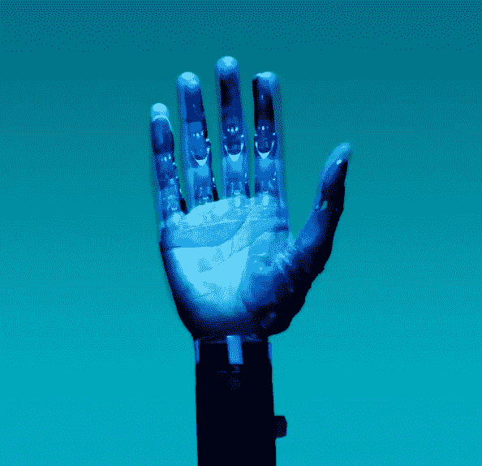
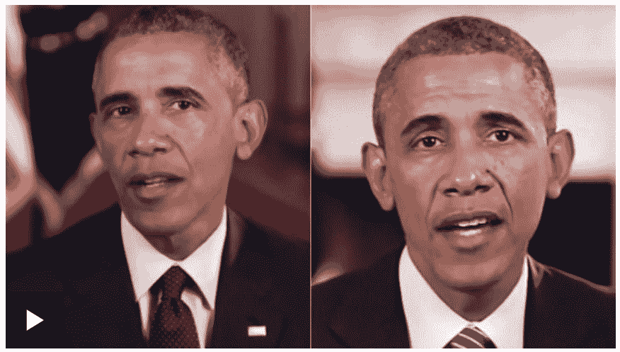
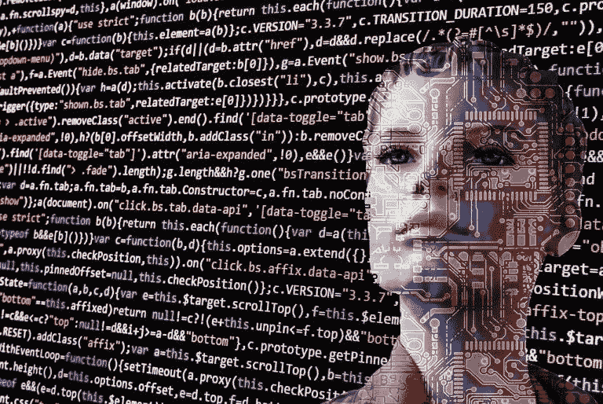
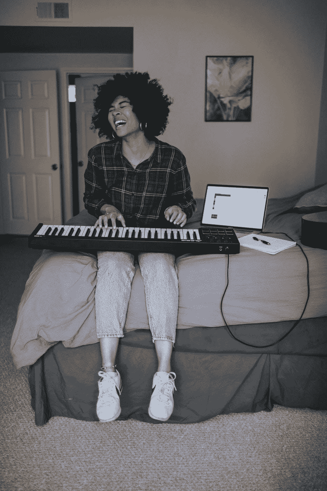
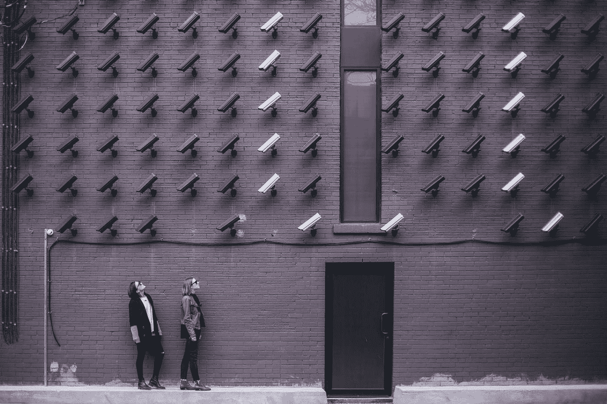

# 用于内容生成的机器学习工具:Open AI、DeepAI、D-ID

> 原文：<https://itnext.io/machine-learning-tools-for-generation-content-open-ai-deepai-d-id-71c84b22b8b3?source=collection_archive---------2----------------------->

# **简介**

机器学习和计算机视觉已经走进了我们的生活。毫无疑问，它们开辟了新的机会。特别是，地下安全服务涉及用于检测和搜索被通缉人员的机器学习。此外，计算机视觉应用于自动驾驶汽车的控制系统，以到达目的地并避免事故。

除了明显的优点，这些技术也有缺点。事实上，机器学习工作的结果可能会被外部各方用于提取个人数据，并出于不公平的目的制造错误信息和假新闻。

[好消息是 Z 世代最有可能从社交网络和新闻网站过滤信息。](https://www.voanews.com/student-union/generation-z-beats-boomers-spotting-fake-news)

*“只有 7%的 Z 世代大学生认为社交媒体是最值得信赖的新闻来源。50%的 Z 世代学生表示，他们认为在线报纸和新闻网站是最值得信赖的。*

# 人工智能(机器学习)产品概述

人工智能工作(机器学习)的结果可以是众所周知的生成产品:照片、视频、音乐、文本。

# 生成的照片

这个服务[thispersonnotexist](https://www.thispersondoesnotexist.com/)提供一个人的预生成照片，这个人从来就不存在。随着猫的照片的生成，情况变得更加复杂。欢迎大家通过[链接](https://thiscatdoesnotexist.com/)在线探索猫咪的照片生成结果。

# 生成的视频

我们所知道的是[一个假奥巴马的高质量视频](https://www.bbc.com/news/av/technology-40598465)使用人工智能工具制作的虚假演讲。综合美国前总统奥巴马可以说任何放在他嘴里的话。生成视频的技术是由华盛顿大学的研究人员提供的，可以产生真实的照片效果。

# 生成的文本

OpenAI 的神经网络 GPT-2/GPT-3 能够根据您自己的描述生成逻辑文本:

[DeepAI](https://deepai.org/machine-learning-model/text-generator) 有针对你的编程语言的文本生成 API 文档:bash/nodejs/python/ruby/c#。

你可以通过链接找到其他有趣的 API 和模型[。其中一些:](https://deepai.org/apis)

*   [图像彩色化](https://deepai.org/machine-learning-model/colorizer)为黑白图像添加颜色
*   [面部识别图像相似度](https://deepai.org/machine-learning-model/facial-recognition)在任何图像、视频或直播视频流中检测和定位面部
*   [情感分析](https://deepai.org/machine-learning-model/sentiment-analysis)将文本分类为积极或消极的情绪
*   [裸体检测](https://deepai.org/machine-learning-model/nsfw-detector)检测照片、视频和直播视频流中的成人内容
*   [文本摘要](https://deepai.org/machine-learning-model/summarization) —缩短长文本文档
*   [姿态检测](https://deepai.org/machine-learning-model/pose-detection)检测人体姿态
*   [文本标记](https://deepai.org/machine-learning-model/text-tagging)从文本中查找关键词
*   [人脸匿名化](https://deepai.org/machine-learning-model/face-anonymization)对图像中的人脸进行匿名化，

# 生成的音乐

相当有趣的工具 [Jukebox](https://openai.com/blog/jukebox/) 是一个从头开始生成音乐的神经网络。

音乐生成的第二个神经网络是 OpenAI 的 [MuseNet](https://openai.com/blog/musenet/) 。它可以用 10 种不同的乐器创作 4 分钟的音乐作品，知道许多不同的风格，并可以将它们融合在一起。

OpenAI 还有很多其他有趣的项目。

# **进一步开发和使用案例**

全新的仪器来自人工智能:

*   在图片、照片、视频或文本中搜索对象和行为模式— *“自行搜索”*
*   虚假陈述和完全删除对象— *“伪装”*
*   生成和搜索合成对象— *“创建和搜索假货”*

难怪，人工智能(机器学习)是一把双刃剑。一方面，使用这些工具会出现新信息，但另一方面，它们会验证内容。简而言之，我注意到了创造和进一步探测之间的对抗。例如，假新闻的产生和在真实新闻中寻找假新闻或在照片(视频)中搜索人以及人脸识别的保护。

关于人们在照片中搜索，我首先想到的是服务 [FindFace](https://findface.pro/) 。它从 2016 年就知道了。它目前只能在 b2b 模式下工作。尽管市场上充斥着允许个人使用的类似公司、机器人和服务。

为了防止面部识别，您可以使用:

*   [照片保护](https://www.deidentification.co/photo-protection/)通过 D-ID
*   [DeepAI 的人脸匿名 API](https://deepai.org/machine-learning-model/face-anonymization)
*   UChicago CS 研究人员制作的 [Fawkes](https://sandlab.cs.uchicago.edu/fawkes/) (保护个人隐私的图像“伪装”)

# 结论

总结一下包括机器学习在内的人工智能——给我们的生活带来新机遇、新内容、新知识的现代工具。因为所说的知识就是力量，即使它们是通过综合的对象获得的。

此外，假新闻不仅可以用来管理和控制人们，还可以在真实事件发生之前揭示有意义的观点和态度。例如为了在通过法律之前了解人们的态度。照片“隐藏”可能有助于在公开性和隐私以及保护个人数据之间达成妥协。