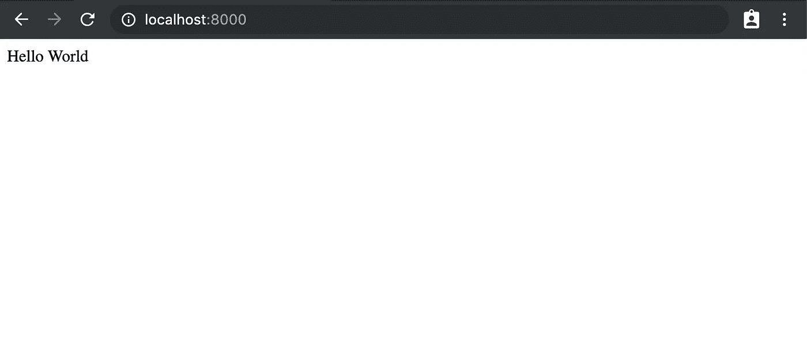
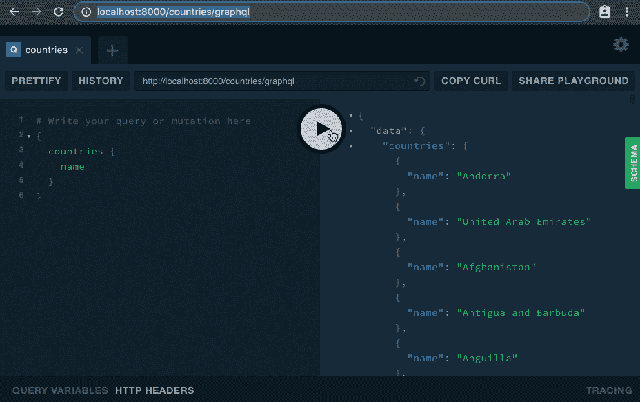
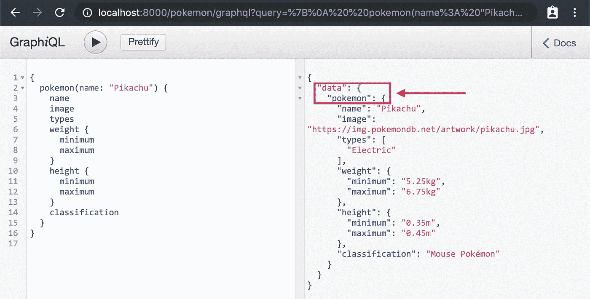
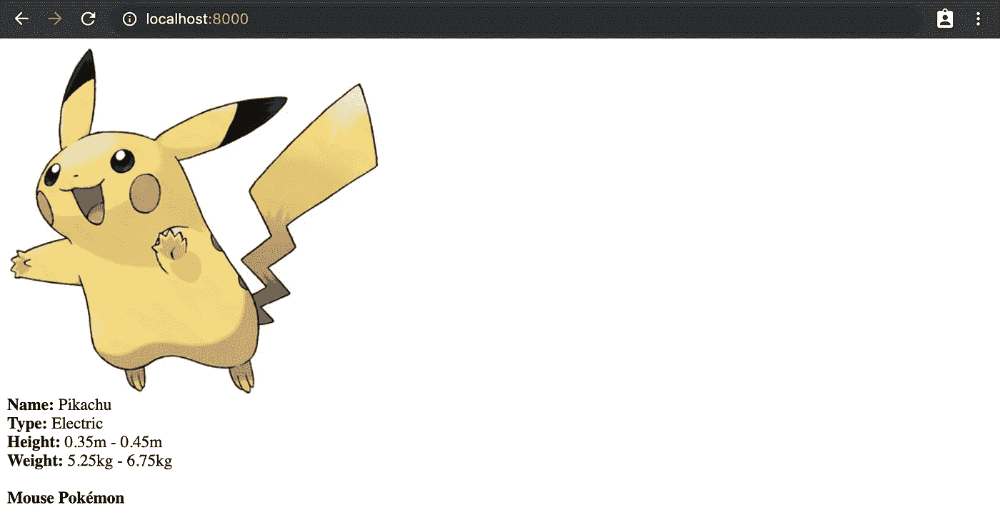
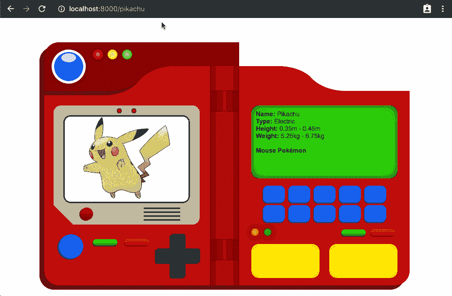
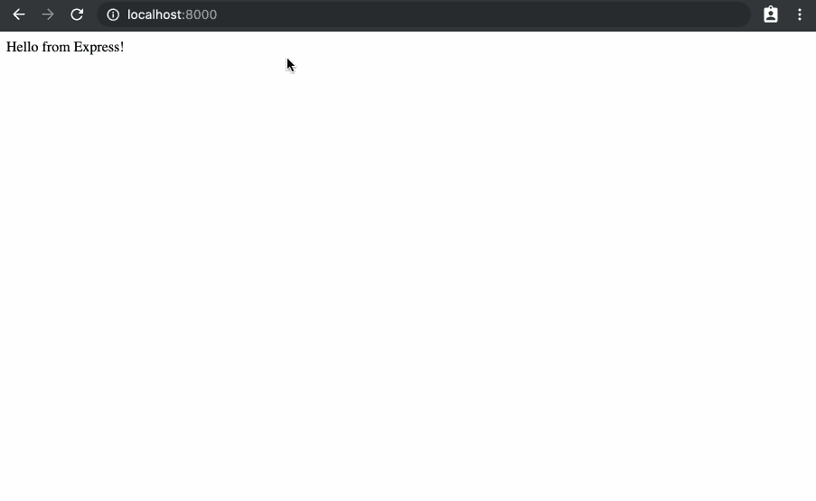

# Magento PWA 工作室:什么是向上？

> 原文：<https://itnext.io/magento-pwa-studio-what-is-upward-acf450fbee3e?source=collection_archive---------2----------------------->


无关，请忽略…

在过去的几个月里，Magento 一直在开发 PWA Studio，简而言之，这是一个工具集，用于在 Magento 2 商店的基础上构建现代渐进式网络应用。

在很大程度上，这些工具已经被其他项目成功地用于生产中，因此 PWA Studio 建立在它们之上是有意义的，例如:

*   **Peregrine** :基于 *React* 的 UI 组件集合，帮助重用常见功能，如路由、渲染页面、产品、价格等。
*   **PWA Buildpack:** 构建和布局优化工具，它扩展了 *webpack* 来帮助配置 PWA Studio 组件并设置本地开发环境。
*   **Venia** :使用 PWA Studio 的库构建的核心店面，它使用 *React* 、 *Redux* 、 *GraphQL* 、 *CSS 模块*等多种技术作为其堆栈的一部分。

然而，有些东西并不像其他东西那样广为人知。**向上**是为 PWA 工作室建造的，所以大多数人没有听说过它是有道理的，但它是最重要的作品之一，事实上我要说它是将其他一切粘合在一起的东西。

但在谈论它是什么之前，重要的是要知道它为什么被制造出来…

# 起初

早期版本的 Venia storefront 在前端使用了大致相同的技术堆栈，但它仍然是作为一个常规的 Magento 2 主题开发的，这不是一个常见的方法，特别是像 [Vue Storefront](https://github.com/DivanteLtd/vue-storefront) 或[神的猎鹰](https://github.com/deity-io/falcon)这样的类似项目正在走向一个更无头的方法。

去除对 Magento 的这种硬依赖是有意义的，但是仍然需要一些东西来处理两者之间的通信。当然你可以直接处理 Magento 的 API，但是:

*   如果你不得不使用多个 API，而不仅仅是 Magento 的，你如何组织所有这些不同的端点呢？
*   如果您需要扩展或改进任何核心 API，该怎么办？如果您需要替换一些端点，是否很容易做到，而且没有很多副作用？
*   不特定于 Magento 的第三方 API(社交媒体、运费计算、CMS 等)如何？您是否需要创建自定义扩展来与它们交互？

这些问题都是由解决的，它有一个单一的位置，请求被发送到那里，并总是以你期望的方式返回数据。

# 那是什么？

简而言之: **UPWARD** 是充当 PWA 和 API 之间中间层的服务器，它有多种好处，但对我来说，最主要的好处是它有助于将所有 API 统一在一个地方，因此您不必跟踪多个端点以及如何访问它们。

也许《T4》的幕后策划人詹姆斯·泽特伦可以更好地解释这一点:

使 **UPWARD** 如此独特的是，它本身不是一个服务器，它实际上是一个*规范*，描述了当数据以不同方式被请求时，服务器应该如何响应。就像 *GraphQL* 是一个规范，像 *Apollo* 和 *Relay* 这样的库是这个规范的实现一样， **UPWARD** 已经在 [NodeJS](https://github.com/magento-research/pwa-studio/tree/develop/packages/upward-js) 和 [PHP](https://github.com/magento-research/upward-php) 中正式实现，但是没有理由说它不能在其他技术中实现。

**向上**定义服务器行为的方式是通过使用特殊语法的 YAML 配置文件。这个文件类似于*。htaccess* 文件是针对 Apache 服务器的，它们的工作方式并不完全相同，但是我发现这种比较有助于理解这个概念。

尽管 **UPWARD** 是为 PWA Studio 设计的，但它是平台不可知的，因此它可以用于任何需要与服务器交互的东西，甚至不一定是 PWA！

# 它看起来怎么样？

与许多通常通过例子更容易理解的事情一样，我将展示一些不使用任何框架的用例，因为这使得解释起来更简单，并且不需要任何特殊的工具，但是您可以很容易地将它们适应您选择的 JS 风格。

# 1.你好世界

让我们从创建一个新的节点服务器并安装所需的依赖项开始，对于这些示例，我将使用`yarn`,但是如果您愿意，也可以随意使用`npm`:

```
yarn add @magento/upward-js express
```

UPWARD-JS 是建立在 *express* 之上的，所以我们需要把它安装成一个对等依赖。

现在，让我们向 package.json 文件中的“scripts”块添加一个命令:

```
*"start"*: "node server.js"
```

这将使用我们现在创建的 *server.js* 文件启动我们的服务器:

这是启动 **UPWARD-JS** 服务器最简单的方法之一，我们只需要调用带有几个必需参数的`createUpwardServer`函数。其中大多数都是不言自明的，我们在这里所做的只是使用端口 8000 创建和绑定一个新的服务器，为调试启用日志记录，并将路径传递给我们的 YAML 配置文件。

正如您所看到的，配置文件相当容易阅读(至少目前如此)， **UPWARD** 要求我们至少指定 3 个属性:服务器*状态* 代码、*标题*和*主体*。在本例中，我们将服务器配置为用 200 响应代码和正文中的 HTML 文本“Hello World”来响应所有请求。

注意“inline”属性让我们直接在配置文件中将值定义为字符串，这在**向上**规范中被称为*解析器*，稍后我们将了解更多。

现在，如果我们运行`yarn run start`并访问 [http://localhost:8000](http://localhost:8000) ，我们将能够看到我们努力工作的结果:



谁需要快递？

因为现在所有的 URL 都将返回相同的“Hello World”字符串，这很有效，但不是很有用。让我们看看如何在现实世界中制造出能真正帮助我们的东西。

# 2.代理请求

现代 web 应用中最常见的用例之一是与多个 API 交互，而不是必须跟踪多个端点，我们可以设置我们的**向上**服务器来代理对不同服务的请求，所以我们只需要向它发送请求(再见 CORS 问题！).

为此，我们需要在我们的 YAML 配置中开始使用*解析器*,*解析器*定义获取数据的方式，它由我们的 YAML 文件中的属性定义。在前面的例子中，我们使用了“内联解析器”,它返回一个字符串，但是对于更复杂的场景，还有许多其他的解析器。

假设我们想要查询两个不同的 GraphQL APIs，一个用于检索神奇宝贝数据(必须全部捕获！)和另一个用于国家数据。这是两种不同的服务，但我们希望设置它们，以便我们可以使用:

*   [http://localhost:8000/pokemon/graph QL](http://localhost:8000/countries/graphql)查询一个神奇宝贝 API。
*   [http://localhost:8000/countries/graph QL](http://localhost:8000/countries/graphql)查询国家 API。

我们需要扩展我们的配置文件，如下所示:

啊，事情看起来更有趣，我在文件中添加了一些注释，因为它开始变得更像一个流程图。如你所见，状态、标题和正文不再是硬编码的，而是由一个`response`属性获取，你可以随意命名，但这意味着**向上**将执行这个`response`来获取它需要的值。让我们按顺序遵循请求流程:

**#1 响应**:该属性使用了一个“条件解析器”，其工作原理与 PHP switch 语句相同。在这种情况下，我们检查:

1.  如果 URL 匹配“/pokemon/graphql”它将使用`pokemonGQL`解析器，
2.  如果与“/countries/graphql”匹配，它将使用`countriesGQL`解析器，
3.  否则使用`helloWorld`解析器。

**#2、#3 pokemonGQL/countriesGQL:** 这些属性使用“代理解析器”，它们所做的只是设置请求将被代理到的 URL，在我们的例子中，我们使用之前使用的“内联解析器”为我们的第三方服务硬编码 URL。

**#4 helloWorld:** 如果 URL 与前面的任何一个都不匹配，我们将像以前一样返回相同的“helloWorld”字符串，现在我只是将配置移动到它自己的解析器中。

因为没有其他需要解决的问题**向上**可以最终返回响应，如果一切顺利，我们应该可以访问我们全新的端点:



# 3.呈现 HTML

显示一个“Hello World”字符串性能很好，但不是很有用，所以让我们稍微修改一下，以显示更复杂的 HTML 标记，并探索其他类型的解析器。

默认情况下**向上**支持使用 Mustache 模板系统，它在功能上非常轻量级和基本，但这通常是一件好事，因为它防止我们在模板中混入太多逻辑。如果你想了解更多，请随意阅读官方回购。

因此，让我们使用 Mustache 来显示一些神奇宝贝数据，而不是“Hello World”字符串，这也将是使用“服务解析器”的好机会:

配置文件的第一部分是相同的，但是在`response`属性中情况开始变得不同:

**#2、#3 pokemonGQL/countriesGQL:** 我没有对 GraphQL 端点进行硬编码，而是将其改为使用环境变量，它们可以通过向`createUpwardServer`函数传递一个`env`参数或使用类似 [dotenv](https://www.npmjs.com/package/dotenv) 的库来设置。在任何情况下，这都有助于使我们的配置更加可定制，因为每个环境可以有不同的值。

**#4 口袋妖怪:**我们现在将使用“口袋妖怪”属性作为默认响应。为此，我们将使用“模板解析器”来渲染带有小胡子模板的身体，这可以在它自己的文件中设置，我们可以将路径传递给它以使事情更有条理。注意这里的`provide`属性，它定义了我们模板中可用的数据，反过来它也可以是一个解析器，让我们继续深入兔子洞。

**#5 pokemonData:** 一旦我们更进一步，这将更有意义，因为现在要理解这是调用另一个“pokemonResult”属性。

**#6 pokemonResult:** “服务解析器”允许我们从 GraphQL 服务中获取数据，因此我们将使用它来获取神奇宝贝信息。它将`url`作为端点，将`query`作为参数，我们现在硬编码为内联参数，以返回皮卡丘的统计数据。如果我们回到之前的“pokemonData”值`pokemonResult.data.pokemon`，我们可以看到它映射到我们从 GraphQL 查询中得到的结果:



GraphQL 响应数据

这意味着来自`pokemon`节点的所有数据现在都可以在我们的 Mustache 模板中获得:

这对于服务器端呈现非常有用，一旦执行完所有解析器，内容将从服务器发送。现在，如果我们去我们的**向上**服务器中的任何 URL(除了代理的 GraphQL 服务器),我们应该会看到皮卡丘惊人的统计数据:



小胡子模板渲染

# 4.使用变量

如果能够使用 URL 通过名称获取特定的神奇宝贝统计数据就好了，所以我们就这么做吧。我们将进一步清理配置文件，使其更易于阅读，并向其中添加一些解析器:

除了一些调整和添加之外，配置基本相同:

**#1 响应:**这里有一个额外的条件检查，看看我们请求的是 favicon 还是 CSS 文件，对于这两种情况，我们都将使用“静态解析器”(#8)，它基本上将文件原样返回到“静态”文件夹中(这里没有魔法)。

**#6 pokemonResult:** 我们将 GraphQL 代码移动到它自己的文件中，并用一个`query`包装它，这样我们可以向它传递变量，然后用属性中的一个`variables`节点指定它们，该节点指向另一个“条件解析器”。

带有变量名的 GraphQL 查询

**#7 pokemonName:** 正如在#1 中一样，我们检查 URL 是否匹配特定的模式(任何以正斜杠开头的内容)，如果匹配，我们使用特殊的关键字`$match.$1`返回它，这是将用于上面的 GraphQL 查询的值。

现在有了一些 CSS，我们应该能够通过在 URL 中传递名称来查看 API 中可用的所有神奇宝贝的统计数据:



比德吉的 [Pokedex 风格](https://codepen.io/Bidji/pen/MYdPwo)的功劳

如您所见， **UPWARD** 允许我们在几乎不编写任何 javascript 的情况下实现一些有趣的功能，然而，如果您对 NodeJS 更熟悉，或者如果您已经有了一个 *express* 服务器，您也可以将 **UPWARD** 用作一个中间件，这样它就可以作为您当前服务器的一个附件，并以一种更加渐进的方式引入，而不是一次性替换 *express* 。

所以你的`server.js`可能看起来像这样:

然后前往`/`路线的请求将由*快递*送达，其余外包给**上行**。



# 概括起来

**向上**可以给我们很多对服务器的控制和定制，而不必直接与 *express* 或类似的其他技术交互。即使在它的早期，我也惊讶于它能让我们做多少开箱即用的事情，所以我希望它会越来越好。

如果你想自己尝试一下，看看规范的官方 Github repo(T28)，我注意到它不是最新的，在大多数情况下，这些例子都没有意义，因为项目一直在快速变化，所以我建议深入研究一下 UPWARD JS 代码(T30)或 Venia 实现(T32)，以获得最新和最棒的特性。

文章中的所有例子都可以在 Github 中找到，所以请随意使用它，并提交任何更改或改进。👋🏽

[](https://github.com/jahvi/upward-examples) [## Jah VI/upward-示例

### 使用 Magento 的 UPWARD JS 服务器的例子。通过创建一个帐户，为 jahvi/upward-examples 的发展做出贡献…

github.com](https://github.com/jahvi/upward-examples)