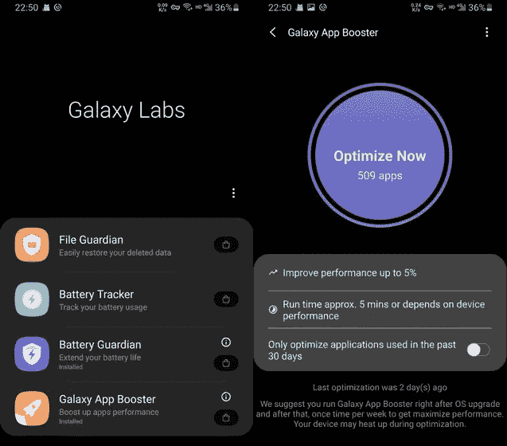

# Galaxy App Booster 的“魔术”

> 原文：<https://itnext.io/magic-trick-of-galaxy-app-booster-684e1984576e?source=collection_archive---------1----------------------->

> [之镜 hubo.dev](https://hubo.dev/2020-11-25-magic-tricks-of-samsung-app-booster-revealed/)



我碰巧尝试了一款名为 [Galaxy App Booster](https://galaxystore.samsung.com/prepost/000004665772?appId=com.samsung.android.appbooster) 的应用，它是三星发布的 [Galaxy Labs](https://galaxystore.samsung.com/prepost/000004665763?appId=com.android.samsung.utilityapp) 的一部分。它声称可以优化设备上的所有应用程序，并将整体性能提升 5%至 15%。它很有吸引力，许多用户也在非三星手机上使用它。

它使用什么样的优化，如何估计改进？它只是做了一个虚假的工作，欺骗我们的思想吗？我决定研究一下里面的魔术。

# TLDR

App Booster 立即在所有应用上运行配置文件引导的编译。这可能会使一些应用程序在空闲维护模式下被操作系统优化之前运行得更快，这意味着可能需要几天时间。

# 得出源码

我从 apkmirror 获取了一个 [apk 文件](https://www.apkmirror.com/apk/samsung-electronics-co-ltd/app-booster/)，然后使用 [jadx](https://github.com/skylot/jadx) 对其进行反编译:

```
jadx -e -d booster app-booster.apk
```

虽然很混乱，但我可以在 Android Studio 中加载代码，并手动重命名主逻辑的类和方法。就变得容易理解了。

# 优化应用

当点击“立即优化”时，它会调用`startCompileServices`:

`startCompileServices`启动编译服务:

`OptimizeService`调用每个包上的`cmd package compile -m speed-profile`:

对改善的估计很简单。如果之前没有完成完整的优化，则设置为 15%。否则就是 5%。

# 更多解释

从 Android 7.0 开始，Android 运行时(ART)使用超前(AOT)编译、实时(JIT)编译和配置文件引导编译的混合组合。该组合是可配置的，典型模式使用以下流程，如[官方文件](https://source.android.com/devices/tech/dalvik/configure#how_art_works)中所述:

1.  应用程序最初安装时没有任何 AOT 编译。应用程序最初几次运行时，它将被解释，频繁执行的方法将被 JIT 编译。
2.  当设备空闲和充电时，编译守护程序会运行，根据第一次运行时生成的配置文件对常用代码进行 AOT 编译。
3.  应用程序的下一次重启将使用概要文件引导的代码，并避免在运行时对已经编译过的方法进行 JIT 编译。在新的运行过程中被 JIT 编译的方法将被添加到概要文件中，然后由编译守护进程获取。

App Booster 使用的命令`cmd package compile -m speed-profile`告诉编译器工具`dex2oat`立即验证和 AOT 编译一个应用的概要文件中列出的方法，这与步骤 2 的工作相同。如果第二步没有被触发，速度差异是显而易见的，正如我在 YouTube 上找到的一个视频所示:

概要引导编译是一项强大的技术。Google Play 甚至在去年推出了[“Play Cloud 中的艺术优化配置文件”](https://android-developers.googleblog.com/2019/04/improving-app-performance-with-art.html)，它通过收集应用程序首次推出时的配置文件，在安装或更新时运行编译。如果应用程序是从 Google Play 下载的，那么 App Booster 的优势就不那么显著了。