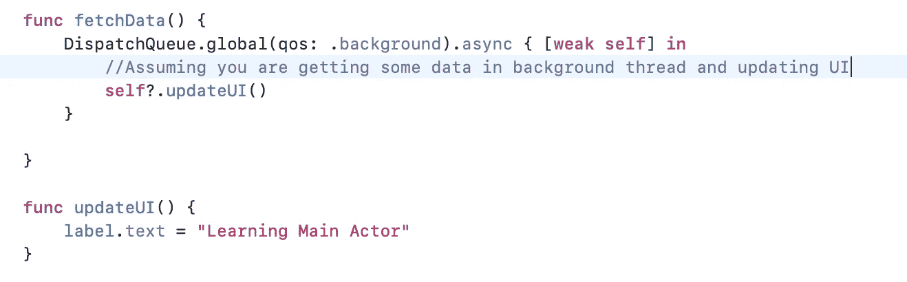
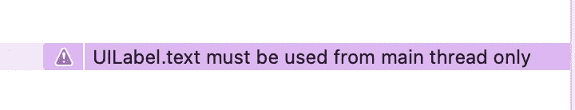
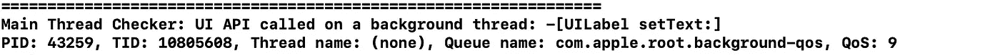
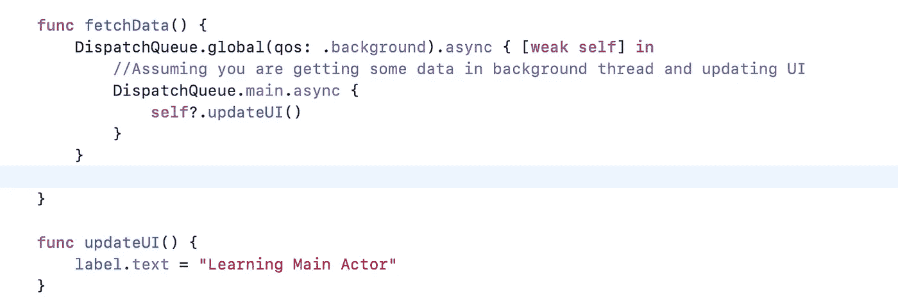
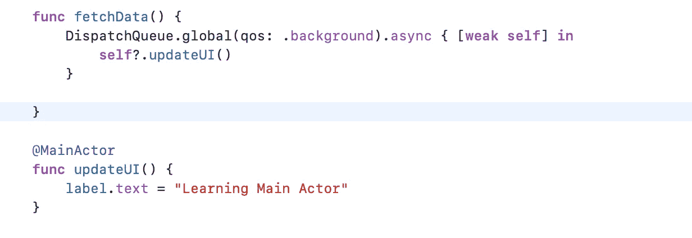
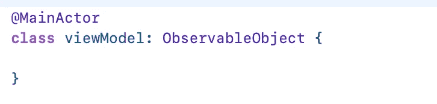
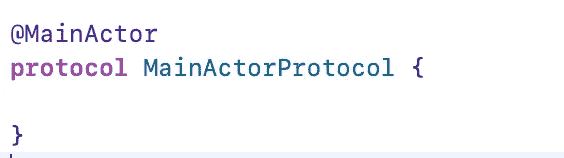
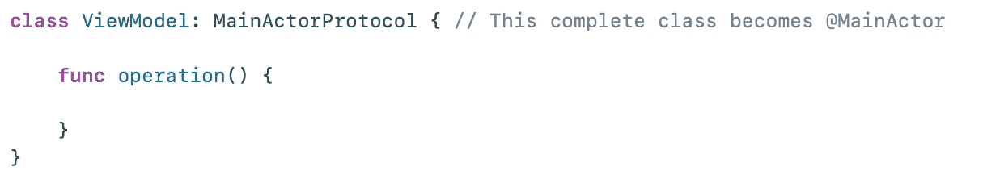
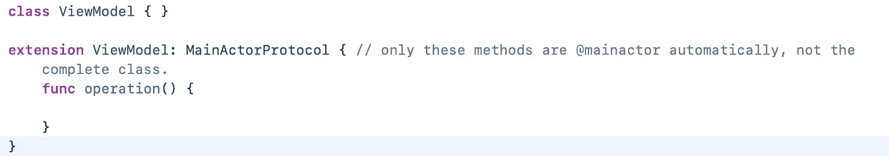

# @ Swift 中的 MainActor 详细演练

> 原文：<https://itnext.io/mainactor-in-swift-detailed-walkthrough-94044c83118b?source=collection_archive---------1----------------------->

## 在主线程中更新 UI 元素不再需要 DispatchQueue.main.async。最新的 Swift 的@MainActor 将取代它，使我们的编码更加简单易懂。

Swift 中的@MainActor 是 Swift 5.5 中一个有趣的新增功能。如果你还不熟悉 Swift 中的演员，我建议你读一下我的文章[Swift 中的演员](https://devcracker.medium.com/swift-actors-e80ff0dc1832)。因为了解演员会让你更了解@MainActor。简而言之，通过在 Swift 中引入 Actor，Swift 并发编程被带到了一个新的高度。Swift Actors 通过消除我们的手动样板代码，将数据放在一个队列/线程中，帮助我们在没有数据竞争问题的情况下访问数据。

## 使用 Swift 的@MainActor:

现在，让我们深入到用例中。我们有一个典型的例子，我们在后台或新线程中从服务器或本地数据库获取数据，并发布我们将在 UI 组件中更新它们。下面是示例截图。

获取数据并在非主线程中更新数据 Swift 中的@MainActor

在上面的代码片段中，我们有一个问题。因为我们的标签正在后台线程中更新。会发生什么？当我们运行这段代码时，我们将得到这个警告和一个崩溃。

UI 主线程警告 swift 中的@MainActor

在非主线程中访问 UIKit 时崩溃 swift 中的@MainActor

因此，为了解决这个问题，我们使用 DispatchQueue.main.async { }调用该方法，如下所示。

调度队列 main 以更新 UI 元素 swift 中的@MainActor

这很好。但是，有时我们会忘记从调度主队列中调用这个方法，我们在执行类似操作的任何地方都必须这样做。

## swift 中的@MainActor 是什么:

所以，最新的 swift 并发编程带来了@MainActor，让这个变得更简单更有效。再次，我想重复，如果你不熟悉，请阅读[我在 Swift](https://devcracker.medium.com/swift-actors-e80ff0dc1832) 上关于演员的文章，以便更好地理解

在 swift 中使用@MainActor

如果我们观察上面的截图，@MainActor 是我们在函数声明中添加的属性，并删除了 DispatchQueue.main.async .意思是，通过将这个操作转换到主线程，这个函数将在主线程中自动执行。Swift 在最新的并发系统中为我们做了这件事。太酷了！！！。这有助于我们删除重复的代码，减少我们的人为错误。

> Swift 中的这个主要参与者在主线程中执行所有操作。苹果在 UIKit、SwiftUI 等中明确使用它们…

## 带有@MainActor 的类:

我们可以将一个完整的类声明为@MainActor，也就是说，该类中的属性和方法将在主线程中执行。下面的截图用@MainActor 属性标记了我们的 viewmodel 类。因此，所有的方法和属性现在都流入了主线程。

使用@MainActor 属性声明类

我们在这里有一个问题，如果我们有一个方法或者属性，不需要在这个类的主线程中，该怎么办？是的，我们可以将它们标记为“非隔离的”([Swift Actor](https://devcracker.medium.com/swift-actors-e80ff0dc1832#:~:text=Isolated%20access%20vs%20nonisolated%20access%3F)中的一个概念)。

## 继承在@MainActor 上的表现。

好了，我们有了一个类，并用@MainActor 标记，如果继承了那个类会怎么样。按照最小惊奇原则，子类也将是@MainActor。

覆盖@MainActor 方法也将成为@MainActor 方法。

## **@协议中的主要角色用法:**

假设我们有一个协议，它有一个带有@MainActor 属性的方法，如下所示，

swift 中作为@MainActor 的协议方法

实际上，这个类或任何类型用相同的方法确认这个协议，这也将成为@MainActor。

协议方法自动变成@MainActor

让我们更深入地了解协议的用法。我们可以将完整的协议标记为@MainActor 吗？。是的，这是可能的。

作为@MainActor 的完整协议

好，不同情况下会有什么表现。💁

> 在 main 定义或声明中确认该协议的类或类型将完全成为@MainActor，而如果该类或结构或任何其他类型在扩展中确认该协议，则只有那些方法成为@MainActor。

为了清楚起见，请参考下面的快照。

通过确认@MainActor 协议，以@MainActor 完成类

@MainActor 协议的扩展构造

同样的事情也适用于其他类型，如 struct 或 enum 等。

目前就这些。感谢阅读！！！。如果你喜欢我的文章，并认为我在这篇文章上花费的时间和精力值得赞赏，请与你的同事/朋友分享这一页，或者在这一页上为我鼓掌。