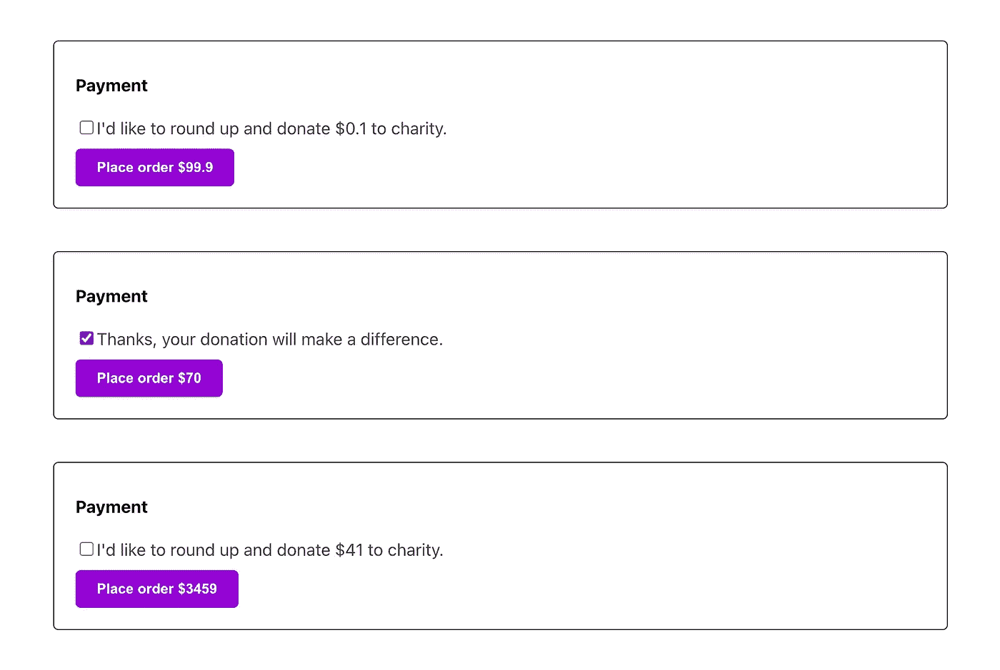

# 可维护的反应——关于综述的故事(下)

> 原文：<https://itnext.io/maintainable-react-a-story-about-round-up-part-ii-c56fca93b830?source=collection_archive---------0----------------------->


照片由[未修改](https://unsplash.com/@norevisions?utm_source=medium&utm_medium=referral)[上的](https://unsplash.com?utm_source=medium&utm_medium=referral)Unsplash

*【更新 11。现在整个系列都完成了，我在 leanpub 上为它创作了一本书*[](https://leanpub.com/react-clean-code)**。你可以用* [*这个链接七折获得一份*](https://leanpub.com/react-clean-code/c/mYXp686cMFw1) *。自从本文(和第二部分)首次发表以来，我已经做了许多修改，我真的相信新的方法要好得多。请读一读，我相信你会成为一个更高效、更优秀的开发人员。**

**更新(2022 年 9 月 25 日):我在这篇* [*可维护的 React Cheatsheet*](https://icodeit.ck.page/maintainable-react-tips) *中总结了 7 个小技巧，可以在这里* *免费下载* [。](https://icodeit.ck.page/maintainable-react-tips)*

*在本教程的第一部分[中，我们已经讨论了一个关于凑集和捐赠的特性。经过几次重构，我们的代码已经达到了处理业务逻辑和可维护的程度。但是我们的故事还没有结束。](/a-not-too-short-story-about-rounding-up-24cb4bdfcb69)*

# *新要求—丹麦货币*

*上面的代码并不完美，但它符合当前所有的业务需求。直到有一天，你听到你的老板谈论一些关于丹麦市场的事情。你没有太在意，但很快你意识到在丹麦，货币与你放入代码中的另外两种略有不同。*

*另外，需要注意的是，他们使用逗号作为小数点分隔符，而在其他一些国家，如澳大利亚，我们使用点(或点)来代替。所以当我第一次看到比萨饼的价格时，我非常震惊。*

*丹麦的新逻辑是，我们应该四舍五入到最接近的十位数。比如`61,00`要上舍入到`70,00`，`70,00`要上舍入到`80,00`。*

*是啊，我知道。但是我们已经有了上面的日本例子，编写测试只是小菜一碟。*

```
*describe('DK', () => {
    it('rounds up to nearest tens', () => {
      const total = getRoundedUpTotalForDK(61)
      expect(total).toEqual(70)
    }) it('add 10 for integers', () => {
      const total = getRoundedUpTotalForDK(70)
      expect(total).toEqual(80)
    })
  })*
```

*实现只是复制和粘贴:*

```
*export const getRoundedUpTotalForDK = (total: number) => Math.floor(total / 10 + 1) * 10*
```

*我不想把`getRoundedUpAmountForDK`放在这里让你感到厌烦，但是让我们仔细看看这些助手，看看我们是否可以简化它们一点。*

```
*export const getRoundedUpTotal = (total: number) => Math.floor(total + 1)export const getRoundedUpAmount = (total: number) => {
  const roundedUpAmount = getRoundedUpTotal(total) - total
  return parseFloat(roundedUpAmount.toPrecision(10))
}export const getRoundedUpTotalForDK = (total: number) => Math.floor(total / 10 + 1) * 10export const getRoundedUpAmountForDK = (total: number) => {
  const roundedUpAmount = getRoundedUpTotalForDK(total) - total
  return parseFloat(roundedUpAmount.toPrecision(10))
}export const getRoundedUpTotalForJP = (total: number) => Math.floor(total / 100 + 1) * 100export const getRoundedUpAmountForJP = (total: number) => {
  const roundedUpAmount = getRoundedUpTotalForJP(total) - total
  return parseFloat(roundedUpAmount.toPrecision(10))
}*
```

# *从小重构开始*

*如果忽略一些细节，太像了，形式上几乎一模一样吧？先从一些小动作开始。行`parseFloat(roundedUpAmount.toPrecision(10))`出现了三次，所以最好有一个函数本身:*

```
*const getPrecisionFixedValue = (number: number) => {
  return parseFloat(number.toPrecision(10))
}*
```

*而`getRoundedUpAmountForXXX`会被简化成:*

```
*export const getRoundedUpAmount = (total: number) => {
  const roundedUpAmount = getRoundedUpTotal(total) - total
  return getPrecisionFixedValue(roundedUpAmount)
}*
```

*我知道这不太令人兴奋，但我们已经取得了一些进展。实际上，我们可以做得更好。秘密武器是高阶函数。*

# *高阶函数*

*幸运的是，当我们使用 JavaScript 时，我们可以使用高阶函数和`currying`来简化`Math.floor`部分，就像，很多。*

*如果你看这三个陈述，你看到了什么？*

```
*Math.floor(total + 1)
Math.floor(total / 10 + 1) * 10
Math.floor(total / 100 + 1) * 100*
```

*或者，为了让你更清楚，如果我把它改变一点点:*

```
*Math.floor(total / 1  + 1) * 1
Math.floor(total / 10 + 1) * 10
Math.floor(total / 100 + 1) * 100*
```

*或者*

```
*Math.floor(total / 10^0 + 1) * 10^0
Math.floor(total / 10^1 + 1) * 10^1
Math.floor(total / 10^2 + 1) * 10^2*
```

*因此，我们可以有一个接受(0，1 或 2)并返回上述表达式之一的函数:*

```
*const getDonationAmountWithNearest = (exp: number) => (total: number) => {
  const nearest = Math.pow(10, exp - 1)
  return Math.floor(total / nearest + 1) * nearest
}*
```

*所以`Math.pow(base, exponent)` returns T 函数返回底数的指数幂，就像在 base^exponent，底数和指数都是十进制数字系统。*

*因此，基本上，我们可以定义一些更有用的小函数，比如:*

```
*const roundUpToNearestInteger = getDonationAmountWithNearest(1)
const roundUpToNearestTen = getDonationAmountWithNearest(2)
const roundUpToNearestHundred = getDonationAmountWithNearest(3)*
```

*因此，在这里，通过使用高阶函数，我们创建了三个更通用和纯粹的算法，它们不与任何业务逻辑绑定，而是纯粹的数学公式。*

# *又一轮高阶函数*

*正如我们已经注意到的，这些`getRoundedUpAmountForXXX`几乎是相同的，因此使用相同的技术，我们可以将差异提取到新函数的参数中:*

```
*const getRoundedUpAmountWith = (getRoundedUpTotalFor: (total: number) => number) => (total: number) => {
  const roundedUpAmount = getRoundedUpTotalFor(total) - total
  return getPrecisionFixedValue(roundedUpAmount)
}*
```

*注意，这个新定义的函数的返回值是一个`function`，这个新函数可以做`getRoundedUpAmountForXXX`所做的事情。例如:*

```
*export const getRoundedUpAmountForJP = getRoundedUpAmountWith(getRoundedUpTotalForJP)
export const getRoundedUpAmountForDK = getRoundedUpAmountWith(getRoundedUpTotalForDK)*
```

*很酷，对吧？现在，这些助手只调用定制的高阶函数:*

```
*export const getRoundedUpTotal = getDonationAmountWithNearest(1)
export const getRoundedUpAmount = getRoundedUpAmountWith(getRoundedUpTotal)export const getRoundedUpTotalForDK = getDonationAmountWithNearest(2)
export const getRoundedUpAmountForDK = getRoundedUpAmountWith(getRoundedUpTotalForDK)export const getRoundedUpTotalForJP = getDonationAmountWithNearest(3)
export const getRoundedUpAmountForJP = getRoundedUpAmountWith(getRoundedUpTotalForJP)*
```

# *查找地图*

*你知道吗？我们甚至可以简化上面的代码。引入一个映射，然后查找该映射，而不是 if-else 或 switch cases，可以进一步简化逻辑。*

```
*const algorithmMap = {
  AU: roundUpToNearestInteger,
  DK: roundUpToNearestTen,
  JP: roundUpToNearestHundred
}const useRoundUp = (price: number, countryCode: CountryCode) => {
  const [agreeWithDonation, setAgreeWithDonation] = useState<boolean>(false)
  const updateDonationAgreement = () => setAgreeWithDonation(withDonation => !withDonation) const getRoundedUpTotal = algorithmMap[countryCode]
  const getRoundedUpAmount = getRoundedUpAmountWith(getRoundedUpTotal) const roundedUpAmount = getRoundedUpAmount(price)
  const total = agreeWithDonation ? getRoundedUpTotal(price) : price return {
    agreeWithDonation,
    updateDonationAgreement,
    total,
    roundedUpAmount
  }
}*
```

*请注意我们是如何使用这两个就地生成的函数来动态计算价格和取整金额的:*

```
*const getRoundedUpTotal = algorithmMap[countryCode]
  const getRoundedUpAmount = getRoundedUpAmountWith(getRoundedUpTotal)*
```

*由于这两个函数是动态生成的，我们不再需要预定义的`getRoundedUpTotalForJP`函数族。*

*这种方法最漂亮的部分可能是，每当添加一个具有不同舍入算法的新市场时，我们只需要修改`algorithmMap`(希望如此)，所有部分都保持不变。*

*此外，您可能已经注意到，我们的测试仍然是绿色的，这是我们可以进行这些大的更改而不必太担心破坏任何现有功能的另一个原因。*

**

*不同国家的汇总逻辑不同*

# *摘要*

*在本教程中，我向您介绍了一个摘自真实项目特性的示例。说实话，接任务的时候没想太多(日本市场新要求)。当丹麦市场出现类似但不同的需求时，我重构了代码，使其更加通用和简洁，然后是最终结果。*

*我想并不是每一个特性都如此简单，或者仅仅是像这样的数学公式。不过，这个想法是，你应该始终注意小的变化，并意识到任何水平的重复。一旦你确定了一些，试着通过将代码提取到一个函数中或者使用更高阶的函数来摧毁它们。请注意，您不必一次完成所有清理工作。相反，你应该继续工作，反复检查你的解决方案，最终，你会比以前更好，整体代码库的质量也会更好。*

*【更新 11。2022 年 11 月]现在整个系列都完成了，我在 leanpub 上为它创作了一本书。你可以用[这个链接打 7 折](https://leanpub.com/react-clean-code/c/mYXp686cMFw1)得到一本。自从本文(和第二部分)首次发表以来，我已经做了许多修改，我真的相信新的方法要好得多。请读一读，我相信你会成为一个更高效、更优秀的开发人员。*