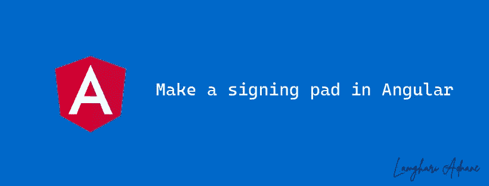
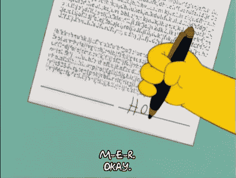
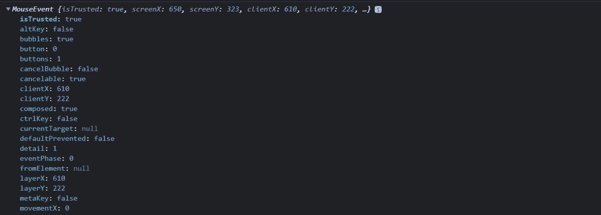
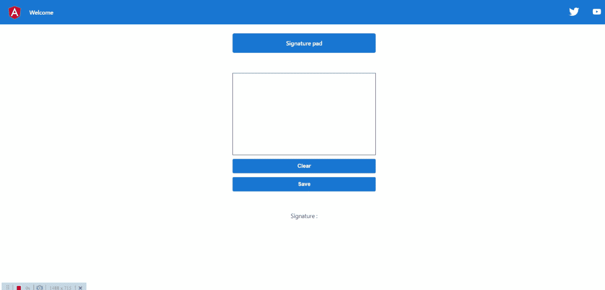

# 用 Angular & Vanilla js 做一个签名簿

> 原文：<https://itnext.io/make-a-signing-pad-in-angular-vanilla-js-7a3eb7e0599d?source=collection_archive---------2----------------------->

如何在 Angular 中制作签名板并将数字签名存储在服务器中



你好世界！

在本文中，我将与您分享如何使用 Canvas 在 Angular 中创建签名板，以及如何将签名保存为图像以供将来使用。

原理很简单，我们将创建一个[画布](https://developer.mozilla.org/en-US/docs/Web/HTML/Element/canvas)，并在上面绘制我们的签名，瞧！

但是怎么做呢？别担心，我会详细解释的:)



对了，荷马，这不是握笔的正确方式！

如你所知，荷马的签名来自其手/笔的运动；在我们的例子中，我们需要跟随计算机的鼠标在画布上的移动，并且由于 **MouseMove** 事件，Angular 将通知我们并给我们光标的坐标:



鼠标事件

这里，clientX et 和 clientY 是光标的坐标，这将帮助我们使用 [CanvasRenderingContext2D](https://developer.mozilla.org/en-US/docs/Web/API/CanvasRenderingContext2D) 在画布上绘制签名。

> 作为 [Canvas API](https://developer.mozilla.org/en-US/docs/Web/API/Canvas_API) 的一部分，`CanvasRenderingContext2D`接口为`[<canvas>](https://developer.mozilla.org/en-US/docs/Web/HTML/Element/canvas)`元素的绘制表面提供了 2D 渲染上下文。它用于绘制形状、文本、图像和其他对象。

因此，对于每个事件，我们将使用`[CanvasRenderingContext2D.lineTo(](https://developer.mozilla.org/en-US/docs/Web/API/CanvasRenderingContext2D/lineTo))`函数绘制一条线，将当前点(当前事件坐标)与最后注册的点连接起来；我们需要不断重复同样的操作，直到我们画完签名:

```
 onMouseMove(e: any): void {
    if (this.isDrawing) {
      const coords = this.relativeCoords(e);
      this.context.lineTo(coords.x, coords.y);
      this.context.stroke();
    }
  }
```

坚持住！我们现在知道了绘图是如何工作的，但是我们如何检测签名的开始和结束呢？答案是 MouseUp 和 MouseDown 事件❤；

MouseDown 表示我们开始按住鼠标按钮，这代表开始绘制签名(isDrawing = true)而当我们释放按钮时触发 MouseUp，这代表签名的结束(isDrawing = false)！

```
 onMouseDown(e: any): void {
    // The mouse button is clicked, which means the start of drawing the signature
    this.isDrawing = true;
    const coords = this.relativeCoords(e);
    this.context.moveTo(coords.x, coords.y);
  }

  @HostListener('document:mouseup', ['$event'])
  onMouseUp(e: any): void {
    // The mouse button is released, so this means the end of drawing the signature
    this.isDrawing = false;
  }
```

所有这些用鼠标就能完美完成！但是我们需要在手机或者平板上用手指签什么呢？

前面的代码可能不起作用，但是有一个解决方案可以让我们完成我们的解决方案！touchstart 和 touchmove 事件！touchstart 和 touchmove 的工作方式与 mousedown 和 mousemove 事件非常相似。

最后，为了将绘图/签名转换成图像，Canvas API 提供了一个函数 [toDataURL()](https://developer.mozilla.org/en-US/docs/Web/API/HTMLCanvasElement/toDataURL) :

```
this.signatureImg = this.sigPadElement.toDataURL('image/png');
```

我们的最终代码是:

最后，这里是结果:



自己试试:

Github 上的项目:

[](https://github.com/adnanelamghari/signing-pad) [## GitHub-adnanelamghari/Signature-pad:使用画布的 Angular 签名板

### 此项目是使用 Angular CLI 版本 14.0.3 生成的。为开发服务器运行 ng serve。导航到…

github.com](https://github.com/adnanelamghari/signing-pad) 

**奖金**

这是^^的香草版本