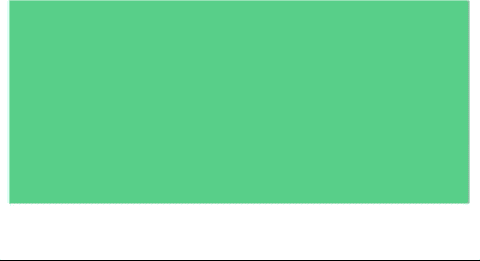

# 滚动时让元素淡入 Vue 每日提示 3

> 原文：<https://itnext.io/make-elements-fade-in-while-scrolling-daily-vue-tip-3-6540dd975c7e?source=collection_archive---------3----------------------->


托马斯·米洛特在 [Unsplash](https://unsplash.com?utm_source=medium&utm_medium=referral) 上拍摄的照片

伟大的网站对用户的交互反应灵敏。一个很好的方法是对某人向下滚动你的页面做出反应。

除了[视差组件](https://learnvue.co/2020/04/a-beautiful-parallax-scrolling-effect-in-vuejs-daily-vue-tips-2/)和滚动事件，一个增加响应触摸的好方法是当视图滚动时让元素淡入。

在这篇每日技巧中，我研究了如何在 Vue3 中使用[滚动事件](https://learnvue.co/2020/01/a-vue-event-handling-cheatsheet-the-essentials)和 CSS 转换来实现这一点。

这是我们将在本教程中学习如何构建的一个屏幕截图。


准备好了吗？让我们开始编码；

## 设计淡入元素的样式

我们要做的第一件事是构建模板并设计组件的样式。在这个例子中，我们将使用空块来展示事情是如何工作的。

所以在我们的模板中，我们只想…

*   包装容器
*   几个全宽元素
*   一些半宽元素增加一些变化

```
<template>
  <div class='container'>
    <div class='fade-in full-width' />
    <div class='fade-in full-width' />
    <div class='half-width fade-in' />
    <div class='half-width fade-in' />
  </div>
</template>
```

然后，为了样式化它们，我们想要构建一个基本的容器，然后用一些填充、颜色和适当的宽度来样式化我们的块。

```
<style scoped>

  .container {
    width: 80%;
    min-width: 450px;
    margin: 0 auto;
  }

  .fade-in {
    background-color: #2ecc71;
    height: 500px;
    margin-bottom: 50px;
    opacity: 0;
    transition: 0.3s all ease-out;
    transform: scale(0.8);
    box-sizing: border-box;
    padding: 20px;
    display: inline-block;
  }
  .full-width{
    width: 100%;
  }

  .half-width {
    width: 47.5%;
  }

  .half-width:nth-of-type(2n + 1) {
    margin-right: 2.5%;
  }

  .half-width:nth-of-type(2n) {
    margin-left: 2.5%;
  }
</style>
```

需要注意的一点是，我们所有的淡入元素都是从默认的不透明度 0 开始的。我们会用我们的脚本处理淡入它们。我们还将改变元素的比例。

我们的[淡入元素被赋予了一个过渡属性](https://learnvue.co/2020/02/vuejs-animations-for-beginners/)，这意味着当我们改变不透明度和比例时，它将在我们的两个值之间平滑过渡——给我们带来我们想要的平滑效果。

因此，如果我们加载我们的页面，我们不应该看到任何东西，但我们应该能够向下滚动页面，因为我们的元素在那里，但完全透明。

让我们实际上使用一些 Javascript 使它们可见。

## 让我们的元素淡入

对于本教程，我们将使用 [Vue 组合 API](https://learnvue.co/2019/12/a-first-look-at-vue3-a-vue-composition-api-tutorial/)——因此在我们的脚本中，我们首先要创建我们的设置方法并导入一些生命周期挂钩。

```
<script>
import { onMounted, onUnmounted } from 'vue'
export default {
  setup () {

    onMounted(() => {

    })

    onUnmounted(() => {

    })
  }
}
</script>
```

然后，让我们创建一个所有淡入元素的数组。我们可以通过使用[document . getelementsbyclassname](https://developer.mozilla.org/en-US/docs/Web/API/Document/getElementsByClassName)来做到这一点——然而，这返回了一个 HTMLCollection，我们需要一个数组，所以我们可以使用 Javascript 的 Arr `ay.from` 方法来转换它。

```
onMounted(() => {
      fadeInElements = Array.from(document.getElementsByClassName('fade-in'))
    })
```

现在我们已经有了一个我们想要淡入的所有元素的数组，我们想要做一些事情:

1.  每当滚动视图时迭代它们
2.  确定元素是否可见
3.  如果是，淡入并从我们的数组中移除

好吧。

首先，我们希望在组件挂载时创建滚动监听器，并在组件卸载时删除它。我们想做的另一件事是，当我们的组件被挂载时，调用我们的 handleScroll 方法，这样一些内容就可以加载，而用户不必滚动来查看一些内容。

```
var fadeInElements = []

onMounted(() => {
      fadeInElements = Array.from(document.getElementsByClassName('fade-in'))
      document.addEventListener('scroll', handleScroll)
      handleScroll()
})

onUnmounted(() => {
      document.removeEventListener('scroll', handleScroll)
})
```

在我们的滚动侦听器中，让我们创建一个 for 循环，遍历我们创建的淡入元素数组。

```
const handleScroll = (evt) => {
      for (var i = 0; i < fadeInElements.length; i++) {
        var elem = fadeInElements[i]
      }
}
```

此时，我们需要某种帮助方法来确定一个元素是否可见。为此，我们将使用元素的[边界矩形](https://developer.mozilla.org/en-US/docs/Web/API/Element/getBoundingClientRect)，它返回元素相对于视口的大小和位置。

我们还将添加一点缓冲，这样在淡入之前至少有 200 像素的元素是可见的。这将真正增强效果，因为它确保网站访问者将看到发生了什么。如果没有这个缓冲区，当元素的 1 个像素在屏幕上并且大部分在视窗之外时，淡入过渡就会触发。

```
const isElemVisible = (el) => {
      var rect = el.getBoundingClientRect()
      var elemTop = rect.top + 200 // 200 = buffer
      var elemBottom = rect.bottom
      return elemTop < window.innerHeight && elemBottom >= 0
}
```

回到我们的滚动事件监听器，我们想看看我们的`isElemVisible` 辅助方法是否对每个元素都是真的。如果是，我们希望改变元素的不透明度和比例，然后将它从数组中移除。

```
for (var i = 0; i < fadeInElements.length; i++) {
        var elem = fadeInElements[i]
        if (isElemVisible(elem)) {
          elem.style.opacity = '1'
          elem.style.transform = 'scale(1)'
          fadeInElements.splice(i, 1) // only allow it to run once
        }
}
```

现在，如果我们回到我们的应用程序并检查它，您会看到当我们滚动时，元素变得可见。正是我们想要的！



## 如果你想的话，我们结束了！

所以我们有了我们一直在寻找的滚动淡入效果！有很多方法可以扩展这种效果，例如:

*   让元素在滚动时淡出，以便可以再次淡入
*   使用 CSS 动画而不是过渡添加更多高级内容
*   将逻辑提取到一个[定制指令](https://learnvue.co/2020/01/creating-your-first-vuejs-custom-directive/)中，这样就可以在整个项目中重用

只要你掌握了使用滚动监听器和 CSS 动画/过渡的诀窍，天空就是真正的极限。

我希望你学到了一些东西，并能想出一些很酷的方法来将这些技术添加到你自己的 Vue 项目中。

如果你有任何问题、意见或任何事情，请告诉我。我很想收到你的来信，看看你都做了些什么！

如果你有兴趣了解更多关于 Vue 3 的知识，请下载我的免费 Vue 3 备忘单，里面有一些基本知识，比如合成 API、Vue 3 模板语法和事件处理。