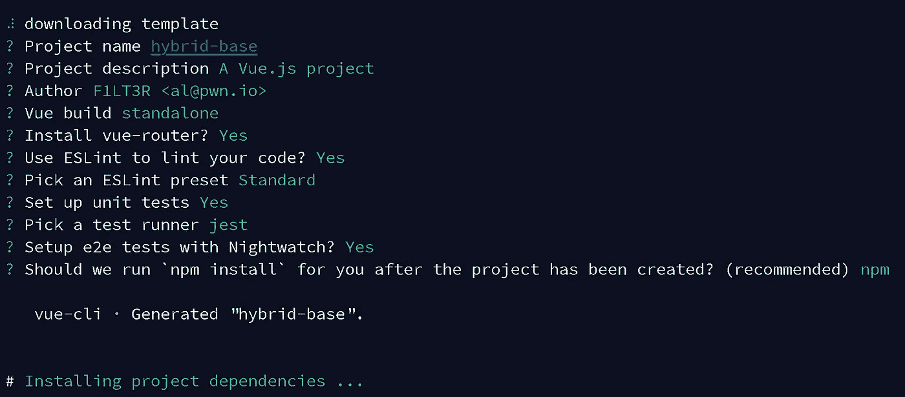
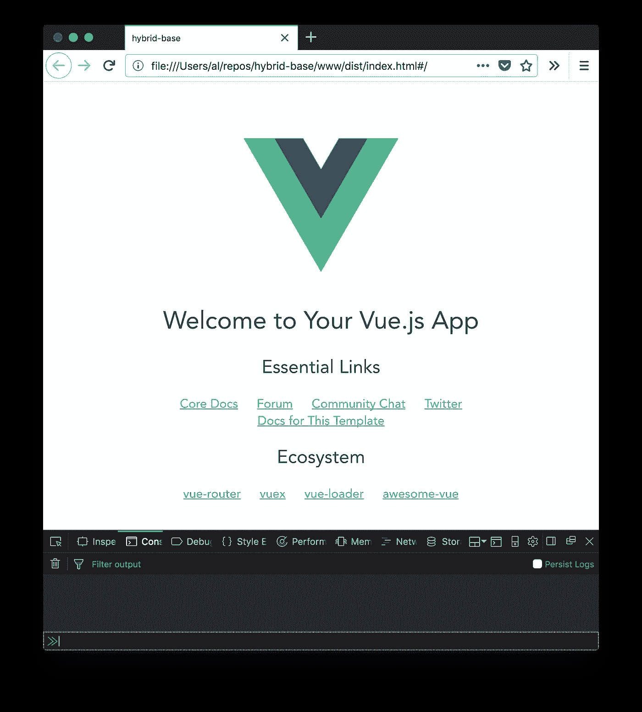
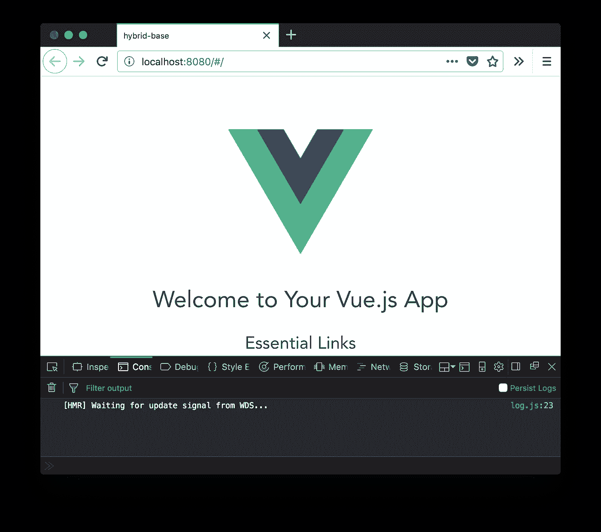
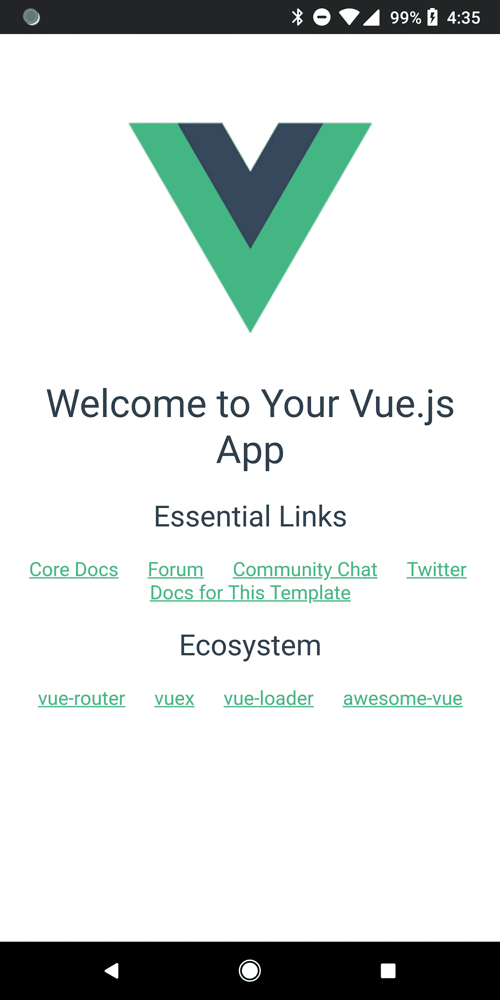
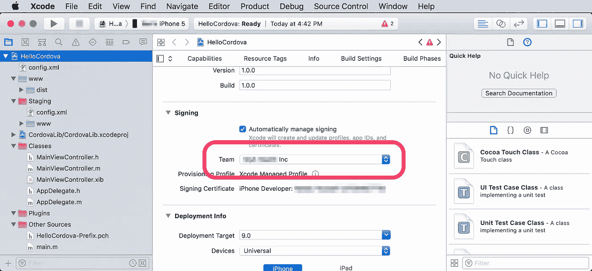
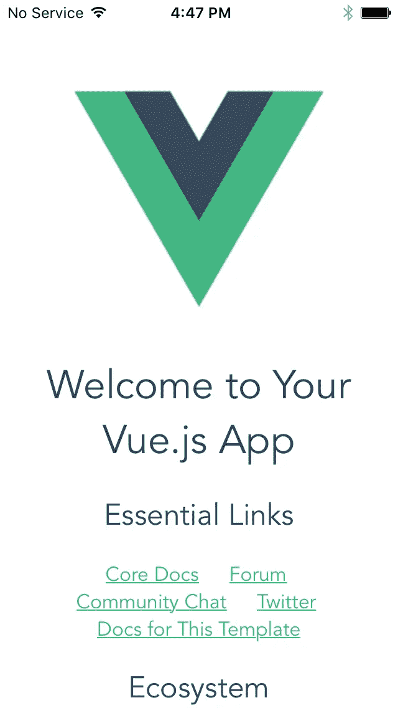
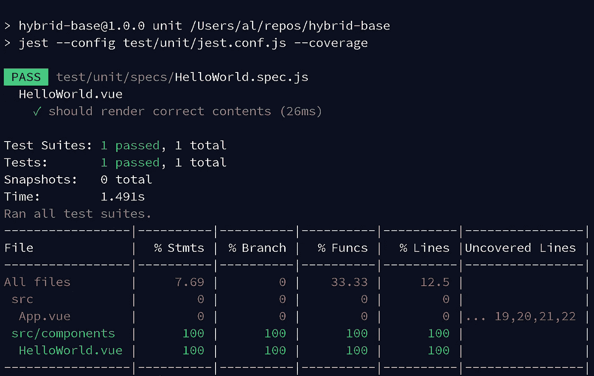
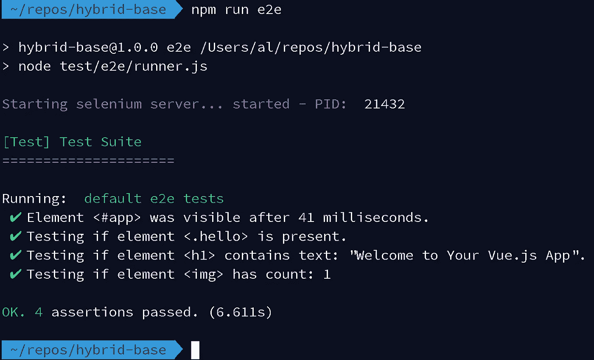

# 混合平台设置:Cordova + Vue + WebPack

> 原文：<https://itnext.io/make-hybrid-platform-cordova-vue-webpack-2fb7031c4f9b?source=collection_archive---------0----------------------->

这些步骤概述了建立开发平台的过程，您可以在该平台上构建混合移动应用程序。


这包括:

*   Cordova + Webpack + Vue.js
*   用 Jest/Mocha-Karma 进行单元测试
*   用守夜人进行功能测试
*   在 Web 浏览器中预览您的应用程序
*   进行更改时，在浏览器中热/实时重新加载您的应用程序
*   构建到 Android/iOS 移动设备

## 什么是混合手机 App？

“混合移动应用”是在本地应用内部运行的网站。代码的 Web 视图部分(所有屏幕和单击按钮时发生的代码)在运行时被解释。其中作为代码的本机部分(用相机拍照、加载文件、获取 GPS 坐标)，在应用程序运行之前被编译成机器代码。

# 先决条件

*   马科斯—高塞拉 10.13.2
*   node . js—9 . 2 . 1 版
*   阿帕奇科尔多瓦— 8.0.0
*   Vue-CLI — 2.9.2 — `npm install-g vue-cli`

# 启动 Cordova Vue-WebPack 项目

创建科尔多瓦项目。

```
cordova create hybrid-base com.f1lt3r.hybridbase
# Creating a new cordova project.
```

创建 Vue.js-Webpack 项目。

```
vue init webpack hybrid-base
```

您将被问到:`? Target directory exists. Continue?`您应该回答“是”,因为目录是在前面的 Cordova 步骤中创建的。



用您自己的名字设置您的 repo，并选择您想要使用的测试框架。

# 合并 Cordova + Vue-WebPack 构建流程

您的科尔多瓦`./www`目录现在应该是这样的:

```
www
├── css
│   └── index.css
├── img
│   └── logo.png
├── index.html
└── js
    └── index.js
```

删除 Cordova `./www`目录的内容，因为我们将使用 WebPack 构建这些内容。

我们将需要离开`./www`目录，因为这是 Cordova 将捆绑到您的移动设备上的代码。

```
cd hybrid-base
sudo rm -r www/*
# Password: ************
```

打开 WebPack 配置文件:`./config/index.js`，更新以下路径:

*   将`index`和`assestsRoot`路径改为指向 Cordova 的`./www`目录，这样你的应用程序代码在打包到你的移动设备之前就已经编译到`./www/dist`中了。
*   将`assetsPublicPath`值改为空字符串`''`。这将允许您的手机通过`file:///`协议提供观看服务。这一点很重要，因为您(通常)不会在移动设备上运行 web 服务器。

像这样更新您的`./config/index.js`文件:

```
build: {
    // Template for index.html
    index: path.resolve(__dirname, '../www/dist/index.html'), // Paths
    assetsRoot: path.resolve(__dirname, '../www/dist'),
    assetsSubDirectory: 'static',
    assetsPublicPath: '',
}
```

在 IDE 中打开`./config.xml`并更新 Cordova 的 WebView 入口点。

```
<content src=”dist/index.html” />
```

构建您的应用程序的分发包。

```
npm run build# > hybrid-base@1.0.0 build /Users/al/repos/hybrid-base
# > node build/build.js
# 
# Hash: 0291f32a5e7a7d714987
# Version: webpack 3.10.0
# Time: 6652ms
#                                                   Asset       Size  Chunks             Chunk Names
#                static/js/vendor.5973cf24864eecc78c48.js     111 kB       0  [emitted]  vendor
#                   static/js/app.b22ce679862c47a75225.js    11.6 kB       1  [emitted]  app
#              static/js/manifest.48340d8e7958823ecf19.js    1.48 kB       2  [emitted]  manifest
#     static/css/app.30790115300ab27614ce176899523b62.css  432 bytes       1  [emitted]  app
# static/css/app.30790115300ab27614ce176899523b62.css.map  828 bytes          [emitted]
#            static/js/vendor.5973cf24864eecc78c48.js.map     548 kB       0  [emitted]  vendor
#               static/js/app.b22ce679862c47a75225.js.map    22.2 kB       1  [emitted]  app
#          static/js/manifest.48340d8e7958823ecf19.js.map    7.79 kB       2  [emitted]  manifest
#                                              index.html  509 bytes          [emitted]
# 
#   Build complete.
# 
#   Tip: built files are meant to be served over an HTTP server.
#   Opening index.html over file:// won't work.
```

您的`./www/dist`目录现在应该看起来像这样:

```
www
└── dist
    ├── index.html
    └── static
        ├── css
        │   ├── app.30790115300ab27614ce176899523b62.css
        │   └── app.30790115300ab27614ce176899523b62.css.map
        └── js
            ├── app.b22ce679862c47a75225.js
            ├── app.b22ce679862c47a75225.js.map
            ├── manifest.48340d8e7958823ecf19.js
            ├── manifest.48340d8e7958823ecf19.js.map
            ├── vendor.5973cf24864eecc78c48.js
            └── vendor.5973cf24864eecc78c48.js.map
```

在浏览器中打开`./www/dist/index.html`文件，检查是否一切都通过`file:///`协议工作。

```
open ./www/dist/index.html
```



注意浏览器地址栏中的 file:///协议。

现在在你的 IDE 中打开 Vue.js `./index.html`文件，并更新你的`Content-Security-Policy` meta 标签以允许本地 web 套接字。你可以添加`connect-src 'self' ws:;`来做到这一点。这将允许 WebPack 知道何时在 web 浏览器预览中重新构建和重新加载您的代码。每当您对源代码进行更改时，都应该发生这种情况。

```
<meta http-equiv=”Content-Security-Policy” content=”default-src ‘self’ data: gap: [https://ssl.gstatic.com](https://ssl.gstatic.com) ‘unsafe-eval’; style-src ‘self’ ‘unsafe-inline’; media-src *; img-src ‘self’ data: content:; connect-src ‘self’ ws:;”>
```

现在我们可以测试`dev`模式是否正常工作。

```
npm run dev# > hybrid-base@1.0.0 dev /Users/al/repos/hybrid-base
# > webpack-dev-server --inline --progress --config build/webpack.dev.conf.js
# 
#  95% emitting
# 
#  DONE  Compiled successfully in 3486ms                                                                                                 12:31:18
# 
#    Your application is running here: [http://localhost:8080](http://localhost:8080)
```

现在 Vue-Webpack 热重装服务器已经上线，请访问 [http://localhost:8080](http://localhost:8080) 查看您的应用。

您应该会看到以下屏幕:



注意下面控制台日志中的 web-sockets 消息，以及地址栏中的 host:port。

# 在 Android 上运行

我们现在将测试在 Android 移动设备上一切正常。确保您已将一个插头插入电脑。

首先我们建造。

```
cordova platform add android# Using cordova-fetch for cordova-android@~7.0.0
# Adding android project...
# Creating Cordova project for the Android platform:
#     Path: platforms/android
#     Package: com.f1lt3r.hybridbase
#     Name: HelloCordova
#     Activity: MainActivity
#     Android target: android-26
# Subproject Path: CordovaLib
# Subproject Path: app
# Android project created with cordova-android@7.0.0
# Android Studio project detected
# Android Studio project detected
# Discovered plugin "cordova-plugin-whitelist" in config.xml. Adding it to the project
# Installing "cordova-plugin-whitelist" for android
# 
#                This plugin is only applicable for versions of cordova-android greater than 4.0\. If you have a previous platform version, you do *not* need this plugin since the whitelist will be built in.
# 
# Adding cordova-plugin-whitelist to package.json
# Saved plugin info for "cordova-plugin-whitelist" to config.xml
# --save flag or autosave detected
# Saving android@~7.0.0 into config.xml file ...
# Using cordova-fetch for cordova-ios@~4.5.4
# Adding ios project...
# Creating Cordova project for the iOS platform:
#     Path: platforms/ios
#     Package: com.f1lt3r.hybridbase
#     Name: HelloCordova
# iOS project created with cordova-ios@4.5.4
# Installing "cordova-plugin-whitelist" for ios
# --save flag or autosave detected
# Saving ios@~4.5.4 into config.xml file ...
```

然后我们跑。

```
cordova run android# Android Studio project detected
# ANDROID_HOME=/Users/al/Library/Android/sdk
# JAVA_HOME=/Library/Java/JavaVirtualMachines/jdk1.8.0_77.jdk/Contents/Home
# studio
# Subproject Path: CordovaLib
# Subproject Path: app
# publishNonDefault is deprecated and has no effect anymore. All variants are now published.
# The Task.leftShift(Closure) method has been deprecated and is scheduled to be removed in Gradle 5.0\. Please use Task.doLast(Action) instead.
#     at build_90p7k4l5ap2hh6f44vf6y6xe6.run(/Users/al/repos/hybrid-base/platforms/android/app/build.gradle:143)
# :CordovaLib:preBuild UP-TO-DATE
# ...
# :app:cdvBuildDebug UP-TO-DATE
# 
# BUILD SUCCESSFUL in 0s
# 47 actionable tasks: 1 executed, 46 up-to-date
# Built the following apk(s):
#     /Users/al/repos/hybrid-base/platforms/android/app/build/outputs/apk/debug/app-debug.apk
# ANDROID_HOME=/Users/al/Library/Android/sdk
# JAVA_HOME=/Library/Java/JavaVirtualMachines/jdk1.8.0_77.jdk/Contents/Home
# No target specified, deploying to device '711KPZK0695877'.
# none
# Skipping build...
# Built the following apk(s):
#     /Users/al/repos/hybrid-base/platforms/android/app/build/outputs/apk/debug/app-debug.apk
# Using apk: /Users/al/repos/hybrid-base/platforms/android/app/build/outputs/apk/debug/app-debug.apk
# Package name: com.f1lt3r.hybridbase
# LAUNCH SUCCESS
```

你现在应该可以在你的 Android 设备上看到这个应用了。



它活着。

# 在 iOS 上运行

是时候在 iOS 设备上检查东西了。确保你插上电源了！

首先，让我们将 iOS 平台添加到 Cordova 项目中。

```
cordova platform add ios# Using cordova-fetch for cordova-ios@~4.5.4
# Adding ios project...
# Creating Cordova project for the iOS platform:
#     Path: platforms/ios
#     Package: com.f1lt3r.hybridbase
#     Name: HelloCordova
# iOS project created with cordova-ios@4.5.4
# Installing "cordova-plugin-whitelist" for ios
# --save flag or autosave detected
# Saving ios@~4.5.4 into config.xml file ...
```

打开应用程序的 Xcode 项目。

```
open platforms/ios/HelloCordova.xcodeproj
```

在构建签名下拉列表中选择您的团队证书。



构建您的 iOS 包。

```
cordova build ios# Building project: /Users/al/repos/hybrid-base/platforms/ios/HelloCordova.xcworkspace
#     Configuration: Debug
#     Platform: device
# User defaults from command line:
#     IDEArchivePathOverride = /Users/al/repos/hybrid-base/platforms/ios/HelloCordova.xcarchive
# 
# Build settings from command line:
#     CONFIGURATION_BUILD_DIR = /Users/al/repos/hybrid-base/platforms/ios/build/device
#     SHARED_PRECOMPS_DIR = /Users/al/repos/hybrid-base/platforms/ios/build/sharedpch
# 
# Build settings from configuration file '/Users/al/repos/hybrid-base/platforms/ios/cordova/build-debug.xcconfig':
#     CLANG_ALLOW_NON_MODULAR_INCLUDES_IN_FRAMEWORK_MODULES = YES
#     CODE_SIGN_ENTITLEMENTS = $(PROJECT_DIR)/$(PROJECT_NAME)/Entitlements-$(CONFIGURATION).plist
#     CODE_SIGN_IDENTITY = iPhone Developer
#     ENABLE_BITCODE = NO
#     GCC_PREPROCESSOR_DEFINITIONS = DEBUG=1
#     HEADER_SEARCH_PATHS = "$(TARGET_BUILD_DIR)/usr/local/lib/include" "$(OBJROOT)/UninstalledProducts/include" "$(OBJROOT)/UninstalledProducts/$(PLATFORM_NAME)/include" "$(BUILT_PRODUCTS_DIR)"
#     OTHER_LDFLAGS = -ObjC
#     SWIFT_OBJC_BRIDGING_HEADER = $(PROJECT_DIR)/$(PROJECT_NAME)/Bridging-Header.h
# 
# === BUILD TARGET CordovaLib OF PROJECT CordovaLib WITH CONFIGURATION Debug ===
# 
# Check dependencies
# 
# Write auxiliary files
# 
# ...
# 
# ** ARCHIVE SUCCEEDED **
# 
# Non-system Ruby in use. This may cause packaging to fail.
# If you use RVM, please run `rvm use system`.
# If you use chruby, please run `chruby system`.
# 2018-02-01 16:43:32.249 xcodebuild[82807:848721] [MT] IDEDistribution: -[IDEDistributionLogging _createLoggingBundleAtPath:]: Created bundle at path '/var/folders/kw/5t8w91_n6rb0z8b2z2grsj1r0000gn/T/HelloCordova_2018-02-01_16-43-32.247.xcdistributionlogs'.
# Exported HelloCordova.xcarchive to: /Users/al/repos/hybrid-base/platforms/ios/build/device
# ** EXPORT SUCCEEDED **
```

在您的设备上运行 iOS 代码。

```
cordova run ios# Building project: /Users/al/repos/hybrid-base/platforms/ios/HelloCordova.xcworkspace
#     Configuration: Debug
#     Platform: device
# User defaults from command line:
#     IDEArchivePathOverride = /Users/al/repos/hybrid-base/platforms/ios/HelloCordova.xcarchive
# 
# Build settings from command line:
#     CONFIGURATION_BUILD_DIR = /Users/al/repos/hybrid-base/platforms/ios/build/device
#     SHARED_PRECOMPS_DIR = /Users/al/repos/hybrid-base/platforms/ios/build/sharedpch
# 
# Build settings from configuration file '/Users/al/repos/hybrid-base/platforms/ios/cordova/build-debug.xcconfig':
#     CLANG_ALLOW_NON_MODULAR_INCLUDES_IN_FRAMEWORK_MODULES = YES
#     CODE_SIGN_ENTITLEMENTS = $(PROJECT_DIR)/$(PROJECT_NAME)/Entitlements-$(CONFIGURATION).plist
#     CODE_SIGN_IDENTITY = iPhone Developer
#     ENABLE_BITCODE = NO
#     GCC_PREPROCESSOR_DEFINITIONS = DEBUG=1
#     HEADER_SEARCH_PATHS = "$(TARGET_BUILD_DIR)/usr/local/lib/include" "$(OBJROOT)/UninstalledProducts/include" "$(OBJROOT)/UninstalledProducts/$(PLATFORM_NAME)/include" "$(BUILT_PRODUCTS_DIR)"
#     OTHER_LDFLAGS = -ObjC
#     SWIFT_OBJC_BRIDGING_HEADER = $(PROJECT_DIR)/$(PROJECT_NAME)/Bridging-Header.h
# 
# === BUILD TARGET CordovaLib OF PROJECT CordovaLib WITH CONFIGURATION Debug ===
# 
# Check dependencies
# 
# Write auxiliary files
# 
# ...
# 
# (lldb)     connect
# (lldb)     run
# success
# (lldb)     safequit
# Process 1502 detached
```

现在，您应该会在 iOS 设备上看到 Vue.js 应用程序。



iOS 报到，长官。

# 测试—玩笑和守夜

最后，我们应该确认单元和功能测试命令工作正常。

首先测试单元测试:

```
npm run unit
```



单元测试通过，没问题。

然后测试功能/端到端测试:

```
npm run e2e
```



注意:您必须先运行“NPM run build ”, e2e 测试才能通过。

# 结论

您现在应该有一个混合平台，允许您使用 Vue.js 和 Cordova 开发和分发移动应用程序。

你可以在这里找到这个指南的回购:[https://github.com/F1LT3R/hybrid-base-cordova-vue-webpack](https://github.com/F1LT3R/hybrid-base-cordova-vue-webpack)

就这些了，伙计们！