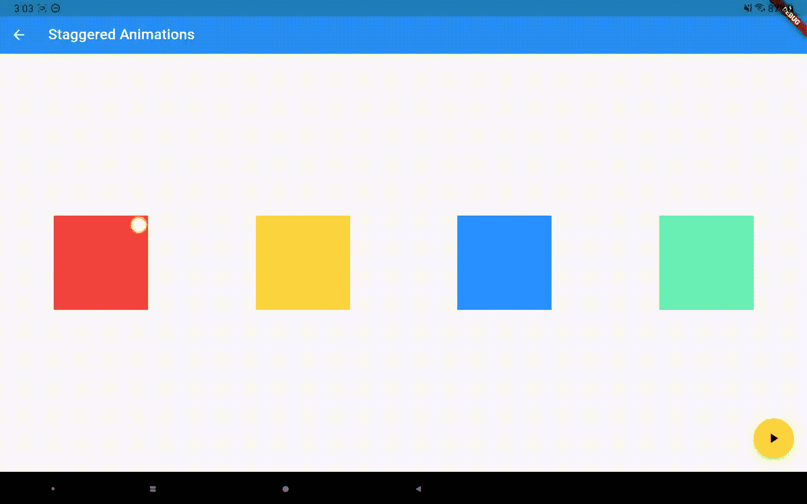
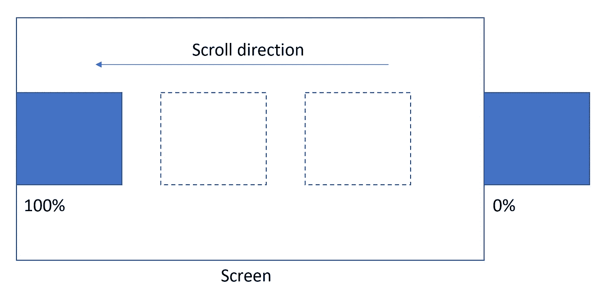

# 使用 animated_styled_widget 包制作隐式和显式动画

> 原文：<https://itnext.io/make-implicit-and-explicit-animations-with-the-responsive-styled-widget-package-7303bffe5c53?source=collection_archive---------9----------------------->



这就是我们将在本文中实现的目标

[animated_styled_widget](https://pub.dev/packages/animated_styled_widget) 包刚刚升级到支持明确的动画。如果您不知道该软件包以前可以做什么，这里有一个简短的回顾:

1.  还有 Style 类，它是主要 UI 元素的响应数据类，如宽度、高度、边距、填充、背景装饰、形状、阴影、变换、文本样式等。从某种意义上来说，它们是响应性的，因为所有这些类都接受一个 Dimension 实例，而该实例的本意是一个 double px 值。例如，您可以这样写:

```
var width = Dimension.clamp(100.toPXLength, 10.toVWLength, 200.toPXLength);
```

其规定宽度为屏幕宽度的 10%,但也限制在 100 像素和 200 像素之间。点击查看尺寸包[。](https://pub.dev/packages/dimension)

样式的定义如下:

```
Style style = Style(
  width: 80.toVMINLength,
  height: 80.toVMINLength,
  backgroundDecoration: BoxDecoration(
      gradient:
          LinearGradient(colors: [Colors.*cyanAccent*, Colors.*purpleAccent*])),
  shapeBorder: RectangleShapeBorder(
          cornerStyles: RectangleCornerStyles.all(CornerStyle.cutout),
          borderRadius: DynamicBorderRadius.all(
              DynamicRadius.circular(100.toPercentLength))),
);
```

2.样式实例将被提供给 StyledContainer 类，该类为您提供了一个容器小部件。

```
Widget widget = StyledContainer(
  style: style,
  child: child
  );
```

3.您可以轻松地使 StyledContainer 隐式动画化。只需使用 AnimatedStyledContainer 类:

```
Widget widget = AnimatedStyledContainer(
  curve: Curves.linear,
  duration: Duration(milliseconds: 100),
  style: toggleStyle ? beginStyle : endStyle,
  child: child
);
```

当您在开始样式和结束样式之间切换时，小部件将在两种样式之间自动显示动画。

以下是 AnimatedStyledContainer 可以实现的一些效果:

基本上，这个包给了你一个超级容器/动画容器类。

# 现在我们来谈谈显性动画

隐式动画易于使用，但无法实现我们想要的每一种效果。这就是我设计 ExplicitAnimatedStyledContainer 类的原因:

```
Widget widget = ExplicitAnimatedStyledContainer(
  style: style,
  child: child,
  localAnimations: localAnimations,
  globalAnimationIds: globalAnimationIds,
  id: id,
  ...
);
```

您仍然为小部件提供初始样式，但是随后您使用局部/全局动画来制作小部件样式的动画。让我们先来谈谈本地动画:

```
Map<AnimationTrigger, MultiAnimationSequence> localAnimations
```

它是 AnimationTrigger 和 MultiAnimationSequence 之间的映射。当前支持的 AnimationTrigger 如下:

```
enum AnimationTrigger {
  mouseEnter,
  mouseExit,
  tap,
  visible,
  scroll,
}
```

当触发事件发生时(例如，您点击了这个小部件)，相应的 MultiAnimationSequence 被触发。多动画序列包含一个序列映射:

```
Map<AnimationProperty, AnimationSequence> sequences
```

其中 AnimationProperty 是对应于 Style 类的每个属性的枚举类，AnimationSequence 是一个通用值、持续时间、延迟和曲线的列表，它告诉我们某个动画属性是如何发展的。例如:

```
MultiAnimationSequence(sequences: {
AnimationProperty.width: AnimationSequence()
  ..add(
      delay: Duration(seconds: 1),
      duration: Duration(milliseconds: 200),
      curve: Curves.*linear*,
      value: 100.toPXLength)
 ..add(
      duration: Duration(milliseconds: 200),
      curve: Curves.*easeIn*,
      value: 200.toPXLength)
});
```

将延迟 1 秒，然后在 200 毫秒内将宽度从当前值动画显示为 100 像素，然后在 200 毫秒内动画显示为 200 像素。您可以使用相同的语法制作其他属性的动画。

这种鼠标悬停效果是通过编写以下内容实现的:

```
Widget widget = ExplicitAnimatedStyledContainer(
  style: style,
  child: child,
  localAnimations: {
  AnimationTrigger.mouseEnter: enterSequence,
  AnimationTrigger.mouseExit: exitSequence,
  }
);
```

鼠标的进入和退出可以有不同的持续时间和曲线，不同的样式属性也可以有不同的持续时间和曲线。

现在来说说其他的动画触发器。AnimationTrigger.tap 很容易理解。当小部件在视口中可见时，将触发 AnimationTrigger.visible(通过使用 [visibility_detector](https://pub.dev/packages/visibility_detector) 包)。当小部件位于可滚动窗口(如 ListView)中时，就会触发 AnimationTrigger.scroll。然后，小部件将根据其沿滚动方向的位置显示动画:



动画进度从 0%到 100%

默认情况下，动画进度的计算方法如上图所示(如果水平滚动)。但是您也可以使用两个百分比偏移使动画提前或推迟开始/结束。

在垂直和水平方向滚动动画

一个长的动画，我们慢慢地动画每个属性

# 预设动画

现在这些多动画序列看起来很强大，但编码起来也很复杂。我准备了一些通用的预定义动画。它们被分为入口、注意力寻求者和出口。例如，一个称为 SlideInAnimation 的常见入口动画被定义为:

```
class SlideInAnimation extends PresetAnimation {
  final AxisDirection direction;
  final Dimension distance;
  const SlideInAnimation(
      {this.distance = const Length(100, unit: LengthUnit.vmax),
      this.direction = AxisDirection.up,
      Duration duration = const Duration(seconds: 1),
      Duration delay = Duration.*zero*,
      Curve curve = Curves.*linear*,
      CustomAnimationControl control = CustomAnimationControl.PLAY})
      : super(duration: duration, delay: delay, curve: curve, control: control);
  ...
}
```

您可以配置滑动距离和方向，以及持续时间、延迟、曲线和控制(动画应该播放一次还是无限播放)。其他预定义的动画有:

```
FadeInAnimation
ZoomInAnimation
FadeOutAnimation
SlideOutAnimation
ZoomOutAnimation
FlipAnimation
FlashAnimation
PulseAnimation
SwingAnimation
WobbleAnimation
RainbowAnimation
ElevateAnimation
...
```

你可以这样使用它们:

```
Widget widget = ExplicitAnimatedStyledContainer(
  style: style,
  child: child,
  localAnimations: {
  AnimationTrigger.visible:                                                       FadeInAnimation().getAnimationSequences()
  }
);
```

然后每次小工具移动到屏幕上，它就会淡入(不透明度从 0 到 1)。多动画序列的另一个特性是能够合并或扩展其他多动画序列。所以你可以这样做:

```
Widget widget = ExplicitAnimatedStyledContainer(
  style: style,
  child: child,
  localAnimations: {
  AnimationTrigger.visible: FadeInAnimation().getAnimationSequences()..merge(
SlideInAnimation().getAnimationSequences())
  }
);
```

然后小工具将会淡入淡出。如果使用 extend，动画将一个接一个播放。预设动画使动画更容易使用，同时还为您提供了很大的灵活性。

一个简单的动画编辑器，让您在各种预设动画中进行选择

# 全局显式动画

如果我们想在不同的窗口小部件之间错开动画，我们可以通过提供全局动画来实现。全局动画包含字符串和多动画序列之间的映射，其中字符串是小部件的标识符。您提供了所有您想要在动画池中使用的全局动画。然后你可以像这样触发一个全局动画:

```
var animationPool = {
"animation1": GlobalAnimation(sequences: {
"container1" : sequence1,
"container2": sequence2,
...})
}...ChangeNotifierProvider<GlobalAnimationNotifier>(
    create: (_) =>
        GlobalAnimationNotifier(animationPool: animationPool), child: child
)...Widget widget = ExplicitAnimatedStyledContainer(
  id: "container1",
  style: style,
  child: child,
  globalAnimationIds: {
  AnimationTrigger.visible: "animation1"  
  }
);
```

id 不必是唯一的。您可以拥有多个 id 相同的小部件，这样它们将在同一个全局动画下进行动画制作。请注意，如果小部件根本不使用全局动画，就不需要 id。

浮动动作按钮触发的交错全局动画

现在你有了[动画 _ 样式 _ 容器](https://pub.dev/packages/animated_styled_widget)包的隐式和显式动画。此套件中还有其他功能，如:

1.  一切都是可序列化的。所以你可以设计、存储和重用这些样式和动画。
2.  您可以通过调用 ExplicitAnimatedStyledContainer 的子容器内部的类似内容，以编程方式更改动画的状态:

```
Provider.*of*<LocalAnimationNotifier>(context, listen: false)
 .updateAnimationStatus(animationSequence, status);
Provider.*of*<GlobalAnimationNotifier>(context, listen: false)
 .updateAnimationStatus(animationId, status);
```

3.您可以随动画一起提供对 AnimationTrigger 事件的回调:

```
Widget widget = ExplicitAnimatedStyledContainer(
  style: style,
  child: child,
  localAnimations: {
  AnimationTrigger.visible: animationSequence
  },
  onVisible: onVisible,
);
```

这个包仍在快速开发中，仍然缺乏文档。所以请耐心等待，并提供您的反馈。在[发布与开发](https://pub.dev/packages/responsive_styled_widget)上查看。谢谢大家！