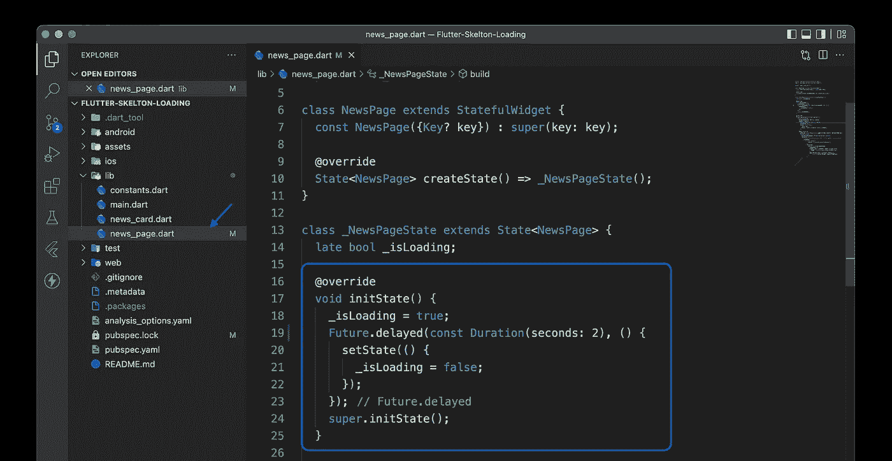
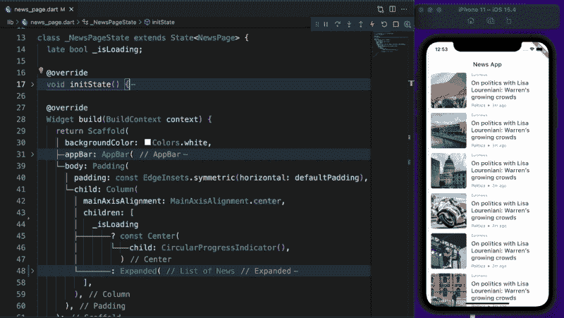
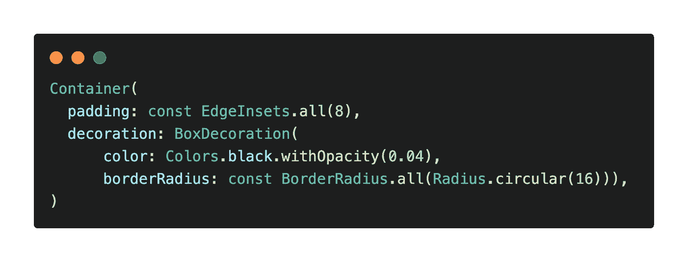
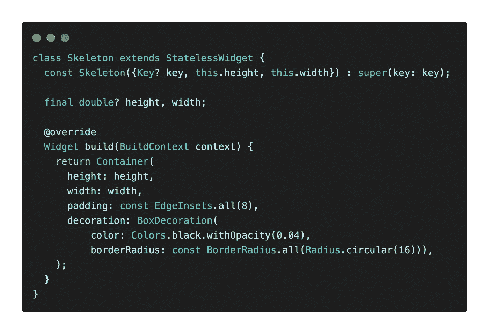
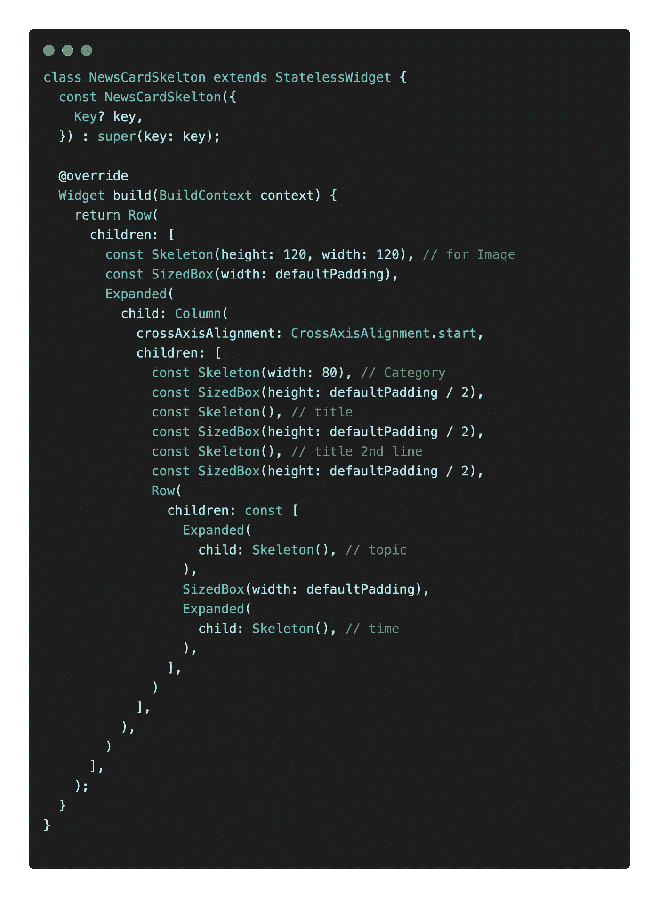
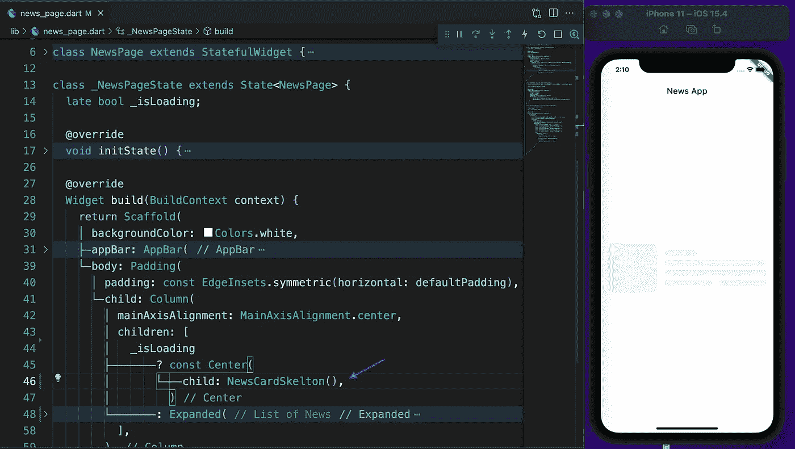
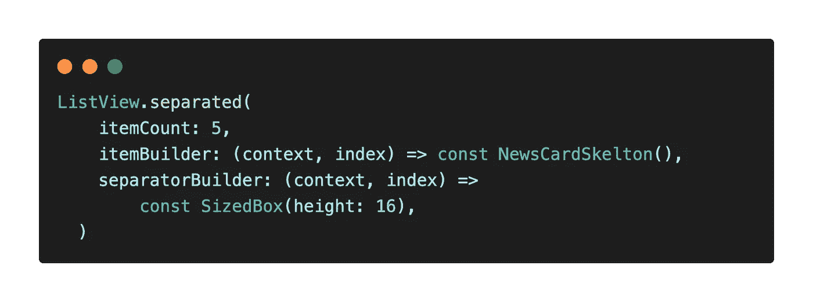
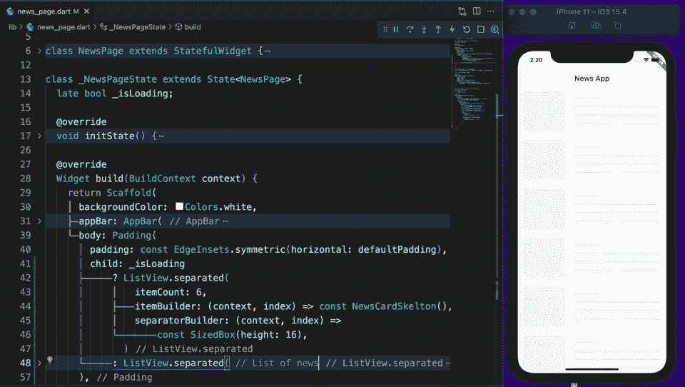

# 加大载荷——减摆载荷对颤振的影响

> 原文：<https://itnext.io/make-loading-great-shimmer-loading-effect-on-flutter-9938facb3aae?source=collection_archive---------1----------------------->

微光负载

在我们的应用程序上读取数据时，我们使用 CircularProgressIndicator，这是可以的，但您可以通过使用微光效果来增强用户体验。在今天的帖子中，我将向你展示如何用 Flutter 轻松做到这一点。

## 项目设置

如果你想跟随我，从 GitHub 下载[启动项目](https://github.com/abuanwar072/Flutter-Skelton-Loading/tree/Starting)。

开始项目—新闻页面

我们有`NewsPage`，显示所有新闻。在`initState`上，我们假设从后端获取数据需要 2 秒钟。这就是为什么 2 秒钟后，我们将`_isLoading`设置为假。如果您运行该应用程序，它会显示循环进度指示器 2 秒钟。

开始项目的预览

## 创建 Skelton 小部件

微光效果没什么，只是一个浅灰色的`Container`。我们的容器的颜色恢复了 4%的不透明度。此外，我们将通过应用`borderRadius`来解决这个问题。最后，我将添加填充，使我们的容器有一个最小的高度，现在是 16，因为我们在容器的其他部分应用了 8 个填充。

现在是时候给这个容器取个名字了，我准备叫它`Skelton`。有时我们可能需要定义高度&宽度。这就是为什么我将高度&宽度参数添加到 Skelton 小部件

Skelton 部件

## 微光效应

让我们为这张新闻卡片创建一个微光效果。`NewsCard`右边有一幅图像，几行为类别，标题&时间。

新闻卡片

是时候把`CircularProgressIndicator`换成`NewsCardSkelton`了。

用 NewsCardSkelton 预览

现在，它显示了一个，但我们需要更多。为此，我们使用了`ListView.separated`。

最终预览与微光效果！

## 源代码🔥

 [## GitHub-abuanwar 072/颤振-骨架加载

### 一个新的颤振项目。这个项目是颤振应用的起点。一些帮助您入门的资源…

github.com](https://github.com/abuanwar072/Flutter-Skelton-Loading) 

我希望你喜欢它。如果你有什么建议或者我犯了什么错误，请告诉我。

## 🔥奖金🔥Flutter UI 套件— 100 多个屏幕😱

 [## Flutter shop-Flutter 的高级电子商务 UI 套件

### Chrome 或 Brave 浏览器推荐预览 Live 预览 FlutterShop 是一个高级电子商务 UI 套件，您可以使用…

theflutterway.gumroad.com](https://theflutterway.gumroad.com/l/fluttershop)