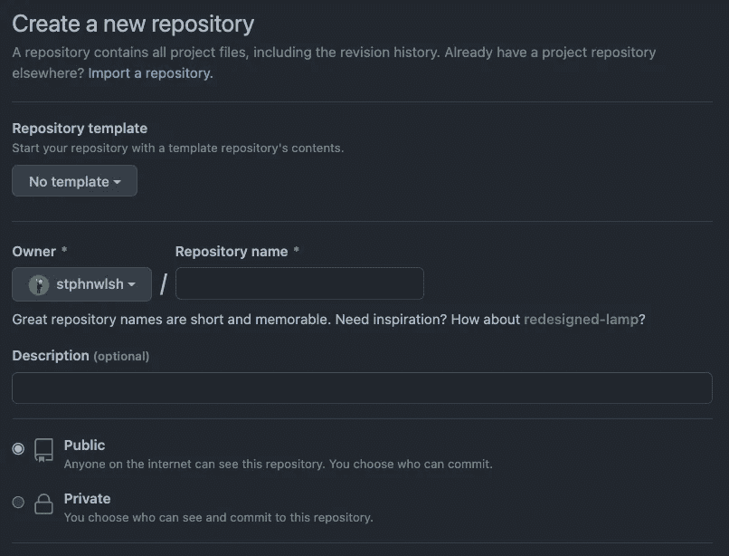
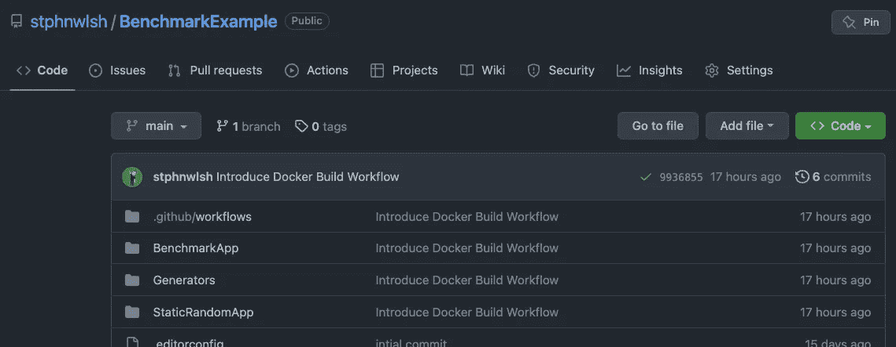
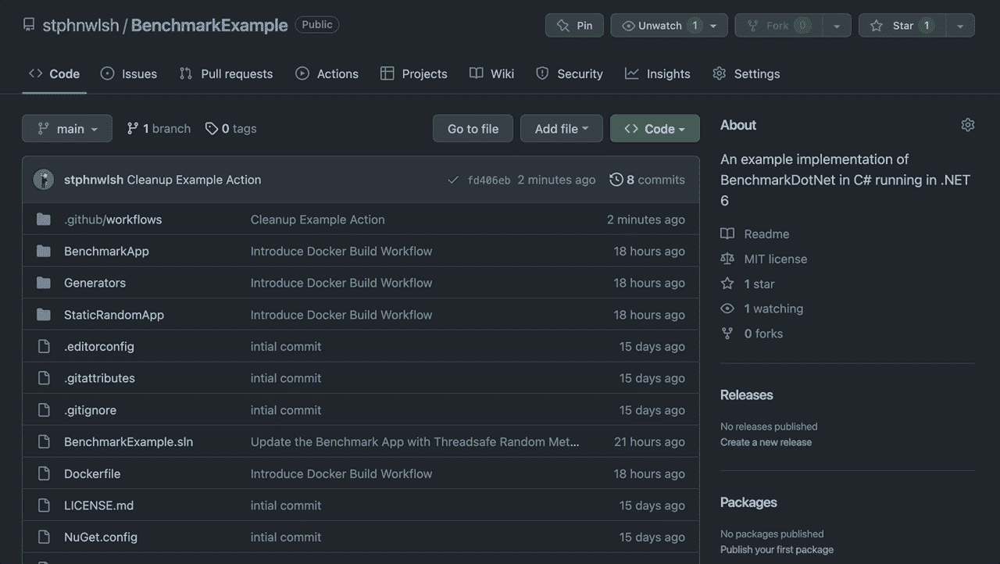
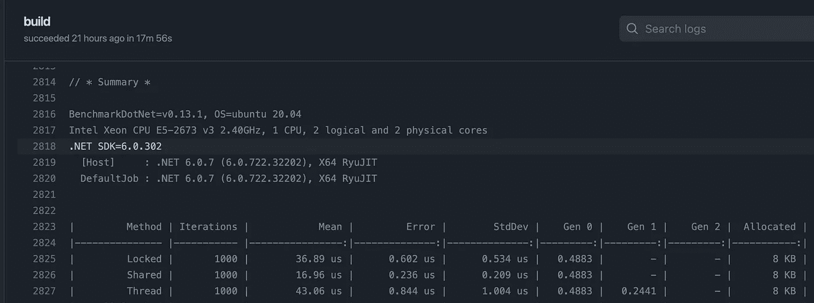
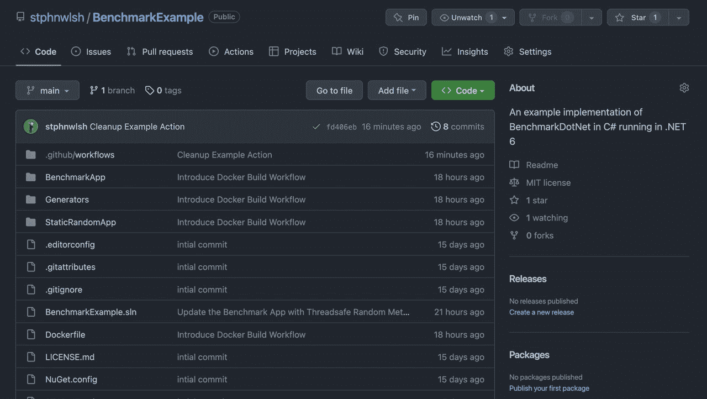

# 让微软为你运行基准测试

> 原文：<https://itnext.io/make-microsoft-run-benchmark-tests-for-you-23f7497bd092?source=collection_archive---------3----------------------->

## 标杆很重要！问题是运行这些测试会使你的机器无法使用。让微软和 GitHub 感受一下这种痛苦吧。


图拉格摄影在 [Unsplash](https://unsplash.com?utm_source=medium&utm_medium=referral) 拍摄的照片

在我们谈到微软和 Github 的乐趣和游戏之前，我们将涉及一些其他的细节。首先，什么是基准测试？然后建立一个任何人都可以运行的简单基准测试示例，最后是如何卸载这些测试。

对于*TL；DR；*观众们，这不是魔术。我们正在使用 [GitHub 动作](https://github.com/features/actions)，一个[公共库](https://github.com/stphnwlsh/BenchmarkExample)和[无限构建分钟](https://github.com/pricing)。既然你知道了，为什么不在剩下的旅程中继续读下去呢。

# 标杆管理

在软件工程术语中，**基准测试**是在执行期间测试代码以确定其执行情况的过程。用于理解代码性能的最常见指标是**时间**和**内存**。还有更多，虽然这些可能是最重要的。

代码执行需要多长时间？一个程序在运行代码时会消耗多少内存？代码完成的时间越长，消耗的内存越多，性能就越差。

在云中运行代码时，这一点很重要。计算能力和内存耗费了大量金钱。

对于软件工程师来说，基准测试通常是通过比较获得相同结果的两种方法来完成的。这有助于工程师了解哪种实现为他们正在处理的应用程序提供了最佳性能。当工程师将这些知识应用到被使用和重复使用数千次的代码部分时，它会对应用程序的性能产生巨大的影响。

# 基准测试。网

出于演示的目的，我们将使用**。NET** 和 **C#** 来执行一些简单的基准测试。我们将使用 BenchmarkDotNet 库；这是在**中运行基准测试的最佳方式。网**。它跟踪基准测试的性能，并将您的方法转化为可重复的实验。

> BenchmarkDotNet 具有大量在综合性能调查中必不可少的特性。四个方面定义了这些特性的设计:*简单性*、*自动化*、*可靠性*和*友好性*。

它是一个强大的工具，使在. NET 控制台应用程序中设置基准测试变得简单而容易。有关 BenchmarkDotNet 及其特性的更多深入信息，请查看他们的[文档](https://benchmarkdotnet.org/#features)。

# 简单的基准测试

为了让我们踏上基准测试之旅，我们将在**中设置一个简单的应用程序。NET** 来测试生成随机数的最快方法。我们希望这是线程安全的，所以我们不会破坏随机数生成器并返回全零。

第一步是在**中创建新的控制台应用。网**。CLI 通过一个简单的单行命令为我们处理这些。谢谢微软，那太简单了。

```
dotnet new console --framework net6.0
```

接下来，我们将创建一个新的类来保存我们的生成器。我们在一个文件中有三个不同的线程安全随机数生成器。它们将构成我们基准测试的基础。[样本库](https://github.com/stphnwlsh/BenchmarkExample/tree/main/Generators)将它们分开，就像它们可能应该的那样。

下一个新的类，`Benchmark.cs`。这将主持我们的测试。这就是 BenchmarkDotNet 大放异彩的地方。`[MemoryDiagnoser]`属性确保我们的[输出捕捉到我们的测试消耗了多少内存](https://benchmarkdotnet.org/articles/configs/diagnosers.html)。`[Params]`属性设置迭代属性的值。对于简单的测试，我们将它设置为 100000，另一个选项是[，这里包含多个值](https://benchmarkdotnet.org/articles/overview.html#params)，以运行多组测试。最后，当我们运行应用程序时，每个带有`Benchmark`属性的方法都将作为测试包含在内。这些基准测试将有三种测试方法，这意味着我们将得到三组结果。

最后，我们将设置`Program.cs`来运行我们的基准测试。这就像设置你的程序文件来匹配下面的代码一样简单。

这是一个简单明了的设置，可以让测试准备好运行。

# 运行基准测试

想在你的机器上测试一下吗？很简单。如果你有**。NET SDK** 安装完毕，只需运行下面的命令。请注意，你可能会听到你的电脑风扇启动的声音。如果你想杀死你的机器，把测试的参数更新到越来越高的数字。

```
dotnet run -c Release --project ./BenchmarkApp.csproj 
```

大量的输出让你知道你做了正确的事情。给它几秒钟，然后你的风扇就会启动。有趣的是你会发现自己在等待结果。看着屏幕好像它会让它跑得更快，因为它被盯着看。这是你一天中失去的时间。你可以用你的计算能力做更好的事情，这就是为什么我建议你远离你的机器运行你的基准测试。

在输出的底部，您会发现一个结果表，很像下面的例子。这表明`Shared`方法在这里显然表现得更好。

```
| Method | Iterations |     Mean | Allocated |
|------- |----------- |---------:|----------:|
| Locked |        100 | 7.495 us |   1,152 B |
| Shared |        100 | 2.235 us |     848 B |
| Thread |        100 | 9.223 us |   1,288 B |
```

# 远程运行基准

为了做到这一点，我们将使用一个公共的 GitHub 库，因为 GitHub 操作易于使用，但它们提供了一个奇妙的额外功能。如果你的回购是公开的，[你的建设分钟是免费的](https://docs.github.com/en/billing/managing-billing-for-github-actions/about-billing-for-github-actions#:~:text=GitHub%20Actions%20usage%20is%20free%20for%20both%20public%20repositories%20and%20self%2Dhosted%20runners)！！！从理论上讲，你可以在其他提供商上做到这一点，但使用 GitHub 是让微软免费做到这一点的唯一途径。

为了做到这一点，您需要一个 [GitHub 帐户](https://github.com/signup)，并且您需要[创建一个新的存储库](https://github.com/new)。



[创建新的 GitHub 库](https://github.com/new)

公开这个库，然后[将您的新库](https://docs.github.com/en/repositories/creating-and-managing-repositories/cloning-a-repository)克隆到您的机器上，将示例代码放到您的新文件夹中，然后[进行您的初始提交](https://github.com/git-guides/git-commit)。



初始提交后的 GitHub 存储库

最后一步是创建 GitHub 动作工作流。按照文档中的说明进行操作，但非常简单，只需导航到**操作**，单击**新建工作流**按钮，并选择标题下方的**自行设置工作流**选项。

将下面的代码放到您的操作中并提交它。就是这样！一旦你这样做了，你的新动作将在后台启动。



为 BenchmarkDotNet 创建示例 GitHub 操作

现在我们有了一个正在运行的动作，我们可以继续我们的其他任务，并在准备好的时候检查结果。要查看结果，让我们执行以下步骤。

1.  导航回我们的操作选项卡。
2.  找到我们最近运行的工作流并选择它
3.  选择构建作业
4.  在构建作业中选择基准步骤
5.  滚动到底部，您将看到结果表

它应该看起来像下面的图片。



BenchmarkDotNet 作业的 GitHub 操作结果



从基准测试中寻找结果

# 最后

至此，我们已经创建了一个新的。NET 基准测试，并让微软为我们运行它。这种方法的美妙之处在于，您是在同一台机器上比较所有的测试方法，因此性能指标仍然是相关的。如果你想在特定的操作系统和系统配置上进行测试，GitHub 也允许你配置[自托管运行器](https://docs.github.com/en/actions/hosting-your-own-runners/about-self-hosted-runners)。

这种方法应该适用于其他基准测试工具。你将不得不修改动作 **YAML** 来代替**来运行你的测试。NET** 应用。

我的机器在运行基准测试时不再崩溃和燃烧，使用这种方法，你的也不会。希望这个方法对你有帮助！如果你做了，分享给大家，没有人会因为基准测试而遭受机器不可用的痛苦！

# 示例存储库

如果你想看这篇文章中详细描述的应用程序的真实例子，你可以在 GitHub 上找到它。这个动作触发了新的基准测试，但是代码更多地被分成了文件和项目。还包括一个示例控制台应用程序，它运行随机数生成器来验证它们确实是线程安全的。

[](https://github.com/stphnwlsh/BenchmarkExample) [## GitHub-stphnwlsh/BenchmarkExample:BenchmarkDotNet 在 C#中的示例实现运行在…

### 此时您不能执行该操作。您已使用另一个标签页或窗口登录。您已在另一个选项卡中注销，或者…

github.com](https://github.com/stphnwlsh/BenchmarkExample) 

```
**Connect or Support?**If you like this, or want to checkout my other work, please connect with me on [LinkedIn](https://www.linkedin.com/in/stphnwlsh), [Twitter](https://twitter.com/stphnwlsh) or [GitHub](https://github.com/stphnwlsh), and consider supporting me at [Buy Me a Coffee](https://www.buymeacoffee.com/stphnwlsh).
```