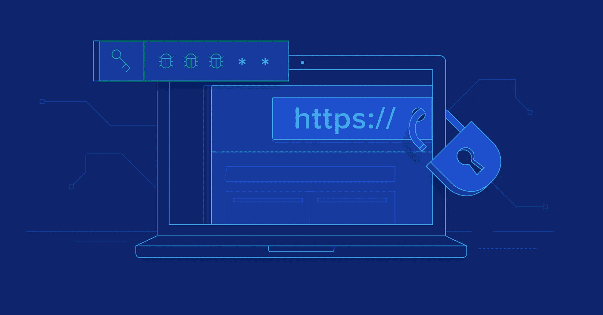

# 如何确保 NodeJS 应用程序或 API 的安全

> 原文：<https://itnext.io/make-security-on-your-nodejs-api-the-priority-50da8dc71d68?source=collection_archive---------0----------------------->



如果你是后端或全栈(web)开发人员，你可能听说过这样的术语: **DOS 攻击、XSS、SQL/NoSQL 注入攻击**等等。
您可能已经知道这些攻击是非常有害的，您需要尽可能地保证您的应用程序(或 API)的安全。但是具体怎么做呢？

在本文中，我将向您展示一些最佳实践，您可以在自己的项目中应用/实现这些实践，并使您的应用程序(或只是一个 API)变得安全。但首先，如果你不熟悉这些攻击，让我们逐一分解！

## **拒绝服务攻击**

DOS 攻击会使网络或机器崩溃/关闭，使其无法访问。例如，这意味着用户将不能访问你的应用程序。攻击者通过不断发送请求、创建流量和发送大量各种信息来实现这一点。利用 DOS 攻击，攻击者可以让你的服务**变慢**或者**完全崩溃**。

## **跨站脚本(XSS)攻击**

XSS 发作是注射的一种。攻击者将恶意脚本注入浏览器端脚本的形式。通常，当输入表单没有经过验证或编码时，它们会出现在输入表单上。
利用 XSS 攻击，攻击者可以访问 cookies、会话令牌或/和其他敏感数据。同样，这些脚本可以重写页面的 HTML 内容。

## **暴力攻击**

暴力攻击是一种用于获取用户密码或个人识别码(PIN)等敏感数据的方法。在这些攻击中，攻击者最有可能依靠自动化软件来生成对所需数据值的大量猜测。
通过暴力攻击，攻击者可以破解加密数据(密码、pin)。

## **SQL/NoSQL 注入攻击**

SQL/NoSQL 注入(SQLi)攻击是注入攻击的一种。SQL/NoSQL 注入使得攻击者能够执行恶意 SQL/NoSQL 语句。攻击者只需将 SQL/NoSQL 命令(查询)插入到连接到数据库的应用程序的特定字段中(例如，POST 登录请求)，就可以实现 SQL/NoSQL 注入攻击。
利用 SQL/NoSQL 注入攻击，攻击者可以绕过认证、授权，检索整个 SQL/NoSQL 数据库的内容，添加、修改、删除数据库中的数据。

# **如何防止这些攻击在自己的项目中发生？**

没错，在您对这些攻击有所了解之后，问题是，如何在您自己的应用程序/ API 中防止它们发生？
我将再次向您展示如何防止这些攻击的最佳实践，一个接一个。

## **防止 DOS 攻击**

1.  当处理 DOS 攻击预防时，首先要考虑的是限制用户可以提交给你的应用程序/ api /服务的实际负载。您可以使用 body-parser 来限制 body 有效负载。如果你正在使用 ExpressJS 作为你的后端框架，那么你就是黄金。ExpressJS 附带了您可以使用的内置 body-parser。

```
const express = require('express');
const app = express();app.use(express.json({ limit: '10kb' })); // Body limit is 10
```

2.另一个有用的 express 特性是 **express-rate-limit 依赖。**此依赖关系允许您为用户设置速率限制。所以基本上，你可以为每个用户设置最大的请求量，当用户使用了他所有的请求后，你可以锁定他一段时间。

以下是如何配置快速速率限制:
*— npm 安装快速速率限制-* 使用 npm 安装

```
const limit = rateLimit({
    max: 100,// max requests
    windowMs: 60 * 60 * 1000, // 1 Hour
    message: 'Too many requests' // message to send
});
app.use('/routeName', limit); // Setting limiter on specific route
```

## **阻止 XSS 袭击**

1.  首先，您可以在输入时净化用户数据。这很容易实现，我们可以使用另一个有用的依赖项，叫做 **xss-clean。** 这种依赖将阻止用户在输入中插入 HTML &脚本。

以下是如何配置 xss-clean:
*— npm 安装 xss-clean -* 使用 npm 安装它

```
// Data Sanitization against XSS
app.use(xss());
```

2.使用**头盔**依赖给你的项目特殊的 HTTP 头。头盔是中间件功能的集合。默认情况下，并不包括所有的中间件功能，但是您可以手动启用其余的功能。你可以查看[这个](https://github.com/helmetjs/helmet/#user-content-how-it-works)链接，看看其他的中间件功能。

下面是你如何配置头盔-它应该在代码的顶部声明:
*-npm 安装头盔-* 使用 NPM 安装它

```
app.use(helmet());
```

3.例如，如果您使用 JSON Web 令牌(JWT)而不是 express-session，您应该考虑将 JWT 的存储到 cookies 中。同样，确保这些用于 JWT 存储的 cookies 仅是 HTTP！

## **防止暴力攻击**

1.  帮助您应对暴力攻击的最有效的方法之一是限制登录尝试，或任何与要求用户输入密码、特殊代码或 pin 的身份验证相关的尝试。
2.  接下来，同样，如果你使用 ExpressJS，你可以实现 **express-rate-limit 依赖。**这一点我们确实在 DOS 攻击防范中实现了。但是这种依赖性对暴力攻击和 DOS 攻击都有效。
3.  为了降低攻击者猜测敏感数据(密码、pin)的速度，让他们的日子更难过，您可以实现 **bcrypt 依赖。Bcrypt 将加密敏感数据，如密码，这将使他们更难猜测。Bcrypt 是一个有点复杂的依赖项，但是如果你想了解更多(你应该了解)请查看这个[链接](https://www.npmjs.com/package/bcrypt)。**
4.  另一件降低暴力攻击可能性的事情是实现**两步验证过程**，或**双因素认证**。实现这个确实需要几行代码，所以这里的[链接](https://davidwalsh.name/2fa)将帮助你解决这个问题！

## **防止 SQL/NoSQL 注入攻击**

1.  如果您正在使用 SQL 或 NoSQL 数据库，您应该整理您的数据。
    如果你正在使用 SQL 数据库，你应该考虑使用 **node-mysql 依赖。**点击了解更多关于 node-mysql [的信息。
    如果您正在使用 NoSQL 数据库(MongoDB)和 ExpressJS，请考虑使用 **express-mongo-sanitize 依赖项。**](https://github.com/mysqljs/mysql#escaping-query-values)

下面是如何配置 mongo-sanitize:
*—npm install express-mongo-sanitize-*使用 NPM 安装它

```
app.use(mongoSanitize());
```

2.如果使用 MongoDB，使用对象数据建模工具(ODM)**mongose**。Mongoose 允许您为每个文档定义模式和模式类型，从一开始就确保文档的安全。猫鼬本身就很复杂，但是如果你想深入了解它，我建议你查看这个[链接](https://code.tutsplus.com/articles/an-introduction-to-mongoose-for-mongodb-and-nodejs--cms-29527)或者上一个速成班，边走边学！

## **在实现了这些依赖项之后，您的主应用程序文件可能如下所示:**

```
// Importing Dependencies
const express = require('express');
const rateLimit = require('express-rate-limit');
const helmet = require('helmet');
const mongoSanitize = require('express-mongo-sanitize');
const xss = require('xss-clean');const app = express();// Helmet
app.use(helmet());// Rate Limiting
const limit = rateLimit({
    max: 100,// max requests
    windowMs: 60 * 60 * 1000, // 1 Hour of 'ban' / lockout 
    message: 'Too many requests' // message to send
});
app.use('/routeName', limit); // Setting limiter on specific route// Body Parser
app.use(express.json({ limit: '10kb' })); // Body limit is 10// Data Sanitization against NoSQL Injection Attacks
app.use(mongoSanitize());// Data Sanitization against XSS attacks
app.use(xss()
```

## **如何在网站/ web app / API 上实现顶级安全？**

我向您展示的这些方法在您自己的项目中实现肯定是非常好的，而且它们做得很好！没毛病。但是！如果你能把它提升到另一个水平会怎么样？如果您想为您的项目实现顶级安全性，该怎么办？如果您可以实施详细监控的 DDoS 攻击防御系统，会怎么样？事实上，如果您能够集成针对所有这些漏洞的监控系统会怎么样？

如果我告诉你，有一个名为 SiteLock 的工具可以暴露漏洞，例如:**搜索引擎/浏览器黑名单、垃圾邮件黑名单、应用程序漏洞、SQL 注入漏洞、跨站点脚本(XSS)漏洞、病毒和恶意软件、网络漏洞。**
我将要向你展示的东西可以节省你的时间和金钱，当然，也会让你的网络应用(或网站)更加安全。

那么这到底是怎么回事呢？

[你听说过 Bluehost 吗？ **Bluehost** 是最大的网站托管提供商之一，为数百万网站提供服务。Bluehost 提供了上面提到的工具 SiteLock，它可以监控你的网站/应用程序并捕捉任何发现的漏洞。而且，它可以验证你的商业信誉。SiteLock 附带 Bluehost 托管包(每月不到 2 美元)。](https://www.bluehost.com/track/andreasdev/)

简而言之，为什么专门选择 Bluehost？那么，你想马上推出你的网站，并确保与你的网站相关的一切都是安全和稳定的吗？除了安全性、稳定性之外，Bluehost 的托管服务非常便宜，SiteLock 是你做生意的有力工具。每月支付不到 2 美元购买 SiteLock 是一个正确的举动，它将真正帮助你监控你的网站/应用程序上发生的所有事情，暴露漏洞并验证你的业务(使你的业务值得信任)。

## **总结**

这些只是一些方法和实践，您可以在自己的项目中使用它们来确保应用程序或 API 的安全。您可以根据我提供的参考资料更深入地研究其中的每一个，或者自己研究更多。
我强烈建议在您自己的个人项目中实现这种级别(或更高级别的)的安全性。擅长保护后端应用程序真的很有价值，这确实是一项很好的技能。我的建议是，无论你在投资组合/简历中展示的项目有多大，都要包括安全性。你想让雇主知道你明白安全有多重要。此外，您还想展示您熟悉如何保护数据的隐私和安全。

完成所有这些后，您可以最大限度地测试您的应用程序/ API，可能会发现安全漏洞并修补它们，或者您可以将它提升到下一个级别，使安全性更高，例如:添加两步验证、电子邮件确认、添加 [csurf](https://github.com/expressjs/csurf#readme) 、增强加密密码等。

我希望这篇文章对您有所帮助，并且您对潜伏在那里的威胁有所了解。如果你想知道更多关于这些攻击(非常深入)或关于加密(bcrypt，crypto)和其他东西(实现两步验证，电子邮件确认等。)，让我知道！

如果你有任何问题，随时问他们。

同样，你现在可以在[Twitter](https://twitter.com/AndreasDEV16)T4【查看我的[网站](http://www.andreasdeveloper.com)上关注我。