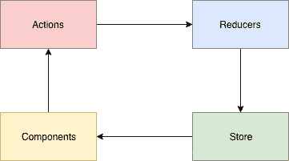
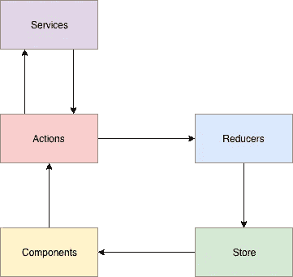
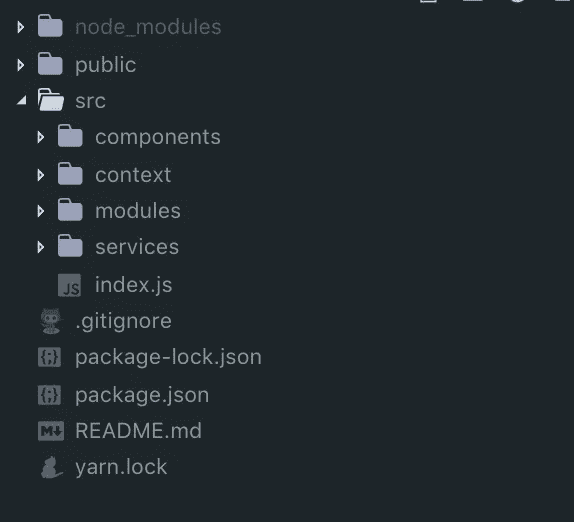
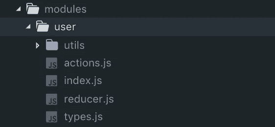
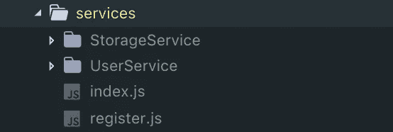
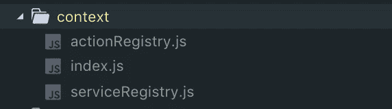

# 让服务成为 redux 架构的自然组成部分

> 原文：<https://itnext.io/make-services-a-natural-prt-of-redux-architecture-8a78b6a4b961?source=collection_archive---------0----------------------->

我将在这里描述的方法只不过是默认 redux 架构的一个小小的扩展。尽管它没有给数据流带来太多的变化，但确实做出了有意义的改进。

# 我在努力实现什么？

在我使用 redux 的整个过程中，我一直在努力解决的主要问题是将业务逻辑放在哪里。只要您的应用程序保持简单，您可能根本不会遇到这个问题。对于相对较小的应用程序，Redux 实际上做得很好。然而，随着应用程序的增长，事情开始变得有点复杂。

首先，在动作创建器内部发出异步 API 请求。这种方法已经足够好了，除非您的 API 响应必须以某种方式进行解析。或者，让我们说，你得到一个数据，在它被显示之前需要一系列的转换。或者您必须发出一连串 http 请求来获得您需要的结果。这些迹象表明，是时候开始分离应用程序了。目标是将所有与 redux flow 无关的东西都移到一个单独的地方。所以我在这里展示的主要目的是定义那个地方。

# 服务的理念

动作创建者应该只调度动作。如果它是一个 thunk，它应该在某个地方获得数据，然后调度一个动作。动作创建者不必构建 URL、发送 http 请求、处理响应以及人们倾向于放入其中的其他东西。这不是它们的本意。取而代之的是，我提议再加一层，把所有的都包起来。我称之为服务。

默认的 redux 数据流如下所示:

像我们都习惯的那样重复流动

当我们在那里添加服务时，它看起来是这样的:

使用新的服务层扩展 Redux 流

变化不是很大，对吗？事实证明这并不像看起来那么简单。

# 再加一层需要什么？

这似乎是一项简单的任务。这在一定程度上。您可以将您的逻辑放在其他地方，而不是放在动作创建器中，然后将它导入那里以供进一步使用。

导入服务以在操作创建者内部使用它

看起来不错，但是这个动作创建者根本不可测试，因为没有办法模拟服务。

这种方法不够好的第二个原因是，您可能需要在使用服务之前对其进行初始化。通常初始化需要一些时间。这个事实本身不允许你再使用这样的方法了。原因如下。

一些服务必须异步配置的事实意味着您必须在某个地方运行配置。做的地方显然是你的应用的入口点。

在入口点文件中配置服务

您在这里注意到的第一件奇怪的事情是，您从入口点导出内容，这不是一件好事。这里我们忘记的另一件事是 **configureServices** 必须是异步的，以便等待所有服务完成。如果您使它异步，您将根本无法导出服务。

## 那么解决办法是什么呢？

让我们一次解决一个问题。如何让动作创建者可测试，并且仍然接受来自外部的服务？我打赌你听说过依赖注入。

src/模块/用户/操作. js

让我们看看这里有什么不同。我们不会立即导出动作创建者，相反，我们导出一个函数，该函数作为依赖项接收服务。现在你的动作创建者是完全可测试的。

尚不清楚您是否需要将您的服务注入 reducers。例如，您可能希望用从某个缓存服务中取出的一些数据来填充 INITIAL_STATE。你不妨想出另一个例子。

为了更加一致，我们也应该为 reducers 实现相同的 DI 包装器。

src/modules/user/reducer.js

只是一个普通的缩减器，但不是导出缩减器本身，而是导出一个返回它的函数。现在是时候看到更大的画面了。

# 项目结构

我喜欢它的简约风格。

*   **src/组件**。所有视图都存储在那里。
*   **src/context** 。这是一个所有全球可用的东西都是从这里进口的地方。我们稍后会深入探讨这个问题。
*   **src/模块**。所有与 redux 相关的东西(动作、归约器、选择器等。)
*   **服务资源中心/服务**。一个适合你的商业逻辑的地方。

项目结构

让我们看看入口点的内部。

src/index.js

我们等到服务配置好，然后将它们注入模块。作为配置模块的结果，我们得到了 redux store，我认为这很有意义。然后，我们呈现应用程序的视图部分。我们还使用动态导入来加载根组件，因为应用程序需要时间来初始化，所以我们必须等到这个过程结束。

# 模块

我喜欢把所有和 redux 有关的东西直接想成一个模块。这里我们只有一个模块——用户模块。

模块目录，保存由文件夹划分的所有模块

如你所见，我创建了一个名为 **user** 的文件夹，并将所有与用户相关的 redux 内容放在那里。由于这些零件彼此紧密相关，我认为将它们存放在一起是一个不错的决定。我不打算解释 **utils** 里有什么，或者 **types.js** 是干什么用的。我想你们可以自己解决。让我们通过**快速浏览一下 **index.js** 内部。**

src/modules/user/index.js

从这里返回的所有东西都是公共 API 模块。如果您想从外部访问它们，可以在这里添加类型。

现在让我们把所有的模块集合在一起，使它们都可以从入口点进行配置(还记得我们在上面是如何调用 **configureModules** 的吗)？这就是它的功能。

暂时忽略“registerActions”部分，我们稍后将回到这个问题。

# 服务。提取业务逻辑

服务是一个附加层，用于保存您的业务逻辑。你可以随意组织你的逻辑。你得到的只是一种机制，使它可以在全球范围内访问。

src/服务

正如我们对模块所做的那样，我们将从入口点调用**配置服务**。下面是这个函数的样子。

我们不打算深入研究这些特定服务的实现，因为我相信从这里很容易理解它们背后的思想。请再次忽略“注册服务”部分。

# 语境。事情如何全球化？

让我们回忆一下入口点代码是什么样子的。

现在一切都要有意义。如果没有，你最好后退几步，再看一遍解释。接下来你要做的是去见登记处。

## 全球注册中心。

注册表支持在整个应用程序中访问您的逻辑。我发布了一个实现这个概念的 [npm 包](https://www.npmjs.com/package/mag-service-registry/v/2.1.1)。这个包将在以后的例子中使用，所以如果您先快速浏览一下会更好。

所以这是最难的部分。请慢慢看完这个。

注册表解决了一个特定的问题。它允许将注册过程委托给公开注册内容的地方。听起来像胡言乱语？只是看一看。

src/context/actionRegistry.js

您创建一个注册表实例。然后你初始化它。因此，您会收到一个函数**popula registry。**这个函数然后被导出，它将被用来注册东西到注册表。

> 所以这里没有注册任何东西，你把它委托给其他地方，但是最终注册的所有东西都可以从这个地方获得。

这是服务注册表。字面上是一样的。

src/上下文/serviceRegistry.js

所以这些注册表代表了上下文。

src/上下文文件夹

上下文是一个抽象概念，包含全局可用的所有内容。这是文件夹的索引文件。

它只是获取注册中心已经公开的所有内容，并将其重新公开。现在，当您的应用程序的任何部分需要访问已经注册的任何内容时，它会从上下文中导入它。

在这里，组件导入动作，就像在常规 redux 流中一样。

用户组件从上下文导入操作

我想我们错过了动作被注册的部分。还记得我在浏览模块时要求忽略这一部分吗？我们回去处理这件事吧。

在 src/modules/index.js 中注册操作

您对已配置的每个模块执行操作，并将其放入单个对象中。然后对象被传递给 **registerActions** 。让我们看看代码。

src/模块/register.js

PopulateActionRegistry 链接到注册表实例。它只是一个包装器，为您提供访问“注册”功能。这是**唯一一个可以注册东西的地方。您永远无法访问注册表实例本身。你可以注册东西(如这里)，或者访问已经注册的东西(如在上下文中)。从来都不是两者兼得。**

服务以同样的方式注册

src/services/register.js

# 就是这样。

我们已经检查了这个架构的所有部分。这是这个结构的样子。

这个项目在 [GitHub](https://github.com/dprovodnikov/complex-redux-project-architecture) 上有。

感谢您花时间阅读本文。让我知道你的想法。我非常感谢任何反馈。在 dp.wireden@gmail.com 联系我。