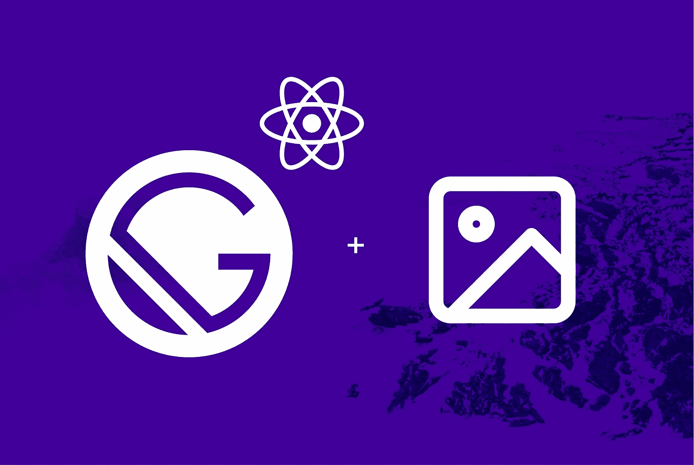

# 让你的设计师对盖茨比的形象处理更满意

> 原文：<https://itnext.io/make-your-designer-happier-with-gatsbys-image-manipulations-8abf3dd83593?source=collection_archive---------2----------------------->



你的团队里有设计师吗？嗯，我知道，他是个坏脾气的人，我们就叫他吉姆吧。人们通常为各种各样的事情去找吉姆；让他知道他们更喜欢在另一个网站上看到的设计，抱怨他实现的特定界面，或者只是要求他在特定维度上调整图像的大小。设计师会收到各种奇怪的请求，吉姆内心深处想要的，也是大多数开发人员渴望的；让他一个人做他的工作。

对 Jim 来说幸运的是，Gatsby 附带了一些非常强大的图像处理插件，执行通常需要设计师(或外部第三方软件)才能执行的操作。这篇文章将集中在这一点上，确保下次你创建一个静态网站，你一定会考虑盖茨比作为一个选项。

在我们开始之前，最好先介绍一下盖茨比的背景。

Gatsby 是所谓的“JAM”栈的一部分，其中 **J** avascript 库利用特定的**A**pi 来产生 HTML 中的静态 **M** arkup。Gatsby 的 API 是 GraphQL，它允许您像在数据库中一样查询数据。这些数据被建模为“节点”,您可以将其视为数据库世界中的“实体”。问题是，盖茨比首先是如何创建数据(节点)的？

答案在于插件，这是允许你与 Gatsby 底层基础设施交互的主要方式。有两种类型的插件:

*   **源插件:**负责创建新的顶层节点(数据)。例如，您可以添加`gatsby-source-filesystem`插件，项目中的每个文件都将成为您可以使用 GraphQL 查询的节点。这允许您获取某个目录的所有文件，获取特定文件的内容，等等。
*   **Transformer 插件:**负责获取现有节点，并将其转换为其他类型的节点，与它们被转换的节点保持父子关系。一个例子是`gatsby-transformer-json`插件，它获取由`gatsby-source-filesystem`创建的节点，并将原始内容解析成 JSON，确保您可以立即查询所有 JSON 文件节点的内容。

通过使用 **transformer 插件**，我们可以获取一个图像节点(也称为图像文件)并转换成另一个图像节点。考虑到这一点，我们可以将 JPG 图像节点转换为 PNG 图像节点；我们需要的只是合适的插件。谢天谢地，盖茨比为此提供了三(3)个独立的插件:`gatsby-plugin-sharp`、`gatsby-transformer-sharp`和`gatsby-image`。

`gatsby-plugin-sharp`是 Gatsby 和 [Sharp](https://github.com/lovell/sharp) 之间的链接，后者是最快的 Node.js 图像处理库之一。作为一个库，Sharp 允许你通过它的函数式 API 来转换、调整大小、增强和重新格式化图像，但是为了在 Gatsby 中使用它，我们需要一个桥接 API 来将 Gatsby 的东西翻译成 Sharp 的东西。我知道这没什么意义，但是请相信我，一会儿就好了。

`gatsby-transformer-sharp`是一个转换器插件，它转换典型的图像文件节点——这些节点是由一个源插件创建的(使用来自本地文件系统、wordpress、contentful 等的数据)。)—至`ImageSharp`节点。一个`ImageSharp`节点和一个典型的图像文件节点有什么区别？嗯，`ImageSharp`节点可以访问我们之前的桥接插件创建的 Shrap API。这个 API 被公开为一组 GraphQL 查询参数，这些参数配置 Sharp 执行的转换过程。因此，当你要求时，你可以在那里转换处理图像。听起来很复杂？让我们稍微简化一下。

1.  您使用 GraphQL 查询您的图像。
2.  在 GraphQL 查询中指定一组查询参数。
3.  根据您指定的值，您将得到一个经过处理(转换)的图像，而不是原始图像。

没什么大不了的，用 GraphQL 调整图片大小和变换图片是很可爱的，但这不是世界上最有用的东西，对吗？好吧，请耐心等待，因为除了修改现有的图像，您还可以生成一组新的图像，用于不同的屏幕宽度和分辨率。Gatsby 可以自动为您创建这些变体，而不是手动创建图像的不同变体以在不同的设备视口中使用。想一想。想想你曾经为了节省一些宝贵的空间而不得不通过 Photoshop、Sketch 或 MS Paint 手动调整尺寸和分辨率来为一幅图像创建多个分辨率。有了盖茨比，这就自动化了。通过使用这个插件，你可以创建两(2)种类型的图像集:**固定**和**流体**。

**流体**图像是根据屏幕宽度而具有不同尺寸的图像。以下是一个流体示例:

```
query {     
  file(relativePath: { eq: "path/to/my/image.png" }) { 
    childImageSharp {         
      # Specify the image processing specifications in the query.
      fluid(maxWidth: 500, quality: 75, toFormat: "JPG") {           
        src       
      }       
    }     
  }
}
```

上面的代码将从本地文件系统加载图像`image.` png，将其转换为一个`ImageSharp`节点，并返回五(5) **个 JPG** 图像的源路径(URIs)，这些图像的宽度为**【125，250，500，750，1000】**，分辨率**降低到 75%** 。

**固定**图像是指尺寸始终相同的图像，但其分辨率会根据观看图像的屏幕质量而变化(即全高清与 4K)。这方面的一个例子如下:

```
query {     
  file(relativePath: { eq: "path/to/my/image.jpg" }) { 
    childImageSharp {         
      # Specify the image processing specifications in the query.
      fixed(width: 125, height: 125) {           
        src       
      }       
    }     
  }
}
```

上面的代码将从本地文件系统加载图像`image.jpg`，将其转换为一个`ImageSharp`节点，并返回三(3)个具有不同分辨率(1x、1.5x 和 2x)的 125x125 图像的源路径。

请记住，`src`只是您可以查询的字段之一。还有其他的东西，比如和`<picture />`元素一起使用的`srcSet`，在获取图像时呈现的 base64 占位符，等等。完整的列表，你可以访问[插件的文档页面](https://www.gatsbyjs.org/packages/gatsby-plugin-sharp/#methods)。

因此，您已经成功地将您的图像转换为您需要的图像，并且您已经获得了图像列表的源路径。现在，你会期望你必须创建`<picture />`元素，在那里放一个``标签列表，添加维度，配置断点等等。嗯，足够幸运的是，有一个名为 [gatsby-image](https://www.gatsbyjs.org/packages/gatsby-image/) 的整洁的小库，它公开了一个名为``的 React 组件。该组件获取前面提到的 GraphQL 查询的输出，并为您设置一切。具体来说，您传入一个名为`fluid`或`fixed`的属性，这取决于您创建的图像，其值是相应 GraphQL 查询的结果。就是这样！为了向用户显示优化的图像，您不需要做任何其他事情。下面是如何使用它的一个例子:

```
import React from "react"
import { graphql } from "gatsby"
import Img from "gatsby-image"

export default ({ data }) => (
  
)// The results of the query whose exported name is `query` will
// automatically be added as props to the default exported 
// React Component. That's a Gatsby feature...
export const query = graphql`
  query {
    file(relativePath: { eq: "blog/avatars/aggelos.jpeg" }) {
      childImageSharp {
        fixed(width: 125, height: 125) {
          src
          srcSet
          base64
        }
      }
    }
  }
`
```

有了``，消费这些急剧的转换现在变得轻而易举，因为您甚至不必担心 GraphQL 查询的结果；**你只需将它们转发给 React 组件，它将为你处理消耗&渲染**。当然，你也可以通过附加的道具来控制图像的显示和定位。关于可用道具的完整列表，你可以查看的[相关文档页面。](https://www.gatsbyjs.org/packages/gatsby-image/?=ga#gatsby-image-props)

# 包扎

长期以来，图像操作一直是开发人员自己难以解决的问题之一。几乎我们所有人都依赖外部资源(无论是人还是软件)来获得我们需要的东西，这种情况经常发生，真的很令人沮丧和耗时。当我听说 Gatsby 时，我认为这只是一种使用 React 创建静态页面的快速而简单的方法，但是它的插件——尤其是图像插件——将它带到了一个完全不同的层次。我们生活在一个图像主导大多数网站内容的时代，Gatsby 让您不必考虑图像的性能影响，不必为调整图像大小而 ping Jim，并在一天结束时，帮助您专注于真正重要的事情；内容。

感谢阅读:)

*👋 ***嗨，我是***[***Aggelos***](https://aggelosarvanitakis.me/)***！如果你喜欢这个，考虑一下*** [***在 twitter 上关注我***](https://twitter.com/AggArvanitakis) ***并与你的开发者朋友分享这个故事*😀***