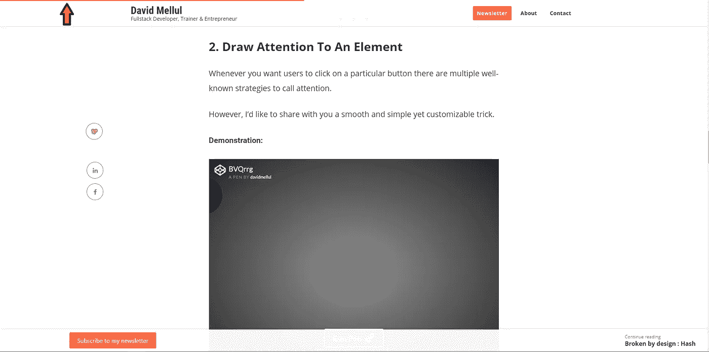
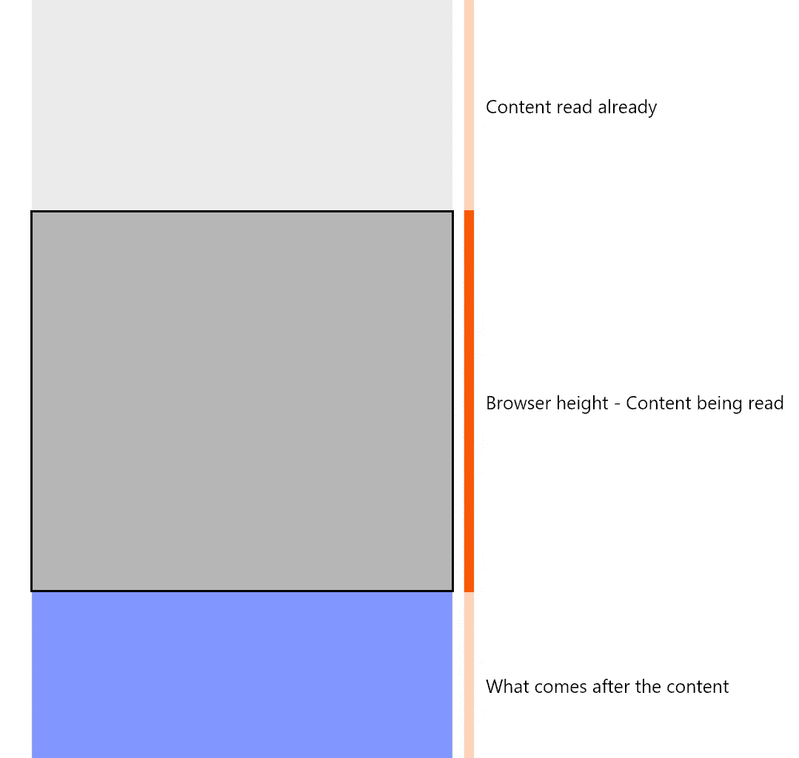
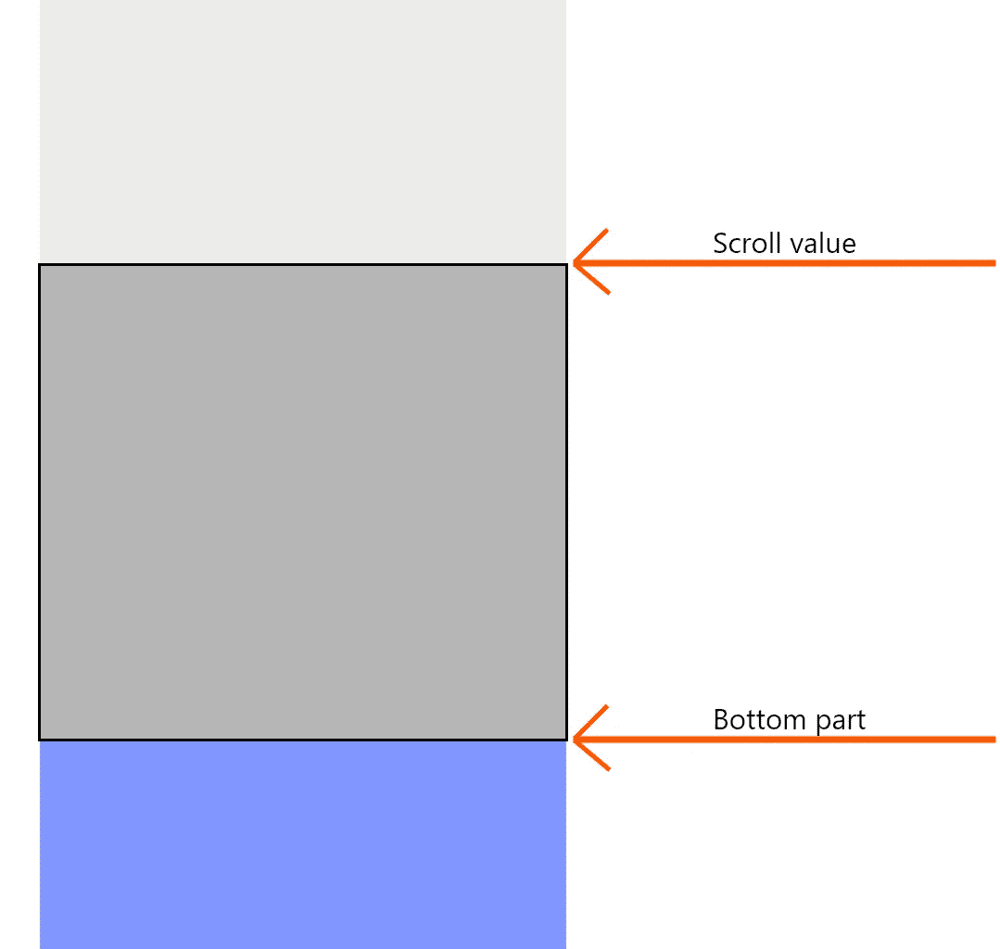

# 制作你自己的类似 Youtube 的进度条

> 原文：<https://itnext.io/make-your-own-youtube-like-progress-bar-218cf28fe706?source=collection_archive---------7----------------------->

给我的个人网站[一个全新的外观](https://dmware.fr/)我想在我的帖子上添加一个类似 Youtube 的进度条，以获得更好的读者体验。

看起来是这样的:

节选自我的[最新文章](https://dmware.fr/4-css-tricks-ive-learnt-the-hard-way/)

它易于完全定制，只需:

*   1 个 HTML 元素
*   1 个 CSS 块(6 个简单属性)
*   12 条普通 JS 线

# 我们开始吧！

**首先**，你需要一个 HTML 节点来显示你的进度条:

`

`

**然后**，需要用 CSS 定制:

我对一切都进行了注释，以使其易于理解和定制

**最后**，你使用 Javascript 让进度条跟随滚动

评论是不够的，所以我将解释:

*   `Line 6 :`检索用户向下滚动了多少。
*   `Line 9 :`看看这张图片和它下面的解释。

当用户到达你的长内容的底部时，你希望进度条被**完全填充。**

这意味着`scroll`值必须等于:

`y position of the content`**+**`height of the content`**-**`browser height`

*   `Line 12:`我使用`Math.min(x, 100)`来确保`width`不会超过 100%，我使用`Math.ceil()`来去除小数部分。

# 示范

这是一支工作笔:

在制作自己的进度条之前，我尝试了几个库，但是我发现它们对我来说太多了。

然而我相信我的方法有优势:

*   没有依赖关系，也没有 HTTP 请求。
*   香草 JS 表演。
*   超小和轻量级代码+非常容易集成到任何地方。
*   易于用 CSS 动画扩展。
*   跨浏览器兼容。

# 感谢阅读

我的最新文章在媒体上已经有超过 1 万的读者和超过 650 次的点击，我非常感激它所带来的一切。

感谢那些阅读、鼓掌、分享和翻译的人💖

像往常一样，我乐于接受建议和想法。

请随时联系☕️

[吴怡](https://unsplash.com/@takeshi2?utm_source=medium&utm_medium=referral)在 [Unsplash](https://unsplash.com?utm_source=medium&utm_medium=referral) 上的“白色马克杯里的卡布奇诺，白色泡沫艺术在木桌上”