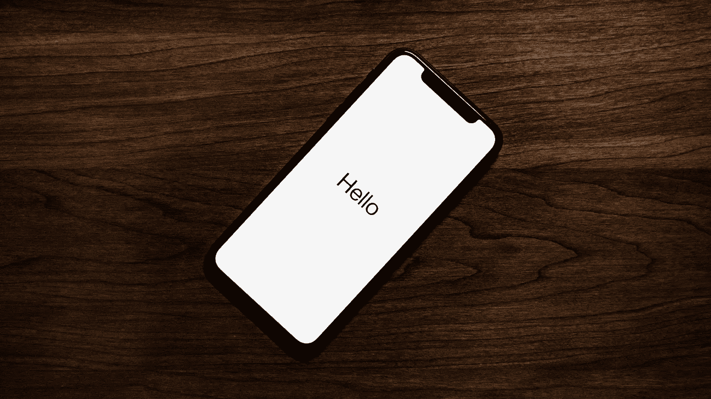
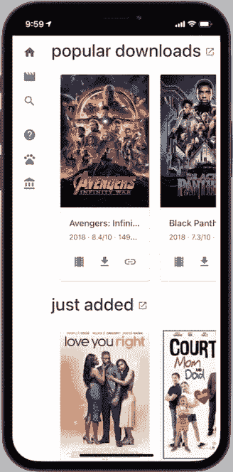
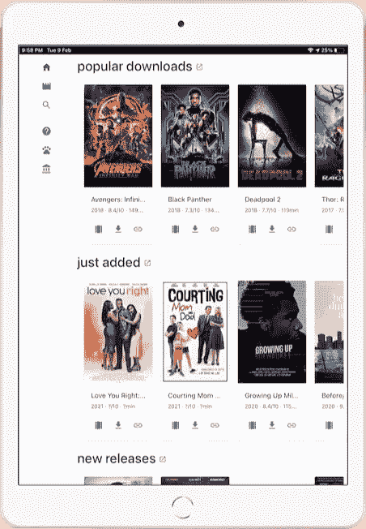
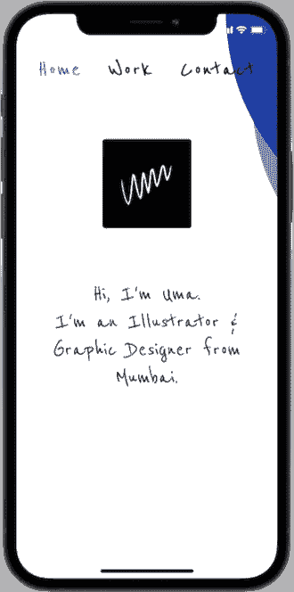
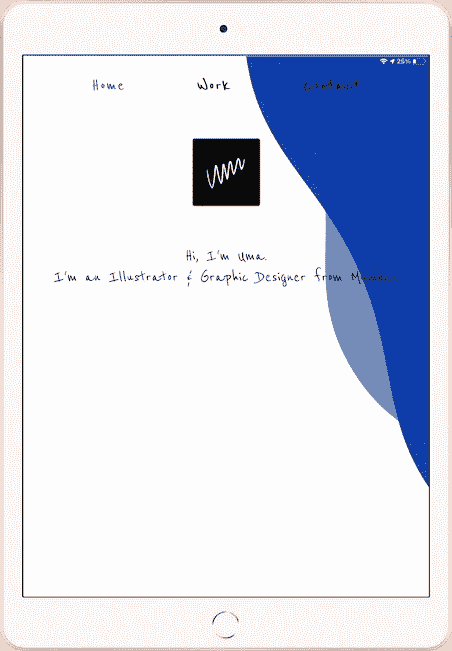
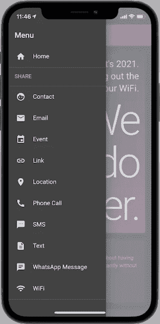
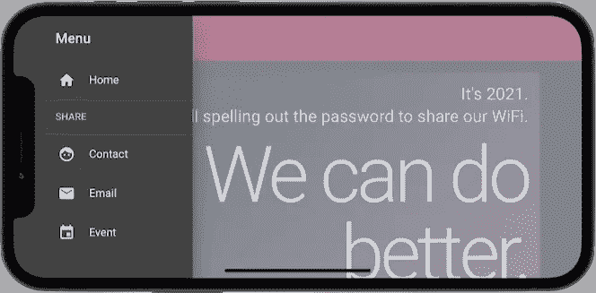

# 让你的 PWAs 在 iOS 上看起来很帅

> 原文：<https://itnext.io/make-your-pwas-look-handsome-on-ios-fd8fdfcd5777?source=collection_archive---------1----------------------->

> 我讲的是如何拥抱 notch，让你的 pwa 在 iOS 设备上覆盖整个屏幕。



由[泰勒·拉斯托维奇](https://unsplash.com/@lastly?utm_source=unsplash&utm_medium=referral&utm_content=creditCopyText)在 [Unsplash](https://unsplash.com/s/photos/iphone?utm_source=unsplash&utm_medium=referral&utm_content=creditCopyText) 上拍摄

## 问题是

为了避免内容隐藏在凹口下，Apple 在默认情况下会限制 PWAs 的视口:



iPhone X 的主屏幕上增加了 [Cinepotato](https://cinepotato.com)

苹果还将 iPhones 和 iPads 上没有凹口的视窗**限制在状态栏下方的区域:**



[Cinepotato](https://cinepotato.com) 添加到 iPad 2020 的主屏幕

如果你想让你的 PWA 拥抱缺口，让它覆盖整个屏幕，你需要一个小黑客。

## 解决方案

将您的文稿设定为排列到缺口区域:

```
// index.html<head> ... <meta name="**viewport**" content="initial-scale=1, **viewport-fit=cover**, width=device-width"></meta>
  <meta name="**apple-mobile-web-app-capable**" content="**yes**"></meta>
  <meta name="**apple-mobile-web-app-status-bar-style**" content="**black-translucent**"></meta> ...</head>
```

注意，这会将 iOS 状态栏的字体颜色设置为白色。

**hack**:将文件的最小高度设置为 100%加上顶部安全区域的高度。这将防止底部出现白条，因为您将文档“上移”了。

此外，向所有 4 个侧面添加安全区域填充，以确保无论设备方向如何，内容都不会隐藏在凹槽下:

```
/* styles.css */html { **min-height**: calc(100% + env(safe-area-inset-top));
  **padding**: env(safe-area-inset-top) env(safe-area-inset-right) env(safe-area-inset-bottom) env(safe-area-inset-left); ... background-attachment: fixed;
  background-image: url('/bg.svg');
  background-position: center;
  background-repeat: no-repeat;
  background-size: cover;}
```

## 结果呢



[umagoyal.com](https://umagoyal.com)添加到 iPhone X 的主屏幕



[umagoyal.com](https://umagoyal.com)添加到 iPad 2020 的主屏幕

## 额外小费

如果你有带`position: fixed`的元素(例如，吐司、侧边栏、底部导航等。)将安全区域衬垫添加到他们的容器或他们自己，视情况而定。**你只需要垫上可能有缺口的边。**

```
/* styles.css */.left-sidebar {
  padding: env(safe-area-inset-top) **0** **0** env(safe-area-inset-left);
}
```



Cam 分享的[侧边栏添加到 iPhone X 的主屏幕](https://shareby.cam)



iPhone X 的主屏幕上增加了 Cam 共享的[侧边栏](https://shareby.cam)

对于固定的割台，您可以选择在凹口区域下方显示割台(就像凸轮共享的[一样),或者填充割台的相关边而不是`html`来填充凹口区域。](https://shareby.cam)

我在 iOS 12 上重试了几次后开发了这个黑客，但从未分享希望它能被苹果修复。看起来这种怪癖会一直存在，就这样吧。干杯！

*喊出*[*MockUPhone*](https://mockuphone.com)*为精彩的电话嘲讽工具！*