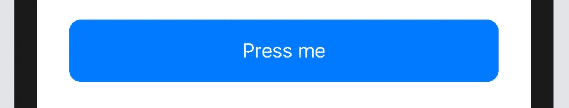
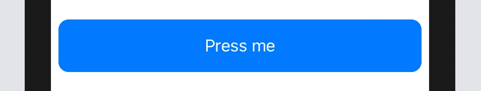
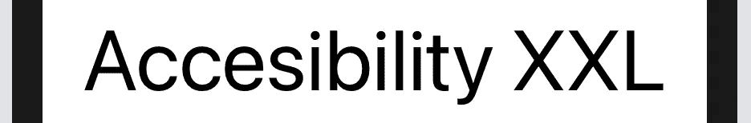

# 使您的 SwiftUI 应用程序可扩展，并为不同的屏幕尺寸做好准备。

> 原文：<https://itnext.io/make-your-swiftui-app-scaleable-and-prepare-for-different-screen-sizes-eed42326b11c?source=collection_archive---------1----------------------->

在构建一个应用程序时，有两件事需要考虑，它应该在每个设备上都看起来不错。不同的屏幕尺寸和文本缩放。这就是这篇短文的内容，所以让我们深入探讨一下。

# 形状和视图

当你用绝对值给形状或视图添加一个框架时，你可能会注意到，它并不是在每个设备上都好看。如果没有，就在多个模拟器上运行。或者更简单，改变设备，并在实时预览中看到变化。

iPhone 11

iPhone SE(第二代)

iPod Touch(第七代)

问题是，蓝色矩形的宽度(这里是 360°)，比 iPod 的屏幕宽度要大。此外，它对 iPhone SE 来说几乎太大了。不过在 iPhone 11 上看起来很棒。现在有两个选择来解决这个问题。您可以使用填充来代替框架，也可以使用相对值。

填料

现在，它在所有设备之间有一个 20 的恒定填充。您也可以使用默认填充。

屏幕大小

这样，按钮始终是屏幕宽度的 90 %。对于 iPads，按钮太大，所以需要指定不同的值。

Ad: [订阅 Medium，支持我:)](https://medium.com/@lucajonscher/membership)

# 缩放度量

在 SwiftUI 2 中，苹果增加了`@ScaledMetric`属性包装器，反映了动态类型设置。他们从小到大都可以进入 XXL。

虽然大多数不应该，一些用户界面元素也应该伸缩。但是你可能不会经常需要它。请务必不要在大图像和视图上使用它。您可以简单地将尺寸作为`@ScaledMetric`变量添加到视图中。

现在，矩形随着动态类型设置而缩放。如果只有一个变量来计算尺寸，就更容易了。

# 文本

SwiftUI 的字体(比如。脚注，。身体，。标题)已经可以调整大小。但是，当你想要更多的选择，你离开预定义的文本是创建自己的。不可扩展。但这和上面一样容易。